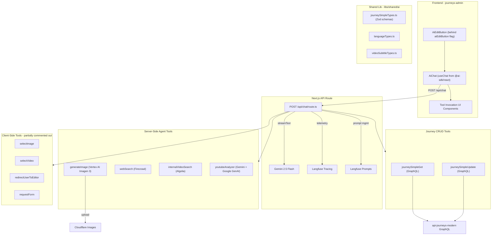

# AI Journey Creation Revival Plan

## Current State Summary

**Branch:** `feature/25-05-ES-ai-journey-creation`
**Last activity:** Aug 15, 2025 (~6 months stale)
**Merge base with main:** Aug 14, 2025
**Feature branch:** 383 commits ahead of main, main is 479 commits ahead of feature branch
**Feature branch scope:** 110 files changed, ~11k insertions across the prototype

---

## Phase 1: Assess Merge vs. Rebuild (Recommended First Step)

### Merge Conflict Analysis (Already Done)

A dry-run merge of `main` into the feature branch produces **6 conflicts**:

| File | Conflict Type | Estimated Difficulty |
| ---- | ------------- | -------------------- |

- `apps/journeys-admin/next-env.d.ts` - trivial (auto-generated types)
- `apps/journeys-admin/next.config.js` - low (webpack/instrumentation additions)
- `apps/journeys-admin/src/components/Editor/Editor.tsx` - medium (AI button integration point)
- `libs/locales/en/apps-journeys-admin.json` - low (locale keys additions)
- `package-lock.json` - **deleted on main** (project likely moved to different lock strategy) - must regenerate
- `package.json` - medium (dependency additions from both sides)

**Verdict: Merge is feasible.** The conflicts are few and well-understood. The prototype's code is almost entirely *new files* (76 new files) with only 11 modified files. This means the AI code is largely additive and won't collide with main's 6 months of evolution.

### Recommended Approach: Merge main into feature branch

1. Create a working branch from the feature branch
2. Merge `main` into it
3. Resolve the 6 conflicts (estimated 1-2 hours)
4. Delete `package-lock.json`, run the project's install command to regenerate
5. Run builds and tests to verify integration

**Why not rebuild?** The prototype has ~76 new files, well-structured with tests. Rebuilding would discard proven logic for the chat UI, tool invocation rendering, image generation pipeline, video analysis, and Langfuse tracing. The merge conflicts are minimal relative to that cost.

---

## Phase 2: Prototype Architecture and External Dependency Audit

### Architecture Overview

### External Services and API Keys Required

| Service | Env Variable(s) | Purpose | Status to Verify |
| ------- | --------------- | ------- | ---------------- |

- **Google Gemini (primary LLM)** - `GOOGLE_GENERATIVE_AI_API_KEY` - Main chat model (gemini-2.5-flash) + YouTube analysis - Check API key validity and billing
- **Google Vertex AI** - `NEXT_PUBLIC_FIREBASE_PROJECT_ID`, `PRIVATE_FIREBASE_CLIENT_EMAIL`, `PRIVATE_FIREBASE_PRIVATE_KEY` - Image generation (Imagen 3.0) - Check Vertex AI is enabled in GCP project
- **Langfuse** - `NEXT_PUBLIC_LANGFUSE_PUBLIC_KEY`, `NEXT_PUBLIC_LANGFUSE_BASE_URL`, plus server-side defaults - Prompt management, tracing, telemetry - Check Langfuse project exists and prompts are configured (especially `system/api/chat/route`)
- **Firecrawl** - `FIRECRAWL_API_KEY` - Web scraping for the webSearch tool - Check active subscription/API key
- **Algolia** - `NEXT_PUBLIC_ALGOLIA_APP_ID`, `NEXT_PUBLIC_ALGOLIA_API_KEY`, `NEXT_PUBLIC_ALGOLIA_INDEX` - Internal video search - Likely already configured for existing features
- **Cloudflare Images** - `NEXT_PUBLIC_CLOUDFLARE_UPLOAD_KEY` + GraphQL mutation - AI-generated image hosting - Likely already configured for existing features

### Feature Flag

The prototype uses the `aiEditButton` LaunchDarkly flag via `useFlags()`. This is already the right approach for controlled rollout.

---

## Phase 3: Token Usage Protection

The prototype currently has **zero token usage controls**. The chat route at `app/api/chat/route.ts` calls `streamText` with no rate limiting, no token budgets, and no cost tracking beyond Langfuse telemetry.

### Recommended Token Usage Strategy

**Tier 1 - Observability (Quick Win, do first)**

- Langfuse is already integrated for tracing. Ensure all model calls (Gemini chat, Gemini YouTube analysis, Imagen generation) are traced with `userId` and `sessionId` tags
- Use Langfuse dashboards to monitor cost per user/team before building enforcement

**Tier 2 - Rate Limiting (Medium effort)**

- Add rate limiting at the `/api/chat/route.ts` API endpoint level
- Options:
  - **Simple approach:** Use an in-memory or Redis-backed rate limiter (e.g., `@upstash/ratelimit`) keyed by `user_id` from JWT. Limit requests per minute/hour
  - **Per-team:** Decode the user's team from JWT or a DB lookup, apply team-level limits

**Tier 3 - Token Budget Tracking (Higher effort)**

- Track cumulative token usage per user/team in a database
- The Vercel AI SDK's `streamText` provides `usage` data in the `onFinish` callback (already partially used). Extract `promptTokens`, `completionTokens`, and `totalTokens`
- Before each request, check if the user/team has remaining budget
- Langfuse also captures token usage data - could query Langfuse API for usage summaries instead of building a separate store

**Recommended starting point:** Tier 1 + Tier 2 (Langfuse monitoring + simple rate limiting). This protects against runaway costs quickly without a heavy implementation.

---

## Execution Order

### Step 1: Merge and Stabilize (~1-2 days)

1. Branch off `feature/25-05-ES-ai-journey-creation` into a new working branch
2. Merge `main` in, resolve the 6 identified conflicts
3. Regenerate lockfile, install dependencies
4. Fix any build errors from 6 months of main evolution (API changes, import path changes, etc.)
5. Run test suite for affected packages

### Step 2: Verify External Services (~0.5 day)

1. Verify each API key listed above is active
2. Confirm Langfuse project has the `system/api/chat/route` prompt configured
3. Test each tool individually (image gen, web search, video search, YouTube analysis)
4. Document any expired keys or services that need re-provisioning

### Step 3: Add Rate Limiting (~1 day)

1. Add request-level rate limiting to `/api/chat/route.ts`
2. Ensure Langfuse tracing captures all token usage with user/team metadata
3. Set conservative limits initially (e.g., 20 requests/hour per user)

### Step 4: Feature Flag and Deployment (~0.5 day)

1. Verify `aiEditButton` flag exists in LaunchDarkly
2. Deploy to stage environment with flag enabled only for test users
3. Validate end-to-end flow on stage

### Step 5: Iterate (~ongoing)

1. Monitor usage via Langfuse
2. Adjust rate limits based on observed patterns
3. Consider Tier 3 token budgets if needed

# Report

## Phase 1: Merge Report: AI Journey Creation Revival

### Branch Created
- **`feature/26-02-JB-ai-journey-creation-revival`** - based off `origin/feature/25-05-ES-ai-journey-creation` with `main` merged in

### Conflicts Resolved (6/6)

| File | Resolution |
|---|---|
| `apps/journeys-admin/next-env.d.ts` | Took main's updated Next.js type references |
| `apps/journeys-admin/next.config.js` | Combined main's `reactCompiler` with feature's `instrumentationHook` + webpack `raw-loader` config. Removed duplicated `outputFileTracingExcludes` (already at top level) |
| `apps/journeys-admin/src/components/Editor/Editor.tsx` | Added `AiEditButton` (behind `aiEditButton` flag) inside main's new `MuxVideoUploadProvider` wrapper |
| `libs/locales/en/apps-journeys-admin.json` | Dropped 3 old locale keys ("Delete Card?", "Delete", "Are you sure...") that main consolidated into "Delete {{ label }}" |
| `package-lock.json` | Deleted (main removed it -- project moved to a different lock strategy) |
| `package.json` | Merged all deps -- details below |

### Post-Merge Codegen Cleanup
Running codegen after the merge produced several unexpected changes:
1. **`pnpm-lock.yaml`**: Regenerated as expected.
2. **`LoadLanguages.ts` & `LoadVideoSubtitleContent.ts`**: New generated types for AI prototype tools. Committed.
3. **`TemplateVideoUpload*` vs `TemplateCustomize*`**: Codegen renamed these files due to operation name changes in `TemplateVideoUploadProvider/graphql.ts` (from a recent main merge).
4. **`apis/api-journeys/src/__generated__/graphql.ts`**: Added `UserMediaProfile` types from the gateway schema.

**Decision:** To keep this feature branch focused, only the lockfile and the new AI-specific types (`LoadLanguages.ts`, `LoadVideoSubtitleContent.ts`) were committed. The unrelated `TemplateVideoUpload` renaming and `UserMediaProfile` additions will be handled in a separate dedicated branch to keep this PR clean.

### `package.json` Dependency Decisions

| Dependency | Feature Branch | Main | Resolution |
|---|---|---|---|
| `@ai-sdk/google` | ^1.2.18 | ^2.0.26 | Took main's ^2.0.26 |
| `@ai-sdk/google-vertex` | ^2.2.27 | absent | Kept (AI feature) |
| `@ai-sdk/openai` | ^1.3.22 | absent | Kept (AI feature) |
| `ai` (Vercel AI SDK) | ^4.3.15 | **^5.0.86** | Took main's v5 (MAJOR change) |
| `zod` | ^3.23.8 | **^4.1.12** | Took main's v4 (MAJOR change) |
| `react` | 18.3.1 | **^19.0.0** | Took main's v19 (MAJOR change) |
| `langfuse-vercel` | ^3.37.4 | absent | Kept (AI tracing) |
| `@vercel/otel` | ^1.13.0 | absent | Kept (AI instrumentation) |
| `launchdarkly-node-server-sdk` | ^7.0.3 | absent (replaced by `@launchdarkly/node-server-sdk`) | **Dropped** (old package) |
| OpenTelemetry packages | ^0.57.x / ^1.26.x | ^0.200.x / ^2.0.x | Took main's versions, kept feature's `api-logs` + `sdk-logs` additions |

### Known Risks for Build-Fix Phase

Three major version bumps will require code changes in the AI prototype:

1. **`ai` v4 -> v5**: The Vercel AI SDK had breaking API changes. The `useChat` hook, `streamText`, `tool()`, and `ToolSet` types likely changed. This is the highest-risk area.

2. **`zod` v3 -> v4**: The AI prototype heavily uses Zod schemas (`journeySimpleTypes.ts`, all tool parameter definitions). Zod 4 has API differences that may affect `.superRefine()`, `.describe()`, and `zod-to-json-schema` compatibility.

3. **React 18 -> 19**: The `AiChat` component and its children use hooks (`useChat`, `useState`, `useCallback`, etc.) which should be mostly compatible, but some patterns may need updating.

### Issue resolution (build / serve)

Issues found when running `nx serve journeys-admin` and entering AI-related areas; fixes applied so far:

| # | Symptom | Cause | Resolution |
|---|---------|--------|------------|
| 1 | `Module not found: Can't resolve 'langfuse'` in `src/libs/ai/langfuse/server.ts` (and client) | Code imports `Langfuse` / `LangfuseWeb` from the `langfuse` package and `LangfuseExporter` from `langfuse-vercel`. Only `langfuse-vercel` was in `package.json`; the core SDK is a separate dependency. | Added `langfuse: "^3.37.4"` to `package.json` and ran `pnpm install`. |
| 2 | `Module not found: Can't resolve '@ai-sdk/react'` in `AiChat.tsx` (and other AI UI components) | Merge took main's `ai` v5 and kept `@ai-sdk/google` etc., but the React bindings package `@ai-sdk/react` was never added. | Added `@ai-sdk/react: "^2.0.0"` to `package.json` (v2 pairs with ai v5; v3 requires ai v6) and ran `pnpm install`. |
| 3 | Runtime error at `value.trim()` in `Form.tsx` (line 33) when checking empty input | In AI SDK v5, `useChat`'s `input` can be `undefined`. `isInputEmpty(value: string)` was called with `input`, so `.trim()` threw when `input` was undefined. | Made `isInputEmpty` accept `string or undefined` and guard with null check and `String(value).trim().length === 0`. |
| 4 | Submit button disabled; type errors in AiChat (append, handleSubmit, input, reload, etc. missing from useChat) | AI SDK v5 changed the `useChat` API: no built-in input/handleSubmit/append/reload; uses transport, `sendMessage`, and local input state. Code was still written for v4. | Migrated to v5: `DefaultChatTransport` with `prepareSendMessagesRequest` (auth + body); local `input`/`setInput` state; submit calls `sendMessage({ text })`; `onFinish` uses `message`/`message.parts`; `addToolResult` adapter and legacy tool-part normalizer for existing UI. Request body converted to legacy `{ role, content }[]` for current API route. **Files changed:** AiChat.tsx, Form.tsx, State/Empty, State/Error, State/Loading, MessageList.tsx, TextPart.tsx, ToolInvocationPart.tsx + BasicTool, GenerateImageTool, RedirectUserToEditorTool, RequestFormTool, SelectImageTool, SelectVideoTool. |
| 5 | POST /api/chat 500: ZodError "expected array, received undefined" for `messages` | Request body had `messages: undefined`. Possible causes: SDK sometimes calls `prepareSendMessagesRequest` with `options.messages` undefined in a code path, or our returned body was not used. | **Client:** In `prepareSendMessagesRequest`, guard with `Array.isArray(options.messages) ? options.messages : []` so we always send an array and never `messages: undefined`. **Server:** Return 400 with a clear message when `body.messages` is null/undefined (include received keys for debugging); use `schema.safeParse(body)` and return 400 with flattened error detail instead of throwing. |
| 6 | POST /api/chat 500: `TypeError: result.toDataStreamResponse is not a function` | In AI SDK v5, `streamText()` result no longer has `toDataStreamResponse()`; the streaming response API was replaced by the UI message stream. | In `app/api/chat/route.ts`, use `result.toUIMessageStreamResponse({ headers })` instead of `result.toDataStreamResponse({ headers, getErrorMessage })`. Dropped `getErrorMessage` (not in v5 options). Client (DefaultChatTransport) expects this UI message stream format. |

More issues are expected (e.g. Zod v4, lint failures) and will be added here as they are resolved.

### Current Status

**Phase 1 (Merge and Stabilize)** is effectively complete: merge done, conflicts resolved, dependencies and build/serve issues fixed (see issue resolution table). The app runs, and the AI chat can send a message and receive a streamed response. Unrelated codegen changes remain deferred. Build/test suite and full manual test still to run; not pushed to remote yet.

**Observations (early Step 2 – verify behaviour)** — these sit between Phase 1 and Phase 2 and affect prototype reliability:

- **aiEditButton visibility:** The button appears intermittently when opening journeys in the editor. Expected behaviour is that it shows every time a journey is opened. This will interfere with testing but is not the top priority.
- **aiChat and tool-call reliability:** Responses are intermittent (e.g. possibly only the first query works). Tool calls may be failing intermittently, making recovery difficult. Consider re‑introducing per-tool try/catch and a controlled error response (experimented with previously but likely not committed).
- **No actual journey updates / mirror responses:** The AI often reflects the user’s request back instead of applying journey changes. Likely causes: tool calls failing silently, and/or the system prompt (e.g. Langfuse `system/api/chat/route`) not in a good state. Needs verification of tool execution and prompt content.

Next: run builds and test suites, then address the observations above (feature flag/visibility, tool error handling, system prompt and tool verification) before or alongside Phase 2 (architecture and dependency audit).