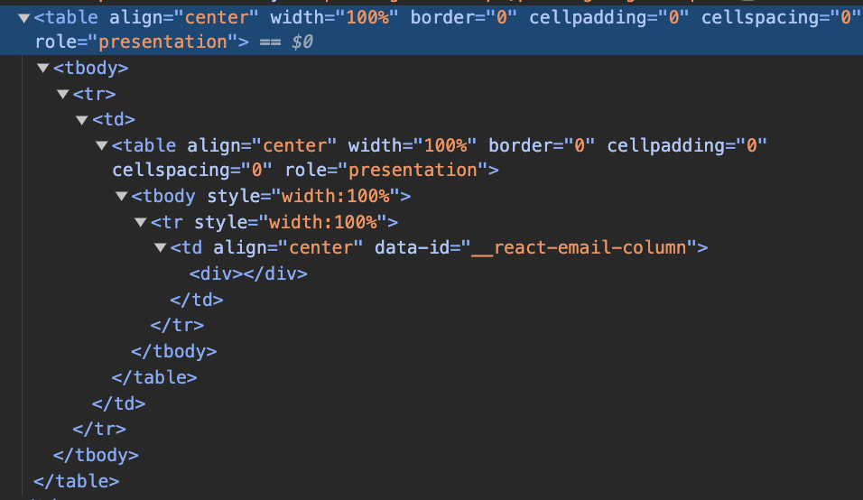

# Transactional Emails

## UI basics for emails

To craft the layout and view of the email, we use a framework called `react-email` to do this.
This gives us a few benefits:

- We can use "react like" syntax in the backend
- Allows us to preview the emails before we ship them
  - `nx email api-journeys`
  - go to `localhost:4601` to view the preview environment
  - you can also run `nx email api-users` to see our other email templates
- Gives us premade react components that are supported by most email clients
- Allows us to use TailwindCSS to style components as it isn't dependent on 'client-side-only' react hooks

#### CSS properties not supported in email clients

Most CSS3 properties are not supported in email clients. Please visit [https://www.caniemail.com/](https://www.caniemail.com/ 'Can I Email') to check if the CSS property you are trying to use is supported.

##### some common CSS properties that are not supported by email clients:

- flexbox
- grid
- position
- auto margins
- negative margins
- auto paddings
- border-radius
- max-width
- min-width
- box-shadow

##### how to center a div in emails

without use of these commonly used css properties, it can be quite challenging to align items centrally. However, react-emails gives us some components we can use that can achieve this:

```
            <Section>
              <Row>
                <Column align="center">
                  <div/>
                </Column>
              </Row>
            </Section>
```

this transpiles to the following html:



As you can see, under the hood the layout of emails is set by table, table headers, table rows and table columns. This is helpful in making sure content layout is consistent across all email clients.

For more react-email components, see: [https://react.email/docs/components/html](https://react.email/docs/components/html)

## How do I know if my email is getting sent?

- In the local environment, we use the nestjs mailer module
- In prod and stage, we use amazon SES.

Since in prod and stage you can just login to your email client and check if it has been sent to your inbox, we will only cover the local environment.

1. Make sure servers are running

```
    nf start
```

2. Go to the journeys-admin locally and perform the actions that will send an email.
3. Go to `http://localhost:1080/` and see if the email is visible here.

#### Creating fake accounts

With the addition of signup verification. It can be quite difficult to create an account with a fake email address for testing purposes. Thankfully, we can use email aliases to solve this.

for example, if your email address is:
`someemail@gmail.com`

then you can add an alias to it by appending `+<number>`, e.g.: `someemail+1@gmail.com`

This will still send an email to the inbox of `someemail@gmail.com` so that you can copmplete the verification process, but mock a new user signup.

## Adding emails to the queue

In our backend, we use redis and bullmq to create a job - that at a later time, will get processed and once complete, send an email to user.

To set up a transactional email, you will need to add a job to the queue

#### 1. Make sure that the module you are working in has the correct bull queue registered. We will use api-journeys as an example:

```
import { BullModule } from '@nestjs/bullmq'
import { Global, Module } from '@nestjs/common'

import { SomeModuleResolver } from './someModule.resolver'
import { SomeModuleService } from './someModule.service'

@Global()
@Module({
  imports: [
    BullModule.registerQueue({ name: 'api-journeys-email' })
  ],
  providers: [SomeResolver, SomeService],
  exports: [SomeResolver, SomeService]
})
export class SomeModule {}

```

#### 2. create a `<moduleName>.services.ts` file

```
import { InjectQueue } from '@nestjs/bullmq'
import { Injectable } from '@nestjs/common'
import { Queue } from 'bullmq'


import {
  SomeEmailJob,
} from '../email/email.consumer'

@Injectable()
export class SomeService {
  constructor(
    @InjectQueue('api-journeys-email')
    private readonly emailQueue: Queue<SomeEmailJob>
  ) {}

  async sendEmail(
    someData: SomeData,
    email: string,
  ): Promise<void> {
    await this.emailQueue.add(
      'some-email-job',
      {
        someData,
        email,
      },
      {
        removeOnComplete: true,
        removeOnFail: {
          age: 24 * 3600 // keep up to 24 hours
        }
      }
    )
  }
}
```

- add `private readonly emailQueue: Queue<SomeEmailJob>` into the constructor, we will configure the type for this in the next step
- the email arg is the email of the recipient. This can also be a userId of the recipient if you know they exist in our api-users database.
- make sure the `@InjectQueue()` decorator is the same name as the queue your module is pointing to
- make sure `@Injectable()` decorator wraps the whole class
- in the `this.emailQueue.add`, the first argument should be a string with the name of the email job. we will configure a consumer for this in the next step.
- the second argument is an object with the data you want to pass to the consumer. the data you want to pass should come from the arguments of the parent method (which in thise case is `sendEmail`)
- the third argument is the configuration settings for this job in the queue.

#### 3. configure your job to be consumed in the `email.consumer.ts`

- create a type for your job

```
export interface SomeEmailJob {
  someData: SomeData
  email: string
}
```

- add your type to the ApiJourneyJob Union type:

```
export type ApiJourneysJob =
  | SomeOtherJob1
  | SomeOtherJob2
  | SomeOtherJob3
  | SomeOtherJob4
  | SomeOtherJob5
  | SomeEmailJob
```

- add your job name to the switch and case:

```
    async process(job: Job<ApiJourneysJob>): Promise<void> {
  switch (job.name) {
    case 'some-email-job':
      await this.someEmailJob(job as Job<SomeEmailJob>)
      break
  }
}
```

- create an async function that matches the function name defined in your switch case, in this example, it will match `this.someEmailJob` so it will be:

```
  async someEmailJob(job: Job<SomeEmailJob>): Promise<void> {

  }
```

- from here you will need to assemble and arrange all the data you need to put into the email.
- Once you are ready, you can call the `await render(<EmailTemplateName>)` from react-email to generate the raw html and `await render(<EmailTemplateName>, { plainText: true } )` to genereate the text for the email which can be put into the `sendEmail` function.

it should look something like this:

```
import { render } from '@react-email/render'


  async someEmailJob(job: Job<SomeEmailJob>): Promise<void> {
      /* ..arrange all the data needed for the email ...*/

      const html = await render(
        SomeJobTemplate({
          email: job.data.email,
          someData: job.data.someData,
        })
      )
      const text = await render(
        SomeJobTemplate({
          email: job.data.email,
          someData: job.data.someData,
        }),
        {
          plainText: true
        }
      )
      await this.emailService.sendEmail({
        to: job.data.email,
        subject: `some title that useses ${someData.data}`,
        html,
        text
      })
  }
```
