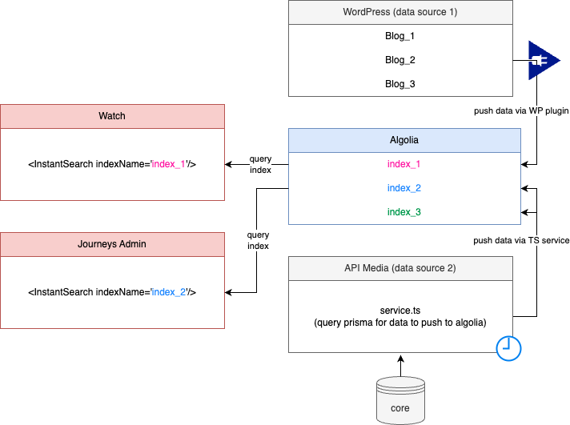

# Backend Algolia

## What Is Algolia?

Algolia is a powerful hosted search engine that enables developers to build fast and relevant search experiences for their users. It provides a search-as-you-type experience for websites and applications, making data retrieval instantaneous and efficient. Algolia indexes your data so that it can be easily queried and delivered to users in a fraction of a second.

## How Does Algolia Work?

1. You transform your data from whichever datasource you have
2. Use the algolia index in typescript to save your objects to an index
3. Let algolia handle indexing this data to be searched based on configuration in the algolia dashboard
4. Applications can then query your algolia indexes for items



## Algolia Dashboard

You will need access to the algolia admin dashboard to create indexes, test and explore the data in them, change the search configuration settings, and see analytics. Ask your team lead to have access granted.

## Pushing/Syncing to Algolia

For data to be available, you need to push it to an algolia index. Create one in the algolia dashboard.
Depending on where your data is coming from may define what this looks like but we are currently doing this for WordPress content, and core data calls.

For populating algolia from core, see `apis/api-media/src/workers/algolia/service/service.ts`

```typescript
const index = client.initIndex(appIndex)
try {
  await index.saveObjects(transformedVideos).wait()
  logger?.info(`exported ${offset} videos to algolia`)
} catch (error) {
  logger?.error(error, 'unable to export videos to algolia')
}
```

This script is configured to to run on a cron job defined in `apis/api-media/src/workers/algolia/config.ts`

For populating algolia from WordPress, you will need WP access and be able to use the [WP Algolia Plugin](https://wordpress.org/plugins/wp-search-with-algolia/).
