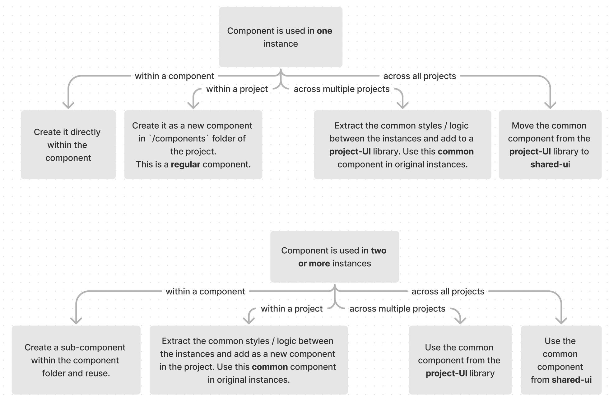

# Component Libraries

For each Jesus Film project ([storybook](https://storybook.core.jesusfilm.org/)), [Material UI](https://mui.com/material-ui/getting-started/overview/) is used to build the component library. `mui` is the latest web component library following the [Material Design 2](https://m2.material.io/components?platform=web) design system.

UX refer to Material Design to understand usage guidelines whilst developers should refer to [Material UI](https://mui.com/material-ui/getting-started/supported-components/) to understand how to build and style components.

## Understanding the Component Hierarchy

Each component is built from other components, as we move across the tree - the component styling and functionality becomes more specific.

Simplified Input example:


The HTML `input` can take on multiple [types and attributes](https://developer.mozilla.org/en-US/docs/Web/HTML/Element/Input). Each successive input component uses a subset of these attributes and adds their own to create components for a narrower use case.

> For example
>
> - `Mui-InputBase` adds end adornment, hides all `input=checkbox` attributes and includes minimal styling.
> - `Mui-TextField` add labels, validation and form control.
>   <br />

Compare and contrast properties on [HTML input](https://developer.mozilla.org/en-US/docs/Web/HTML/Element/Input), [Mui-InputBase](https://mui.com/material-ui/api/input-base/) and [Mui-TextField](https://mui.com/material-ui/api/text-field/#advanced-configuration) to see more.

### Mui components

Usually only the highest level `mui` components (eg `TextField`) are recommended for use. See full list [here](https://mui.com/material-ui/).

All Material UI components will be themed with the `mui` [default theme](https://mui.com/material-ui/customization/default-theme/).

Since we reuse these high level `mui` components to build many different components, these are known as **common** components.

### Our components

We need the Mui components to look and/or function differently to the default. We apply multiple different strategies for each use case.

For styling & function changes for **all** components:

We override the `mui` default theme with different themes. See more on theming [here](../04-theming.md).

For all other use cases:



#### This results in the following project structure:<br/>

**Applications**

- [journeys](https://your.nextstep.is/)
- [journeys-admin](https://admin.nextstep.is/)
- [watch](https://watch-jesusfilm.vercel.app/)

**UI Libraries**

- journey-ui: common components used in journeys & journeys-admin
- shared-ui: common components used in all app projects

This common implementation pattern is derived from the [Atomic Web Design](https://bradfrost.com/blog/post/atomic-web-design/) approach

## FAQs

#### **Can I use whatever components I want as long as I make it look like the design?**

No! Each component is designed for a different use case and will have accessibility labels and [theming built in](https://bareynol.github.io/mui-theme-creator/#TextField).
Using arbitrary components just based on look can result in:

- Fundamental [landmark roles](https://developer.mozilla.org/en-US/docs/Web/Accessibility/ARIA/roles/landmark_role) being misapplied or not applied
- Poor user experience for those needing screen-readers or other assistive technology
- Styling of components breaking when we change our theme
- Adding unnecessary styling complexity to each component, increasing the maintenance burden
- Future updates to components risk breaking behaviour (especially for less stable common component libraries you may create or work with)
  <br/><br/>

#### **What if I need both the default mui component and a jfp component with the same name, in the same file?**

Prepend **Mui** to the `mui` component and import like so:

```
import MuiTextField from '@mui/material/TextField'
import TextField from "../components/TextField'
```
