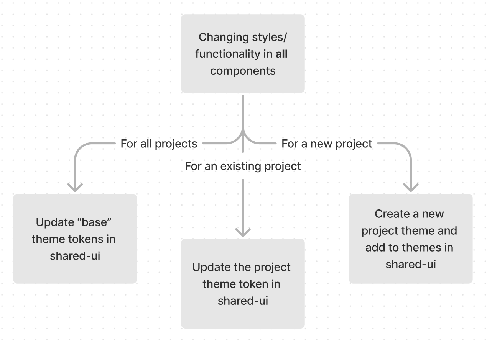

# Theming

## Styling a regular component:

- https://mui.com/material-ui/customization/how-to-customize/#1-one-off-customization

## Styling a common component:

- https://mui.com/material-ui/customization/how-to-customize/#2-reusable-component

## Styling all components:



### Updating a project theme:

- Make a post in the `nextsteps-frontend` slack channel with the change you intend to make. This helps all devs to anticipate the change or offer alternate solutions to the issue.
- Go to `/libs/shared/ui/src/libs/themes`. Each folder (eg `base`, `website`) are project themes and contain a `tokens` folder.
- Update the appropriate file in `tokens` and check the theme stories are correct and capture your update. See mui documentation for the [palette](https://mui.com/material-ui/customization/palette/), [typography](https://mui.com/material-ui/customization/typography/) and [component](https://mui.com/material-ui/customization/theme-components/) tokens.

### Creating a project theme:

- [Create a material theme](https://mui.com/material-ui/customization/theming/#createtheme-options-args-theme)
- Use the `breakpoints` and `spacing` theme tokens from `base` in every new project theme. See `libs/shared/ui/src/libs/themes/website/theme.ts` for an example.
- Update `index.ts` in `/libs/shared/ui/src/libs/themes` with the new theme name.

```
export enum ThemeName {
  ...ExistingThemes,
  newTheme = 'newTheme'
}

// Add within getThemes()
 const themes = {
    ...ExistingThemes
    newTheme: {light: newThemeLight, dark: newThemeDark}
  }

```
