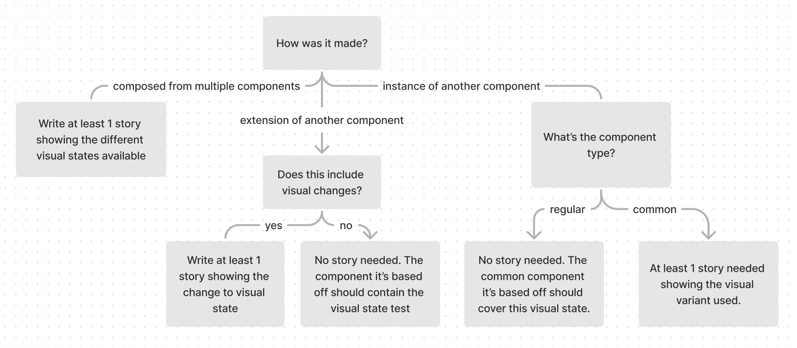

# Storybook

Storybook allows us to capture multiple visual variations of a component which may be difficult to reproduce by manual testing/mocking. This:

- Provides the designer with an accessible overview of the component during development.
- Creates visual state scenarios for [visual regression testing](../visual-testing).

## What is a story?

[A rendered state of a UI component](https://storybook.js.org/docs/react/get-started/whats-a-story)

## When to write stories

For instances of mui components we directly use, a `components.stories.tsx` story should be included in the shared-ui theme tokens folder. For example see:<br/>

- journeys - to be created <br/>
- [watch](https://storybook.core.jesusfilm.org/?path=/story/website-theme--components)

For our own components use the following chart:



> Not sure how the component is made? See [component types](#component-types)

A general rule of thumb would be to create a new story for each property that changes the visual state.

- For example, a component with `disabled`, `size` and `variant` properties would have 3 stories.

Each story should show all the visual states possible on that property.

- For example, the `size` story should show that component rendered at all sizes.

Sometimes, multiple properties may determine the visual state of the component. In this case, keep to the principle that each story should show one or variants of one visual state.

Sometimes components require others to be visualised such as transparent containers / customized scrollbars. In this case add other components in the story template so we can visualize it.

## How to write stories

Storybook documents multiple ways to write stories [here](https://storybook.js.org/docs/react/writing-stories/introduction). In our code we adopt the Component Story Format ([CSF](https://storybook.js.org/docs/react/writing-stories/introduction#component-story-format)), using Templates with [args composition](https://storybook.js.org/docs/react/writing-stories/introduction#using-args) to write stories.

### Basic Story Structure

```
// imports
import type { StoryObj } from '@storybook/react'

const ComponentDemo = {
  ...projectSpecificConfig, // #1
  component: Component,
  title: 'Project/ComponentPath/Component' // #2
}

// #3 add mocked response

// #4 add mocked data

#5
const Template: StoryObj<ComponentProps<typeof Component>> = ({ ...args }) => (
  <OptionalProviders>         // #6
    <Component {...args} />
  </OptionalProviders>
)

#7
export const Default = Template.bind({})
Default.args = {
  // add properties here
}

export const OtherStory = Template.bind({})
OtherStory.args = {
  ...Default.args,
  // set properties unique to other stories
}

```

Special notes:

1. Each story should use it's project-specific config to correctly set the theme. If the component is simple and does not change based on viewport, use the project-specific `simpleComponentConfig`.

2. See [naming components and hierarchy](https://storybook.js.org/docs/react/writing-stories/naming-components-and-hierarchy).

3. We don't call apis within storybook so mock out the response. <br/>Some components may call **our apis**. The basic structure is:

```
import { MockedResponse } from '@apollo/client/testing'

const exampleEventMock: MockedResponse = {
  request: {
    query: EXAMPLE_EVENT_UPDATE,
    variables: {
      // match the variables to our api response, for example
      input: {
        id: 'uuid',
        otherProp: 'otherPropValue'
      }
    }
  },
  result: {
    data: {
      exampleEventUpdate: {
        id: 'uuid'
      }
    }
  }
}
```

3. Some components call **external** apis. For this we use `msw`. We define the mock in a `.handlers.ts` file. See `VideoFromYouTube.handlers.ts` & `VideoFromYoutube.stories.tsx` for a usage example.

4. Instead of bloating the Template or story args, we extract any complex component data. This may be defined above the Template or imported from a `data.ts` file within the same component folder. See `RadioQuestion.stories.tsx` for an example.

5. Our project uses `StoryObj<ComponentProps<typeof Component>>` as the Template type. If you need to extend the template type, use

```
StoryObj<ComponentProps<typeof Component> & { newProperty: NewPropertyType }>
```

6.  Components sometimes references data passed to it from a parent `Provider` component. Some providers we use pass down:

    - Themes (ThemeProvider)
    - Alert functionality (SnackbarProvider)
    - Feature flag configurations (FlagsProvider)
    - Api data (ApolloProvider - use MockedProvider in tests/stories). <br/>

    Add **only** the providers needed to render and interact with the story.

7.  Name the stories based on their visual state. Usually this is 1 or 2 words. The default rendered state (usually the simplest variant) is named "Default". Also name the story "Default" if there is only 1 story.
