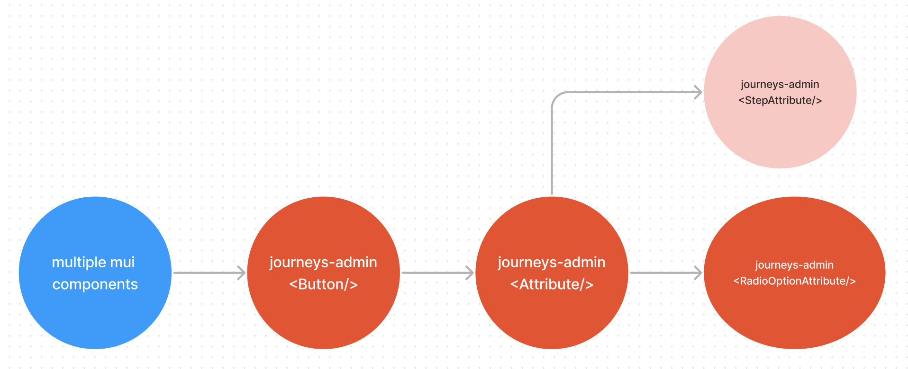

# Visual Testing

## Storybook & Chromatic

Storybook allows us to capture multiple visual variations of a component which may be difficult to reproduce by manual testing/mocking. Currently our team predominantly uses this feature for visual regression testing.

We use Chromatic to capture snapshots for each component variation (story). These are used to:

- Provide the designer with an accessible overview of the component during development.
- Flag code changes which produce undesired visual effects before releasing to production

Currently we have a 80k snapshot limit per month for visual regression testing.

## What is a story?

[A rendered state of a UI component](https://storybook.js.org/docs/react/get-started/whats-a-story)

## When to write stories

For instances of mui components we directly use, a `components.stories.tsx` story should be included in the shared-ui theme tokens folder. <br/>
journeys - to be created <br/>
[watch](https://storybook.core.jesusfilm.org/?path=/story/website-theme--components)

For our own components use the following chart:


> Not sure how the component is made? See [component types](#component-types)

A general rule of thumb would be to create a new story for each property that changes the visual state.

- For example, a component with `disabled`, `size` and `variant` properties would have 3 stories.

Each story should show all the visual states possible on that property.

- For example, the `size` story should show that component rendered at all sizes.

Sometimes, multiple properties may determine the visual state of the component. In this case, keep to the principle that each story should show one or variants of one visual state.

Sometimes components require others to be visualised such as transparent containers / customized scrollbars. In this case add other components in the story template so we can visualize it.

## How to write stories

Storybook documents multiple ways to write stories [here](https://storybook.js.org/docs/react/writing-stories/introduction). In our code we adopt the Component Story Format ([CSF](https://storybook.js.org/docs/react/writing-stories/introduction#component-story-format)), using Templates with [args composition](https://storybook.js.org/docs/react/writing-stories/introduction#using-args) to write stories.

### Basic Story Structure

```
// imports

const ComponentDemo = {
  ...config,
  component: Component,
  title: 'Project/ComponentPath/Component'
}

const mockedFunctionResponse: MockedResponseType = someMockResponse

const mockedData: MockDataType = { mockData }

const Template: ComponentStory<typeof Component> = = ({ ...args }) => (
  <OptionalProviders>
    <Component/>
  </OptionalProviders>
)

export const Default = Template.bind({})
Default.args = {
  // add properties here
}

export const OtherStory = Template.bind({})
OtherStory.args = {
  ...Default.args,
  // set properties unique to other stories
}

```

Special notes:

- Each story should use it's project-specific config to correctly set the theme. If the component is simple and does not change based on viewport, use the project-specific `simpleComponentConfig`.

- Our project uses `ComponentStory<typeof Component>` as the Template type. If you need to extend the template type, use

```
Story< Parameters<typeof Component>[0] & { newProperty: NewPropertyType }
```

## Component Types

In our monorepo we can categorize all the components we create into **common** and **regular** components, of which there are several types:

**Common components**<br/>
Any component intended for reuse in multiple different components. This includes:

- Some unique component made from multiple components like
  > For example [journeys-admin Button](https://storybook.core.jesusfilm.org/?path=/story/journeys-admin-editor-controlpanel-button--default) is made from Mui-Box, Mui-Typography and Mui-Stack amongst others.
- An extension of a component.
  > For example [journeys-ui TextField](https://storybook.core.jesusfilm.org/?path=/story/journeys-ui-textfield--states) uses the `filled` variant of [Mui-TextField](https://mui.com/material-ui/react-text-field/#form-props) and adapts it to work with formik - a form managagement library.
- An instance of a component

  > For example [Attribute](https://storybook.core.jesusfilm.org/?path=/story/journeys-admin-editor-controlpanel-attributes-attribute--default) is a version of [journeys-admin Button](https://storybook.core.jesusfilm.org/?path=/story/journeys-admin-editor-controlpanel-button--default) which sets the `selected` and `onClick` logic.

  

**Regular components**<br/>
Unique components only used in one other component / page. Similarly they are created by:

- Unique components made from multiple components
  > See [watch Header](https://storybook.core.jesusfilm.org/?path=/story/watch-header--default)
- Extending a component
  > See [ShareDialog](https://storybook.core.jesusfilm.org/?path=/story/watch-sharedialog--basic) (extended from shared-ui [Dialog](https://storybook.core.jesusfilm.org/?path=/story/shared-ui-dialog--info))
- An instance of a component
  > See [RadioOptionAttribute](https://storybook.core.jesusfilm.org/?path=/story/journeys-admin-editor-controlpanel-attributes-radiooption--filled) (instance of [Attribute](https://storybook.core.jesusfilm.org/?path=/story/journeys-admin-editor-controlpanel-attributes-attribute--default))
