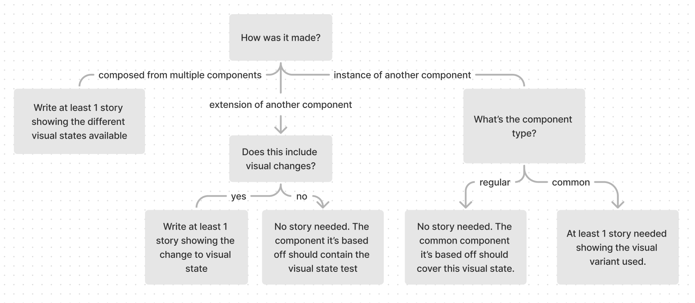

# Visual Testing

## Storybook & Chromatic

Storybook allows us to capture multiple visual variations of a component which may be difficult to reproduce by manual testing/mocking. Currently our team predominantly uses this feature for visual regression testing.

We use Chromatic to capture snapshots for each component variation (story). These are used to:

- Provide the designer with an accessible overview of the component during development.
- Flag code changes which produce undesired visual effects before releasing to production

Currently we have a 80k snapshot limit per month for visual regression testing.

## What is a story?

[A rendered state of a UI component](https://storybook.js.org/docs/react/get-started/whats-a-story)

## When to write stories

> See [component types]() for examples

For instances of mui components we directly use, a `components.stories.tsx` story should be included in the shared-ui theme tokens folder.  
[journeys]() - to be created  
[watch](https://storybook.core.jesusfilm.org/?path=/story/website-theme--components)

For our own components use the following chart:

All common components must have at least 1 story documenting its visual state/s.
Could combine multiple visual states in 1 story if it’s simple? (hover / focus)
If it’s a non-visual component like a transparent container / customized scrollbar, add other components in the story template so we can visualize it.

## Component Types

In our monorepo we can categorize all the components we create into **common** and **regular** components, of which there are several types:

**Common components** 
Any component intended for reuse in multiple different components. This includes:

- Some unique component made from multiple components like
  > For example [journeys-admin Button](https://storybook.core.jesusfilm.org/?path=/story/journeys-admin-editor-controlpanel-button--default) is made from Mui-Box, Mui-Typography and Mui-Stack amongst others.
- An extension of a component.
  > For example [journeys-ui TextField](https://storybook.core.jesusfilm.org/?path=/story/journeys-ui-textfield--states) uses the `filled` variant of [Mui-TextField](https://mui.com/material-ui/react-text-field/#form-props) and adapts it to work with formik - a form managagement library.
- An instance of a component

  > For example [Attribute](https://storybook.core.jesusfilm.org/?path=/story/journeys-admin-editor-controlpanel-attributes-attribute--default) is a version of [journeys-admin Button](https://storybook.core.jesusfilm.org/?path=/story/journeys-admin-editor-controlpanel-button--default) which sets the `selected` and `onClick` logic.

  

**Regular components** 
Unique components only used in one other component / page. Similarly they are created by:

- Unique components made from multiple components
  > See [watch Header](https://storybook.core.jesusfilm.org/?path=/story/watch-header--default)
- Extending a component
  > See [ShareDialog](https://storybook.core.jesusfilm.org/?path=/story/watch-sharedialog--basic) (extended from shared-ui [Dialog](https://storybook.core.jesusfilm.org/?path=/story/shared-ui-dialog--info))
- An instance of a component
  > See [RadioOptionAttribute](https://storybook.core.jesusfilm.org/?path=/story/journeys-admin-editor-controlpanel-attributes-radiooption--filled) (instance of [Attribute](https://storybook.core.jesusfilm.org/?path=/story/journeys-admin-editor-controlpanel-attributes-attribute--default))

 

**Testing differs based on component type**
