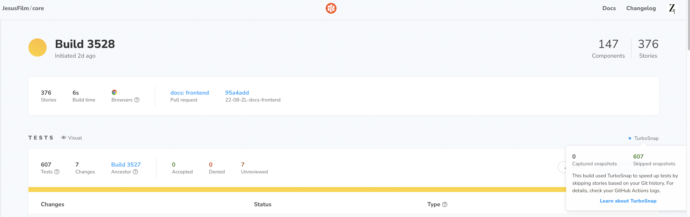

# Visual Testing

Testing visual components is done via 2 methods:

- [Snapshot testing](https://kentcdodds.com/blog/effective-snapshot-testing) - compares the rendered HTML code for a component to some reference component HTML.
- Visual regression testing - compares a screenshot of the component to some reference screenshot

Visual regression testing alone is sufficient for our project. Using [Chromatic](https://www.chromatic.com/docs/) with [stories](../storybook/#what-is-a-story) we are able to flag code changes which produce undesired visual effects before releasing to production.

Currently, we have an 80k snapshot limit per month for visual regression testing. To manage this limit effectively and avoid exceeding it, we’ve introduced a GitHub label called `chromatic`. Assign this label to Pull Requests only when they require visual testing.

Visual testing is a required GitHub Action check. This means you won’t be able to merge to production until you apply this label to your PR if it includes any visual changes.

## UI Review

Used by UX to review our storybook components.

# UI Change Requests

For minor UI/UX changes, designer approval is not always required before merging to production. However, these changes must still be reviewed — preferably by QA, or, in urgent cases, by another developer if QA is unavailable.

All changes should undergo code review and QA testing. While small visual adjustments do not require prior designer approval, it’s important to notify the designer once the changes are in production. If designers are not satisfied with the changes, they can either request a reversion or create a ticket for further updates.

If you’re uncertain whether a change qualifies as “small,” it’s best to seek designer approval. Alternatively, send the changes to a QA member, who will determine whether a designer review is necessary.

This process stems from the current limited availability of our designers. As the Design team expands, this policy will need to be revisited and updated.

## UI Tests

Used by devs to update the component snapshots in our unified chromatic snapshot library.

## TurboSnap

This feature enables Chromatic to only snap images for the affected stories.

You can check if snapshots are correctly being skipped via the Turbosnap status on the UI Test page for a PR.

