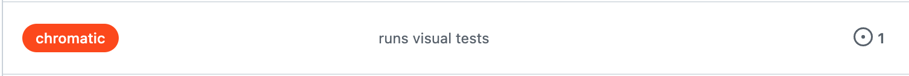

# Visual Testing

Testing visual components is done via 2 methods:

- [Snapshot testing](https://kentcdodds.com/blog/effective-snapshot-testing) - compares the rendered HTML code for a component to some reference component HTML.
- Visual regression testing - compares a screenshot of the component to some reference screenshot

Visual regression testing alone is sufficient for our project. Using [Chromatic](https://www.chromatic.com/docs/) with [stories](../storybook/#what-is-a-story) we are able to flag code changes which produce undesired visual effects before releasing to production.

Currently, we have an 80k snapshot limit per month for visual regression testing. To manage this limit effectively and avoid exceeding it, we’ve introduced a GitHub label called `chromatic`. Assign this label to Pull Requests only when they require visual testing.

Visual testing is a required GitHub Action check. This means you won’t be able to merge to production until you apply this label to your PR if it includes any visual changes.

## UI Review

Used by UX to review our storybook components.

# UI Change Requests

You don't have to wait for Design's approval before pushing it in.
If the change looks right to you, push in the change and let Design know that the change has been made.
They will let you know if there is something wrong and create another ticket for it or ask for the change to be reverted.
If however, you still want another pair of eyes on it before pushing, feel free to bring in QA into it.

## UI Tests

Used by devs to update the component snapshots in our unified chromatic snapshot library.

## TurboSnap

This feature enables Chromatic to only snap images for the affected stories.

You can check if snapshots are correctly being skipped via the Turbosnap status on the UI Test page for a PR.

