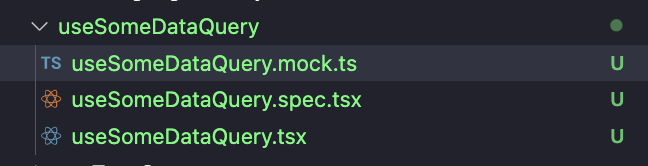

# Custom Hooks

## Mocking network calls

When testing a custom hook that contains a GraphQL call, you will also need to update any relevant tests that consume this hook.
As a result you will be writing mock calls in multiple files.

The problem with this is that if the GraphQL query changes. You will have to spend a lot of time going through each and every test file that consumes this hook and individually updating every test.

To prevent this problem in our codebase, we add all our mocked queries to a `[hook-name].mock.ts` file that lives in the directory of the hook.

For example if your custom hook has as GraphQL call that looks like this:

```
export const GET_SOME_DATA = gql`
  query GetSomeData($id: ID!) {
    someData(id: $id) {
        id
        value
    }
  }
`

```

You will most likely mock it in every test file like this:

```
export const getSomeDataMock: MockedResponse<
  GetSomeData,
  GetSomeDataVariables
> = {
  request: {
    query: GET_SOME_DATA,
    variables: {
      id: 'mockId'
    }
  },
  result: {
    data: {
      someData:     {
          __typename: 'SomeData',
          id: 'someDataId',
          value: 'someValue'
        }
    }
  }
}
```

Instead of putting the above in every test file, follow the below steps:

- create a `[hook-name].mock.ts` file in the same directory as your hook.
  
- export the mock query from the file

  ```
  // useSomeDataQuery.mock.ts

  export const getSomeDataMock: MockedResponse<
    GetSomeData,
    GetSomeDataVariables
  > = {
    request: {
      query: GET_SOME_DATA,
      variables: {
        id: 'mockId'
      }
    },
    result: {
      data: {
        someData:     {
            __typename: 'SomeData',
            id: 'someDataId',
            value: 'someValue'
          }
      }
    }
  }
  ```

- import the mock query into any necessary tests.

  ```
  // your test file(s)


  import { getSomeDataMock } from '../../../libs/useSomeDataQuery/useSomeDataQuery.mock'


    it('should return some data', async () => {
      const { getByText } = render(
          <MockedProvider
            cache={cache}
            mocks={[getSomeDataMock]}
          >
            <SomeComponent />
          </MockedProvider>
      )

      // your test logic here
    })
  ```

Now if anyone changes this query in the future, they will only need to update the mocked query in your mock.ts file and it will automatically reflect in your other test files.

#### FAQ

Q: "What if I need to assert the result has been called?"

A:

```
import { getSomeDataMock } from '../../../libs/useSomeDataQuery/useSomeDataQuery.mock'


  it('should return some data', async () => {
    const result = jest.fn().mockReturnValue(getSomeDataMock.result)

    const { getByText } = render(
        <MockedProvider
          cache={cache}
          mocks={[{ ...getSomeDataMock, result }]}
        >
          <SomeComponent />
        </MockedProvider>
    )

    await waitFor(() => expect(result).toHaveBeenCalled())
    expect(getByText('someValue')).toBeInTheDocument()
  })
```

Q: "Im only consuming the hook in one place, does that mean I don't have to create a mock.ts file and export my mocked query from there?"

A: No. As time goes on, our project will grow, change, evolve. As a result, requirements change all the time. Who's to say we wont end up consuming your hook in other places? If we do, more tests requiring mocks of the GraphQL call in your hook will need to be written. So therefore, to be more future minded, you will need to create a mock.ts file and add your mocks to it.
