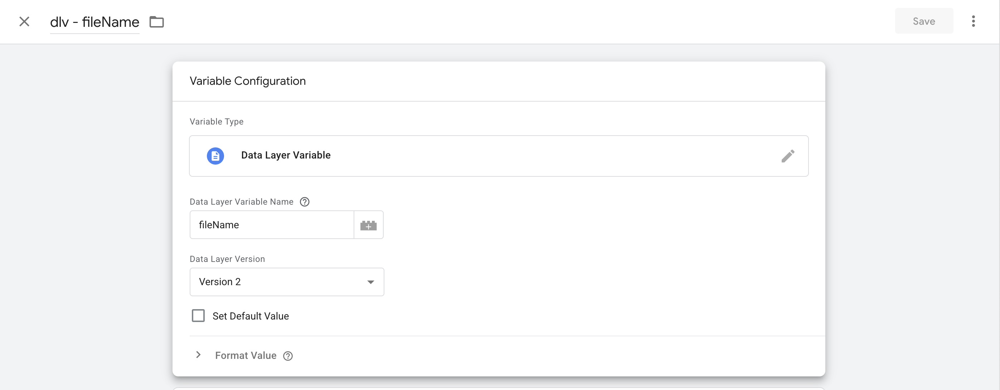
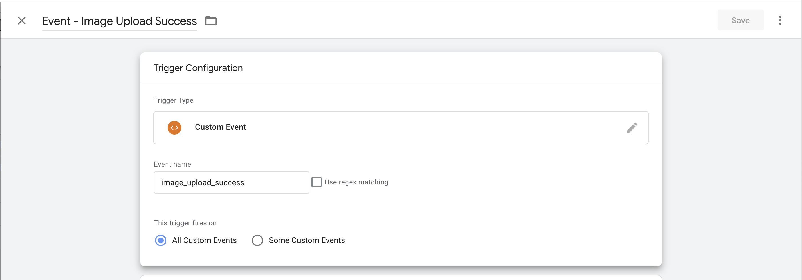
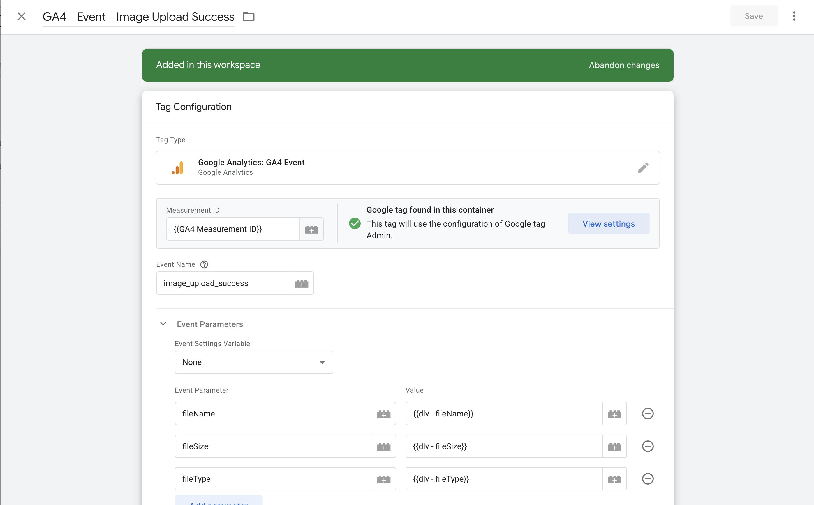
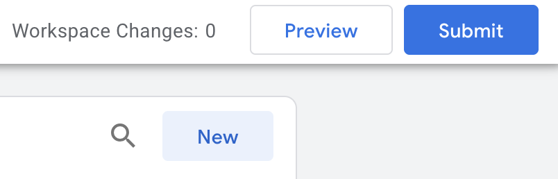

# Analytics

User-behaviour analytics flow through Google Tag Manager (GTM) into Google Analytics 4 (GA4). The application pushes events to the browser `dataLayer`, GTM matches them with Custom Event triggers, and GA4 Event tags forward them (with parameters) to GA4 using a shared Measurement ID.

## Getting access

GTM and GA4 are managed under the Jesus Film Project account. To get access to the workspace, speak to an admin — you'll need to be added before you can create variables, triggers, or tags.

## Adding a Custom Event in GTM → GA4

A custom event flows through three layers:

1. The application pushes data into the `dataLayer`.
2. GTM picks it up via a **Custom Event trigger** that reads **Data Layer Variables**.
3. A **GA4 Event tag** sends the event (with parameters) to GA4 using a configured **Measurement ID**.

### Step 1 — Push the event from the application

Push an event to the `dataLayer` with a unique event name and any parameters you want to capture. In Next.js apps, use `sendGTMEvent` from `@next/third-parties/google` — the `event` key becomes the GTM Custom Event name; other keys map to Data Layer Variables.

```ts
import { sendGTMEvent } from '@next/third-parties/google'

sendGTMEvent({
  event: 'image_upload_success',
  fileSize,
  fileType
})
```

In this repo, these pushes typically live in a small wrapper file (e.g. `apps/<app>/src/libs/send<Thing>Event/`) and are called from the relevant handler. See [apps/journeys-admin/src/libs/sendImageUploadEvent/sendImageUploadEvent.ts](https://github.com/JesusFilm/core/blob/main/apps/journeys-admin/src/libs/sendImageUploadEvent/sendImageUploadEvent.ts) for the image-upload example.

### Step 2 — Create Data Layer Variables in GTM

In GTM, go to **Variables → User-Defined Variables → New → Variable Configuration → Data Layer Variable**, then enter the `dataLayer` key name (e.g. `fileSize`) and save.

The `dlv - ` prefix in the variable name just stands for "Data Layer Variable" — it's a user-facing naming convention for organization, not something GTM requires.



For each parameter you want available in tags, create a Data Layer Variable that reads it from the `dataLayer`. In this workspace these were added as:

- `dlv - fileSize`
- `dlv - fileType`

### Step 3 — Create Custom Event Triggers

In GTM, go to **Triggers → New → Trigger Configuration → Custom Event**, enter the exact `dataLayer` event name (e.g. `image_upload_success`) in the **Event name** field, leave the trigger to fire on **All Custom Events**, and save.

The `Event - ` prefix in the trigger name is just a user-facing naming convention for organization — it groups custom-event triggers together in the list and isn't required by GTM.



For each `dataLayer` event name, create a Custom Event trigger that listens for that exact event name. In this workspace:

- `Event - Image Upload Success` (fires on `image_upload_success`)

### Step 4 — Create GA4 Event Tags

In GTM, go to **Tags → New → Tag Configuration → Google Analytics: GA4 Event**. Set the Measurement ID to `{{GA4 Measurement ID}}` (an existing Constant variable in this workspace), give the GA4 event a name (e.g. `image_upload_success`), map parameters using the Data Layer Variables created in Step 2, then attach the matching trigger from Step 3 and save.

If the `GA4 Measurement ID` constant doesn't exist in your container, create it via **Variables → New → Constant**, name it `GA4 Measurement ID`, and paste the GA4 property's Measurement ID. You can find it in the matching GA4 property under **Admin → Data Streams** — click into a data stream and the **Measurement ID** (format `G-XXXXXXXXXX`) is shown at the top of the stream details.

The `GA4 - ` prefix in the tag name is just a user-facing naming convention for organization — it distinguishes GA4 tags from other tag platforms, and the trailing `Event - ` keeps the tag aligned with its trigger. Neither is required by GTM.



For each event you want to send to GA4, create a GA4 Event tag. In this workspace:

- `GA4 - Event - Image Upload Success` → triggered by `Event - Image Upload Success`

### Step 5 — Preview, test, and publish

Before publishing, install the [Tag Assistant by Google](https://chromewebstore.google.com/detail/tag-assistant/kejbdjndbnbjgmefkgdddjlbokphdefk) Chrome extension. It connects your browser to GTM's **Preview** mode so you can see which tags fire on a real page load, inspect the parameters being sent, and confirm the `dataLayer` push looks right — without it, GTM Preview can't attach to the site.

Open Preview mode from the **Preview** button in the top right of the GTM workspace:



Make sure the app you want to test is already reachable before you click **Preview** — Tag Assistant needs a live URL to attach to. Enter the target URL for whatever environment you intend to preview: a local dev server (e.g. `journeys-admin` at `http://localhost:4200/`), a Vercel preview URL, stage, or prod.

:::tip Verify before publishing
Use GTM's **Preview** mode (with Tag Assistant connected) to fire the event in your app and confirm the tag fires with the right parameters. Then verify the event appears in GA4 — open the GA4 property and go to **Admin → Data display → DebugView** (or **Reports → Realtime** for live events). Once confirmed, **Submit** changes with a clear Version Name and Description, and publish to the **Live** environment.
:::

#### Troubleshooting

**Tag Assistant connects but no tags fire.** An ad blocker or browser privacy setting is likely blocking the GTM/GA4 trackers. Disable any ad-blocker extension for the target URL, or in the **Dia** browser go to **Settings → Privacy** and uncheck tracking protection, then reload the page.

### Step 6 — Replicate to stage and prod containers

Once the new variables, triggers, and tags are working in the current container, repeat the setup in the **stage** and **prod** containers. The fastest way is to export the new items from the current container and import them into the others rather than recreating each one by hand.

To export from the source container, in GTM go to **Admin → Container → Export Container**. On the next screen, pick either the current **workspace** or the **published version** you just shipped, then select all the container items that were added (the new Data Layer Variables, Custom Event triggers, and GA4 Event tags) and click **Export**. GTM downloads a `.json` file.

In the target container (stage or prod), go to the same place — **Admin → Container → Import Container** — choose the exported `.json` file, then pick either **Overwrite** or **Merge**. Prefer **Merge**: it shows a preview of exactly what will be added, modified, or deleted before anything changes. Review that summary and confirm only the expected items are listed.

Because the imported GA4 Event tag references `{{GA4 Measurement ID}}` by name, GTM resolves it to the target container's own constant of that name on import — so stage tags use stage's Measurement ID, prod tags use prod's. This only works if each target container already has its own `GA4 Measurement ID` constant set to that environment's GA4 property (see Step 4 if it's missing). If the constant doesn't exist in the target, GTM will create one from the source's value during merge, which can silently point stage at prod's GA4 — review the import preview for any new `GA4 Measurement ID` variable being added.

After the import, do a final check over the imported items — most importantly, open each GA4 Event tag and verify the **Measurement ID** is pointing to the correct one for that environment. Then preview and publish that container the same way as Step 5.

### Naming Conventions

| Item                          | Convention                           | Example                              |
| ----------------------------- | ------------------------------------ | ------------------------------------ |
| Data Layer Variables          | `dlv - <camelCaseKey>`               | `dlv - fileSize`                     |
| Triggers (Custom Event)       | `Event - <Title Case Description>`   | `Event - Image Upload Success`       |
| GA4 Event Tags                | `GA4 - Event - <Title Case>`         | `GA4 - Event - Image Upload Success` |
| Constants / config variables  | Plain descriptive names              | `GA4 Measurement ID`                 |
| GA4 event names (sent to GA4) | `snake_case`                         | `image_upload_success`               |
| `dataLayer` keys              | `camelCase`                          | `fileSize`, `fileType`               |
| Versions                      | Short, human-readable change summary | `GA4 Image Upload Event Tracking`    |

- GA4 event names use `snake_case` to match Google's recommended convention and how GA4 displays events.
- `dataLayer` keys use `camelCase` to match typical JavaScript object property style.
- GTM auto-assigns a numeric version ID, so version names don't need to include one.
