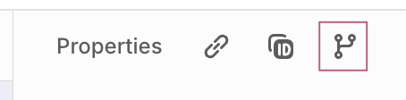
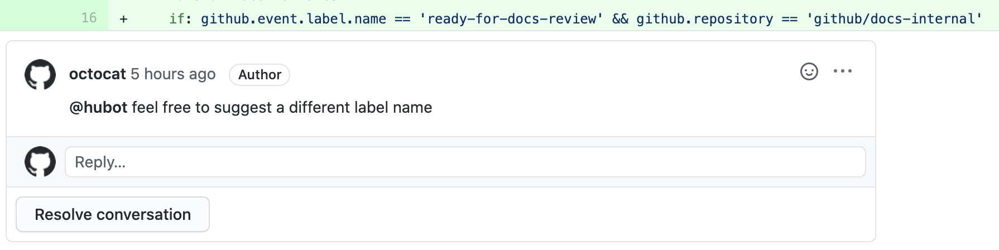
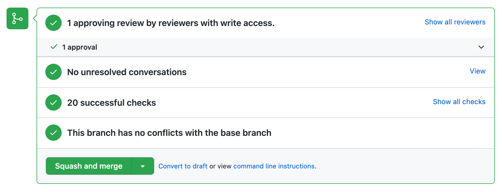
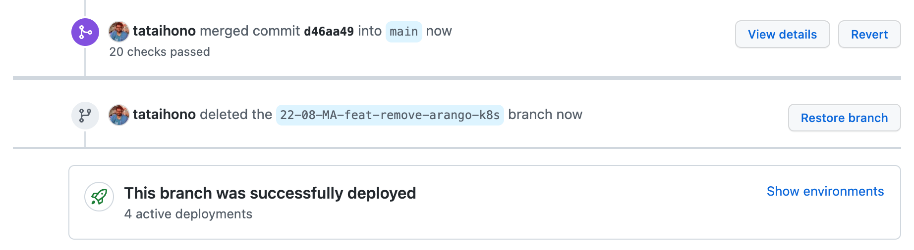
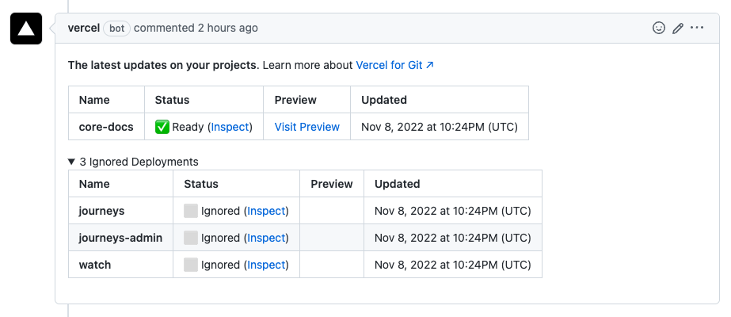
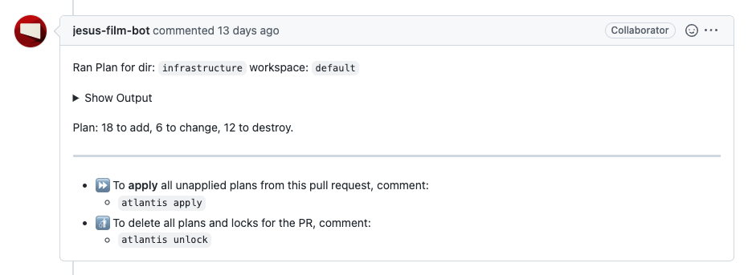
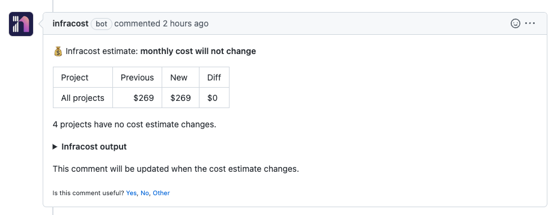

# Our Workflow

Core is a single monorepo that aims to implement our unified product suite hosted on GitHub.com (see [JesusFilm/Core](https://github.com/JesusFilm/core)). We use modified version of [GitHub flow](https://docs.github.com/en/get-started/quickstart/github-flow) to collaborate on projects within Core Development Kit.

## Prerequisites

To follow our workflow, you will need a GitHub account and access to the [JesusFilm/Core](https://github.com/JesusFilm/core) repository by being added to a JesusFilm GitHub Team. For information on how to create an account, see "[Signing up for GitHub](https://docs.github.com/en/github/getting-started-with-github/signing-up-for-github)."

For salaried and contract engineers you'll need to be added to the [Engineering](https://github.com/orgs/JesusFilm/teams/engineering) team. For collaborators and friends of the ministry you'll need to be added to the [Friends of the Ministry](https://github.com/orgs/JesusFilm/teams/friends-of-the-ministry) team as an outside collaborator. You'll need to contact a Team maintainer to request being added to one of these teams. If you have access to [JFP Digital Slack](https://jfp-digital.slack.com/) post a message to #sol-engineering requesting access to the relevant team.

If You are a team maintainer and have been and have been contacted by someone to add them to a GitHub team, see "[Adding organization members to a team](https://docs.github.com/en/organizations/organizing-members-into-teams/adding-organization-members-to-a-team)."

## Following our workflow

### Create a branch

When starting on a new feature, bug-fix, or refactor you must create a new branch to commit your work to. By creating a branch, you create a space to work without affecting the `main` branch. Additionally, you give collaborators a chance to review your work. For more information, see "[Creating and deleting branches within your repository](https://docs.github.com/en/github/collaborating-with-issues-and-pull-requests/creating-and-deleting-branches-within-your-repository)."

#### Naming your branch

When it comes to naming your Git branches, there are two common approaches: a traditional, verbose format and a more streamlined format generated by [Linear](https://linear.app/). While both are valid, the Linear approach is cleaner and thus the recommended approach.

*Historic/Verbose Approach*

Historically branch names followed the following format: `YY-CY-FN-type-summary` where:
- `YY` is the short-form year
- `CY` is the cycle number with a leading zero if necessary
- `FN` is your first and last initial
- `type` is the type of issue being addressed (build, chore, ci, docs, feat, fix, perf, refactor, revert, style, test)
- `summary` is a two to four word dash-separated summary of the issue being addressed

*Clean Linear Generated Approach*

This is the format: `{fullname}/{linearProject}-{linearId}-{title}`
Here's what each part represents:
- {fullname}: Your full name, which helps easily identify the branch owner.
- {linearProject}: The short code or identifier for the Linear project.
- {linearId}: The unique ID of the Linear ticket the branch relates to.
- {title}: A short, descriptive title of the Linear ticket.

This branch name can be conveniently generated directly from within a Linear ticket's "Properties" pane by clicking the `Copy git branch name` button.

For example `johndoe/eng-3055-update-docs`.

**Old/Stale Branches**

Periodically old branches not being worked on will be deleted.

#### Large-Scoped Feature Branches

For **large-scoped feature implementations** that may involve multiple Linear tickets or require a dedicated integration point, we recommend creating a **single overarching feature branch** using the general naming convention. Subsequent work or smaller contributions related to this large feature can then branch off and PR into this dedicated feature branch.

For this approach use the following format: `feature/YY-CY-FN-summary`.

- `feature/` denotes it's a feature branch
- `YY` is the short-form year
- `CY` is the cycle number with a leading zero if necessary
- `FN` is your first and last initial
- `summary` is a one to four word dash-separated summary of the issue being addressed

For example `feature/22-06-ZL-templates`.

### Make changes

On your branch, make any desired changes to the repository. Your branch is a safe place to make changes. If you make a mistake, you can revert your changes or push additional changes to fix the mistake. Your changes will not end up on the default branch until you merge your branch.

Commit and push your changes to your branch. Give each commit a descriptive message to help you and future contributors understand what changes the commit contains. For example, fix typo or increase rate limit.

Ideally, each commit contains an isolated, complete change. This makes it easy to revert your changes if you decide to take a different approach. For example, if you want to rename a variable and add some tests, put the variable rename in one commit and the tests in another commit. Later, if you want to keep the tests but revert the variable rename, you can revert the specific commit that contained the variable rename. If you put the variable rename and tests in the same commit or spread the variable rename across multiple commits, you would spend more effort reverting your changes.

By committing and pushing your changes regularly, you back up your work to remote storage. This means that you can access your work from any device. It also means that your collaborators can see your work, answer questions, and make suggestions or contributions.

Continue to make, commit, and push changes to your branch until you are ready to ask for feedback.

:::tip

Tip: Make a separate branch for each set of unrelated changes. This makes it easier for reviewers to give feedback. It also makes it easier for you and future collaborators to understand the changes and to revert or build on them. Additionally, if there is a delay in one set of changes, your other changes aren't also delayed.

:::

### Create a pull request

Create a pull request to ask collaborators for feedback on your changes. Pull request review is so valuable to us that we require approving review and passing checks before pull requests can be merged. If you want early feedback or advice before you complete your changes, you can mark your pull request as a draft. For more information, see "[Creating a pull request](https://docs.github.com/en/articles/creating-a-pull-request)."

When you create a pull request, coderabbit.ai will populate a detailed description for you.

In addition to filling out the body of the pull request, you can add comments to specific lines of the pull request to explicitly point something out to the reviewers.

Once you've done this you can check off `I have performed a self-review of my own code`.

Our repository has checks configured to run on pull requests, you will see any checks that failed on your pull request. This helps you catch errors before merging your branch. For more information, see "[About status checks](https://docs.github.com/en/github/collaborating-with-issues-and-pull-requests/about-status-checks)."

#### Naming your pull request

- Primary type with colon should be at start of pull request name (build, chore, ci, docs, feat, fix, perf, refactor, revert, style, test).
- Short summary of what is being done.
- Complete sentence, written as though it was an order.

Try to keep your name short, focused, and to the point. The clarity and utility to the reader should be the top concern.

By tradition, the name of a pull request is a complete sentence, written as though it were an order (an imperative sentence). For example, say "chore: Delete the FizzBuzz RPC and replace it with the new system.” instead of "Deleting the FizzBuzz RPC and replacing it with the new system.”

#### Reviewer

You must tag at least one reviewer. Typically this is going to be a fellow team member or a senior engineer from another team with domain specific experience relevant to the pull request's content.

#### Assignee

You must tag the person responsible for merging this pull request. Typically this is going to be youself or your team leader.

### Code Review

Reviews allow collaborators to comment on the changes proposed in pull requests, approve the changes, or request further changes before the pull request is merged. We require that all pull requests are approved before being merged.

We've adopted [The Standard of Code Review](https://google.github.io/eng-practices/review/reviewer/standard.html) put forward by Google. Please note that when Google refer to CL (changelist) we take it to mean PR (pull request). Two documents worthy of your time are:

- [Reviewers: How to do a code review](https://google.github.io/eng-practices/review/reviewer/)
- [Authors: getting through code review](https://google.github.io/eng-practices/review/developer/)

As a reviewer doing a code review, you must make sure that:

- The code is well-designed.
- The functionality is good for the users of the code.
- Any UI changes are sensible and look good.
- The code isn’t more complex than it needs to be.
- The developer isn’t implementing things they might need in the future but doesn’t know they need now.
- Code has appropriate unit tests.
- Tests are well-designed.
- The developer used clear names for everything.
- Comments are clear and useful, and mostly explain why instead of what.
- Code is appropriately documented.
- The code conforms to our style guides.

#### Address review comments

Reviewers should leave questions, comments, and suggestions. Reviewers can comment on the whole pull request or add comments to specific lines. You and reviewers can insert images or code suggestions to clarify comments. For more information, see "[Reviewing changes in pull requests](https://docs.github.com/en/github/collaborating-with-issues-and-pull-requests/reviewing-changes-in-pull-requests)."

You can continue to commit and push changes in response to the reviews. Your pull request will update automatically.

### Squash and merge your pull request

Once your pull request is approved and all [checks have passed](#our-checks), click the "Squash and merge" button on your pull request. This will automatically merge your branch so that your changes appear on the `main` branch. GitHub retains the history of comments and commits in the pull request to help future contributors understand your changes. For more information, see "[Merging a pull request](https://docs.github.com/en/pull-requests/collaborating-with-pull-requests/incorporating-changes-from-a-pull-request/merging-a-pull-request)."

GitHub will tell you if your pull request has conflicts that must be resolved before merging. For more information, see "[Addressing merge conflicts](https://docs.github.com/en/github/collaborating-with-issues-and-pull-requests/addressing-merge-conflicts)."

### Delete your branch

After you merge your pull request, your branch will automatically be deleted. This indicates that the work on the branch is complete and prevents you or others from accidentally using old branches. For more information, see "[Deleting and restoring branches in a pull request](https://docs.github.com/en/repositories/configuring-branches-and-merges-in-your-repository/managing-branches-in-your-repository/deleting-and-restoring-branches-in-a-pull-request)."

Don't worry about losing information. Your pull request and commit history will not be deleted. You can always restore your deleted branch or revert your pull request if needed.

## Our checks

Our checks are defined in this [main.yml](https://github.com/JesusFilm/core/blob/main/.github/workflows/main.yml) file to define our workflow configuration. These checks run automatically when creating and updating a pull request. For more information, see "[Workflow syntax for GitHub Actions](https://docs.github.com/en/actions/using-workflows/workflow-syntax-for-github-actions)."

:::tip

Checks in the fail or pending state will add details to your pull request via comments or logs. They can be discovered by clicking the "Details" button next to the relevant check.

:::

### CodeQL

This check runs GitHub's industry-leading semantic code analysis engine, [CodeQL](https://github.com/github/codeql-action), against our source code to find security vulnerabilities. It then automatically uploads the results to GitHub so they can be displayed in the repository security tab. CodeQL runs an extensible set of queries, which have been developed by the community and the GitHub Security Lab to find common vulnerabilities in your code.

### Danger

This check runs [Danger JS](https://danger.systems/js/) giving us the chance to automate common code review chores. This provides another logical step in your build, through this Danger can help lint your rote tasks in daily code review. We use Danger to codify your teams norms. Leaving humans to think about harder problems. For more information, see "[dangerfile.ts](https://github.com/JesusFilm/core/blob/main/dangerfile.ts)."

### Lint

This check runs `codegen`, `lint`, `type-check`, and `extract-translations` commands on all affected projects. On top of that we also run [commitlint](https://commitlint.js.org/#/), and [validate-branch-name](https://www.npmjs.com/package/validate-branch-name). Finally we run a [script](https://github.com/JesusFilm/core/blob/main/tools/scripts/check-git-status.sh) ensure that no files changed when the previous commands have been run.

### Build

This check runs `fetch-secrets`, `generate`, and `build` commands on all affected projects. This ensures that changes to our projects can still be built and deployed.

### Tests

This check runs `generate` and `test` on all affected projects. Typically the `test` command will run all integration, unit and e2e tests contained within the affected projects.

### Visual Tests

This check runs `build-storybook` on the shared-storybook project. It will then run the [Chromatic GitHub Action](https://www.chromatic.com/docs/github-actions) to automate our visual regression tests and publish [Storybook](https://storybook.core.jesusfilm.org/). Upon success two additional checks are added for [UI Tests](https://www.chromatic.com/docs/test) and [UI Review](https://www.chromatic.com/docs/review).

### Vercel

[Vercel for GitHub](https://vercel.com/docs/concepts/git/vercel-for-github) checks automatically deploys all affected projects on Vercel. On completion it will publish Preview Deployment URLs for affected projects as a comment.

### Atlantis

[Atlantis](https://www.runatlantis.io/) is an application for automating Terraform via pull requests. It is deployed as a standalone application into our infrastructure at [atlantis.central.jesusfilm.org](https://atlantis.central.jesusfilm.org/).

Atlantis listens for GitHub webhooks about Terraform pull requests. It then runs `terraform plan` and comments with the output back on the pull request.

After an approval, when you want to apply, comment `atlantis apply` on the pull request and Atlantis will run `terraform apply` and comment back with the output.

### Infracost

Infracost scans for Terraform code changes and checks over 3 million prices to create a simple, understandable cost estimate before any resources are launched. It is important to consider considerable price increases based on Terraform changes and ensure you have appropriate leadership buy-in when increasing costs.

### Contributor License Agreement

This check ensures that you as an individual collaborator have agreed to our [Contributor License Agreement (CLA)](https://cla-assistant.io/JesusFilm/core). If you have not already done so, a bot will leave a comment asking you to agree. We are only able to accept contributions from individuals who agree to our CLA. If you are a salaried or contract engineer, as a condition of your contract, you have already agreed to this CLA.
