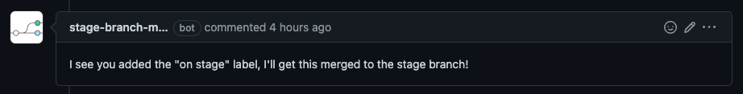
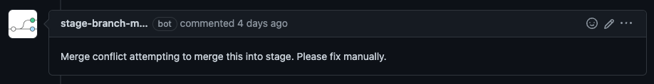

# Deployment

## Stage

### Adding your Pull Request (PR) branch to the stage branch

1. Add "on stage" label to your PR.
1. GitHub Bot will attempt to merge your PR branch into the stage branch.
   
1. If a conflict exist between your PR branch and the stage branch you must resolve conflicts by manually. You will need to pull down the stage branch to your development container and merge the PR branch manually (alternatively you will need to reset the stage branch).
   
   1. Run `git checkout stage`
   1. Run `git merge my-pr-branch-name`
   1. Resolve conflicts between your PR branch and the stage branch
   1. Run `git push origin stage`

### Recommended automation for stage recovery

Manual stage recovery is disruptive and requires channel coordination. To reduce this overhead, we recommend automating stage reset with a Slack notification and timeout policy.

#### Proposed policy

1. Detect reset-worthy stage states (failed merge bot, broken stage deploy, or explicit manual trigger).
1. Use a dedicated opt-out label on PRs: `"stage-reset-blocked"`.
   - Engineers add this label only when they are actively testing and need stage preserved.
   - If this label is not present, reset is allowed by default.
1. Post a Slack message to affected PR owners (all open PRs with `"on stage"` label) with:
   - Why reset is needed
   - Which PRs are currently on stage
   - Which PRs are currently protected by `"stage-reset-blocked"`
1. If no PR is protected by `"stage-reset-blocked"`, proceed automatically:
   1. Reset `stage` to `main`
   1. Re-merge open PRs labeled `"on stage"` in update order
   1. Push updated `stage`
1. If one or more PRs have `"stage-reset-blocked"`:
   - Skip automatic reset
   - Notify owners that reset is blocked until label removal or manual override
1. Post a completion message to Slack with:
   - Reset status (success/failure)
   - PRs successfully re-applied
   - PRs that failed and require manual follow-up

#### Guardrails

- Do not run automatically during protected release windows.
- Use `"stage-reset-blocked"` as the only persistent opt-out mechanism.
- Keep all reset actions auditable in a GitHub Actions run log.
- Prefer a dry-run mode before enabling automatic reset in production.

### Resetting the stage branch

From time to time the stage branch will need to be reset to main. This can happen for any number of reasons including but not limited to:

- Changes to stage branch were never merged to main e.g a PR was merged to stage then closed without merging to main.
- Conflicts were merged differently in stage than in main

In order to reset stage from your local environment follow these steps:

1. Run `git push -d origin stage`
1. Run `git branch -D stage` (This may fail if you don’t have a local ‘stage’ branch)
1. Run `git checkout main`
1. Run `git pull origin main`
1. Run `git checkout -b stage`
1. Run `git push origin stage`
1. You will then need to merge into stage each [PR's currently labelled "on stage"](https://github.com/JesusFilm/core/pulls?q=is%3Apr+is%3Aopen+sort%3Aupdated-desc+label%3A%22on+stage%22) by running `git merge origin/branch-name`
1. Once you’ve merged all the required branches then run `git push origin stage`
