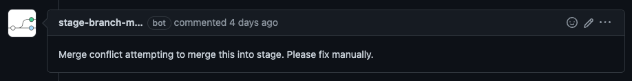

# Deployment

## Stage

### Adding your Pull Request (PR) branch to the stage branch

1. Add "on stage" label to your PR.
1. GitHub Bot will attempt to merge your PR branch into the stage branch.
   
1. If a conflict exists between your PR branch and the stage branch you must resolve conflicts manually. You will need to pull down the stage branch to your development container and merge the PR branch manually (alternatively you will need to reset the stage branch).
   
   1. Run `git checkout stage`
   1. Run `git merge my-pr-branch-name`
   1. Resolve conflicts between your PR branch and the stage branch
   1. Run `git push origin stage`

### Resetting the stage branch

From time to time the stage branch will need to be reset to main. This can happen for any number of reasons including but not limited to:

- Changes to stage branch were never merged to main e.g a PR was merged to stage then closed without merging to main.
- Conflicts were merged differently in stage than in main

In order to reset stage from your local environment follow these steps:

1. Run `git push -d origin stage`
1. Run `git branch -D stage` (This may fail if you don’t have a local ‘stage’ branch)
1. Run `git checkout main`
1. Run `git pull origin main`
1. Run `git checkout -b stage`
1. Run `git push origin stage`
1. You will then need to merge into stage each [PR's currently labelled "on stage"](https://github.com/JesusFilm/core/pulls?q=is%3Apr+is%3Aopen+sort%3Aupdated-desc+label%3A%22on+stage%22) by running `git merge origin/branch-name`
1. Once you’ve merged all the required branches then run `git push origin stage`
