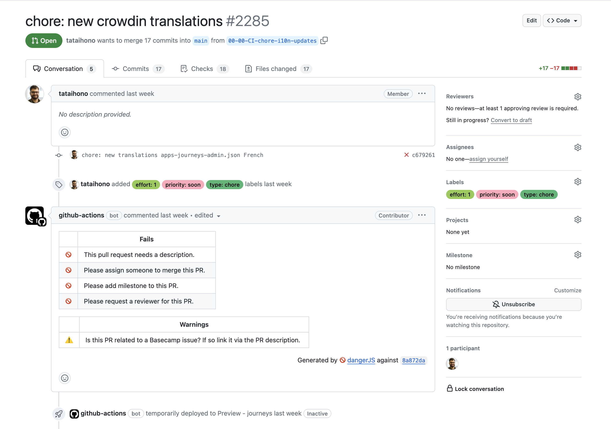
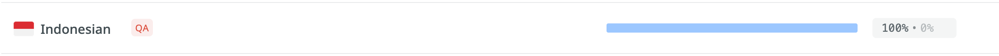

# Translation Process

## Understanding Locales

A locale represents a specific geographical, political, or cultural region and consists of:

- Language code (2 letters): e.g., 'en' for English
- Optional region code (2 letters): e.g., 'US' for United States
- Optional script code: e.g., 'Hans' for Simplified Chinese characters

### Currently Supported Countries and Regions

Our application currently supports the following locales:

- English (en)
- Spanish (es, es-ES)
- Arabic (ar, ar-SA)
- Chinese Simplified (zh, zh-Hans-CN)

## Translation Workflow

### 1. Crowdin Integration

After merging changes into production, our [Crowdin GitHub integration](https://support.crowdin.com/github-integration/) automatically:

1. Detects changes in the `locales/en` directory
2. Uploads new content for translation
3. Generates translations using DeepL
4. Creates a PR with the translated content



#### Developer Responsibilities for Crowdin PRs:

1. Assign yourself to relevant translation PRs
2. Update PR labels appropriately
3. Request review from another team member
4. Merge approved changes promptly

### 2. DeepL Machine Translation

- DeepL automatically translates new content when detected by Crowdin
- Process typically takes 5-10 minutes
- Limitations:
  - May not capture context accurately
  - Not all languages are supported
  - Some translations may remain in English
  - Requires verification from local users

## Adding New Languages

### Prerequisites

1. Coordinate with the Jesus Film translations manager who oversees Crowdin
2. Wait for confirmation that the language is fully translated



### Implementation Steps

#### 1. Update next-i18next Configuration

Modify `next-i18next.config.js`:

```jsx
import path from 'path'

/**
 * @type {import('next-i18next').UserConfig}
 **/
const i18nConfig = {
  i18n: {
    defaultLocale: 'en',
    locales: [
      'en',
      'es', // Spanish
      'ar', // Arabic
      'zh', // Chinese (two-letter code)
      'zh-Hans-CN' // Chinese Simplified (specific variant)
    ],
    fallbackLng: {
      default: ['en'],
      ar: ['ar-SA'],
      es: ['es-ES'],
      zh: ['zh-Hans-CN']
    },
    localePath: path.resolve('./libs/locales')
  }
}

export default i18nConfig
```

Key Configuration Rules:

- Always include both the two-letter language code and specific variants if needed
- Add fallback languages for variants using `fallbackLng`
- Skip fallback configuration if the locale already has a folder in `libs/locales`

#### 2. Update Middleware Configuration

If your project uses middleware, update the supported locales:

```jsx
const supportedLocales = [
  'en', // English
  'es', // Spanish
  'ar', // Arabic
  'zh', // Chinese (two-letter code)
  'zh-Hans-CN' // Chinese Simplified (specific variant)
]
```

### Best Practices

1. Always include both:
   - Two-letter language code (e.g., 'zh')
   - Specific variants when needed (e.g., 'zh-Hans-CN')
2. Define proper fallbacks for all variants
3. Maintain consistent naming conventions
4. Document new additions in both config files
5. Verify translations in Crowdin before adding new locales
