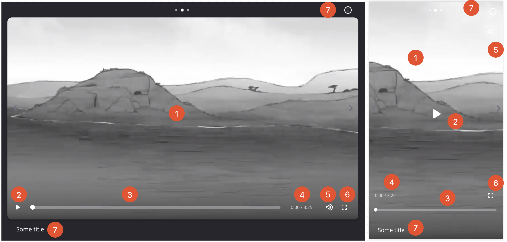

# Video Player

Our NextSteps video is built using the [videojs](https://github.com/videojs/video.js) and [videojs-youtube](https://github.com/videojs/videojs-youtube) libraries.

This has been customised to support multiple sources of videos, display our own custom controls and adding navigation trigger features on video end time.

## Sources

Player supports 3 types of videos:

1. Jesus Film Project library videos (also known as arclight or internal videos)
2. Youtube Videos
3. Custom uploaded videos (cloudflare)

## Custom Controls

Our custom controls are built using the video-js `player` object, methods and event listeners. The behaviour of the video player is defined within the `Video.tsx, VideoControls.tsx and VideoTriggers.tsx` files.

### General features

- Displays the same for LTR and RTL journeys
- Controls `fade from view` 3 seconds after last interaction

### Autoplay

Autoplay is notoriously flakey depending on the device, journey configuration and user interaction. The limitations exist to prevent autoplay videos from spamming users. More can be seen [here](https://developer.chrome.com/blog/autoplay/)

The general principals which apply to us are:

1. Muted autoplay is always allowed (except youtube videos on iPhone)
2. Autoplay with sound is allowed if the user has interacted with card.

As a result, we see the following quirks in autoplay behaviour:

- iPhones and iPads block autoplay for Youtube videos. This is due to a `videojs-youtube` limitation.
- On iPhone, arclight / cloudflare videos will usually autoplay unless `user interaction` limitations prevent so. Most commonly we have found this occuring in 2 scenarios:

1. [Video on first card autoplays but is muted](#the-autoplay-video-on-the-first-card-has-no-sound)
2. [Video on a middle card does not autoplay](#the-arclight-video-does-not-autoplay-on-iphone)

Desktop and Android devices are able to autoplay videos successfully.

### Control Features

### 1) Video Display

- One click in this region `plays / pauses` the video
- Double clicking in this region `toggles fullscreen` mode

#### **Poster Images**

Poster images will cover this area, there are 4 types - in order of display

1. `NextImage` - User selected poster image (always displays if present)
2. `NextImage` - Default image thumbnail on arclight video object (displays only if no user poster set)
3. `videojs.poster` - Do not use as image is not optimized.
4. `Youtube thumbnail` - Defined within the YT embed player. We cannot control this display.

Poster images should display `as the video loads` and `remain on the screen` until the video starts playing.

- If there is no user selected poster, the arclight and youtube videos display their own default poster.
- If there is no poster at all, the video will display the first frame of the video whilst loading / before playing. This can seem like a [bug](#faqs)

### 2) Play / Pause

- Changes position based on desktop or mobile device

### 3) Progress Slider

- Displays the `clipped` duration of the video, based on `startAt` and `endAt` video properties.
- Shows a tooltip with current time on interaction.
- Disabled on mobile if the player hasn't started playing, as scrubbing does not set properly if we try to change it before load on iOS.
- iOS uses its native video player in fullscreen mode which shows the full duration of the video (regardless of `startAt/endAt` times).
  Scrubbing to a time before `startAt` should play the video at the `startAt` time. Scrubbing to a time after `endAt` should trigger the video navigation. This is an accepted difference.

### 4) Video duration display

- Displays the relative running time within the `clipped` duration of the video.
- Differs from iOS native video player (occurs during fullscreen mode). This is an accepted difference.

### 5) Volume Slider and Mute

- Displays as `mute/unmute` button on mobile
- Displays as a `mute/unmute` button on desktop alongside a slider which appears on button hover which sets the volume.

### 6) Fullscreen toggle

This uses both the `fscreen` library (built on the native browser fullscreen [API](https://caniuse.com/fullscreen)) and videojs `player` object methods to toggle fullscreen.

- Desktop, Android devices and iPads support `fscreen`, this allows us to enlarge the card and keep our custom controls as we toggle fullscreen.
-
- iPhones only support `player` fullscreen methods. Due to `videojs` limitations, an `arclight / cloudflare` video will trigger the `native iPhone video player` whilst a `youtube` video can only trigger **full window** mode.

### 7) Header & Footer

- Disappear when fullscreen along with the navigation arrows
- Disappears when a YT video is paused, so it doesn't clash with the youtube title and logo that appear on pause.

### Frequently encountered bugs

#### **The video shows a black screen and no image**

- This is most likely because there is no poster image selected for this video. We default to displaying the first frame of the video which can be a black screen. Change the `startAt` time to test that the video correctly displays.

#### **The video does not navigate away after I finish watching**

- Check is there a `navigation action` attached to the video? Does this navigate to a `different` card than the one the video is on? Otherwise raise the issue as a bug.

#### **The youtube video does not go fullscreen on iPhone**

- Check the fullscreen icon, has it changed appearance from the maximise to minimise view icon? If so, the youtube video has toggled to fullscreen mode. Unfortunately this looks like **full window** mode on iPhones due to `iOS` and `videoJS` limitations. Looks bad but is not a bug.

#### **The autoplay video on the first card has no sound**

- This occurs because there is no user interaction when the first card loads, so all videos will not autoplay unless muted. It was a product decision to override user-selected sound settings to allow autoplay to occur on the first card. Users must manually unmute to listen to the audio for the first card.

#### **The arclight video does not autoplay on iPhone**

- Is there a video on the card before the broken autoplay video? If so, this breaks because the first video is watched to the end and autotriggers navigation to the autoplay arclight video. Since no user interaction was registered, the video does not autoplay (iPhone considers this as spam). In this case, manually set the autoplay video to `mute` or don't stack videos back to back if you want autoplay to occur. Else, raise a bug report.

#### **The youtube video does not play in the embedded journey on Chrome browser**

- There is a security feature on Chrome which prevents iframe youtube videos (like the one in our video player) from playing. This is a browser feature we cannot bypass. For the best embedded journey experience, favour usage of arclight and custom uploaded videos.
