# feat: Add `updatedAt` to Gateway API Entities

## Enhancement Summary

**Deepened on:** 2026-03-24
**Sections enhanced:** All major sections
**Agents used:** Architecture Strategist, Performance Oracle, Security Sentinel, Data Migration Expert, Data Integrity Guardian, Pattern Recognition Specialist, Code Simplicity Reviewer, TypeScript Reviewer, Best Practices Researcher, Framework Docs Researcher, Schema Drift Detector

### Key Improvements from Deepening
1. **Compound indexes** `@@index([updatedAt, id])` for large tables (Video, VideoVariant) to support efficient paginated sync
2. **`CREATE INDEX CONCURRENTLY`** required for Video/VideoVariant to avoid write-locks in production
3. **Critical data integrity gap**: `data-import.ts` uses raw `psql` restore which bypasses `@updatedAt` — requires post-import timestamp reset
4. **Child record propagation**: `@updatedAt` does NOT cascade to parent records — must be documented as known limitation
5. **Default query limits**: `videoVariants` and `keywords` queries are unbounded — must cap before adding `updatedSince`
6. **Rollback plan** and **post-deploy verification** queries added
7. **`videosFilter()` helper** should use pure-function return pattern (not mutation) for consistency

### New Considerations Discovered
- `graphql-scalars` must be verified as a dependency in api-languages `package.json`
- Use `'DateTime'` scalar type (not `'Date'`) — older types use `'Date'` but that loses time precision
- Test `omit()` calls must be updated to stop stripping `updatedAt` from assertions
- Soft-delete pattern already exists in the journeys schema (`deletedAt DateTime?`) — precedent for future deletion tracking
- Consumers should subtract a 10-second buffer from their high-water mark to handle clock skew

---

## Overview

Enable incremental sync for downstream consumers (e.g., `JesusFilm/forge` CMS) by exposing `updatedAt` timestamps on all syncable entities and making them filterable via `updatedSince`. This turns a 3–6 hour full re-sync into a 2–5 minute delta sync.

Affected subgraphs: `api-media`, `api-languages`. Gateway schema is auto-generated from subgraph composition — no manual gateway changes needed.

## Problem Statement / Motivation

Downstream consumers currently must re-fetch every record to detect changes. There is no timestamp exposed in the GraphQL API to support delta queries. Adding `updatedAt` + `updatedSince` filtering enables consumers to query only records modified since their last sync checkpoint.

## Research Findings

### What Already Exists

| Entity | `updatedAt` in Prisma? | Exposed in GraphQL? | Filter type exists? |
|--------|:----------------------:|:-------------------:|:-------------------:|
| Video | Yes (`schema.prisma:161`) | No | `VideosFilter` exists |
| VideoVariant | Yes (`:247`) | No | `VideoVariantFilter` exists |
| VideoSubtitle | Yes | No | No filter type |
| VideoEdition | Yes (`:263`) | No | No filter type |
| BibleCitation | Yes (`:382`) | No | No filter type |
| Keyword | Yes (`:423`) | No | No filter type |
| BibleBook | Yes (`:398`) | No | No filter type |
| Language | Yes (`:22`) | No | `LanguagesFilter` exists |
| **Country** | **No** | No | No filter type |

### Key Codebase Facts

- **Pothos schema builder** is used for all GraphQL types (not SDL files)
- **api-languages builder does NOT have `DateTime` scalar** registered (`apis/api-languages/src/schema/builder.ts:59-61`) — prerequisite to fix
- **api-media builder already has `DateTime`** via `DateTimeResolver` from `graphql-scalars` (`apis/api-media/src/schema/builder.ts:127-128`)
- **Gateway** uses `@graphql-hive/gateway` with Hive CDN supergraph polling — auto-composes from subgraphs
- **No `@@index` on `updatedAt`** for any entity — needed for query performance
- `videosFilter()` helper at `apis/api-media/src/schema/video/lib/videosFilter/videosFilter.ts:6-41`
- `VideoVariantFilter` applied inline in resolver at `apis/api-media/src/schema/videoVariant/videoVariant.ts`
- `LanguagesFilter` applied inline at `apis/api-languages/src/schema/language/language.ts:104-128`
- `keywords` query has no args (`apis/api-media/src/schema/keyword/keyword.ts:18-24`)
- `bibleBooks` query has no args (`apis/api-media/src/schema/bibleBook/bibleBook.ts:49-59`)
- `countries` query uses inline args `term` and `ids` (`apis/api-languages/src/schema/country/country.ts:83-110`)

### Research Insights: Schema & Migration State

- **No schema drift detected** — both Prisma schemas are clean and migration histories are consistent
- **No conflicting indexes** — none of the 6 target models have existing `updatedAt` indexes
- **Two separate migrations** will be needed (one per Prisma project: media + languages)
- **Latest migration timestamps**: media `20260209020139`, languages `20250807215708`
- **Existing index patterns**: media uses both B-tree and Hash indexes; Hash is used for equality-only fields (`type: Hash`)

---

## Proposed Solution

### Architecture

```mermaid
erDiagram
    Video {
        String id PK
        DateTime updatedAt "already exists"
    }
    VideoVariant {
        String id PK
        DateTime updatedAt "already exists"
    }
    VideoEdition {
        String id PK
        DateTime updatedAt "already exists"
    }
    Keyword {
        String id PK
        DateTime updatedAt "already exists"
    }
    BibleBook {
        String id PK
        DateTime updatedAt "already exists"
    }
    Language {
        String id PK
        DateTime updatedAt "already exists"
    }
    Country {
        String id PK
        DateTime updatedAt "NEW - needs migration"
    }
```



### Research Insights: Architecture

- **DateTime scalar in api-languages is safe for federation.** The gateway supergraph currently declares `DateTime` from 3 subgraphs. Adding api-languages as a 4th contributor is standard — scalars are inherently shareable in Federation v2.6 and do not require `@shareable`.
- **VideoVariant should NOT become a federation entity.** It is queried through `api-media` only. Its `language` field resolves to a `Language` entity stub which the gateway resolves against `api-languages`. This pattern is correct for delta sync via list queries.
- **Supergraph composition is low-risk.** Additive changes (new fields, new input types) compose safely. During deployment, there is a brief window (~10s) where one subgraph has the new schema but composition hasn't caught up — standard and harmless for additive changes.

---

### Implementation Phases

#### Phase 1: Prerequisites

**1a. Register `DateTime` scalar in api-languages builder**

File: `apis/api-languages/src/schema/builder.ts`

Three changes required:
1. Import `DateTimeResolver` from `graphql-scalars`
2. Add `DateTime: { Input: Date; Output: Date }` to the `Scalars` generic parameter
3. Call `builder.addScalarType('DateTime', DateTimeResolver)`

This mirrors the exact pattern in `apis/api-media/src/schema/builder.ts:66-68,128`.

> **Prerequisite check:** Verify `graphql-scalars` is listed in api-languages' `package.json` dependencies. If not, add it.

**1b. Add `updatedAt` column to `Country` model**

File: `libs/prisma/languages/db/schema.prisma`

```prisma
model Country {
  // ... existing fields ...
  updatedAt DateTime @default(now()) @updatedAt
}
```

Run: `npx prisma migrate dev --name add-country-updated-at` from the languages prisma directory. The migration will default existing rows to `now()`.

#### Research Insights: Country Migration

- **`DEFAULT CURRENT_TIMESTAMP` is safe.** PostgreSQL applies it in a single pass. For ~250 rows, completes in milliseconds.
- **All existing rows get the same `updatedAt` (migration timestamp).** First delta sync after deployment returns all countries — this is the expected and correct behavior.
- **`@default(now())` is necessary.** Without it, Prisma would need a multi-step nullable→backfill→not-null migration. The Language model uses bare `@updatedAt` without `@default(now())` — that's an existing inconsistency, but for a new column on an existing table, `@default(now())` is required.

**1c. Add database indexes to all filtered entities**

> **Critical: Use `CREATE INDEX CONCURRENTLY` for Video and VideoVariant.** These are potentially large tables. Standard `CREATE INDEX` acquires a SHARE lock that blocks writes for the duration of the index build. For large tables this could be seconds to minutes.

**For large tables (Video, VideoVariant)** — use compound indexes for future cursor-based pagination:

File: `libs/prisma/media/db/schema.prisma`
```prisma
model Video {
  // ...
  @@index([updatedAt, id])
}
model VideoVariant {
  // ...
  @@index([updatedAt, id])
}
```

**Migration procedure for large tables:**
1. Generate migration with `prisma migrate dev --create-only --name add-updated-at-indexes`
2. Edit the generated SQL to use `CREATE INDEX CONCURRENTLY`
3. Note: `CONCURRENTLY` cannot run inside a transaction — the migration must be split or run outside Prisma's transaction wrapper

**For small tables** — single-column index is sufficient:

```prisma
model Keyword {
  // ...
  @@index([updatedAt])
}
model BibleBook {
  // ...
  @@index([updatedAt])
}
```

File: `libs/prisma/languages/db/schema.prisma`
```prisma
model Language {
  // ...
  @@index([updatedAt])
}
model Country {
  // ...
  @@index([updatedAt])
}
```

#### Research Insights: Index Strategy

- **B-tree is correct** (not BRIN). BRIN relies on physical correlation between row location and column value — `updatedAt` changes scatter values across pages, making BRIN perform poorly.
- **Compound `[updatedAt, id]` on large tables** enables efficient cursor-based pagination with `ORDER BY updatedAt ASC, id ASC` without a sort step.
- **Single-column indexes on small tables** (BibleBook ~66 rows, Country ~250 rows, Language ~7K rows) are adequate — the tables fit in memory regardless.
- **Verify production row counts before migrating:** Run `SELECT relname, n_live_tup FROM pg_stat_user_tables WHERE relname IN ('Video', 'VideoVariant', 'Keyword')` to decide which tables need `CONCURRENTLY`.

---

#### Phase 2: Expose `updatedAt` on GraphQL Types

Add `updatedAt` field to each Pothos type definition using the standard expose pattern:

```typescript
updatedAt: t.expose('updatedAt', { type: 'DateTime', nullable: false })
```

> **Important: Use `'DateTime'` not `'Date'`.** The codebase has an inconsistency — older types (Video's `publishedAt`, CloudflareR2) use `'Date'` which loses the time component. Newer types (Playlist, PlaylistItem) use `'DateTime'`. For `updatedAt` timestamps, `'DateTime'` is semantically correct and matches the newer codebase pattern.

Files to modify:
- `apis/api-media/src/schema/video/video.ts` — `Video` type
- `apis/api-media/src/schema/videoVariant/videoVariant.ts` — `VideoVariant` type
- `apis/api-media/src/schema/videoEdition/videoEdition.ts` — `VideoEdition` type
- `apis/api-media/src/schema/keyword/keyword.ts` — `Keyword` type
- `apis/api-media/src/schema/bibleBook/bibleBook.ts` — `BibleBook` type
- `apis/api-languages/src/schema/language/language.ts` — `Language` type
- `apis/api-languages/src/schema/country/country.ts` — `Country` type

---

#### Phase 3: Add `updatedSince` to Existing Filter Types

**3a. `VideosFilter`**

File: `apis/api-media/src/schema/video/inputs/videosFilter.ts`

```typescript
updatedSince: t.field({ type: 'DateTime', required: false })
```

File: `apis/api-media/src/schema/video/lib/videosFilter/videosFilter.ts`

> **Use the pure-function return pattern** (not mutation). The existing helper returns an object — add `updatedSince` as a destructured parameter and include it in the returned object:

```typescript
// Pure-function pattern (matches existing videosFilter style)
updatedAt: updatedSince != null ? { gte: updatedSince } : undefined,
```

This automatically flows to `videosCount` and `adminVideosCount` since they use the same `videosFilter()` helper.

#### Research Insights: Filter Pattern

- **`!= null` is the correct null check** — catches both `null` and `undefined`, which is what you want since Pothos may pass either for omitted optional fields. This is the established convention throughout the codebase.
- **No `new Date()` wrapping needed** — `DateTimeResolver` already parses incoming ISO strings into `Date` objects during input coercion. By the time it reaches the resolver, `filter.updatedSince` is already a `Date` instance.
- **`Prisma.VideoWhereInput` accepts `{ gte: Date }` for DateTime fields** — this is type-safe and well-precedented (see `apis/api-journeys-modern/src/schema/journeyVisitor/journeyVisitor.ts:308-321`).

**3b. `VideoVariantFilter`**

File: `apis/api-media/src/schema/videoVariant/inputs/videoVariantFilter.ts`

```typescript
updatedSince: t.field({ type: 'DateTime', required: false })
```

Update inline filter logic in `apis/api-media/src/schema/videoVariant/videoVariant.ts` for both `videoVariants` and `videoVariantsCount` queries.

> **Also fix the unbounded query.** Change `take: limit ?? undefined` to `take: limit ?? 100` at `videoVariant.ts:465` to prevent unbounded result sets.

**3c. `LanguagesFilter`**

File: `apis/api-languages/src/schema/language/language.ts`

Add `updatedSince` to the input type (lines 13-25) and update the inline filter logic in `languages` query (lines 104-128) and `languagesCount` query (lines 131-159).

---

#### Phase 4: Create New Filter Types

**4a. `CountriesFilter` — NON-BREAKING approach**

> **Important:** The spec proposes changing `countries(ids, term)` to `countries(where: CountriesFilter)`. This is a **breaking change**. Instead, follow the pattern used by `languages` which has both `term` and `where` as separate args. Add `where: CountriesFilter` alongside the existing `term` and `ids` args.

File: `apis/api-languages/src/schema/country/country.ts`

```typescript
builder.inputType('CountriesFilter', {
  fields: (t) => ({
    ids: t.idList(),
    term: t.string(),
    updatedSince: t.field({ type: 'DateTime', required: false })
  })
})
```

Update query to accept `where: CountriesFilter` **in addition to** existing `term` and `ids` args. Merge both sources in the resolver — if `where` is provided, use it; otherwise fall back to top-level args.

#### Research Insights: Naming & Conventions

- **Use `where:` arg naming** for all new filter arguments — this is the dominant pattern (`videos`, `languages`, `videosCount` all use `where:`). `videoVariants` uses `input:` which is the outlier.
- **Plural filter names** (`CountriesFilter`, `KeywordsFilter`, `BibleBooksFilter`) are correct — matches `VideosFilter`, `LanguagesFilter` pattern.

**4b. `KeywordsFilter`**

File: `apis/api-media/src/schema/keyword/keyword.ts`

```typescript
builder.inputType('KeywordsFilter', {
  fields: (t) => ({
    updatedSince: t.field({ type: 'DateTime', required: false })
  })
})
```

Update `keywords` query to accept `where: KeywordsFilter` arg.

> **Also add a default limit.** The `keywords` query currently returns all rows with no pagination. Add `take: limit ?? 250` as a safety net.

**4c. `BibleBooksFilter`**

File: `apis/api-media/src/schema/bibleBook/bibleBook.ts`

```typescript
builder.inputType('BibleBooksFilter', {
  fields: (t) => ({
    updatedSince: t.field({ type: 'DateTime', required: false })
  })
})
```

Update `bibleBooks` query to accept `where: BibleBooksFilter` arg. No default limit needed — dataset is naturally bounded (~66 rows).

---

#### Phase 5: Update Count Queries

Ensure all count queries that accept filter types also respect `updatedSince`:

- `videosCount(where: VideosFilter)` — already uses `videosFilter()` helper; auto-handled by Phase 3a
- `adminVideosCount(where: VideosFilter)` — same helper; auto-handled
- `videoVariantsCount(input: VideoVariantFilter)` — update inline filter in Phase 3b
- `languagesCount(where: LanguagesFilter)` — update inline filter in Phase 3c

---

#### Phase 6: Tests

Follow existing test patterns using `jest-mock-extended` for Prisma mocking.

For each entity with `updatedSince` support, add tests:

1. **Filter applied correctly** — verify Prisma `where` includes `updatedAt: { gte: <date> }` when `updatedSince` is provided
2. **Filter omitted** — verify Prisma `where` does NOT include `updatedAt` filter when `updatedSince` is null/undefined
3. **`updatedAt` field exposed** — verify the GraphQL response includes `updatedAt` as a DateTime string
4. **Count queries** — verify count queries also respect `updatedSince`

Test files to create/modify:
- `apis/api-media/src/schema/video/__tests__/video.spec.ts`
- `apis/api-media/src/schema/videoVariant/__tests__/videoVariant.spec.ts`
- `apis/api-media/src/schema/keyword/__tests__/keyword.spec.ts`
- `apis/api-media/src/schema/bibleBook/__tests__/bibleBook.spec.ts`
- `apis/api-languages/src/schema/language/__tests__/language.spec.ts`
- `apis/api-languages/src/schema/country/__tests__/country.spec.ts`

#### Research Insights: Test Pattern Changes

- **Remove `updatedAt` from `omit()` calls** in test assertions. Currently tests strip `updatedAt` because it's not in GraphQL responses. After this change, assertions must include `updatedAt`.
  - Example: `omit(language, ['createdAt', 'updatedAt', 'hasVideos'])` becomes `omit(language, ['createdAt', 'hasVideos'])`
- **Mock data already includes `updatedAt`** as `new Date()` — assertions just need the expected serialized DateTime value.
- **Test the DateTime serialization format** — `DateTimeResolver` returns RFC 3339 / ISO 8601 strings with `Z` suffix (e.g., `"2021-01-01T00:00:00.000Z"`).

---

## System-Wide Impact

### Interaction Graph

- Adding `updatedAt` to GraphQL types: subgraph schema changes → gateway supergraph recomposes automatically via Hive CDN polling (10s interval in prod)
- No middleware, callbacks, or observers affected — this is purely additive read-path changes
- Prisma `@updatedAt` handles write-path automatically — no application code changes for timestamp updates

### Error Propagation

- `updatedSince` with an invalid DateTime will be caught by `DateTimeResolver` scalar validation (strict RFC 3339) before reaching resolvers
- No new error paths introduced in resolver logic — the `gte` filter is a simple Prisma `where` clause
- Prisma uses parameterized queries — zero injection risk

### State Lifecycle Risks

- Country migration backfills with `now()` — first delta sync after deployment returns all countries (safe, expected)
- No risk of orphaned state — this is read-only filtering on existing data

### Research Insights: Critical Data Integrity Gaps

#### `@updatedAt` does NOT cascade to parent records

When a child record changes (e.g., `VideoTitle`, `VideoSnippet`, `CountryName`), the parent's `updatedAt` is **NOT** automatically updated. This means:
- A `VideoTitle` update will NOT bump `Video.updatedAt`
- A `CountryName` update will NOT bump `Country.updatedAt`

**Impact on sync consumers:** Queries with `WHERE Video.updatedAt > :lastSync` will miss videos whose child records were modified without the parent being touched.

**Mitigation for v1:** Document this as a **known limitation**. Consumers should do periodic full reconciliation (recommended every 24h) to catch changes that didn't propagate.

**Future mitigation options:**
1. Database triggers on child tables that touch parent `updatedAt`
2. Application-level middleware that explicitly updates parent in the same transaction
3. Sync on child tables directly (increases query complexity)

#### `data-import.ts` bypasses `@updatedAt` entirely

The `apis/api-media/src/scripts/data-import.ts` script does a full database restore via raw `psql` (`DROP SCHEMA public CASCADE; CREATE SCHEMA public;` followed by SQL dump import). After this, all `updatedAt` values reflect the backup timestamp, not current time.

**Impact:** If the backup is hours/days old, sync consumers' cursors could be ahead of restored data, causing them to **miss all restored records**.

**Mitigation:** After any `psql`-based data import, either:
1. Run `UPDATE "Video" SET "updatedAt" = NOW()` on all affected tables
2. Reset all sync consumer cursors to force full re-sync
3. Document this in the data import runbook

### API Surface Parity

- All root queries that return lists of syncable entities should support `updatedSince`
- Count queries should accept the same filters as their list counterparts

### Integration Test Scenarios

1. Query `videos(where: { updatedSince: "..." })` returns only recently updated videos
2. `videosCount(where: { updatedSince: "..." })` returns matching count
3. `countries` query works with both old-style `(ids, term)` args and new `where` filter
4. `keywords(where: { updatedSince: "..." })` returns filtered results
5. Gateway composes correctly with new subgraph schemas

---

## Security Assessment

**Overall risk: LOW.** Reviewed by Security Sentinel agent.

- **No injection risk** — `DateTimeResolver` validates RFC 3339 format; Prisma uses parameterized queries
- **No timing information leak** — `updatedAt` on media content is not sensitive. Precedent: `publishedAt` is already exposed on Video
- **No enumeration risk** — public queries already enforce `published: true`; `updatedSince` only narrows an already-permitted result set
- **No role restriction needed** — `updatedSince` on public queries does not expand the attack surface beyond what offset/limit pagination already provides
- **Pre-existing concern (not introduced by this change):** `videoVariants` query has no default limit — addressed in Phase 3b

---

## Acceptance Criteria

### Functional Requirements

- [ ] `updatedAt` field exposed on: Video, VideoVariant, VideoEdition, Keyword, BibleBook, Language, Country
- [ ] `updatedSince` filter on: VideosFilter, VideoVariantFilter, LanguagesFilter
- [ ] New filter types: CountriesFilter, KeywordsFilter, BibleBooksFilter — all with `updatedSince`
- [ ] Count queries (videosCount, videoVariantsCount, languagesCount) respect `updatedSince`
- [ ] `countries` query maintains backward compatibility (existing `ids`/`term` args preserved)
- [ ] Country model has `updatedAt` column with `@updatedAt` directive

### Non-Functional Requirements

- [ ] Compound `@@index([updatedAt, id])` on Video, VideoVariant; single `@@index([updatedAt])` on others
- [ ] `CREATE INDEX CONCURRENTLY` used for Video/VideoVariant indexes
- [ ] DateTime scalar registered in api-languages builder
- [ ] Default limit on `videoVariants` query (`take: limit ?? 100`)
- [ ] Default limit on `keywords` query (`take: limit ?? 250`)
- [ ] All new/modified queries have test coverage

### Quality Gates

- [ ] Existing tests pass (no regressions)
- [ ] New filter tests for each entity
- [ ] Prisma migrations generated and validated
- [ ] Post-deploy verification queries run successfully

---

## Spec Deviations & Decisions

### 1. Most Prisma migrations are NOT needed (spec overclaims)

The spec assumes `updatedAt` columns need to be added to all entities. In reality, only **Country** needs a migration. All other entities (Video, VideoVariant, VideoSubtitle, VideoEdition, BibleCitation, Keyword, BibleBook, Language) already have `updatedAt` with `@updatedAt` in their Prisma schemas.

### 2. Countries query — backward-compatible approach (deviates from spec)

The spec proposes replacing `countries(ids, term)` with `countries(where: CountriesFilter)`. This is a **breaking change**. This plan instead adds `where` alongside existing args, following the `languages` query pattern.

### 3. DateTime scalar prerequisite (not mentioned in spec)

The api-languages builder lacks `DateTime` scalar registration. This must be added before any `updatedAt` exposure or `updatedSince` filtering works in that subgraph. Three changes: import `DateTimeResolver`, add to `Scalars` generic, call `addScalarType`.

### 4. Database indexes (not mentioned in spec)

Compound `@@index([updatedAt, id])` for large tables (Video, VideoVariant) and single `@@index([updatedAt])` for small tables. `CREATE INDEX CONCURRENTLY` required for production safety on large tables.

### 5. Default query limits (not mentioned in spec)

`videoVariants` (`take: limit ?? 100`) and `keywords` (`take: limit ?? 250`) need default limits to prevent unbounded result sets.

### 6. Scope exclusions — explicitly out of scope for v1

- **Deletion tracking**: `updatedSince` only returns modified records, not deleted ones. Consumers must do periodic full reconciliation. A soft-delete pattern (`deletedAt`) already exists in the journeys schema as precedent for v2.
- **Parent-child propagation**: Child record changes (VideoTitle, CountryName, etc.) do NOT update parent `updatedAt`. Documented as known limitation.
- **`data-import.ts` bypass**: Raw psql imports reset all timestamps. Post-import procedure must be documented.
- **Ordering by `updatedAt`**: Recommended but not enforced in v1. The compound indexes support it when ready.

---

## Deployment & Operations

### Migration Strategy

Two separate migration files (one per Prisma project):

1. **Languages migration**: Add `updatedAt` column to Country + `@@index([updatedAt])` on Language and Country
2. **Media migration**: Add `@@index([updatedAt, id])` on Video/VideoVariant + `@@index([updatedAt])` on Keyword/BibleBook
   - **Must use `CREATE INDEX CONCURRENTLY`** for Video/VideoVariant — edit generated SQL after `prisma migrate dev --create-only`

### Pre-Deploy Verification

```sql
-- Verify production table sizes to confirm CONCURRENTLY is needed
SELECT relname, n_live_tup FROM pg_stat_user_tables
WHERE relname IN ('Video', 'VideoVariant', 'Keyword', 'BibleBook', 'Language', 'Country')
ORDER BY n_live_tup DESC;

-- Confirm no updatedAt column exists on Country
SELECT column_name FROM information_schema.columns
WHERE table_name = 'Country' AND column_name = 'updatedAt';
```

### Post-Deploy Verification

```sql
-- 1. Confirm Country column exists and all rows have a value
SELECT COUNT(*) AS total, COUNT("updatedAt") AS with_timestamp
FROM "Country";

-- 2. Confirm all Country updatedAt values are approximately the migration time
SELECT MIN("updatedAt"), MAX("updatedAt") FROM "Country";

-- 3. Confirm indexes exist
SELECT indexname, tablename FROM pg_indexes
WHERE indexname LIKE '%updatedAt%' ORDER BY tablename;

-- 4. Confirm index is being used
EXPLAIN ANALYZE SELECT * FROM "Video"
WHERE "updatedAt" >= NOW() - INTERVAL '1 hour';
```

### Rollback Plan

```sql
-- Rollback Country column addition
ALTER TABLE "Country" DROP COLUMN "updatedAt";

-- Rollback indexes (safe, no data impact)
DROP INDEX IF EXISTS "Video_updatedAt_id_idx";
DROP INDEX IF EXISTS "VideoVariant_updatedAt_id_idx";
DROP INDEX IF EXISTS "Keyword_updatedAt_idx";
DROP INDEX IF EXISTS "BibleBook_updatedAt_idx";
DROP INDEX IF EXISTS "Language_updatedAt_idx";
DROP INDEX IF EXISTS "Country_updatedAt_idx";
```

Plus revert Prisma schema changes and run `prisma migrate resolve --rolled-back <migration_name>`.

---

## Dependencies & Risks

| Risk | Impact | Mitigation |
|------|--------|------------|
| Country migration on production DB | Brief lock on Country table (~250 rows) | Table is small; completes in milliseconds |
| Index creation on large tables | SHARE lock blocks writes during build | Use `CREATE INDEX CONCURRENTLY` for Video/VideoVariant |
| Breaking `countries` query signature | Downstream consumer failures | Keep existing args; add `where` alongside |
| DateTime scalar missing in api-languages | Build failure | Add as first prerequisite in Phase 1a |
| `graphql-scalars` not in api-languages deps | Import failure | Verify `package.json` before implementation |
| `data-import.ts` resets all timestamps | Sync consumers miss restored records | Document post-import timestamp reset procedure |
| Child changes don't propagate to parent | Sync consumers get stale parent records | Document limitation; recommend 24h full reconciliation |
| Unbounded `videoVariants`/`keywords` queries | Large payloads, high DB load | Add default `take` limits |

---

## Consumer Guidance (for downstream sync clients)

### High-Water Mark Strategy

```typescript
// Subtract 10-second buffer to handle clock skew and transaction delays
function getUpdatedSinceParam(highWaterMark: string): string {
  const hwm = new Date(highWaterMark)
  const buffer = 10_000 // 10 seconds
  return new Date(hwm.getTime() - buffer).toISOString()
}
```

### Idempotency Requirement

Due to the buffer window, consumers will re-receive some records on each sync cycle. **Consumers must upsert (not insert-only)** — re-delivery is expected and harmless.

### Full Reconciliation

Schedule a full reconciliation every 24 hours to catch:
- Records missed due to the parent-child propagation gap
- Data restored via `data-import.ts` that bypassed `@updatedAt`
- Any edge cases around long-running transactions

---

## Implementation Checklist

### Phase 1: Prerequisites
- [ ] Verify `graphql-scalars` in api-languages `package.json`
- [ ] Register `DateTime` scalar in `apis/api-languages/src/schema/builder.ts` (import, Scalars generic, addScalarType)
- [ ] Add `updatedAt` to Country model in `libs/prisma/languages/db/schema.prisma`
- [ ] Add `@@index([updatedAt, id])` to Video, VideoVariant in `libs/prisma/media/db/schema.prisma`
- [ ] Add `@@index([updatedAt])` to Keyword, BibleBook in `libs/prisma/media/db/schema.prisma`
- [ ] Add `@@index([updatedAt])` to Language, Country in `libs/prisma/languages/db/schema.prisma`
- [ ] Generate media migration with `--create-only`, edit to use `CREATE INDEX CONCURRENTLY` for Video/VideoVariant
- [ ] Generate and apply languages migration

### Phase 2: Expose `updatedAt` on GraphQL types
- [ ] Video type in `apis/api-media/src/schema/video/video.ts`
- [ ] VideoVariant type in `apis/api-media/src/schema/videoVariant/videoVariant.ts`
- [ ] VideoEdition type in `apis/api-media/src/schema/videoEdition/videoEdition.ts`
- [ ] Keyword type in `apis/api-media/src/schema/keyword/keyword.ts`
- [ ] BibleBook type in `apis/api-media/src/schema/bibleBook/bibleBook.ts`
- [ ] Language type in `apis/api-languages/src/schema/language/language.ts`
- [ ] Country type in `apis/api-languages/src/schema/country/country.ts`

### Phase 3: Add `updatedSince` to existing filters
- [ ] `VideosFilter` input + `videosFilter()` helper (pure-function style)
- [ ] `VideoVariantFilter` input + inline resolver + default `take: limit ?? 100`
- [ ] `LanguagesFilter` input + inline resolver logic

### Phase 4: Create new filter types
- [ ] `CountriesFilter` (non-breaking — alongside existing args)
- [ ] `KeywordsFilter` + default `take: limit ?? 250`
- [ ] `BibleBooksFilter`

### Phase 5: Verify count queries
- [ ] `videosCount` respects `updatedSince`
- [ ] `videoVariantsCount` respects `updatedSince`
- [ ] `languagesCount` respects `updatedSince`

### Phase 6: Tests
- [ ] Video filter + count tests
- [ ] VideoVariant filter + count tests
- [ ] Keyword filter tests
- [ ] BibleBook filter tests
- [ ] Language filter + count tests
- [ ] Country filter tests
- [ ] `updatedAt` field exposure tests for all types
- [ ] Update `omit()` calls to stop stripping `updatedAt` from assertions

### Phase 7: Documentation & Operations
- [ ] Document known limitation: child record changes don't propagate to parent `updatedAt`
- [ ] Document post-`data-import.ts` timestamp reset procedure
- [ ] Document consumer guidance (buffer window, idempotency, full reconciliation)
- [ ] Add rollback SQL to deploy checklist
- [ ] Add post-deploy verification queries to deploy checklist

---

## Sources & References

### Internal References

- Media Prisma schema: `libs/prisma/media/db/schema.prisma`
- Languages Prisma schema: `libs/prisma/languages/db/schema.prisma`
- VideosFilter input: `apis/api-media/src/schema/video/inputs/videosFilter.ts`
- VideosFilter helper: `apis/api-media/src/schema/video/lib/videosFilter/videosFilter.ts:6-41`
- VideoVariantFilter input: `apis/api-media/src/schema/videoVariant/inputs/videoVariantFilter.ts:3-8`
- LanguagesFilter: `apis/api-languages/src/schema/language/language.ts:13-25`
- Countries query: `apis/api-languages/src/schema/country/country.ts:83-110`
- Keywords query: `apis/api-media/src/schema/keyword/keyword.ts:18-24`
- BibleBooks query: `apis/api-media/src/schema/bibleBook/bibleBook.ts:49-59`
- api-media builder (DateTime): `apis/api-media/src/schema/builder.ts:66-68,127-128`
- api-languages builder (no DateTime): `apis/api-languages/src/schema/builder.ts:59-61`
- Video count query: `apis/api-media/src/schema/video/video.ts:615-639`
- VideoVariant count query: `apis/api-media/src/schema/videoVariant/videoVariant.ts:468-480`
- Languages count query: `apis/api-languages/src/schema/language/language.ts:131-159`
- Data import script: `apis/api-media/src/scripts/data-import.ts`
- Soft delete precedent: `libs/prisma/journeys/db/schema.prisma:290` (deletedAt pattern)
- DateTime exposure precedent: `apis/api-media/src/schema/playlist/playlist.ts:50-51`
- DateTime filter precedent: `apis/api-journeys-modern/src/schema/journeyVisitor/journeyVisitor.ts:308-321`

### External References

- Prisma `@updatedAt` docs: does NOT fire on nested relation updates or raw SQL
- `DateTimeResolver` from `graphql-scalars`: accepts/returns RFC 3339 / ISO 8601 format
- PostgreSQL B-tree indexes: correct choice for `updatedAt` range queries (not BRIN)
- `CREATE INDEX CONCURRENTLY`: avoids write-locks but cannot run inside a transaction
