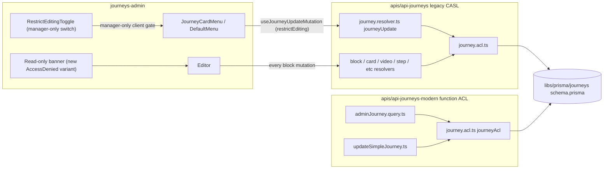

# Restrict Team Template Edit Access to Managers and Creators (NES-1610)

## Overview

Add an opt-in per-template flag (`Journey.restrictEditing`) that restricts edit access on a **team (local) template** to the journey **creator (owner)** and **team managers**. Plain team members and journey editors can still view and duplicate the template, but cannot mutate its content. The flag is OFF by default; a team manager toggles it on a card in the **Team Templates** tab of the dashboard.

The work spans **two PRs** because a frontend-only solution is not safe (see [Frontend-Only Feasibility](#frontend-only-feasibility-verdict)):

1. **PR #1 — Backend:** Prisma migration, ACL rules in both legacy and modern API, GraphQL schema updates, codegen, tests. Branch: `jianweichong/nes-1610-restrict-template-edit-backend`.
2. **PR #2 — Frontend:** Toggle UI on team template cards, AccessDenied UX, query/mutation field threading. Based on the backend branch (`-Sb` set on PR creation). Branch: `jianweichong/nes-1610-restrict-template-edit-frontend`.

## Problem Statement

> "During a seminar today, someone kept changing the team templates into Quickstart templates and they don't know how and I don't know how they did that." — Shannon, 2026-04-21

A "team template" today is `Journey { template: true, teamId: <not 'jfp-team'> }`. Any user with `UserTeam` membership on the owning team has full **Update / Manage** rights on that template via:

- `journey.acl.ts:86-111` (legacy CASL) — explicit "local template" rule grants `Manage` to team members and journey editors.
- `journey.acl.ts:191-205` (modern function ACL) — team members get `update` on any team journey, including templates.

Symptoms reported in the seminar:

- Members accidentally flipped `customizable: true` (the "Quickstart" surface) by toggling **Needs Customization** on chat widgets, action properties, video/image blocks (NES-1429 surface).
- Members typed `{{curly braces}}` into the Template Settings "Text for Customization" field, marking the template as customizable.
- The lead facilitator could not "QC the templates" because edits stomped each other.

**The desired behavior**: Team managers can lock a specific template so only the journey **creator (owner)** and **team managers** may mutate its content. The toggle is opt-in per template, not a team-wide default.

## Proposed Solution

Add a single boolean column `Journey.restrictEditing` (default `false`). When `true`:

- The journey is **read** by anyone who could read it before (no change to read access).
- The journey can be **mutated** only by:
  - Users in `UserJourney` with `role = 'owner'` on this journey (the **creator**).
  - Users in `UserTeam` with `role = 'manager'` on the owning team.
- Plain team members (`UserTeam.role = 'member'`) and journey editors (`UserJourney.role = 'editor'`) lose `Update`, `Manage`, and field-level `Manage` (e.g. `template`, `customizable`) on this journey.
- Publishers (`Role.publisher`) retain global override (existing semantic — they can edit any template).

The flag itself can only be flipped by a team manager (gated as a field-level `Manage` rule on `Journey/restrictEditing`, mirroring how `Journey/template` is gated today at `journey.acl.ts:112-138`).

The frontend surfaces this as a switch on the `JourneyCardMenu` for any team-local template, disabled for non-managers (matching the `TeamUpdateDialog.tsx:151-176` and `CustomDomainDialog/DefaultJourneyForm.tsx:198-210` pattern).

## Frontend-Only Feasibility Verdict

**Frontend-only is NOT safe.** Reasoning:

1. **Direct URL bypass.** Any team member who knows or guesses a journey ID can navigate to `/publisher/{journeyId}` directly. The `pages/publisher/[journeyId].tsx:70-91` gate renders `<Editor />` for any non-publisher viewing a non-global template. A frontend-only restriction (hiding the card link) does not protect this surface.
2. **GraphQL devtools bypass.** A motivated team member can call `journeyUpdate`, `blockCreate`, `blockUpdate`, `cardBlockUpdate`, `videoBlockUpdate`, `actionUpdate`, `journeyTheme*`, `journeyCustomizationField*`, etc. directly via Apollo devtools or raw HTTP. Each of these is gated only by the existing CASL `Action.Update` / `Action.Manage` checks, which today permit any team member.
3. **The seminar accident scenario specifically uses `journeyUpdate`** (toggling `customizable`) — exactly the mutation that has no per-template lock today.
4. **Block-level resolvers bypass `journey.resolver.ts` entirely.** `block.resolver.ts:49`, `card`, `video`, `step`, `videoTrigger`, `chatButton`, `host`, `journeyTheme`, `action`, and the modern `updateSimpleJourney` each independently call `ability.can(Action.Update, subject('Journey', block.journey))`. Without the new ACL rule, every one of these continues to permit team-member edits.

A frontend-only fix solves the **accidental** misclick (the seminar story) cosmetically but leaves the **deliberate** edit path open. Given the security/audit posture in `docs/solutions/security-issues/journey-acl-read-authorization-bypass-invite-requested-role.md` and `docs/solutions/security-issues/google-sync-missing-integration-ownership-guard.md` ("backend authorization must never rely on frontend filtering"), the robust fix requires backend ACL changes. The frontend layer is UX polish, not security.

**Decision: Backend-first, two-PR plan.**

## Technical Approach

### Architecture



The backend **must** update both `apis/api-journeys/src/app/modules/journey/journey.acl.ts` (CASL) and `apis/api-journeys-modern/src/schema/journey/journey.acl.ts` (function ACL) — this is a documented invariant (`apis/AGENTS.md:188-194`, "ACL parity").

### Data Model Change

```prisma
// libs/prisma/journeys/db/schema.prisma — Journey model (add to lines 405-475 cluster)

model Journey {
  // ... existing fields
  template          Boolean? @default(false)
  templateSite      Boolean? @default(false)
  customizable      Boolean? @default(false)

  /// When true on a template, only the journey owner (creator) and team
  /// managers may mutate the journey. Plain team members and journey editors
  /// retain read access. No-op on non-templates and on global templates
  /// (teamId = 'jfp-team' is governed by the publisher rule instead).
  restrictEditing   Boolean  @default(false)

  // ... existing fields
}
```

**Naming**: I considered `managerEditOnly`, `editLockedToManagers`, and `restrictEditToCreatorAndManagers`. I chose `restrictEditing` because (a) it follows the project's terse naming (`template`, `customizable`, `featuredAt`), (b) the semantic — "edit is restricted" — is clearer than `managerEditOnly` (which reads as "only managers", omitting the creator), and (c) the meaning is fully documented by the schema doc-comment plus the GraphQL field description.

**Audit fields deferred to v2** (see [Future Considerations](#future-considerations)). The plan is to ship the lock first; if support requests "who turned this on?", add `restrictEditingSetByUserId` and `restrictEditingSetAt` then.

### ACL Rule Specification

Single rule, mirrored across both APIs:

> Action `Update` and `Manage` on `Journey` is **denied** when `template = true` and `restrictEditing = true` and the user is not (a) journey owner, (b) team manager of the owning team, or (c) a publisher.

#### Legacy CASL — `apis/api-journeys/src/app/modules/journey/journey.acl.ts`

The current "local template" rule (`acl.ts:86-111`) grants `Manage` to team members and journey editors. We split this into two paths:

```ts
// Pseudo-code — actual implementation in apis/api-journeys/src/app/modules/journey/journey.acl.ts

// existing: team-member Manage on local template
can(Action.Manage, 'Journey', {
  AND: [
    { template: { equals: true } },
    { teamId: { not: 'jfp-team' } },
    { restrictEditing: { equals: false } }, // NEW — only when NOT restricted
    {
      OR: [{ team: { is: { userTeams: { some: { userId, role: { in: [UserTeamRole.member, UserTeamRole.manager] } } } } } }, { userJourneys: { some: { userId, role: { in: [UserJourneyRole.editor, UserJourneyRole.owner] } } } }]
    }
  ]
})

// NEW — restricted local template Manage: managers + owners only
can(Action.Manage, 'Journey', {
  AND: [
    { template: { equals: true } },
    { teamId: { not: 'jfp-team' } },
    { restrictEditing: { equals: true } },
    {
      OR: [{ team: { is: { userTeams: { some: { userId, role: UserTeamRole.manager } } } } }, { userJourneys: { some: { userId, role: UserJourneyRole.owner } } }]
    }
  ]
})

// NEW — field-level Manage on `restrictEditing`: only managers may flip the flag itself
can(Action.Manage, 'Journey', 'restrictEditing', {
  team: { is: { userTeams: { some: { userId, role: UserTeamRole.manager } } } }
})
```

The existing field-level Manage rules on `template` (`acl.ts:114-138`) are extended with the same `restrictEditing` carve-out so a member cannot bypass the lock by flipping `template:false → template:true` to clear it.

#### Modern function ACL — `apis/api-journeys-modern/src/schema/journey/journey.acl.ts`

```ts
// Pseudo-code — actual implementation in apis/api-journeys-modern/src/schema/journey/journey.acl.ts

function update(journey: Partial<Journey>, user: User): boolean {
  // ... existing: publisher / global-template carve-outs

  const isLocalTemplate = journey.template === true && journey.teamId !== 'jfp-team'
  const isRestricted = isLocalTemplate && journey.restrictEditing === true

  if (isRestricted) {
    // Only owner (creator) and team manager may update
    const isOwner = journey.userJourneys?.some((uj) => uj.userId === user.id && uj.role === UserJourneyRole.owner)
    const isManager = journey.team?.userTeams?.some((ut) => ut.userId === user.id && ut.role === UserTeamRole.manager)
    return Boolean(isOwner) || Boolean(isManager)
  }

  // ... existing logic for non-restricted journeys
}
```

The `update`, `manage`, and `extract` functions all need the same carve-out. The modern API also needs the read-side `journeyAccessWhere`-style filter to be left **unchanged** — restricted templates remain visible in admin lists; only the mutation side is gated.

### Mutation Coverage — Every Path That Mutates a Journey

This is critical. Block-level mutations bypass `journey.resolver.ts` and have their own ACL calls. The new rule must take effect on every one of them. Each item below was identified in the SpecFlow analysis and must be tested:

**Legacy `apis/api-journeys` resolvers calling `Action.Update` or `Action.Manage` on `subject('Journey', ...)`:**

- `journey.resolver.ts:752-859` — `journeyUpdate` (line 770)
- `journey.resolver.ts:1025-1077` — `journeyTemplate` (also see field-level `template` rule)
- `journey.resolver.ts:920-1023` — `journeysArchive`, `journeysDelete`, `journeysTrash`, `journeysRestore` (already gated to managers + owners via `Action.Manage` — verify behavior unchanged)
- `block.resolver.ts:49` and surrounding — every block create/update/delete/order
- `card/card.resolver.ts` — card block updates
- `video/video.resolver.ts` — video block updates
- `step/step.resolver.ts` — step block updates
- `videoTrigger/videoTrigger.resolver.ts` — video trigger updates
- `chatButton/...` — chat button create/update/delete
- `host/host.resolver.ts` — host updates
- `journeyTheme/journeyTheme.resolver.ts:61` — theme updates
- `journeyCustomizationField/journeyCustomizationField.resolver.ts:41,100` — customization field updates
- `action/...` — action updates (including the **NES-1429 customizable toggle**, the seminar trigger)

Because all of these call into the same CASL `Ability` with `subject('Journey', block.journey)`, the new ACL rule covers them automatically — but the `block.journey` payload **must include `restrictEditing`** in its select, or the ACL evaluation will treat it as `undefined` and fall through. The `caslFactory` Prisma include shapes need a one-line audit.

**Modern `apis/api-journeys-modern`:**

- `simple/updateSimpleJourney.ts` — calls `journeyAcl('update', journey, user)`. New rule applies automatically once the modern `update()` is updated.
- `journeyTransferFromAnonymous` — N/A (anonymous transfer doesn't apply to templates).
- All other journey reads (`adminJourney.query.ts`, `adminJourneys.query.ts`) — read paths unchanged.

### GraphQL Schema Updates

#### Legacy SDL — `apis/api-journeys/src/app/modules/journey/journey.graphql`

```graphql
type Journey {
  # ... existing
  restrictEditing: Boolean!
}

input JourneyUpdateInput {
  # ... existing
  restrictEditing: Boolean
}
```

#### Modern Pothos — `apis/api-journeys-modern/src/schema/journey/journey.ts`

```ts
// In the prismaObject('Journey', { fields }) block (around lines 138-167)
restrictEditing: t.exposeBoolean('restrictEditing'),
```

#### Modern input — `apis/api-journeys-modern/src/schema/journey/inputs/journeyUpdateInput.ts`

```ts
restrictEditing: t.boolean({ required: false })
```

(Modern doesn't expose a write-side `journeyUpdate` mutation today — `journeySimpleUpdate` is the modern write path, and we add the field there too.)

### Frontend Wiring

The single source of truth for the current user's team role is already loaded by `TeamProvider` (`libs/journeys/ui/src/components/TeamProvider/TeamProvider.tsx:99-128`). No new query needed for the role.

#### Three places the new field is added to client GraphQL documents:

1. **Card list query** — `apps/journeys-admin/src/libs/useAdminJourneysQuery/useAdminJourneysQuery.ts:8-81`. Add `restrictEditing` to the selection set so the card menu can read it.
2. **Editor journey fragment** — `libs/journeys/ui/src/libs/JourneyProvider/journeyFields.tsx:12-126`. Add to `JOURNEY_FIELDS`.
3. **Journey settings update mutation** — `apps/journeys-admin/src/libs/useJourneyUpdateMutation/useJourneyUpdateMutation.ts:15-48`. Add `restrictEditing` to the input/output selection so optimistic responses + cache writes work.

#### New component — `RestrictEditingToggle`

Location: `apps/journeys-admin/src/components/JourneyList/JourneyCard/JourneyCardMenu/RestrictEditingToggle/`

Skeleton:

```tsx
// apps/journeys-admin/src/components/JourneyList/JourneyCard/JourneyCardMenu/RestrictEditingToggle/RestrictEditingToggle.tsx
// (sketch — full implementation in PR #2)

export function RestrictEditingToggle({ journey }: Props): ReactElement {
  const { activeTeam } = useTeam()
  const currentUserTeamRole = useMemo(
    () => activeTeam?.userTeams.find(ut => ut.user.email === user.email)?.role,
    [activeTeam, user.email]
  )
  const isManager = currentUserTeamRole === UserTeamRole.manager
  const isLocalTemplate = journey.template === true && journey.team?.id !== 'jfp-team'
  const [updateJourney] = useJourneyUpdateMutation()

  if (!isLocalTemplate) return null

  return (
    <MenuItem disabled={!isManager} onClick={...}>
      <Switch checked={journey.restrictEditing ?? false} />
      <ListItemText
        primary={t('Restrict editing to managers')}
        secondary={!isManager ? t('Only managers can change this') : undefined}
      />
    </MenuItem>
  )
}
```

Mounted from `DefaultMenu.tsx` at the appropriate position in the local-template branch (around the existing `:283-293` block where Access/Duplicate/Translate are skipped for local templates). Includes optimistic response + the existing `useCommand` undo wrapper (mirroring `Reactions.tsx:27-57`).

#### AccessDenied UX for restricted templates

The existing `apps/journeys-admin/src/components/AccessDenied/AccessDenied.tsx` is wired to the error string `'user is not allowed to view journey'` (`pages/journeys/[journeyId].tsx:178-188`). It currently offers "Request access" via `userJourneyRequest`. For a restricted template the user **already has read access** — that copy is misleading.

Approach: introduce a second AccessDenied variant `AccessDenied/RestrictedTemplate.tsx` triggered by a new server-side error code `'user cannot edit restricted template'`. Copy: "This template is locked for editing. Only the creator and team managers can make changes. You can still preview it or duplicate it to your own journey." Buttons: **Preview** (links to `/templates/{id}` if applicable, otherwise the read-only editor view), **Duplicate to my journey** (calls existing `journeyDuplicate`).

Read-only editor surface is **out of scope for v1** (cost too high — Editor is not designed read-only). Instead the restricted user sees the AccessDenied variant before the editor mounts.

#### CardActionArea behavior on restricted templates

`JourneyCard.tsx:146-156` wraps the image in a `CardActionArea` linking to `/journeys/{id}` regardless of permissions. For a restricted template viewed by a non-eligible user, we keep the link but display a small "Manager-only edit" chip on the card (mimicking the existing template/featured badges). Clicking still navigates → server-side gate redirects → AccessDenied variant. This avoids hiding the template entirely while making the lock state obvious before click.

### Inheritance & Conversion Semantics

These are decisions baked into the resolvers, not just the ACL. Each must have a unit test.

| Operation                                                      | Source `restrictEditing`    | New row `restrictEditing`                                                   |
| -------------------------------------------------------------- | --------------------------- | --------------------------------------------------------------------------- |
| `journeyTemplate` flip `template: false → true`                | n/a (was a regular journey) | `false` (default — opt-in)                                                  |
| `journeyTemplate` flip `template: true → false`                | any                         | `false` (cleared — non-templates can't be restricted)                       |
| `journeyDuplicate` template → template (same team, by manager) | `true`                      | `true` (inherit)                                                            |
| `journeyDuplicate` template → regular journey (any user)       | `true`                      | `false` (the duplicate is owned by the duplicator and is a regular journey) |
| `journeyDuplicate` template → another team (`Copy to Team`)    | `true`                      | `false` (each team manages its own restriction state)                       |
| `journeyTranslate` (creates a new journey)                     | `true`                      | `false` (the translation is a separate journey owned by the translator)     |
| Publisher promotes local → global (`teamId = 'jfp-team'`)      | `true`                      | `false` (cleared — global templates use the publisher rule instead)         |

The `from`-template descendants tracked via `Journey.fromTemplateId` (`schema.prisma:468`) are independent journeys and never inherit the flag.

### System-Wide Impact

#### Interaction Graph

`User toggles RestrictEditingToggle` →
`useJourneyUpdateMutation` →
Apollo `journeyUpdate` mutation →
`journey.resolver.ts:journeyUpdate` (legacy) →
`caslGuard` → `journey.acl.ts:Manage on Journey/restrictEditing` (NEW) →
`prisma.journey.update({ data: { restrictEditing: true } })` →
Apollo cache write back to client →
`JourneyCard` re-renders with new chip + toggle state.

`Restricted member tries to edit a step block` →
Editor calls `blockUpdate` mutation →
`block.resolver.ts:49` → `ability.can(Action.Update, subject('Journey', block.journey))` →
`journey.acl.ts` (NEW restricted rule) → returns `false` →
`caslGuard` throws `ForbiddenException` →
Apollo error → existing snackbar + retry handler in editor.

#### Error & Failure Propagation

- `journeyUpdate` with insufficient role → `ForbiddenException` (legacy) / `GraphQLError` (modern). Existing Apollo error link surfaces a snackbar.
- Mutation attempted on a restricted template by a non-manager from the editor → block resolver throws → error link → existing "Something went wrong" toast in `apps/journeys-admin/src/components/Editor`. We do NOT introduce a new error code/variant for v1 — keep the surface uniform.
- Server-side render of `pages/journeys/[journeyId].tsx` for a restricted template by a non-eligible user → catches `'user cannot edit restricted template'` (NEW error string), redirects to AccessDenied variant.

#### State Lifecycle Risks

- A team member is mid-edit when a manager flips the flag ON. The next mutation 403s. We accept this as a "best-effort" eviction in v1 (see I4 in SpecFlow analysis) — surface via the existing toast and let the user copy work and refresh.
- A journey owner leaves the team (`UserTeam` delete cascade). If `UserJourney(owner)` row is deleted as well, the template's "creator" is gone — only managers can edit. This is acceptable; no new code path needed. Confirm `UserJourney(owner)` is not auto-deleted on `UserTeam` delete (Prisma cascade audit).

#### API Surface Parity

Both `apis/api-journeys` and `apis/api-journeys-modern` must expose `restrictEditing` and gate it identically. The legacy ACL spec (`journey.acl.spec.ts`) and modern ACL spec (`journey.acl.spec.ts`) must each gain a parallel test matrix.

#### Integration Test Scenarios (cross-layer)

1. Manager turns flag ON → member tries `journeyUpdate` with `customizable: true` → gets `Forbidden`. Verify the database state is unchanged.
2. Manager turns flag ON → member opens `/journeys/{id}` → server redirects to `/publisher/{id}` → publisher page detects restricted state → AccessDenied variant rendered.
3. Member duplicates a restricted template → succeeds → new regular journey, owned by member, `restrictEditing = false`.
4. Manager flips `template: false` on a restricted template → field-level `template` Manage check denies for non-manager, allows for manager → template becomes a regular journey, `restrictEditing` automatically cleared.
5. Publisher edits a restricted local template → succeeds (publisher override).
6. Owner (creator) of restricted template who is not a manager edits → succeeds.

## Implementation Phases

### Phase 1: Backend PR — Prisma + ACL + GraphQL + Tests

**Branch**: `jianweichong/nes-1610-restrict-template-edit-backend` (this worktree).
**Base**: `main`.
**Target audience**: Mike (per `team-directory.dev.md` for backend changes).

Tasks (to be created in `/ce:work` phase):

1. **Schema** — Add `restrictEditing Boolean @default(false)` to `libs/prisma/journeys/db/schema.prisma` Journey model.
2. **Generate Prisma client** — `nx prisma-generate prisma-journeys`.
3. **Migrate** — `nx prisma-migrate prisma-journeys --name add_journey_restrict_editing`.
4. **Legacy GraphQL SDL** — Add `restrictEditing: Boolean!` to `Journey` type and `restrictEditing: Boolean` to `JourneyUpdateInput` in `apis/api-journeys/src/app/modules/journey/journey.graphql`.
5. **Legacy ACL** — Update `apis/api-journeys/src/app/modules/journey/journey.acl.ts`:
   - Split the current local-template Manage rule into two (restricted vs unrestricted).
   - Add field-level Manage rule for `restrictEditing` (manager-only).
   - Audit existing field-level `template` and `customizable` rules to ensure they respect `restrictEditing`.
6. **Legacy ACL spec** — Add role × flag matrix tests to `apis/api-journeys/src/app/modules/journey/journey.acl.spec.ts`.
7. **Legacy resolver** — `apis/api-journeys/src/app/modules/journey/journey.resolver.ts`:
   - Confirm `journeyUpdate` validates the new field via existing `JourneyUpdateInput` mapping.
   - `journeyTemplate`: clear `restrictEditing` when flipping `template: true → false`.
   - `journeyDuplicate`: implement the inheritance table above.
8. **Legacy resolver spec** — Mirror in `journey.resolver.spec.ts`.
9. **Modern Pothos exposure** — `apis/api-journeys-modern/src/schema/journey/journey.ts:24-250` add `t.exposeBoolean('restrictEditing')`.
10. **Modern input** — `apis/api-journeys-modern/src/schema/journey/inputs/journeyUpdateInput.ts` add `restrictEditing`.
11. **Modern ACL** — `apis/api-journeys-modern/src/schema/journey/journey.acl.ts`: update `update`, `manage`, `extract` with the new restricted-template check.
12. **Modern ACL spec** — Add role × flag matrix tests to `journey.acl.spec.ts`.
13. **`updateSimpleJourney`** — `apis/api-journeys-modern/src/schema/journey/simple/updateSimpleJourney.ts` allow + gate the new field.
14. **CASL include audit** — Verify every `subject('Journey', ...)` site has `restrictEditing` in its Prisma `select` so ACL eval doesn't see `undefined`.
15. **Codegen** — `nx generate-graphql api-journeys` (requires `nf start` on port 4001), `nx generate-graphql api-journeys-modern`, `nx generate-graphql api-gateway`.
16. **Lint + tests** — `npx jest --config apis/api-journeys/jest.config.ts --no-coverage 'apis/api-journeys/src/app/modules/journey'`, modern equivalent, eslint.

**Acceptance for backend PR**:

- [ ] Prisma migration applies cleanly on a fresh DB and a non-empty staging DB.
- [ ] Legacy ACL spec covers all 24 cells of `{flag on/off} × {UserJourneyRole owner/editor/inviteRequested/none} × {UserTeamRole manager/member/none/publisher}` for `Action.Update`.
- [ ] Modern ACL spec covers the same matrix.
- [ ] `journeyUpdate` mutation accepts and persists the field.
- [ ] `journeyTemplate true → false` clears `restrictEditing`.
- [ ] `journeyDuplicate` follows the inheritance table for every row.
- [ ] No regression on existing journey-list / journey-fetch tests.
- [ ] No new lint errors.

### Phase 2: Frontend PR — Toggle + AccessDenied + Cache Wiring

**Branch**: `jianweichong/nes-1610-restrict-template-edit-frontend`.
**Base**: `jianweichong/nes-1610-restrict-template-edit-backend` (the backend branch — set via `gh pr create -B ...`).
**Target audience**: Siyang or Edmond (per `team-directory.dev.md` for general frontend feature work).
**Linear ticket**: This PR is the primary one linked to NES-1610.

Tasks:

1. **Add `restrictEditing` to client GraphQL documents:**
   - `apps/journeys-admin/src/libs/useAdminJourneysQuery/useAdminJourneysQuery.ts`
   - `libs/journeys/ui/src/libs/JourneyProvider/journeyFields.tsx`
   - `apps/journeys-admin/src/libs/useJourneyUpdateMutation/useJourneyUpdateMutation.ts`
2. **Run codegen** — `nx run-many -t codegen` (regenerates `__generated__` types).
3. **`RestrictEditingToggle` component** (new) — `apps/journeys-admin/src/components/JourneyList/JourneyCard/JourneyCardMenu/RestrictEditingToggle/`. Mimics `TeamUpdateDialog.tsx:151-176` for manager-gating and `Reactions.tsx` for the optimistic + undo wrapper. Includes spec + stories.
4. **Mount in `DefaultMenu.tsx`** — local-template branch (around `:283-293`).
5. **"Manager-only edit" badge on `JourneyCard`** — small chip rendered when `restrictEditing && isLocalTemplate`. Mimics existing template/featured chips.
6. **AccessDenied variant** — `apps/journeys-admin/src/components/AccessDenied/RestrictedTemplate.tsx` triggered by the new error code from the backend.
7. **`pages/publisher/[journeyId].tsx`** — when `journey.restrictEditing` and current user is not owner/manager/publisher, render the AccessDenied variant instead of `<Editor />`.
8. **`pages/journeys/[journeyId].tsx`** — handle the new `'user cannot edit restricted template'` error string in `getServerSideProps` parallel to the existing `'user is not allowed to view journey'` handler.
9. **Lint + Jest + Storybook** — full app suite.

**Acceptance for frontend PR**:

- [ ] Manager sees an enabled "Restrict editing to managers" switch in `JourneyCardMenu` for any team-local template.
- [ ] Member sees the same switch but disabled, with a tooltip "Only managers can change this".
- [ ] Toggling the switch is undoable (Ctrl+Z / Ctrl+Shift+Z) per the Reactions pattern.
- [ ] Switching does NOT appear on global templates or non-template journeys.
- [ ] When `restrictEditing && isLocalTemplate`, the journey card shows a "Manager-only edit" chip.
- [ ] A non-eligible user clicking a restricted template card lands on the AccessDenied "Restricted template" variant — never on a broken Editor.
- [ ] The owner (creator) of a restricted template who is not a manager can still edit fully.
- [ ] All existing journey-card / journey-list tests pass without regression.

## Alternative Approaches Considered

### A. Frontend-only "guard" (rejected)

Hide the edit button + redirect to AccessDenied for non-managers based on a client-only computed flag. **Rejected** — bypassable via direct URL or devtools mutation, leaves the seminar-accident path open in principle, and violates `docs/solutions/security-issues/google-sync-missing-integration-ownership-guard.md` ("backend authorization must never rely on frontend filtering").

### B. New `Journey.editAccess` enum field (`'all' | 'managers'`) (rejected for v1)

More flexible (could later add `'team'`, `'role:foo'`, etc.). Rejected because (a) the spec is binary, (b) Prisma + GraphQL + 3 codegen layers + 2 ACL files all carry an enum migration cost, (c) the existing fields on Journey are all booleans (`template`, `customizable`, `featuredAt`, `website`, `showShareButton`, ...) — an enum here would be the odd one out, and (d) a future enum migration from `Boolean` is a one-day job if/when needed.

### C. Per-team setting "All team templates locked by default" (rejected)

A team-wide opt-in instead of per-template. Rejected because the user explicitly said "we shouldn't make it the default, but have it as an option that the manager could select" and the seminar story is about specific facilitator templates, not whole-team lockdown.

### D. Full read-only editor surface (deferred)

Render `<Editor readOnly />` for restricted templates. Rejected for v1 — Editor is not designed for read-only, the cost is too high, and the AccessDenied variant + Duplicate flow is sufficient. Captured in [Future Considerations](#future-considerations).

### E. Use existing `userJourneyRequest` flow ("Request access") (rejected)

Reuse the existing request-access UX for the AccessDenied variant. Rejected because the user already has read access; "Request access" is misleading copy. The new variant is cleaner and avoids overloading an existing mutation.

## Acceptance Criteria

### Functional

#### Backend (PR #1)

- [ ] `Journey.restrictEditing` exists in Prisma schema with default `false`, exposed via GraphQL on both legacy and modern.
- [ ] Mutating `restrictEditing` requires `UserTeamRole.manager` on the owning team (legacy + modern).
- [ ] When `template = true && restrictEditing = true`, `journeyUpdate` and all journey-content mutations succeed only for owner / manager / publisher.
- [ ] Field-level Manage on `template` and `customizable` denies non-managers when `restrictEditing = true`.
- [ ] `journeyTemplate true → false` clears `restrictEditing`.
- [ ] `journeyDuplicate` honors the inheritance table for every operation type.
- [ ] Block-level mutations (`block.resolver.ts`, `card`, `video`, `step`, `videoTrigger`, `chatButton`, `host`, `journeyTheme`, `journeyCustomizationField`, `action`) all honor the rule via the shared CASL `subject('Journey', ...)` call.
- [ ] ACL spec test matrix (4 × 4 × 2 = 32 cells minimum) green on both APIs.

#### Frontend (PR #2)

- [ ] Manager-only "Restrict editing to managers" switch on team-local template cards.
- [ ] Switch shows a clear disabled state + tooltip for non-managers.
- [ ] "Manager-only edit" chip on restricted template cards.
- [ ] AccessDenied "Restricted template" variant for non-eligible users hitting `/publisher/{id}`.
- [ ] Editor never mounts for a non-eligible user on a restricted template (server-side gate).
- [ ] Owner / publisher / manager edit flow unchanged.
- [ ] Switch interaction is undoable via the Command/Undo provider.

### Non-Functional

- [ ] No N+1 query introduced — `restrictEditing` is a column on `Journey`, fetched in existing selections.
- [ ] No additional GraphQL roundtrip per card — single field added to existing query.
- [ ] Admin journey list query bytes increase by < 10 bytes per row.
- [ ] No new external dependencies.
- [ ] Internationalized — copy goes through `t('Restrict editing to managers')` etc., namespace `apps-journeys-admin`.

### Quality Gates

- [ ] All Jest tests pass (legacy api-journeys, modern api-journeys-modern, journeys-admin).
- [ ] Lint clean.
- [ ] Storybook entries for the new component + AccessDenied variant.
- [ ] QA scenarios written and posted to NES-1610 (per `writing-qa-requirements.dev.md`).

## Success Metrics

- Zero "I accidentally changed a team template" reports in #nextsteps-bugs in the 30 days following frontend PR merge.
- ≥ 1 team manager voluntarily turns the toggle on within the first week post-launch (signal that the feature is discoverable).
- No regression in normal team template edit volume (people who SHOULD edit are still editing).

## Dependencies & Prerequisites

### Hard

- **Backend PR must merge before frontend PR.** The frontend PR's GraphQL fields (in `useJourneyUpdateMutation`, `useAdminJourneysQuery`, `JOURNEY_FIELDS`) reference `restrictEditing` which does not exist on the gateway schema until backend lands.
- **Codegen must run** between backend merge and frontend PR review so the gateway schema includes the new field.

### Soft

- Linear ticket NES-1429 ("Customizable toggle on chat widgets") just shipped and is the surface that members were toggling in the seminar. The new restriction makes that mutation impossible from a non-manager — verify this with QA via the chat widget flow.
- The "Copy to Team" and "Translate" flows (NES-1601 and others) recently landed. The inheritance table assumes their resolvers are stable.

## Risk Analysis & Mitigation

| Risk                                                                         | Likelihood | Impact                              | Mitigation                                                                                                                                                                                                       |
| ---------------------------------------------------------------------------- | ---------- | ----------------------------------- | ---------------------------------------------------------------------------------------------------------------------------------------------------------------------------------------------------------------- |
| Missing a block-level resolver in the ACL audit                              | Medium     | High (partial bypass)               | Enumerate every `subject('Journey', ...)` site in PR #1; integration test scenario #1 explicitly tests `customizable` toggle (the seminar trigger).                                                              |
| ACL parity drift between legacy and modern                                   | Medium     | High (silent inconsistency)         | One PR adds rules to BOTH files, with side-by-side spec tests. CI runs both suites.                                                                                                                              |
| Apollo cache shows stale `restrictEditing = undefined` after partial deploy  | Low        | Low (UI degrades to "unrestricted") | Backend defaults to `false`. Frontend uses `journey.restrictEditing ?? false`. Apollo `errorPolicy: 'all'` on the affected queries (per `pothos-query-parameter-ignored-nested-resolution-failure.md` learning). |
| User mid-edit when flag flips ON loses work on next save                     | Low        | Medium                              | Best-effort: clear toast + redirect on the next 403. Document in QA as a known v1 limitation.                                                                                                                    |
| Owner leaves team, only managers can edit                                    | Low        | Low                                 | Acceptable. Document in PR description.                                                                                                                                                                          |
| Field name `restrictEditing` is ambiguous in support tickets                 | Low        | Low                                 | Schema doc-comment + GraphQL field description fully document the semantic.                                                                                                                                      |
| Codegen on FE before BE merges produces "field does not exist" gateway error | Medium     | Medium                              | Hard gate: PR #2 cannot merge until PR #1 is in `main` and gateway codegen has propagated. CI on PR #2 should fail until then.                                                                                   |
| Migration on staging takes longer than expected on the Journey table         | Low        | Medium                              | Adding a `Boolean DEFAULT false` column is a metadata-only Postgres operation — fast on any size table.                                                                                                          |
| Spec gap: what if owner is also a non-manager member?                        | Verified   | None                                | Owner is granted via `UserJourney.role = owner` regardless of UserTeam role. Existing pattern.                                                                                                                   |

## Resource Requirements

- **Engineer time**: 1 dev-day for PR #1 (backend), 1.5 dev-days for PR #2 (frontend + AccessDenied UX).
- **Reviewers**: Mike (backend PR), Siyang or Edmond (frontend PR).
- **QA**: Sharon (per `qa-handoff-sharon.dev.md`) — full QA after frontend PR is merged to staging.
- **Infrastructure**: None new. Single Prisma migration (additive, default false).
- **Linear ticket**: NES-1610 — already created, status Backlog → In Progress on PR #1 open.

## Future Considerations

1. **Audit fields** — `restrictEditingSetByUserId` + `restrictEditingSetAt`. Useful for support diagnosing "why can't I edit". Defer to v2 unless support requests come in.
2. **Active-editor eviction** — Subscriptions or polling to evict mid-session editors when the flag flips. Not justified by current usage — most edits are short.
3. **Read-only editor surface** — render `<Editor readOnly />` instead of bouncing to AccessDenied. Significant work in the editor's command/undo system. Deferred.
4. **Per-team default** — option for managers to set "all team templates locked by default". Deferred until user feedback.
5. **Per-section locking** — lock specific blocks instead of the whole journey. Out of scope; would need a new model.
6. **Notification on flip** — Slack/email to other editors when a manager locks a template they were editing. Not justified.
7. **Bulk action** — Manager selects N templates, locks all at once. Skip until requested.

## Documentation Plan

- **PR #1 description** — explains the ACL change, links to this plan, lists every resolver touched.
- **PR #2 description** — explains the UI surface, links to this plan, includes screenshots/GIFs of the toggle + AccessDenied variant.
- **QA scenarios** — written per `writing-qa-requirements.dev.md` and posted as Linear comment on NES-1610. Cover: positive paths (manager toggle, owner edit, manager edit), negative paths (member edit, editor edit), edge cases (template flip, duplicate inheritance, copy-to-team), and viewport variations (desktop + mobile).
- **`docs/solutions/`** — after the frontend PR merges, run `/ce:compound` to capture the manager-only-edit ACL pattern. Natural extension of `journey-acl-read-authorization-bypass-invite-requested-role.md`.

## Sources & References

### Linear

- **NES-1610** — Restrict Team Template edit access to managers only — https://linear.app/jesus-film-project/issue/NES-1610/restrict-team-template-edit-access-to-managers-only
- **Slack thread (synced)** — `#nextsteps-bugs` 2026-04-21/22 thread `1776801546.167049` — Shannon's report.

### Internal Code (worktree paths)

- **Backend ACL files (the heart of the change):**
  - `apis/api-journeys/src/app/modules/journey/journey.acl.ts:1-167`
  - `apis/api-journeys/src/app/modules/journey/journey.acl.spec.ts:1-285`
  - `apis/api-journeys-modern/src/schema/journey/journey.acl.ts:1-221`
  - `apis/api-journeys-modern/src/schema/journey/journey.acl.spec.ts`
- **Schema & GraphQL:**
  - `libs/prisma/journeys/db/schema.prisma:405-475` (Journey model)
  - `apis/api-journeys/src/app/modules/journey/journey.graphql:20-228`
  - `apis/api-journeys-modern/src/schema/journey/journey.ts:24-250`
  - `apis/api-journeys-modern/src/schema/journey/inputs/journeyUpdateInput.ts:8-45`
- **Resolvers (every site that mutates a journey):**
  - `apis/api-journeys/src/app/modules/journey/journey.resolver.ts:752-1077`
  - `apis/api-journeys/src/app/modules/block/block.resolver.ts:49`
  - `apis/api-journeys/src/app/modules/journeyTheme/journeyTheme.resolver.ts:61`
  - `apis/api-journeys/src/app/modules/journeyCustomizationField/journeyCustomizationField.resolver.ts:41,100`
  - `apis/api-journeys-modern/src/schema/journey/simple/updateSimpleJourney.ts`
- **Frontend pages & components:**
  - `apps/journeys-admin/pages/index.tsx` (dashboard with Team Templates tab)
  - `apps/journeys-admin/pages/journeys/[journeyId].tsx:157-188` (server-side gate + AccessDenied wiring)
  - `apps/journeys-admin/pages/publisher/[journeyId].tsx:43-94` (publisher route renders Editor)
  - `apps/journeys-admin/src/components/JourneyList/JourneyListView/JourneyListView.tsx:62-73` (Team Templates tab)
  - `apps/journeys-admin/src/components/JourneyList/JourneyListContent/JourneyListContent.tsx:122-156` (template filter)
  - `apps/journeys-admin/src/components/JourneyList/JourneyCard/JourneyCard.tsx:63-423`
  - `apps/journeys-admin/src/components/JourneyList/JourneyCard/JourneyCardMenu/JourneyCardMenu.tsx:101-329`
  - `apps/journeys-admin/src/components/JourneyList/JourneyCard/JourneyCardMenu/DefaultMenu/DefaultMenu.tsx:101-327`
  - `apps/journeys-admin/src/components/AccessDenied/AccessDenied.tsx:1-80`
- **Existing manager-only UI patterns to mimic:**
  - `apps/journeys-admin/src/components/Team/TeamUpdateDialog/TeamUpdateDialog.tsx:56-176`
  - `apps/journeys-admin/src/components/Team/CustomDomainDialog/DomainNameForm/DomainNameForm.tsx:219-235`
  - `apps/journeys-admin/src/components/Team/TeamManageDialog/UserTeamList/UserTeamList.tsx:93`
- **Existing toggle + optimistic + undo pattern:**
  - `apps/journeys-admin/src/components/Editor/Slider/Settings/CanvasDetails/JourneyAppearance/Reactions/Reactions.tsx`
- **Apollo + role hooks:**
  - `apps/journeys-admin/src/libs/useJourneyUpdateMutation/useJourneyUpdateMutation.ts:15-48`
  - `apps/journeys-admin/src/libs/useAdminJourneysQuery/useAdminJourneysQuery.ts:8-81`
  - `libs/journeys/ui/src/libs/JourneyProvider/journeyFields.tsx:12-126`
  - `libs/journeys/ui/src/components/TeamProvider/TeamProvider.tsx:99-128`

### Conventions & Rules (project)

- `.claude/CLAUDE.md` — branch naming, code style, Nx monorepo
- `.claude/rules/workflow/lfg-workflow.dev.md` — assignment, reviewers, QA handoff
- `.claude/rules/workflow/writing-qa-requirements.dev.md` — QA scenario format
- `.claude/rules/workflow/team-directory.dev.md` — reviewer selection
- `.claude/rules/running-jest-tests.md` — `npx jest` directly, never `nx test`
- `apis/AGENTS.md:165-194` — ACL parity invariant
- `apps/journeys-admin/AGENTS.md` — frontend conventions

### Institutional Learnings

- `docs/solutions/security-issues/journey-acl-read-authorization-bypass-invite-requested-role.md` — role-exhaustive matrix tests, never authorize on record existence.
- `docs/solutions/security-issues/google-sync-missing-integration-ownership-guard.md` — backend authorization must never rely on frontend filtering.
- `docs/solutions/logic-errors/pothos-query-parameter-ignored-nested-resolution-failure.md` — two-query pattern when ACL needs relations; `errorPolicy: 'all'` on Apollo client queries during phased rollout.
- `docs/solutions/integration-issues/pothos-prisma-datetimefilter-null-type-mismatch.md` — codegen sync after schema changes (`nx run shared-gql:codegen` AND per-app codegen).
- `docs/solutions/integration-issues/federation-subgraph-scalar-registration-hidden-prerequisites.md` — additive-only schema changes are non-breaking; verify field doesn't already exist before migration.
