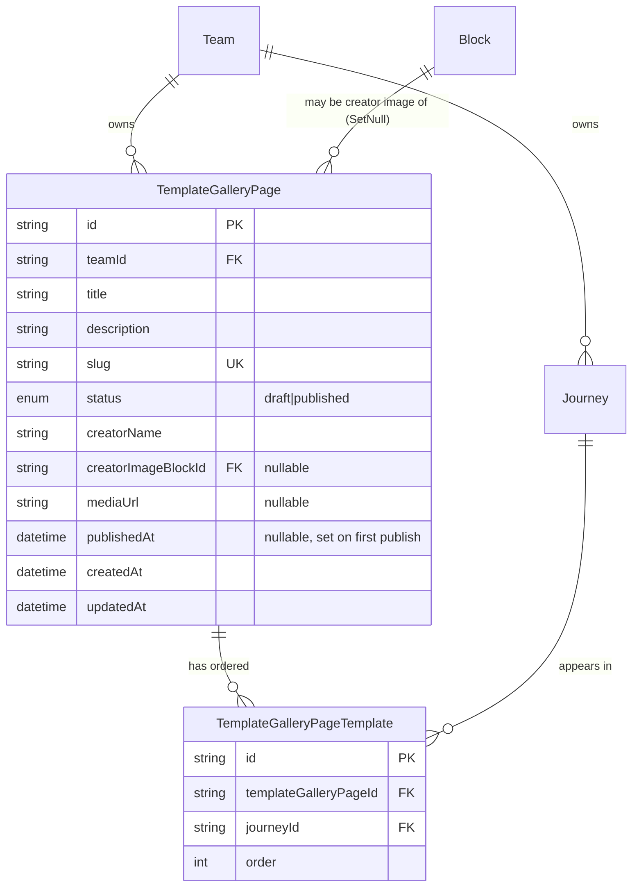

# feat: NES-1547 Backend Template Gallery Page API

## Enhancement Summary

**Deepened:** 2026-04-29 (11 parallel reviewers: architecture, security, data integrity, performance, TypeScript, pattern recognition, simplicity, best-practices research, framework docs, spec-flow, learnings).

### Material changes from initial draft

| # | Change | Source | Severity |
|---|---|---|---|
| 1 | Add same-team validation for `creatorImageBlockId` (Block-content leak via public query) | security-sentinel H1 | **High** |
| 2 | Read-time filter on `templates` field (`status: published`, `template: true`, `teamId === page.teamId`) to defend against stale rows after journey transfer/archive | security-sentinel H2, spec-flow #3-4 | **High** |
| 3 | Set `onDelete: Cascade` on `TemplateGalleryPage.team` relation (default Restrict silently breaks team deletion) | data-integrity-guardian, spec-flow #2 | **High** |
| 4 | Replace single-column `@@index(status)` with composite `@@index([teamId, createdAt(sort: Desc)])` (selectivity + covers list query) | performance-oracle, data-integrity-guardian | Medium |
| 5 | Move slug-gen out of `$transaction`; replace N-round-trip loop with single `WHERE slug LIKE 'base%'` query + `P2002` catch-and-retry-once | performance-oracle, data-integrity-guardian | Medium |
| 6 | Use existing `slugify` npm package (already a repo dep, used in `block/step/stepBlockUpdate.mutation.ts`) instead of inlining `convertToSlug` from api-languages | pattern-recognition-specialist | Medium |
| 7 | Drop `lib/` subfolder — no precedent in any sibling module; flatten helpers to siblings | pattern-recognition-specialist, code-simplicity-reviewer | Medium |
| 8 | Drop `templateGalleryPage.acl.ts` — no-op for "any team member" rule; resolvers call `isInTeam` directly | code-simplicity-reviewer | Medium |
| 9 | Public query uses `t.withAuth({ $any: { isAuthenticated: true, isAnonymous: true } })` — match `adminJourney.query.ts` precedent rather than inventing a no-`withAuth` pattern | architecture-strategist A1 | Medium |
| 10 | Add `'Query.templateGalleryPageBySlug': 60_000` to `useResponseCache` `ttlPerSchemaCoordinate` in `yoga.ts` (or document why default suffices) | performance-oracle, learnings-researcher | Medium |
| 11 | Validate `mediaUrl` scheme is `https:` (defense-in-depth against SSRF in any downstream proxy) | security-sentinel M3 | Medium |
| 12 | Validate `slug` arg shape (`/^[a-z0-9-]{1,200}$/`) at the resolver layer | security-sentinel M1, spec-flow #11 | Medium |
| 13 | Use `nestedSelection` in the `templates` field (column pruning, mirrors `journeyCollection.ts:33-39`) | kieran-typescript-reviewer | Low |
| 14 | Concrete TS samples added for input fields (`t.id`, `t.string`, `t.idList`) and `prismaObject` fields (`t.exposeID`, `t.expose`, `t.relation`) — implementer no longer has to guess | kieran-typescript-reviewer | Low |
| 15 | Reserved-slug list (`admin`, `api`, `templates`, etc.) rejected with `SLUG_RESERVED` | spec-flow #11 | Low |
| 16 | Drop type-shape `templateGalleryPage.spec.ts` — no precedent (e.g., `journeyCollection/` has none); 5 specs total | pattern-recognition-specialist, code-simplicity-reviewer | Low |
| 17 | Defer `prismaObjectField` extension on `Journey` to NES-1548 (no current consumer) | architecture-strategist A2, code-simplicity-reviewer | Low |
| 18 | Use `description: input.description ?? undefined` (let `@default("")` apply) — avoid resolver/schema coupling on the empty-string convention | kieran-typescript-reviewer | Low |
| 19 | Document `t.withAuth(fn)` precedent vs Pothos docs (the docs only show static map; the repo uses the function form per `googleCreate.mutation.ts:30-37`) | framework-docs-researcher | Note |
| 20 | Repo uses `@prisma/client ^7.0.0` — confirm 7.x compound-key/`$transaction` semantics still apply | framework-docs-researcher | Note |

### Decisions explicitly rejected from review feedback (with rationale)

- **`@sindresorhus/slugify`** (best-practices-researcher BP1): rejected. Pattern-recognition-specialist showed `slugify` is already a repo dep (`block/step/stepBlockUpdate.mutation.ts:2`); introducing a second slug library is inconsistency for marginal Unicode benefit. Use the existing package.
- **Slug-alias table for SEO 301 redirects** (best-practices-researcher BP3): deferred. Out of scope for NES-1547. Logged in *Future Considerations* with a follow-up flag.
- **`templateGalleryPageUnpublish` mutation** (spec-flow #7): deferred. Spec explicitly says draft → published only; no archive/unpublish. Hard delete + recreate is the temporary unpublish path.
- **i18n on title/description/creatorName** (spec-flow #9): deferred. Confirmed with the resolved-decisions list — single language for MVP. Logged in *Future Considerations*; if product needs multi-lingual, revisit before migration runs.
- **Optimistic locking via `expectedUpdatedAt`** (spec-flow #8): deferred. Not blocking for MVP; admin UI (NES-1548) can add it client-side if needed.
- **Increase default builder `nullable` for list items** (kieran-typescript-reviewer #9): leave to verify-in-place — implementer reads `builder.ts` and matches.

### Carry-forward MUST-FIX checklist for the implementer

- [ ] Block ownership validation (#1) before any persistence path that accepts `creatorImageBlockId`.
- [ ] Read-time `templates` filter (#2) on `templateGalleryPageBySlug`.
- [ ] `onDelete: Cascade` on `TemplateGalleryPage.team` (#3).
- [ ] `P2002` catch-and-retry-once for slug uniqueness (#5).
- [ ] Public query `t.withAuth({ $any: { isAuthenticated: true, isAnonymous: true } })` (#9).
- [ ] `mediaUrl` `https:`-only validation at write time (#11).
- [ ] Slug regex `/^[a-z0-9-]{1,200}$/` validation on input (#12).

## Overview

Add a new Pothos GraphQL API in `apis/api-journeys-modern` that lets team members curate a public-facing "Template Gallery Page" — a slug-addressable landing page that groups a hand-picked, hand-ordered list of template journeys belonging to that team. Publishers create the page as a draft, edit metadata and ordering, then publish it; published pages are world-readable by slug. The API is the upstream for NES-1548 (admin UI) and NES-1549 (public gallery page UI).

This work is the **API half** of the broader Template Gallery Pages feature (roadmap NES-1607). Everything is scoped to the modern Pothos stack — no NestJS resolvers, no schema additions to `apis/api-journeys`. The migration extends the shared `prisma-journeys` schema, so both APIs see the new tables, but only `api-journeys-modern` exposes them in GraphQL.

## Problem Statement

### What we're solving

Today, anyone landing on `/templates/<journey-slug>` sees a single template journey from JFP's central catalogue. There is no way for a team to publish *their own* curated, branded landing page that bundles several of their templates with descriptive copy, an ordering, and a memorable URL. Teams that want this currently link to individual journey pages or build offsite landing pages that drift from the canonical template content.

### Why now

- The product team committed to launching team template galleries (NES-1607) in the next release window.
- Frontend tickets NES-1548 (admin) and NES-1549 (public) are blocked on the API contract.
- A LaunchDarkly flag (`templateGalleryPage`, dashboard-defined, off by default) gates the admin UI rollout, so we can ship the API and admin scaffold safely before flipping it on.

### Constraints

- **Stack lock-in**: Pothos + Prisma + GraphQL Yoga in `api-journeys-modern`. No CASL, no NestJS guards.
- **Shared Prisma schema**: `libs/prisma/journeys/db/schema.prisma` is consumed by both the legacy `api-journeys` and the modern API. The migration must not break legacy resolvers.
- **Federation**: `api-journeys-modern` is a federated subgraph composed by Hive into `api-gateway`. The new types must be federation-compatible (no name clashes, correct `shareable` markers if extended later).
- **Public read**: `templateGalleryPageBySlug` must be reachable by an unauthenticated visitor — i.e. not behind `t.withAuth({ isAuthenticated: true })`.
- **No backend LaunchDarkly client**: There is no server-side LD wiring in `api-journeys-modern`. The flag gates the admin frontend only; the API is invisible to end users until the admin UI ships behind the flag.

## Proposed Solution

Build a single new Pothos schema module `apis/api-journeys-modern/src/schema/templateGalleryPage/` that mirrors the file layout used by `chatButton/` and `customDomain/`, with semantics borrowed from the legacy `journeyCollection.resolver.ts` (transactional join-table replacement, cross-team journey filtering).

Add two new Prisma models — `TemplateGalleryPage` and `TemplateGalleryPageTemplate` (the ordered join table) — plus a new enum `TemplateGalleryPageStatus { draft, published }`. Migrate via `nx prisma-migrate prisma-journeys`.

Auth uses the existing `isInTeam` scope (any team member, manager **or** member, can create / read / update / publish / delete). Cross-team isolation is enforced at write time by filtering input `journeyIds` to `{ template: true, teamId: page.teamId }` and silently dropping disallowed IDs (mirrors legacy `journeyCollectionCreate` behaviour). This validation is extracted to a single helper file (`filterToTeamTemplates.ts`) so the rule can be relaxed later without touching every resolver.

Slug generation uses a small new helper `generateUniqueSlug.ts` that applies `slugify`-style transformation, then loops with a numeric suffix until the DB unique constraint passes — same shape as `apis/api-languages/src/lib/slugify/slugify.ts`, but DB-backed for uniqueness because slugs are mutable.

Publish is a separate mutation `templateGalleryPagePublish(id)` to keep the state transition explicit and to make the "set `publishedAt` on first publish only" rule trivial to enforce. Re-publishing an already-published page is a no-op (returns the page unchanged, does not bump `publishedAt`).

## Technical Approach

### Architecture

Three layers, each with a single responsibility:

1. **Prisma layer** — `libs/prisma/journeys/db/schema.prisma`: new models, enum, relations, migration.
2. **Pothos layer** — `apis/api-journeys-modern/src/schema/templateGalleryPage/`: GraphQL types, queries, mutations, slug helper, journeyIds validator, Block-ownership validator. **No `acl.ts`** (rule reduces to a single `isInTeam` call) and **no `lib/` subfolder** (no precedent in any sibling module).
3. **Federation layer** — re-run `generate-graphql` for `api-journeys-modern` and `api-gateway`, then `run-many -t codegen` so admin/public frontends pick up types.

#### File map (new) — flat, mirroring `chatButton/` and `customDomain/`

```text
apis/api-journeys-modern/src/schema/templateGalleryPage/
├── index.ts                                            # barrel: imports all sibling files (side-effect registration)
├── templateGalleryPage.ts                              # builder.prismaObject('TemplateGalleryPage', …) + templates field
├── enums/
│   ├── index.ts
│   └── templateGalleryPageStatus.ts                    # builder.enumType wrapping Prisma TemplateGalleryPageStatus
├── inputs/
│   ├── index.ts
│   ├── templateGalleryPageCreateInput.ts
│   └── templateGalleryPageUpdateInput.ts
├── generateUniqueSlug.ts                               # slugify pkg + single LIKE query + P2002 retry-once + reserved-slug guard
├── filterToTeamTemplates.ts                            # journeyIds → only same-team templates (single point of relaxation)
├── validateCreatorImageBlock.ts                        # NEW: asserts Block belongs to a journey in the same team (security H1)
├── templateGalleryPages.query.ts                       # team list, team-member auth
├── templateGalleryPageBySlug.query.ts                  # single, public, published-only, with read-time templates filter
├── templateGalleryPageCreate.mutation.ts
├── templateGalleryPageUpdate.mutation.ts
├── templateGalleryPagePublish.mutation.ts
├── templateGalleryPageDelete.mutation.ts
├── templateGalleryPageBySlug.query.spec.ts
├── templateGalleryPages.query.spec.ts
├── templateGalleryPageCreate.mutation.spec.ts
├── templateGalleryPageUpdate.mutation.spec.ts
├── templateGalleryPagePublish.mutation.spec.ts
├── templateGalleryPageDelete.mutation.spec.ts
├── generateUniqueSlug.spec.ts
├── filterToTeamTemplates.spec.ts
└── validateCreatorImageBlock.spec.ts
```

**Deletions vs. initial draft:** `lib/` subfolder, `templateGalleryPage.acl.ts`, `templateGalleryPage.spec.ts` (type-shape sanity — covered by codegen).
**Additions vs. initial draft:** `validateCreatorImageBlock.ts` (security H1).

#### File map (modified)

| File | Change |
|---|---|
| `libs/prisma/journeys/db/schema.prisma` | Add `TemplateGalleryPageStatus` enum, `TemplateGalleryPage` model, `TemplateGalleryPageTemplate` join model. Add back-references to `Team`, `Journey`, `Block`. |
| `apis/api-journeys-modern/src/schema/schema.ts` | Add `import './templateGalleryPage'` (alphabetical: between `team` and `user`, but follow existing ordering — `team` is at the bottom, so insert before `user`). |
| `apis/api-journeys-modern/src/schema/journey/journey.ts` | (Optional, ship-with) Extend `JourneyRef` with a `templateGalleryPages` field via `builder.prismaObjectField('Journey', …)` — same pattern as `journeyCollection.ts:29-46`. **Not strictly required for NES-1547**; deferred unless the admin UI wants it. Flag in PR for review. |

#### Prisma schema — exact additions

Insert after the existing `JourneyCollection`/`JourneyCollectionJourneys` block (~line 721 of [libs/prisma/journeys/db/schema.prisma](libs/prisma/journeys/db/schema.prisma:702)):

```prisma
enum TemplateGalleryPageStatus {
  draft
  published
}

model TemplateGalleryPage {
  id                  String                        @id @default(uuid())
  teamId              String
  title               String
  description         String                        @default("")
  slug                String                        @unique
  status              TemplateGalleryPageStatus     @default(draft)
  creatorName         String
  creatorImageBlockId String?
  mediaUrl            String?
  publishedAt         DateTime?
  createdAt           DateTime                      @default(now())
  updatedAt           DateTime                      @updatedAt
  team                Team                          @relation(fields: [teamId], references: [id], onDelete: Cascade)  // changed: Cascade so Team deletion does not throw FK violation
  creatorImageBlock   Block?                        @relation("TemplateGalleryPageCreatorImageBlock", fields: [creatorImageBlockId], references: [id], onDelete: SetNull)
  templates           TemplateGalleryPageTemplate[]

  @@index([teamId, createdAt(sort: Desc)])  // covering index for templateGalleryPages list query (team-scoped, sorted by createdAt desc)
  // dropped: @@index(status) — selectivity ~50% (draft/published) makes it near-useless; status is filtered post-fetch on a single row in templateGalleryPageBySlug
}

model TemplateGalleryPageTemplate {
  id                    String              @id @default(uuid())
  templateGalleryPageId String
  journeyId             String
  order                 Int
  templateGalleryPage   TemplateGalleryPage @relation(fields: [templateGalleryPageId], references: [id], onDelete: Cascade)
  journey               Journey             @relation("JourneyTemplateGalleryPageTemplate", fields: [journeyId], references: [id], onDelete: Cascade)

  @@unique([templateGalleryPageId, journeyId])
  @@unique([templateGalleryPageId, order])  // NB: do not UPDATE order in-place — Postgres unique constraints are NOT DEFERRABLE here. Always delete + recreate inside one transaction (mirrors legacy journeyCollectionUpdate at apis/api-journeys/src/app/modules/journeyCollection/journeyCollection.resolver.ts:142-162).
}
```

Back-references to add to existing models:

| Model | Field to add |
|---|---|
| `Team` ([schema.prisma:239-258](libs/prisma/journeys/db/schema.prisma:239)) | `templateGalleryPages TemplateGalleryPage[]` |
| `Journey` (~line 444 area, near `journeyCollectionJourneys`) | `templateGalleryPageTemplates TemplateGalleryPageTemplate[] @relation("JourneyTemplateGalleryPageTemplate")` |
| `Block` (creator image FK) | `templateGalleryPagesAsCreatorImage TemplateGalleryPage[] @relation("TemplateGalleryPageCreatorImageBlock")` |

#### ERD



#### Concrete Pothos source (per kieran-typescript-reviewer)

**`templateGalleryPage.ts` — prismaObject field shape** (use `t.exposeID/exposeString/expose/relation`, NOT `t.field({ type: 'String', resolve })` which is wordier and bypasses Pothos's `expose` optimization):

```typescript
import { builder } from '../builder'
import { JourneyRef } from '../journey/journey'
import { TemplateGalleryPageStatusRef } from './enums'

export const TemplateGalleryPageRef = builder.prismaObject('TemplateGalleryPage', {
  shareable: false,  // no other subgraph defines this type yet — see architecture review A2
  fields: (t) => ({
    id: t.exposeID('id', { nullable: false }),
    title: t.exposeString('title', { nullable: false }),
    description: t.exposeString('description', { nullable: false }),
    slug: t.exposeString('slug', { nullable: false }),
    status: t.expose('status', { type: TemplateGalleryPageStatusRef, nullable: false }),
    creatorName: t.exposeString('creatorName', { nullable: false }),
    creatorImageBlock: t.relation('creatorImageBlock', { nullable: true }),
    mediaUrl: t.exposeString('mediaUrl', { nullable: true }),
    publishedAt: t.expose('publishedAt', { type: 'DateTimeISO', nullable: true }),
    createdAt: t.expose('createdAt', { type: 'DateTimeISO', nullable: false }),
    updatedAt: t.expose('updatedAt', { type: 'DateTimeISO', nullable: false }),
    team: t.relation('team', { nullable: false }),
    // `templates` field — see §"Read-time templates filter" above for full body
  })
})
```

**`inputs/templateGalleryPageCreateInput.ts`**:

```typescript
import { builder } from '../../builder'

export const TemplateGalleryPageCreateInput = builder.inputType('TemplateGalleryPageCreateInput', {
  fields: (t) => ({
    teamId: t.id({ required: true }),
    title: t.string({ required: true }),
    description: t.string(),                     // optional; defaults to "" via Prisma
    creatorName: t.string({ required: true }),
    creatorImageBlockId: t.id(),
    mediaUrl: t.string(),                        // server validates https:// at write time
    journeyIds: t.idList()                       // optional; ordering = array order
  })
})
```

**`inputs/templateGalleryPageUpdateInput.ts`** — note absence of `status`, `publishedAt`, `id`, `teamId`, `createdAt`, `updatedAt` (security M2 invariant — neither `status` nor `publishedAt` may be mutated through Update):

```typescript
import { builder } from '../../builder'

export const TemplateGalleryPageUpdateInput = builder.inputType('TemplateGalleryPageUpdateInput', {
  fields: (t) => ({
    title: t.string(),
    description: t.string(),
    slug: t.string(),                            // server normalizes via slugify({lower:true,strict:true}) and rejects reserved/duplicate
    creatorName: t.string(),
    creatorImageBlockId: t.id(),                 // null clears, undefined leaves alone
    mediaUrl: t.string(),
    journeyIds: t.idList()                       // undefined leaves join table; [] clears; non-empty replaces
  })
})
```

**ID-arg form** — every `id` arg uses `t.arg.id({ required: true })` (majority pattern in repo, e.g. [integrationDelete.mutation.ts:17](apis/api-journeys-modern/src/schema/integration/integrationDelete.mutation.ts:17)). Slug args use `t.arg.string({ required: true })` because slug is `String`, not `ID`.

**List-item nullability** — verify `apis/api-journeys-modern/src/schema/builder.ts` `defaultListNullability` config before writing the `templates` field. If lists default to `nullable: { list: false, items: false }`, our `[Journey!]!` SDL output is correct with `nullable: false`. If defaults differ, set explicit `nullable: { list: false, items: false }`.

#### GraphQL schema — public surface (target SDL)

```graphql
enum TemplateGalleryPageStatus {
  draft
  published
}

type TemplateGalleryPage {
  id: ID!
  title: String!
  description: String!
  slug: String!
  status: TemplateGalleryPageStatus!
  creatorName: String!
  creatorImageBlock: ImageBlock
  mediaUrl: String
  publishedAt: DateTimeISO
  createdAt: DateTimeISO!
  updatedAt: DateTimeISO!
  team: Team!
  templates: [Journey!]!     # already ordered by `order` asc — see select in resolver
}

input TemplateGalleryPageCreateInput {
  teamId: ID!
  title: String!
  description: String
  creatorName: String!
  creatorImageBlockId: ID
  mediaUrl: String
  journeyIds: [ID!]          # optional; ordering = array order
}

input TemplateGalleryPageUpdateInput {
  title: String
  description: String
  slug: String               # MUTABLE
  creatorName: String
  creatorImageBlockId: ID
  mediaUrl: String
  journeyIds: [ID!]          # if provided, REPLACES join table; ordering = array order
}

type Query {
  templateGalleryPages(teamId: ID!): [TemplateGalleryPage!]!     # team auth (isInTeam)
  templateGalleryPageBySlug(slug: String!): TemplateGalleryPage  # PUBLIC; published-only; null if draft or missing
}

type Mutation {
  templateGalleryPageCreate(input: TemplateGalleryPageCreateInput!): TemplateGalleryPage!
  templateGalleryPageUpdate(id: ID!, input: TemplateGalleryPageUpdateInput!): TemplateGalleryPage!
  templateGalleryPagePublish(id: ID!): TemplateGalleryPage!
  templateGalleryPageDelete(id: ID!): TemplateGalleryPage!
}
```

#### Response cache configuration

The federated subgraph runs `useResponseCache` per [yoga.ts:81-106](apis/api-journeys-modern/src/yoga.ts:81). Two changes are required for safe public/private coexistence — both are surfaces this plan touches:

1. **Verify `session` is configured.** Per the official Yoga docs, there is **no auth-aware default** — `useResponseCache` will share a single global cache slot across all callers unless `session` is wired. Confirm the existing `yoga.ts` config sets `session: req => req.headers.get('authorization')` (or `null` for anonymous-only routes). Report finding in the PR; if missing, raise a separate issue (out of scope for NES-1547 unless the plan's public query exposes the gap).
2. **Add explicit TTL for the public query** in `ttlPerSchemaCoordinate`:

```typescript
useResponseCache({
  // ...existing config
  ttlPerSchemaCoordinate: {
    // ...existing entries
    'Query.templateGalleryPageBySlug': 60_000,  // 1 minute — bounds staleness if mutation invalidation is bypassed (e.g., direct DB edit during a backfill)
  }
})
```

**Why 60s, not 0:** the public page is hit by anonymous internet traffic and is a strong cache candidate — slug→page mapping changes only on slug edit (rare) and publish/delete (caught by mutation invalidation by default). 60s is short enough that even bypassed-invalidation paths recover quickly.

**Mutation invalidation:** `useResponseCache` defaults to `invalidateViaMutation: true`. Our four mutations all return the `TemplateGalleryPage` typename, so the plugin's typename+id tag tracking automatically invalidates cached responses that referenced the mutated row. Verified pattern; no extra config needed.

#### Auth strategy — concrete patterns

The Pothos scope-auth plugin supports both static and dynamic scopes. Two patterns appear in the repo:

**Pattern A — `teamId` is in args (create, list):**

```typescript
// from apis/api-journeys-modern/src/schema/integration/google/googleCreate.mutation.ts:30-37
.withAuth((_parent, args) => ({
  $all: {
    isAuthenticated: true,
    isInTeam: (args.input as typeof TemplateGalleryPageCreateInput.$inferInput).teamId
  }
}))
```

**Pattern B — `teamId` must be derived (id-based update/publish/delete):**

```typescript
// from apis/api-journeys-modern/src/schema/googleSheetsSync/googleSheetsSyncs.query.ts:74
import { isInTeam } from '../authScopes'
// inside resolver, after fetching the page:
if (!(await isInTeam({ context, teamId: page.teamId }))) {
  throw new GraphQLError('user is not allowed to ...', { extensions: { code: 'FORBIDDEN' } })
}
```

**Public read (`templateGalleryPageBySlug`):** matches the [adminJourney](apis/api-journeys-modern/src/schema/journey/adminJourney.query.ts) precedent — use `t.withAuth({ $any: { isAuthenticated: true, isAnonymous: true } })` so both anonymous and authenticated visitors hit the same code path. **Do not** invent a no-`withAuth` pattern; this keeps scope-auth telemetry and grep-ability consistent with every other anonymous-allowed resolver in the modern API. The resolver applies `where: { slug, status: 'published' }` so drafts never leak. Returns `null` (not throw) on miss — frontends rely on this for 404 handling.

#### Slug generation

`generateUniqueSlug.ts` — **single LIKE query (not N round-trips), runs OUTSIDE the transaction, with `P2002` retry-once for the rare TOCTOU race**:

```typescript
import slugify from 'slugify'  // already a repo dependency; used in apis/api-journeys-modern/src/schema/block/step/stepBlockUpdate.mutation.ts:2
import { prisma } from '@core/prisma/journeys/client'

const RESERVED_SLUGS = new Set([
  'admin', 'api', 'templates', 'journey', 'journeys',
  'static', 'public', 'app', 'auth', 'sign-in', 'sign-up',
  'health', 'graphql', 'webhook', 'webhooks'
])

export class SlugTakenError extends Error {
  constructor() { super('slug already in use'); this.name = 'SlugTakenError' }
}

export class SlugReservedError extends Error {
  constructor(slug: string) { super(`slug "${slug}" is reserved`); this.name = 'SlugReservedError' }
}

/**
 * Generate a unique slug from a title.
 * - Uses the repo's existing `slugify` package with `{ lower: true, strict: true }`
 *   (strips Unicode homographs, normalizes case, drops non-alphanumerics).
 * - Single SELECT to fetch all colliding slugs (cheap; bounded by team activity).
 * - Picks the first non-conflicting suffix in {base, base-2, ..., base-50}; falls back to a 6-char nanoid suffix beyond that.
 * - Caller is responsible for catching P2002 from the subsequent INSERT and retrying ONCE if the title was the source of the slug (TOCTOU window).
 */
export async function generateUniqueSlug(
  title: string,
  excludeId?: string  // for update: ignore self when checking conflicts
): Promise<string> {
  const base = slugify(title, { lower: true, strict: true })
  if (base === '' || RESERVED_SLUGS.has(base)) throw new SlugReservedError(base || '(empty)')

  const collisions = await prisma.templateGalleryPage.findMany({
    where: { slug: { startsWith: base } },
    select: { id: true, slug: true }
  })
  const taken = new Set(
    collisions.filter(c => c.id !== excludeId).map(c => c.slug)
  )

  if (!taken.has(base)) return base
  for (let suffix = 2; suffix <= 50; suffix++) {
    const candidate = `${base}-${suffix}`
    if (!taken.has(candidate)) return candidate
  }
  // Pathological — 50 collisions on the same base. Fall back to entropy.
  const { nanoid } = await import('nanoid')
  return `${base}-${nanoid(6)}`
}

/**
 * Validate a user-supplied slug (update flow only).
 * Slug must match the canonical shape, not be reserved, and not collide.
 */
export async function validateUserSuppliedSlug(
  rawSlug: string,
  excludeId: string
): Promise<string> {
  const slug = slugify(rawSlug, { lower: true, strict: true })
  if (!/^[a-z0-9]+(-[a-z0-9]+)*$/.test(slug) || slug.length > 200) {
    throw new GraphQLError('invalid slug shape', {
      extensions: { code: 'BAD_USER_INPUT', field: 'slug' }
    })
  }
  if (RESERVED_SLUGS.has(slug)) throw new SlugReservedError(slug)
  const existing = await prisma.templateGalleryPage.findFirst({
    where: { slug, NOT: { id: excludeId } },
    select: { id: true }
  })
  if (existing != null) throw new SlugTakenError()
  return slug
}
```

**Resolver TOCTOU pattern** (in `templateGalleryPageCreate.mutation.ts`):

```typescript
let attempt = 0
while (true) {
  const slug = await generateUniqueSlug(title)
  try {
    return await prisma.$transaction(async (tx) => {
      const validJourneyIds = await filterToTeamTemplates(tx, teamId, journeyIds ?? [])
      if (creatorImageBlockId != null) await validateCreatorImageBlock(tx, teamId, creatorImageBlockId)
      return tx.templateGalleryPage.create({ ...query, data: { /* ... */ slug, /* ... */ } })
    })
  } catch (e) {
    if (e instanceof Prisma.PrismaClientKnownRequestError && e.code === 'P2002' && attempt === 0) {
      attempt += 1  // retry once with a fresh slug computation
      continue
    }
    throw e
  }
}
```

**Why this shape** (vs. original draft's loop-inside-transaction):
- N database round-trips collapsed to 1 (the `LIKE` SELECT).
- Slug-gen runs **before** opening the transaction — does not pin a connection.
- DB unique constraint backstops the TOCTOU race; one retry is sufficient (a third concurrent collision on the exact same suffix is statistically negligible and the second retry would mask a real bug).

#### Cross-team journey isolation

`filterToTeamTemplates.ts`:

```typescript
/**
 * Filter input journeyIds to those that:
 *   - belong to the given teamId
 *   - have template === true (today's product rule; relax here when cross-team templates ship)
 *
 * Drops invalid IDs silently — mirrors legacy `journeyCollectionCreate` UX.
 * The dropped count is returned so the caller MAY surface it to the admin UI
 * (NES-1548 already plans a "we removed N journeys you don't have access to" toast).
 */
export async function filterToTeamTemplates(
  tx: Prisma.TransactionClient,
  teamId: string,
  journeyIds: string[]
): Promise<{ validIds: string[]; droppedCount: number }> {
  if (journeyIds.length === 0) return { validIds: [], droppedCount: 0 }
  const dedup = [...new Set(journeyIds)]
  const found = await tx.journey.findMany({
    where: { id: { in: dedup }, teamId, template: true },
    select: { id: true }
  })
  const validSet = new Set(found.map(j => j.id))
  const validIds = dedup.filter(id => validSet.has(id))  // preserves input ordering
  return { validIds, droppedCount: dedup.length - validIds.length }
}
```

This is the **single point** where the cross-team rule lives. To allow cross-team templates later (per spec note: "Isolate this validation so it can be relaxed later"), edit only this helper.

#### Block ownership validation (security H1)

`validateCreatorImageBlock.ts` — **NEW** (per security review):

```typescript
import { GraphQLError } from 'graphql'
import { Prisma } from '@core/prisma/journeys/client'

/**
 * Asserts that the given Block id belongs to a Journey owned by the given team.
 *
 * Without this check, a Team-A publisher could set creatorImageBlockId to a Block
 * from a Team-B private/draft journey; the public templateGalleryPageBySlug query
 * would then expose that Block (its src/alt) to anonymous visitors.
 *
 * Same class of bug as docs/solutions/security-issues/google-sync-missing-integration-ownership-guard.md
 * — accepting a foreign-key id without verifying requester owns the referenced resource.
 */
export async function validateCreatorImageBlock(
  tx: Prisma.TransactionClient,
  teamId: string,
  blockId: string
): Promise<void> {
  const block = await tx.block.findUnique({
    where: { id: blockId },
    select: { typename: true, journey: { select: { teamId: true } } }
  })
  if (block == null) {
    throw new GraphQLError('creator image block not found', {
      extensions: { code: 'BAD_USER_INPUT', field: 'creatorImageBlockId' }
    })
  }
  if (block.journey?.teamId !== teamId) {
    throw new GraphQLError('creator image block does not belong to your team', {
      extensions: { code: 'FORBIDDEN', field: 'creatorImageBlockId' }
    })
  }
  // (Optional) constrain to typename === 'ImageBlock'; defer until product confirms whether VideoBlock is also acceptable.
}
```

#### Read-time templates filter (security H2)

The `templates` field on `TemplateGalleryPageRef` MUST filter at read time, not just write time. A journey can be transferred to another team or have its `template` flag flipped to `false` after being added to a gallery — the join row persists but the journey no longer matches the original write-time filter. Without read-time filtering, the public page would expose journeys the team no longer owns or that are no longer templates.

```typescript
templates: t.field({
  type: [JourneyRef],
  // SDL: [Journey!]! — verify nullable list-item config in apis/api-journeys-modern/src/schema/builder.ts
  nullable: false,
  select: (_args, _ctx, nestedSelection) => ({
    teamId: true,  // pin parent.teamId for the filter below (Pothos parent-selection)
    templates: {
      where: {
        // Defense-in-depth: even if a join row is stale, only same-team published templates surface.
        journey: {
          template: true,
          status: 'published',
          // teamId equality enforced via parent.teamId; for cross-team future, relax here too.
        }
      },
      include: { journey: nestedSelection(true) },  // column pruning per kieran-typescript-reviewer #9
      orderBy: { order: 'asc' }
    }
  }),
  resolve: (page) => {
    return page.templates
      .filter(tpt => tpt.journey?.teamId === page.teamId)  // belt + braces beside the where clause above
      .map(tpt => tpt.journey)
  }
})
```

If/when product allows cross-team templates in galleries, the `teamId` line in both the `where` clause and the `.filter` call lifts (single, well-known relaxation point).

#### Mutation logic — `templateGalleryPageCreate`

Mirrors [apis/api-journeys/src/app/modules/journeyCollection/journeyCollection.resolver.ts:72-110](apis/api-journeys/src/app/modules/journeyCollection/journeyCollection.resolver.ts:72), with TOCTOU retry, Block ownership validation, and `mediaUrl` scheme allowlist:

```typescript
type CreateInput = typeof TemplateGalleryPageCreateInput.$inferInput

function assertHttpsUrl(input: string | null | undefined, field: string): void {
  if (input == null) return
  try {
    const url = new URL(input)
    if (url.protocol !== 'https:') throw new Error('insecure scheme')
  } catch {
    throw new GraphQLError(`${field} must be a valid https URL`, {
      extensions: { code: 'BAD_USER_INPUT', field }
    })
  }
}

builder.mutationField('templateGalleryPageCreate', (t) =>
  t
    .withAuth((_parent, args) => ({
      $all: {
        isAuthenticated: true,
        isInTeam: (args.input as CreateInput).teamId
      }
    }))
    .prismaField({
      type: TemplateGalleryPageRef,
      nullable: false,
      args: { input: t.arg({ type: TemplateGalleryPageCreateInput, required: true }) },
      resolve: async (query, _parent, args) => {
        const { teamId, title, description, creatorName, creatorImageBlockId, mediaUrl, journeyIds } = args.input
        assertHttpsUrl(mediaUrl, 'mediaUrl')

        let attempt = 0
        while (true) {
          const slug = await generateUniqueSlug(title)
          try {
            return await prisma.$transaction(async (tx) => {
              const { validIds } = await filterToTeamTemplates(tx, teamId, journeyIds ?? [])
              if (creatorImageBlockId != null) {
                await validateCreatorImageBlock(tx, teamId, creatorImageBlockId)
              }
              return tx.templateGalleryPage.create({
                ...query,
                data: {
                  team: { connect: { id: teamId } },
                  title,
                  description: description ?? undefined,  // honor @default("")
                  slug,
                  status: 'draft',
                  creatorName,
                  creatorImageBlockId: creatorImageBlockId ?? undefined,
                  mediaUrl: mediaUrl ?? undefined,
                  templates: {
                    createMany: {
                      data: validIds.map((journeyId, order) => ({ journeyId, order }))
                    }
                  }
                }
              })
            })
          } catch (e) {
            if (e instanceof Prisma.PrismaClientKnownRequestError && e.code === 'P2002' && attempt === 0) {
              attempt += 1
              continue
            }
            throw e
          }
        }
      }
    })
)
```

#### Mutation logic — `templateGalleryPageUpdate`

```typescript
// Pattern B auth: fetch first, check teamId membership, then transact.
// 1. Fetch the page (id-only mutation — no teamId in args).
// 2. await isInTeam({ context, teamId: page.teamId }) — throw FORBIDDEN if false.
// 3. assertHttpsUrl(input.mediaUrl, 'mediaUrl') if provided.
// 4. If input.slug provided: const slug = await validateUserSuppliedSlug(input.slug, id).
// 5. If input.title provided AND input.slug NOT provided: do NOT regenerate slug — title changes do not auto-rewrite slug to avoid silently invalidating published URLs.
// 6. If input.creatorImageBlockId provided (not null): await validateCreatorImageBlock(tx, page.teamId, input.creatorImageBlockId).
//    If input.creatorImageBlockId === null: clear it. If undefined: leave alone.
// 7. Inside tx:
//    - If input.journeyIds is undefined: leave join table alone.
//    - If input.journeyIds is [] : tx.templateGalleryPageTemplate.deleteMany({ where: { templateGalleryPageId: id } }).
//    - If input.journeyIds is non-empty: deleteMany + createMany inside the same tx (legacy pattern; mirrors journeyCollectionUpdate).
// 8. Update mutable fields. Update input MUST NOT accept `status` or `publishedAt` — those transition via the publish mutation only (security M2 invariant).
```

**Update input fields explicitly omitted** (security M2 invariant — call out in the spec): `status`, `publishedAt`, `id`, `teamId`, `createdAt`, `updatedAt`, `slug` (handled separately above), `journeyIds` (handled separately above). Test asserts an attempt to pass any of these is rejected at SDL-input level.

#### Mutation logic — `templateGalleryPagePublish`

```typescript
// Fetch page (id-only mutation).
// await isInTeam({ context, teamId: page.teamId }) — throw FORBIDDEN if false.
// If status === 'published': return page unchanged (idempotent — no publishedAt update).
// Otherwise: update { status: 'published', publishedAt: page.publishedAt ?? new Date() }.
//   The `?? page.publishedAt` preserves the original first-publish timestamp on subsequent transitions
//   (security M2 invariant: publishedAt is monotonic).
// Returns the updated page.
```

Idempotent so the admin UI can call it repeatedly without side effects (e.g., a "Publish" button that the user clicks twice). Same idempotency rule means the response cache `invalidateViaMutation` (default-on in `useResponseCache`) only fires when state actually changes — repeated no-op publishes don't bust the cache.

#### Mutation logic — `templateGalleryPageDelete`

```typescript
// Hard delete with cascade — TemplateGalleryPageTemplate rows go automatically (onDelete: Cascade).
// Block referenced by creatorImageBlockId is NOT deleted (FK is on us, with onDelete: SetNull on our side, but creator image is on Block, which we don't own).
// Returns the deleted page (Pothos pattern — return result of prisma.delete()).
```

#### Query logic — `templateGalleryPages` (team list)

```typescript
// Auth: t.withAuth((_p, args) => ({ $all: { isAuthenticated: true, isInTeam: args.teamId as string } }))
// Resolver: prisma.templateGalleryPage.findMany({ ...query, where: { teamId }, orderBy: { createdAt: 'desc' } })
// Returns BOTH draft and published.
```

#### Query logic — `templateGalleryPageBySlug` (public)

```typescript
builder.queryField('templateGalleryPageBySlug', (t) =>
  t
    .withAuth({ $any: { isAuthenticated: true, isAnonymous: true } })  // matches adminJourney precedent
    .prismaField({
      type: TemplateGalleryPageRef,
      nullable: true,
      args: { slug: t.arg.string({ required: true }) },
      resolve: async (query, _parent, args) => {
        // Validate shape — fail fast on probing/abuse before hitting the DB
        if (!/^[a-z0-9]+(-[a-z0-9]+)*$/.test(args.slug) || args.slug.length > 200) return null
        // findUnique on a non-unique compound (slug+status) won't typecheck — use findFirst
        return prisma.templateGalleryPage.findFirst({
          ...query,
          where: { slug: args.slug, status: 'published' }
        })
      }
    })
)
```

Returns `null` on:
- malformed slug (regex reject before DB)
- unknown slug
- draft / status !== 'published'

Frontend interprets `null` as 404.

The `templates` field defined above (in §"Read-time templates filter") handles per-row filtering of the join rows (`status: published`, `template: true`, `teamId === page.teamId`) — defense in depth alongside the published-only `where` on the page itself. Mirrors [apis/api-journeys-modern/src/schema/journeyCollection/journeyCollection.ts:11-24](apis/api-journeys-modern/src/schema/journeyCollection/journeyCollection.ts:11) but with the additional read-time filters required by security review.

### Implementation Phases

#### Phase 1 — Prisma schema & migration

- [ ] Edit [libs/prisma/journeys/db/schema.prisma](libs/prisma/journeys/db/schema.prisma): add enum, two models, three back-references.
- [ ] Run `nx prisma-generate prisma-journeys`.
- [ ] Run `nx prisma-migrate prisma-journeys`. Verify timestamped migration file appears under `libs/prisma/journeys/db/migrations/`.
- [ ] Inspect generated SQL: confirm `CREATE TABLE`, indexes, FK cascades, unique constraints. No destructive ALTERs on existing tables.
- [ ] Smoke-test: `pnpm nx run prisma-journeys:prisma-generate` + start `api-journeys` to ensure legacy resolvers still compile against the regenerated client.

**Done when:** Migration file exists, generated client has the new types, both APIs build.

#### Phase 2 — Pothos types, helpers (no resolvers wired yet)

- [ ] `templateGalleryPage/templateGalleryPage.ts` — `prismaObject` + read-time-filtered `templates` field (with `nestedSelection`).
- [ ] `templateGalleryPage/enums/templateGalleryPageStatus.ts` — `builder.enumType` over Prisma enum.
- [ ] `templateGalleryPage/inputs/templateGalleryPageCreateInput.ts` and `templateGalleryPageUpdateInput.ts` (Update input excludes `status`/`publishedAt` per security M2 invariant).
- [ ] `templateGalleryPage/generateUniqueSlug.ts` + spec — uses `slugify` package, single `LIKE` query, RESERVED_SLUGS guard, `validateUserSuppliedSlug` exported alongside.
- [ ] `templateGalleryPage/filterToTeamTemplates.ts` + spec — returns `{ validIds, droppedCount }`.
- [ ] `templateGalleryPage/validateCreatorImageBlock.ts` + spec — security H1 helper.
- [ ] `templateGalleryPage/index.ts` — barrel (imports all sibling files for side-effect registration).
- [ ] Add `import './templateGalleryPage'` to [apis/api-journeys-modern/src/schema/schema.ts](apis/api-journeys-modern/src/schema/schema.ts).
- [ ] Verify `DateTime`/`DateTimeISO` scalar is registered in `apis/api-journeys-modern/src/schema/builder.ts` before exposing `publishedAt`/`createdAt`/`updatedAt`. Per [docs/solutions/integration-issues/federation-subgraph-scalar-registration-hidden-prerequisites.md](docs/solutions/integration-issues/federation-subgraph-scalar-registration-hidden-prerequisites.md), each subgraph needs its own scalar registration.

**No `acl.ts` file** — the rule reduces to a single `isInTeam` call per resolver. Add this file when product reverses the "any team member" decision (one-line change).

**Done when:** `nx generate-graphql api-journeys-modern` succeeds and emits the `TemplateGalleryPage` type with no fields-related errors. Builder's `onUnusedQuery: 'error'` (per [docs/solutions/logic-errors/pothos-query-parameter-ignored-nested-resolution-failure.md](docs/solutions/logic-errors/pothos-query-parameter-ignored-nested-resolution-failure.md)) catches any missing `query` spreads.

#### Phase 3 — Queries

- [ ] `templateGalleryPages.query.ts` — team list, dynamic `isInTeam` auth, `findMany` with `orderBy: createdAt desc`.
- [ ] `templateGalleryPageBySlug.query.ts` — public, `findFirst` with `slug + status: published`, returns nullable.
- [ ] Specs for both.

**Done when:** `pnpm jest --config apis/api-journeys-modern/jest.config.ts --no-coverage 'apis/api-journeys-modern/src/schema/templateGalleryPage'` passes the query specs.

#### Phase 4 — Mutations

- [ ] `templateGalleryPageCreate.mutation.ts` + spec.
- [ ] `templateGalleryPageUpdate.mutation.ts` + spec.
- [ ] `templateGalleryPagePublish.mutation.ts` + spec.
- [ ] `templateGalleryPageDelete.mutation.ts` + spec.
- [ ] Wire each transactionally; the create + update mutations both use `prisma.$transaction` for slug-gen + journey-id filter + write.

**Done when:** All mutation specs pass. Manual end-to-end via `nf start` + a GraphQL playground query for each operation.

#### Phase 5 — Federation & frontend codegen

- [ ] `nx generate-graphql api-journeys-modern` — confirms subgraph SDL is well-formed.
- [ ] `nx generate-graphql api-gateway` — Hive recomposes; fails loudly on type clashes.
- [ ] `nx run-many -t codegen` — frontends pick up new types.
- [ ] Inspect generated `apis/api-gateway/schema.graphql` diff: only additions, no surprises in existing types.

**Done when:** Gateway schema compiled, frontends compile against new types (no consumers yet — codegen produces type definitions but no usages, so unused-export warnings expected and fine).

#### Phase 6 — Documentation & PR

- [ ] Update [.claude/rules/backend/database-schema-changes.md](.claude/rules/backend/database-schema-changes.md) ONLY if a new pattern emerged worth documenting (probably no change needed).
- [ ] PR description: link NES-1547, summarise schema additions, attach generated SDL diff, list phases above as the test plan.
- [ ] No changelog file update needed — release notes are derived from PR titles via the standard tooling.

## Alternative Approaches Considered

| Approach | Why considered | Why rejected |
|---|---|---|
| **Add to legacy `api-journeys` (NestJS)** | Existing journeyCollection lives there; copy-paste would be faster. | Spec mandates Pothos. New work goes to `api-journeys-modern`; legacy is on the way out. |
| **Reuse `JourneyCollection` model** | Same shape — title, ordered journeys, teamId. | Different lifecycle (drafts, publish, slugs, public access, creator metadata). Overloading `JourneyCollection` would couple two product surfaces and defeat the resolved decision to track status separately. |
| **Single mutation `templateGalleryPageSave` covering create + update + publish** | Fewer GQL surface points. | Hides state transitions; makes ACL/audit reasoning harder; spec explicitly calls for a separate `Publish` mutation. |
| **Soft delete (status: archived)** | Recoverable. | Spec says hard delete. Templates Gallery Pages aren't a regulated artefact; cascade is fine. |
| **Slug auto-regenerate on title change** | Convenience. | Silently breaks any external link to the published page. Slug change is now an explicit, rare admin operation. |
| **Backend LD flag check on the API** | Defence in depth. | No backend LD client exists, and the API is invisible until the admin UI ships behind the flag. Adding LD client purely for one flag check would be over-engineering. The PR can land before the LD flag flips on. |
| **CRUD via a single REST router** | Simpler. | Inconsistent with the rest of the API surface. All other journey-domain CRUD is GraphQL. |

## System-Wide Impact

### Interaction Graph

- **`templateGalleryPageCreate`** triggers: Pothos scope-auth resolver → `prisma.$transaction` → 1× `templateGalleryPage.findUnique` per slug-loop iteration (≥1) → 0..1× `journey.findMany` (cross-team filter) → 1× `templateGalleryPage.create` with nested `createMany` of join rows. No fan-out of webhooks, no downstream events. Federation gateway sees a new resolver registration only at compose time.
- **`templateGalleryPageBySlug`** triggers: anonymous-context Yoga request → Pothos resolver → 1× `prisma.templateGalleryPage.findFirst` joined with `templates → journey`. Apollo Federation response cache (`useResponseCache` per [yoga.ts:27-62](apis/api-journeys-modern/src/yoga.ts:27)) may cache by query+slug — verify the cache keying does not leak draft/published transitions across cache windows. **Action:** confirm cache TTL or set `@cacheControl(scope: PUBLIC, maxAge: …)` if the team wants explicit caching; default behavior is fine for first ship.
- **`templateGalleryPagePublish`** writes one row, no triggers. Idempotent.
- **`templateGalleryPageDelete`** triggers: cascade delete of `TemplateGalleryPageTemplate` rows (FK `onDelete: Cascade`). Does **not** delete the referenced `Block` (creator image) — only the FK is `SetNull` on Block deletion. Confirms safe.

### Error & Failure Propagation

| Failure point | Surface to client |
|---|---|
| Auth scope fails (`isInTeam` returns false) | Pothos default: `not authorized` GraphQLError, code 401/403 (depends on Pothos config). Confirm by checking `builder.ts` scope-auth options. |
| Slug collision in transaction (extremely rare given pre-loop) | Postgres unique violation → Prisma `P2002` → caught by transaction → re-throw as GraphQLError `code: SLUG_TAKEN`. Catch explicitly in create/update. |
| Journey ID belongs to other team / not a template | Silently filtered by `filterToTeamTemplates`. No error. Match legacy behaviour. |
| `creatorImageBlockId` does not exist | FK constraint violation → Prisma `P2003` → re-throw as `BAD_USER_INPUT` with code `INVALID_CREATOR_IMAGE_BLOCK`. |
| Page not found on update/publish/delete | Resolver fetches first; throw `NOT_FOUND` GraphQLError. Match `customDomain.query.ts:32-35` pattern. |
| Public query — page is draft or missing | Return `null` (not throw). Document in SDL comment. |

### State Lifecycle Risks

- **Partial failure on create**: All writes (page + join rows) are inside `prisma.$transaction`. Atomic. No orphans.
- **Partial failure on update**: Same. Slug uniqueness pre-check runs inside the same transaction, so concurrent inserts cannot defeat the check between SELECT and INSERT (Postgres MVCC + the post-transaction unique constraint backstops both).
- **Concurrent publish**: Two clients calling `publish` simultaneously on a draft. First wins, sets `publishedAt`. Second sees `status: published`, no-ops, returns the page with the first request's `publishedAt`. Acceptable — no harm done.
- **Block deletion → creator image**: `onDelete: SetNull` on our FK — `creatorImageBlockId` becomes null on the page. UI shows fallback. Verified safe.
- **Journey deletion → join row**: `onDelete: Cascade` — orphaned join rows don't accumulate.
- **Page deletion → consumers**: Anyone holding the slug URL gets `null` from `templateGalleryPageBySlug` → 404 on the public page. Acceptable; matches deletion semantics.

### API Surface Parity

- `apis/api-journeys` (legacy NestJS) does **not** re-expose `TemplateGalleryPage`. Only `api-journeys-modern` owns this type. Verified by federation `override` not being used.
- The shared Prisma schema means `api-journeys` resolvers compile against the new types automatically — none reference the new tables, but the regeneration step is mandatory after the migration.
- No watch-modern, journeys-admin, or journeys consumer is *required* to update (codegen produces types; consumers will land in NES-1548 / NES-1549).

### Integration Test Scenarios

These are deliberately cross-layer scenarios that unit-with-mocks cannot cover. Recommended to run via `apis/api-journeys-modern-e2e` or as a manual checklist before merging.

1. **Create-then-publish-then-public-fetch**: As team manager, create a draft with three journey IDs (mix of own-team templates and one journey from another team). Publish. As an unauthenticated visitor, fetch by slug. Verify exactly the two valid templates appear, in input order.
2. **Slug edit propagates to public**: Update a published page's slug. Public fetch by old slug returns null; by new slug returns the page.
3. **Delete cascades**: Delete a page with five join rows. Verify rows are gone via direct DB query; verify the underlying journeys are still present.
4. **Cross-team leak guard**: As Team A member, attempt to create a page on Team A with a journey ID belonging to Team B. Verify journey is silently dropped from the join table.
5. **Concurrent slug update**: Two updates to the same page changing the title (without slug). Page slug remains unchanged after both — slug is not auto-derived on title-only updates.

## Acceptance Criteria

### Functional Requirements

- [ ] Migration adds `TemplateGalleryPage` (with `team` relation `onDelete: Cascade`), `TemplateGalleryPageTemplate`, `TemplateGalleryPageStatus`, plus `@@index([teamId, createdAt(sort: Desc)])` on the page model.
- [ ] All four mutations (`Create`, `Update`, `Publish`, `Delete`) and both queries (`templateGalleryPages`, `templateGalleryPageBySlug`) appear in `apis/api-gateway/schema.graphql` after `generate-graphql api-gateway`.
- [ ] `templateGalleryPageBySlug(slug)` returns `null` for any page where `status != published`, for any unknown slug, **and** for any malformed slug (regex reject before DB hit) — never throws.
- [ ] `templateGalleryPageBySlug` `templates` field filters at read time to `{ template: true, status: 'published', journey.teamId === page.teamId }` — even stale join rows from journey transfer or template-flag flip are excluded (security H2).
- [ ] `templateGalleryPagePublish` is idempotent; second call returns the page unchanged with the original `publishedAt`. `publishedAt` is monotonic — neither Update nor Publish can clear it (security M2 invariant).
- [ ] `templateGalleryPageDelete` cascades join rows; verified via inserted-row count before/after. Deleting the owning Team also cascades the gallery pages (Team→Page `onDelete: Cascade`).
- [ ] Auth: any team member (manager OR member) can perform all four mutations; non-team users get `FORBIDDEN`. Public `templateGalleryPageBySlug` uses `t.withAuth({ $any: { isAuthenticated: true, isAnonymous: true } })` per [adminJourney.query.ts](apis/api-journeys-modern/src/schema/journey/adminJourney.query.ts) precedent.
- [ ] Slug is generated from title on create via `slugify(title, { lower: true, strict: true })`; `RESERVED_SLUGS` rejected with `SLUG_RESERVED`; user-supplied slug on update normalized + validated against the same regex `/^[a-z0-9]+(-[a-z0-9]+)*$/` (≤200 chars).
- [ ] Slug uniqueness backed by DB unique constraint + one-shot `P2002` retry; user never sees `SLUG_TAKEN` for a title-derived slug (only for user-supplied slugs).
- [ ] Cross-team `journeyIds` are silently filtered out via `filterToTeamTemplates` — no error, just dropped. `droppedCount` is computed for downstream UI surfacing.
- [ ] `creatorImageBlockId` (when provided) is validated to belong to a journey owned by the same team via `validateCreatorImageBlock` — throws `BAD_USER_INPUT` if missing or `FORBIDDEN` if cross-team (security H1).
- [ ] `mediaUrl` (when provided) is validated to be a syntactically valid `https://` URL via `assertHttpsUrl`; rejects `http:`, `file:`, `gopher:`, `data:`, etc. (security M3).

### Non-Functional Requirements

- [ ] All resolvers use `...query` spread for Pothos field selection (per [docs/solutions/logic-errors/pothos-query-parameter-ignored-nested-resolution-failure.md](docs/solutions/logic-errors/pothos-query-parameter-ignored-nested-resolution-failure.md)). Confirm `onUnusedQuery: 'error'` is set on the modern builder.
- [ ] No backend LD wiring added; rollout gating is purely frontend in NES-1548.
- [ ] Each mutation completes in a single Prisma transaction. Slug-gen runs **outside** the transaction; the transaction is opened only after the candidate slug is computed.
- [ ] No new dependencies added to `apis/api-journeys-modern/package.json`. `slugify` is already a repo dep ([block/step/stepBlockUpdate.mutation.ts:2](apis/api-journeys-modern/src/schema/block/step/stepBlockUpdate.mutation.ts:2)); `nanoid` is already a transitive dep used elsewhere — verify before relying on it for the >50-collision fallback. If not available, drop the fallback (50 collisions on the same base is product-pathological, throw a clear error).
- [ ] `templateGalleryPageUpdate` SDL input does NOT include `status`, `publishedAt`, `id`, `teamId`, `createdAt`, or `updatedAt` (security M2 invariant).
- [ ] `useResponseCache` `ttlPerSchemaCoordinate` includes `'Query.templateGalleryPageBySlug': 60_000`.

### Quality Gates

- [ ] One spec file per resolver, plus specs for `generateUniqueSlug` and `filterToTeamTemplates`.
- [ ] All specs pass under `npx jest --config apis/api-journeys-modern/jest.config.ts --no-coverage 'apis/api-journeys-modern/src/schema/templateGalleryPage'`.
- [ ] Lint passes: `nx lint api-journeys-modern`.
- [ ] Type-check passes: implicit in `nx generate-graphql api-journeys-modern`.
- [ ] Gateway compose passes: `nx generate-graphql api-gateway`.
- [ ] Front-end codegen passes: `nx run-many -t codegen`.
- [ ] PR description references this plan and ticket NES-1547.

## Success Metrics

- API ships behind no flag (because no consumers yet); zero regressions in `api-journeys`/`api-journeys-modern` test suites.
- NES-1548 (admin UI) and NES-1549 (public page) can build their UI tickets against the deployed gateway schema with no follow-up API changes.
- p95 latency for `templateGalleryPageBySlug` < 200ms once consumers exist (measured post-NES-1549 launch).

## Dependencies & Prerequisites

| Dependency | State |
|---|---|
| `prisma-pothos-types` plugin | Already wired in `builder.ts` |
| `isInTeam` scope | Implemented at `apis/api-journeys-modern/src/schema/authScopes.ts:47-59,111` |
| Slugify pattern | Reference: `apis/api-languages/src/lib/slugify/slugify.ts:1-37` (copied inline, not imported) |
| `prisma.$transaction` | Already used by every multi-write mutation |
| Federation compose tooling | `nx generate-graphql api-gateway` runs Hive |
| LaunchDarkly `templateGalleryPage` flag | Frontend-only; created by ops in dashboard, off by default. **Not** a blocker for this PR. |
| NES-1607 product spec | Resolved decisions captured in this plan |

No blockers. Ready to begin.

## Risk Analysis & Mitigation

| Risk | Likelihood | Impact | Mitigation |
|---|---|---|---|
| Stale cross-team rows after journey transfer / template-flag flip leak to public page | Med | High | Read-time `templates` filter (security H2) — see §"Read-time templates filter". |
| `creatorImageBlockId` set to another team's Block leaks Block content via public query | Med | High | `validateCreatorImageBlock` runs on Create + Update (security H1). |
| Slug uniqueness race under concurrent same-title creates | Low | Med | DB unique constraint + one-shot `P2002` retry with re-computed slug. After two collisions on the same auto-generated slug, throw — bug-not-feature. |
| Federation compose fails on type name clash | Low | Med | New names (`TemplateGalleryPage*`) checked against existing schema (none collide). Gate landing on `generate-graphql api-gateway` succeeding locally. |
| Codegen breaks downstream apps | Low | Med | Codegen runs on every CI; failure is loud; mitigated by running locally before push. |
| Public query abuse / scraping / slug enumeration | Med | Low | Existing Yoga rate-limiting + response cache (`ttlPerSchemaCoordinate`); regex-reject malformed slugs before DB hit; bounded slug character set. |
| Spec changes "any team member" → "managers only" mid-flight | Low | Low | One-line change in each of four resolvers (`isInTeam` → `isTeamManager`); minor scope. |
| `useResponseCache` lacks `session` config and bleeds authed responses to anonymous | Low | High | Verify `session` is configured in `yoga.ts` before NES-1548 ships authed mutations that rely on cache invalidation. **Out of scope for NES-1547** (no authed cached responses introduced here), but flag in PR. |

## Resource Requirements

- 1 backend engineer, ~1.5–2 days of work to implement, test, and ship.
- No infra changes (DB migration is automatic via `prisma-migrate`).
- No new env vars, secrets, or third-party services.

## Future Considerations

- **Cross-team templates in galleries** (NES-1607 stretch goal): change only `filterToTeamTemplates.ts` and the `teamId` line in the `templates` field's read-time `where`. Every other resolver remains untouched.
- **SEO 301 redirects on slug change**: per best-practices research, mutable public slugs without redirects bleed link equity and break bookmarks. Add a `TemplateGalleryPageSlugAlias` table (`oldSlug`, `pageId`, `createdAt`), populate it on slug update, and have the public web layer (NES-1549) issue `301` on alias hits. **Out of scope for NES-1547**; flag in PR description as a follow-up. Reference: [Yoast slug optimization](https://yoast.com/slug/), [AIOSEO automatic redirects](https://aioseo.com/docs/automatic-redirects-when-changing-the-post-slug/).
- **`templateGalleryPageUnpublish` mutation**: today, hard delete is the only way to retract a published page. A draft-rollback would set `status: draft` while preserving `publishedAt` for audit. Cheap to add (one resolver, no migration). Hold until product asks.
- **Internationalization (`title` / `description` / `creatorName`)**: single-language for MVP per resolved decisions. JFP serves a multi-lingual product; if i18n becomes near-term, add a `locale String` column **before** migration runs (cheap additive). Post-migration retrofit would require a join-table for translations and a backfill of the default locale across all rows.
- **Optimistic locking on Update**: today the Update mutation is last-write-wins per field. Two admins editing the same gallery can clobber each other silently. Add an optional `expectedUpdatedAt: DateTimeISO` to `TemplateGalleryPageUpdateInput` and reject with `STALE_RECORD` if mismatched. Hold until NES-1548 reports user pain.
- **Soft delete / archive**: would add `archived` to `TemplateGalleryPageStatus` and a separate `templateGalleryPageArchive` mutation. Public query already filters to `published`, so archived pages naturally drop out. Hold until product asks for non-destructive retraction.
- **Pagination on `templateGalleryPages`**: currently returns all pages for a team. If a team accumulates hundreds, switch to a Relay-style connection (Pothos has the `RelayPlugin` already loaded — see [builder.ts:59](apis/api-journeys-modern/src/schema/builder.ts:59)).
- **Audit log**: capture who created/published/deleted. Not in scope; would land as a new model + interceptor.
- **Analytics on public page**: track views per slug. Existing Plausible integration already covers slug-based pages; reuse.
- **Reserved-slug list growth**: today's hard-coded `RESERVED_SLUGS` is small. If the product grows new top-level routes, add to the constant. Consider promoting to a config-driven list once it grows past ~20 entries.

## Documentation Plan

- Inline JSDoc on `filterToTeamTemplates` explaining the deliberately-permissive silent-drop behaviour and how to relax it.
- One-paragraph note in PR description on the `slug` mutability decision and idempotent publish.
- No changes to `.claude/rules/backend/` — no new conventions emerged.
- No README update — `apis/api-journeys-modern` does not have one and we should not introduce one for a single feature module.

## Sources & References

### Internal References

- **Closest analogue (legacy NestJS, port to Pothos):** [apis/api-journeys/src/app/modules/journeyCollection/journeyCollection.resolver.ts:72-204](apis/api-journeys/src/app/modules/journeyCollection/journeyCollection.resolver.ts:72) — create/update/delete patterns including transactional join-table replacement and cross-team `journeyIds` filtering.
- **Pothos object + relation field pattern:** [apis/api-journeys-modern/src/schema/journeyCollection/journeyCollection.ts:4-46](apis/api-journeys-modern/src/schema/journeyCollection/journeyCollection.ts:4) — including the cross-import-safe `prismaObjectField` extension on `Journey`.
- **Dynamic auth scope from input:** [apis/api-journeys-modern/src/schema/integration/google/googleCreate.mutation.ts:28-46](apis/api-journeys-modern/src/schema/integration/google/googleCreate.mutation.ts:28).
- **Direct `isInTeam` call in resolver (Pattern B):** [apis/api-journeys-modern/src/schema/googleSheetsSync/googleSheetsSyncs.query.ts:6,74](apis/api-journeys-modern/src/schema/googleSheetsSync/googleSheetsSyncs.query.ts:74).
- **ACL helper shape:** [apis/api-journeys-modern/src/schema/journeyCollection/journeyCollection.acl.ts:9-46](apis/api-journeys-modern/src/schema/journeyCollection/journeyCollection.acl.ts:9).
- **Single-resource query with NOT_FOUND/FORBIDDEN error pattern:** [apis/api-journeys-modern/src/schema/customDomain/customDomain.query.ts:11-48](apis/api-journeys-modern/src/schema/customDomain/customDomain.query.ts:11).
- **Auth scopes registration:** [apis/api-journeys-modern/src/schema/authScopes.ts:47-115](apis/api-journeys-modern/src/schema/authScopes.ts:47).
- **Builder configuration & plugins:** [apis/api-journeys-modern/src/schema/builder.ts:32-85](apis/api-journeys-modern/src/schema/builder.ts:32).
- **Schema module registration list:** [apis/api-journeys-modern/src/schema/schema.ts](apis/api-journeys-modern/src/schema/schema.ts).
- **Federated Yoga setup (response cache, JWT forwarding):** [apis/api-journeys-modern/src/yoga.ts:27-62](apis/api-journeys-modern/src/yoga.ts:27).
- **Existing slugify helper to clone:** [apis/api-languages/src/lib/slugify/slugify.ts:1-37](apis/api-languages/src/lib/slugify/slugify.ts:1).
- **Public template ACL (existing):** [apis/api-journeys-modern/src/schema/journey/journey.acl.ts:55,66-72](apis/api-journeys-modern/src/schema/journey/journey.acl.ts:55).
- **Prisma schema (existing JourneyCollection patterns):** [libs/prisma/journeys/db/schema.prisma:702-721](libs/prisma/journeys/db/schema.prisma:702).
- **Test setup (jest-mock-extended, prismaMock):** [apis/api-journeys-modern/test/prismaMock.ts:1-16](apis/api-journeys-modern/test/prismaMock.ts:1).
- **Spec example (mutation):** [apis/api-journeys-modern/src/schema/chatButton/chatButtonCreate.mutation.spec.ts](apis/api-journeys-modern/src/schema/chatButton/chatButtonCreate.mutation.spec.ts).

### External References

- [Pothos Prisma Objects](https://pothos-graphql.dev/docs/plugins/prisma/objects) — `prismaObject`, `t.exposeID/exposeString/expose/relation`.
- [Pothos Circular References](https://pothos-graphql.dev/docs/guide/circular-references) — `prismaObjectField` as the canonical extension pattern (deferred for NES-1547 per architecture review).
- [Pothos Prisma Relations](https://pothos-graphql.dev/docs/plugins/prisma/relations) — `query` callback for `where`/`orderBy`/`take`/`skip`. The plan uses Pothos `select` with explicit `where`/`orderBy` for the `templates` field.
- [Pothos Scope Auth](https://pothos-graphql.dev/docs/plugins/scope-auth) — static map `t.withAuth({ ... })` is documented; the function form `t.withAuth((parent, args) => ({...}))` is **used in the repo** (`apis/api-journeys-modern/src/schema/integration/google/googleCreate.mutation.ts:30-37`) but not explicitly documented at the official site. Repo precedent is the source of truth here.
- [Pothos Federation](https://pothos-graphql.dev/docs/plugins/federation) — `builder.toSubGraphSchema({ linkUrl: 'https://specs.apollo.dev/federation/v2.6' })` exposes `@key`, `@external`, `@requires`, `@provides`, `@shareable`, `@tag`, `@inaccessible`, `@override`, `@interfaceObject`, `@composeDirective`, `@link`.
- [Pothos Enums](https://pothos-graphql.dev/docs/guide/enums) — `builder.enumType(PrismaEnum, { name: 'GqlName' })`.
- [Prisma Transactions](https://www.prisma.io/docs/orm/prisma-client/queries/transactions) — callback form for read-modify-write; "keep transactions short."
- [Prisma compound IDs/uniques](https://www.prisma.io/docs/orm/prisma-client/special-fields-and-types/working-with-composite-ids-and-constraints) — `findUnique({ where: { templateGalleryPageId_journeyId: {...} } })` shape.
- [Prisma Discussion #23131](https://github.com/prisma/prisma/discussions/23131) — explicit M2M relation table updates: `deleteMany + createMany` is the 2026 norm for "replace whole set."
- [GraphQL Yoga Response Caching](https://the-guild.dev/graphql/yoga-server/docs/features/response-caching) — `session` config is required to avoid global-shared cache slot. `invalidateViaMutation: true` is the default and triggers on entity typename+id.
- [Yoga Response Cache source](https://github.com/dotansimha/graphql-yoga/blob/main/packages/plugins/response-cache/src/index.ts) — defaults reference.
- [Apollo Federation v2.6 Directives](https://www.apollographql.com/docs/graphos/schema-design/federated-schemas/reference/directives) — `@key`, `@shareable`, `@inaccessible`, `@override`.
- [Apollo Federation Backward Compatibility](https://www.apollographql.com/docs/graphos/schema-design/federated-schemas/reference/backward-compatibility) — adding new types is non-breaking; preemptive `@shareable` is a future migration cost, not a saving.
- [`slugify` npm package](https://www.npmjs.com/package/slugify) — `{ lower: true, strict: true }` strips Unicode homographs, normalizes case, drops non-alphanumerics. Already a repo dep.
- [Yoast: slug optimization for SEO](https://yoast.com/slug/) and [AIOSEO: automatic redirects on slug change](https://aioseo.com/docs/automatic-redirects-when-changing-the-post-slug/) — basis for the deferred `TemplateGalleryPageSlugAlias` future-considerations work.
- [Pothos issue #1192 — withAuth + authScopes don't combine](https://github.com/hayes/pothos/issues/1192) — note on why we use one mechanism per resolver.

### Conventions & Rules

- [.claude/rules/backend/apis.md](.claude/rules/backend/apis.md) — Pothos + Prisma + early returns + descriptive names + always-typed.
- [.claude/rules/backend/database-schema-changes.md](.claude/rules/backend/database-schema-changes.md) — full Prisma + GraphQL workflow (steps 1–7); journeys domain runs `nx prisma-migrate prisma-journeys` then `nx generate-graphql api-journeys-modern && nx generate-graphql api-gateway && nx run-many -t codegen`.
- [.claude/rules/running-jest-tests.md](.claude/rules/running-jest-tests.md) — `npx jest --config <app>/jest.config.ts --no-coverage '<path>'`, never `nx test` with `--testPathPattern`.
- [.claude/CLAUDE.md](.claude/CLAUDE.md) — branch naming regex; matches `siyangcao/nes-1547-backend-template-gallery-page-api`.

### Past Solutions / Learnings

- [docs/solutions/logic-errors/pothos-query-parameter-ignored-nested-resolution-failure.md](docs/solutions/logic-errors/pothos-query-parameter-ignored-nested-resolution-failure.md) — every Pothos resolver returning a model **must** spread `...query` into the Prisma call; nested relations resolve incorrectly otherwise. Confirm `onUnusedQuery: 'error'` is set in `builder.ts` to catch this at dev time.
- [docs/solutions/integration-issues/pothos-prisma-datetimefilter-null-type-mismatch.md](docs/solutions/integration-issues/pothos-prisma-datetimefilter-null-type-mismatch.md) — Pothos `required: false` infers `T | null | undefined` while Prisma rejects `null` for many filters. Use `?? undefined` (not `?? null`) when piping nullable Pothos input into Prisma `data` / `where`. Relevant for `description`, `mediaUrl`, `creatorImageBlockId`, and any future `publishedAt` filter.
- [docs/solutions/integration-issues/federation-subgraph-scalar-registration-hidden-prerequisites.md](docs/solutions/integration-issues/federation-subgraph-scalar-registration-hidden-prerequisites.md) — subgraph builders are independent. Verify the `DateTime`/`DateTimeISO` scalar is registered in `api-journeys-modern/src/schema/builder.ts` before exposing `publishedAt` / `createdAt` / `updatedAt`. Federation v2.6 makes scalars implicitly shareable — no `@shareable` directive needed.
- [docs/solutions/security-issues/google-sync-missing-integration-ownership-guard.md](docs/solutions/security-issues/google-sync-missing-integration-ownership-guard.md) — backend authorization must never trust frontend-supplied resource IDs. The plan's `validateCreatorImageBlock` and `filterToTeamTemplates` follow the three-step pattern (exists, correct team, owned) this incident codified. Tests must include cross-team negative cases for both helpers.
- [docs/solutions/security-issues/journey-acl-read-authorization-bypass-invite-requested-role.md](docs/solutions/security-issues/journey-acl-read-authorization-bypass-invite-requested-role.md) — null-check existence is NOT the same as role check. Verify `isInTeam` (in `apis/api-journeys-modern/src/schema/authScopes.ts:47-59`) checks `userTeam != null` against `UserTeamRole` of `manager` or `member` only — not against any future `pending` / `invited` / `guest` value. Add a role-exhaustive negative test matrix per mutation.
- [docs/plans/2026-04-07-003-feat-templates-language-dropdown-auto-populate-plan.md](docs/plans/2026-04-07-003-feat-templates-language-dropdown-auto-populate-plan.md) — slug-based template lookup pattern; reaffirms `where: { template: true, status: 'published' }` is the canonical public filter.

### Related Work

- **Roadmap:** NES-1607 (Template Gallery Pages — full feature)
- **Frontend admin UI (downstream):** NES-1548
- **Public gallery page (downstream):** NES-1549
- **Past template work:** the feature builds on the existing `Journey.template = true` flag and the `JourneyStatus.published` lifecycle — both pre-existing.
