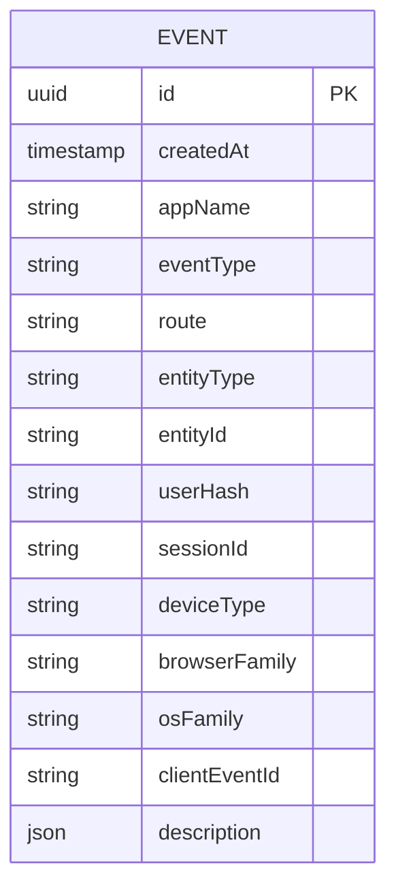

# feat: Signal — Internal Usage Analytics

## Enhancement Summary

**Deepened on:** 2026-04-29 (same day as initial plan)
**Sections materially revised:** Hashing & salt rotation; wire schema for `eventType`; `description` validation; `useTrackEvent` loading-state behaviour; mutation idempotency; gateway auth wiring; read-side authorization scope.

### Key changes from v1 of this plan

1. **Eliminated the `Salt` table.** Review (security + simplicity) converged: persisting the daily salt in the same DB as `Event` makes hashes trivially reversible while the salt is live. Plausible's reference implementation _destroys_ old salts. We adopt a deterministic salt: `salt = HMAC_SHA256(SIGNALS_SALT_SECRET, utc_date)`. The env secret never lives in the DB. No rotation logic, no race condition, stronger privacy. ([Plausible discussion #601](https://github.com/plausible/analytics/discussions/601), [EDPB 01/2025 on pseudonymisation](https://www.edpb.europa.eu/system/files/2025-01/edpb_guidelines_202501_pseudonymisation_en.pdf))
2. **Hash construction tightened.** `HMAC-SHA256(salt, host || \x1f || ip || \x1f || normalisedUA)`, where `normalisedUA = {browser_family, major, os_family}` from `ua-parser` and known bots are dropped at the resolver.
3. **`eventType` becomes `String!` on the wire,** validated at the resolver against an allowlist. Pothos enum stays internal for query strictness. Reason: GraphQL enums hard-reject removed values; deployed admin bundles after a value is dropped would silently lose every event until reload. String + allowlist gracefully drops unknowns with a Datadog warn.
4. **`description` validation added server-side.** Max 2KB, recursive denylist on PII-shaped keys (`email`, `name`, `phone`, `userId`, etc.), optional per-eventType zod schema. Reason: the brainstorm relied on code review to keep PII out; review correctly flagged this as too weak for a privacy-claimed system.
5. **`useTrackEvent` guard inverted to fail-closed.** `if (!user?.email) return; if (INTERNAL_EMAILS.includes(...)) return;` — the v1 guard fired during the `useUser()` loading window, leaking pre-hydration events past the internal exclusion.
6. **Apollo mutation dedup defeated.** Adds `clientEventId: uuid()` to mutation variables; server ignores it. Without this, rapid re-clicks would be undercounted.
7. **Gateway JWT auth wiring spelled out.** Mirror `apis/api-media/yoga.ts` (`useForwardedJWT`) + `apis/api-media/src/schema/builder.ts` (discriminated context union: `apiKey | authenticated | public`). Existing Plausible API-key path stays untouched.
8. **Read scope narrowed to `admin` role only;** explicit threat-model note that raw rows enable cross-correlation re-identification when combined with other systems. Broader stakeholder views deferred to a future `eventStats` aggregation.
9. **Simplifications adopted:** dropped JSON-path filtering from v1, dropped `prismaConnection` cursor pagination from v1 (simple `limit` + `orderBy desc`), trimmed Phase 3 to a one-page operator note.

### Simplifications rejected

- "Land `Event` in `libs/prisma/journeys` instead of new `prisma-signals` domain" — semantic drift cost > the short-term scaffold saving. Keep the new domain.

### Schema iteration (post-deepen review with team)

After re-examining the schema for cross-app extensibility and query ergonomics, the following columns were added or reshaped. Rationale for each is in § Data Model.

1. **`appName`** added — multi-app slicing from day 1 (`journeys-admin`, `videos-admin`, future apps).
2. **`route`** added — Next.js pathname; "which page produced this event" without forcing every call site to encode it in `description`.
3. **`entityType + entityId`** (polymorphic pair) added in place of any per-app entity column. Lets every admin app reuse the table with no migrations: `entityType='journey', entityId=<uuid>` for journeys-admin; `entityType='video', entityId=<uuid>` for videos-admin; etc. Type safety recovered at the resolver via Pothos enum + zod ID-format validation.
4. **`sessionId`** added — per-tab UUID stored in `sessionStorage`. Survives mobile IP rotation, which `userHash` doesn't. Strengthens "distinct sessions on feature X" counts; pairs with `userHash` for upper/lower bounds on distinct people.
5. **`deviceType`, `browserFamily`, `osFamily`** added — coarse UA-derived buckets. The hash pipeline already normalises UA via `ua-parser-js`; persisting the buckets is free. Answers "is this feature used on mobile" / "is anything broken on Safari" without follow-up events.
6. **`clientEventId`** persisted with `@unique` index — already in the mutation as the Apollo-dedup nonce; persisting it gives free idempotency and a frontend↔backend correlation key for debugging.
7. **Editor overlay events split** from one `editor_overlay_opened` + `description.overlay` into four named event types (`editor_analytics_overlay_opened`, `editor_strategy_overlay_opened`, `editor_helpscout_overlay_opened`, `editor_social_preview_overlay_opened`). Eliminates the JSON-path filter on a frequent slice and keeps the allowlist reading as a clean catalogue of tracked interactions.
8. **Indexes:** `[appName, eventType, createdAt]`, `[entityType, entityId, createdAt]`, `[userHash, createdAt]` — match the dominant query shapes.
9. **Retention policy** (180 days) added to the operator note. Daily DELETE of events older than the window. Privacy + storage hygiene.
10. **Success criterion rewritten.** Cross-day distinct-user counting is intentionally broken by the daily-rotating salt — that's the privacy/utility trade we accepted. Origin's "distinct users in last 30 days" success line is replaced with "events per day/week broken down by app/device/route/entity, plus daily distinct users on a given day". The team agreed cross-day distinct counts are not actually load-bearing for usage decisions.
11. **Dwell time / time-on-page out of scope.** Schema can absorb it later (heartbeat events using existing columns, no migration); not part of v1.

---

## Overview

Stand up an internal product-analytics pipeline so the team can answer "is this feature actually used?" for `journeys-admin`. Capture click-level events to a new `Event` table fronted by a federated GraphQL surface in `api-analytics`. Attribute via a Plausible-style daily-derived hash (no raw `userId`, no salt persistence). Ship v1 with an allowlisted set of event types covering Create Journey, Create-from-Template, four editor overlays, and the AI translation language picker.

The brainstorm decisions are carried forward verbatim (see origin: `docs/brainstorms/2026-04-29-signal-usage-analytics-requirements.md`). Repo + external research surfaced one structural decision and several correctness/privacy fixes; all are integrated into this plan.

## Problem Statement

The team has no instrumentation on admin-app usage. There is no way to tell whether a given feature in `journeys-admin` is used at all, by how many distinct people, or how frequently. This makes prioritisation guesswork, and means dead features stay shipped because nobody knows they're dead. Plausible covers public end-user journey traffic; Datadog covers errors and RUM; neither covers admin-side product interactions.

## Carried-Forward Decisions

From the origin requirements doc — settled and not re-litigated here:

- **Storage:** Own table queried via `api-analytics` GraphQL surface (R1, R4).
- **Schema:** `id`, `createdAt`, `eventType` (allowlisted), `userHash`, `description` (Json) (R2).
- **Taxonomy:** Allowlisted enum + free-form JSON `description` (R3) — _with new server-side validation, see § Description Validation_.
- **Filtering on `eventType` and date range from day one** (R4) — _JSON-path filtering deferred to v2_.
- **Attribution:** No raw `userId` (R5) — _implementation switched from `sha256(salt+...)` to `HMAC(salt, ...)` with deterministic salt; see § Hashing_.
- **Internal-user exclusion:** Client-side, Doppler-managed env var (R6).
- **v1 events:** `journey_create_clicked`, `journey_create_from_template`, `editor_overlay_opened`, `ai_translation_language_picked` (R7).
- **Failure isolation:** Fire-and-forget, Datadog log, never break the user flow (R8).
- **No T&Cs change for v1** (origin Key Decisions). _Caveat from EDPB guidance: hashes are pseudonymous personal data **while the day's salt is derivable** (i.e. while `SIGNALS_SALT_SECRET` exists). Document this position in the operator note. Rotating `SIGNALS_SALT_SECRET` invalidates all prior hashes irretrievably._

## Decisions Required Before Implementation

### D1. Where does the `Event` table physically live?

`.claude/rules/backend/database-schema-changes.md` mandates `nx prisma-introspect prisma-analytics` — the analytics domain is a read-only introspection of Plausible's Postgres. We cannot `prisma migrate` an `events` table into it.

**Recommendation:** new migrate-managed domain `libs/prisma/signals`. `api-analytics` imports both clients. New DB or new schema in an existing analytics-tier DB — pick during Phase 1.

### D2. Read auth on the `events` query

`apis/api-analytics/src/lib/auth/auth.ts` only accepts Plausible API keys. The internal `events` query needs gateway JWT context.

**Recommendation:** mirror `apis/api-media/yoga.ts` (`useForwardedJWT`) and `apis/api-media/src/schema/builder.ts` (discriminated context union). Restrict the `events` query to `admin` role only. Reason: raw rows + IP/UA can be cross-referenced against other internal logs to deanonymise — narrow the read surface accordingly. Aggregate-only views (`eventStats`) for broader audiences are a v2 follow-up.

### D3. Mutation auth

**Recommendation:** authenticated via gateway JWT + per-user rate limit (e.g. 60/min). Reject unknown `eventType` values gracefully. Reject `description` payloads >2KB or with PII-shaped keys. See § Server-side Validation.

### D4. Admin UI language tracking duplication

Verify whether `apps/journeys-admin/src/components/JourneyList/JourneyCard/JourneyCardMenu/TranslateJourneyDialog/TranslateJourneyDialog.tsx` already emits a tracking signal (Ken's all-staff mention). Drop `ai_translation_language_picked` from v1 if duplicate.

## Proposed Solution

A new domain (`signals`) backs a small Pothos schema added to `api-analytics`:

- `Event` Prisma model in `libs/prisma/signals` (no `Salt` table — see § Hashing).
- Pothos `eventCreate` mutation, gateway-authenticated, server hashes inputs and persists.
- Pothos `events` `prismaList` query — `eventType` + date range filters, `limit` (default 100, max 1000), `orderBy createdAt desc`.
- `eventType` allowlist single-sourced from a TypeScript constant; sent on the wire as `String!` for forward-compat.
- No `Salt` table; daily salt derived from `HMAC_SHA256(SIGNALS_SALT_SECRET, utc_date)`.
- `apps/journeys-admin/src/libs/useTrackEvent` hook — fail-closed internal-user check, `clientEventId` nonce, Datadog warn on failure.
- v1 events wired at the call sites identified in research (§ Sources).

## Technical Approach

### Architecture

```
journeys-admin / videos-admin / ... (Next.js)
  └── useTrackEvent({ eventType, entity?, description? })
        ├── if !user?.email                                     → return (loading or unauthenticated)
        ├── if user.email ∈ NEXT_PUBLIC_INTERNAL_USER_EMAILS    → return
        └── Apollo mutation {
              eventType, appName, route, entityType?, entityId?,
              sessionId, description?, clientEventId
            } → api-gateway
                └── api-analytics
                      ├── eventCreate (gateway-JWT, rate-limited)
                      │     ├── validate eventType ∈ allowlist (else warn + drop)
                      │     ├── validate appName ∈ allowlist
                      │     ├── validate entityType ∈ allowlist (if present); ID format per type
                      │     ├── validate description (size, PII denylist, optional zod)
                      │     ├── normalise UA → { deviceType, browserFamily, osFamily }
                      │     ├── if isbot(UA) → drop (silent)
                      │     ├── salt = HMAC_SHA256(SIGNALS_SALT_SECRET, utc_date)
                      │     ├── userHash = HMAC_SHA256(salt, host || \x1f || ip || \x1f || normalisedUA)
                      │     └── prisma.event.create
                      └── events query (gateway-JWT, admin-only)
                            └── filter (appName, eventType, entityType, entityId, route,
                                        deviceType, sessionId, createdAt range), limit + orderBy
```

### Data Model

```prisma
// libs/prisma/signals/db/schema.prisma

generator client {
  provider = "prisma-client-js"
  output   = "../src/__generated__/client"
}

datasource db {
  provider = "postgresql"
  url      = env("PG_DATABASE_URL_SIGNALS")
}

model Event {
  id            String   @id @default(uuid()) @db.Uuid
  createdAt     DateTime @default(now())

  // What & where
  appName       String                                         // 'journeys-admin' | 'videos-admin' | ...
  eventType     String                                         // allowlist enforced at resolver
  route         String?                                        // Next.js pathname

  // What it's about (polymorphic; nullable when not entity-bound)
  entityType    String?                                        // 'journey' | 'video' | 'template' | ...
  entityId      String?                                        // ID within entityType (UUID/string)

  // Who (pseudonymous)
  userHash      String                                         // HMAC-derived, daily-rotating
  sessionId     String?                                        // per-tab UUID, sessionStorage

  // Coarse environment (derived from UA at write time)
  deviceType    String?                                        // 'mobile' | 'tablet' | 'desktop'
  browserFamily String?                                        // 'Chrome' | 'Safari' | 'Firefox' | ...
  osFamily      String?                                        // 'macOS' | 'iOS' | 'Windows' | 'Android' | 'Linux'

  // Idempotency / correlation
  clientEventId String?  @unique                               // defeats Apollo dedup; idempotency key

  // Free-form extras
  description   Json?                                          // 2KB cap, recursive PII-key denylist

  @@index([appName, eventType, createdAt])
  @@index([entityType, entityId, createdAt])
  @@index([userHash, createdAt])
}
```

ERD:



No `Salt` table. The active salt is **never persisted** anywhere durable. The only thing that exists across requests is `SIGNALS_SALT_SECRET` (Doppler env, server-only), and the active hash inputs (in-memory per request).

### Why each column exists

| Column                                    | Why                                                                                                                                                                                                                                                                                                                                                |
| ----------------------------------------- | -------------------------------------------------------------------------------------------------------------------------------------------------------------------------------------------------------------------------------------------------------------------------------------------------------------------------------------------------- |
| `id`, `createdAt`                         | Standard. `createdAt` is server-side `now()`.                                                                                                                                                                                                                                                                                                      |
| `appName`                                 | Multi-app slicing. Without this, "journeys-admin vs videos-admin" can't be sliced.                                                                                                                                                                                                                                                                 |
| `eventType`                               | Identity of the action ("which button"). Allowlisted; old admin bundles can't pollute via removed values (graceful warn + drop).                                                                                                                                                                                                                   |
| `route`                                   | Which page produced the event. Cheap; saves every call site from putting it in `description`.                                                                                                                                                                                                                                                      |
| `entityType + entityId`                   | The thing the event is _about_, polymorphic across apps. Resolver validates `entityType ∈ allowlist` and ID format per type via zod. Trade-off vs per-entity columns: adds a soft-constraint string column instead of a typed UUID column, recovered by resolver-side validation. Net win is no migration when a new app's primary entity appears. |
| `userHash`                                | Pseudonymous identifier; daily-rotating via HMAC. Daily distinct counts are exact; cross-day distinct is intentionally broken (privacy choice).                                                                                                                                                                                                    |
| `sessionId`                               | Per-tab UUID in `sessionStorage`. Survives mobile IP churn (which fragments `userHash`). Counts tabs cleanly. Pairs with `userHash` for upper/lower bounds on distinct people.                                                                                                                                                                     |
| `deviceType`, `browserFamily`, `osFamily` | Coarse UA buckets — already computed in the hash pipeline; persisting them is free. Coarse enough not to re-identify (no version, no minor).                                                                                                                                                                                                       |
| `clientEventId`                           | Client-generated UUID per call. `@unique` index. Defeats Apollo mutation dedup so rapid double-clicks count twice; gives free idempotency if retries are added; debug correlation key.                                                                                                                                                             |
| `description`                             | Free-form extras. 2KB cap + recursive PII-key denylist enforced at resolver.                                                                                                                                                                                                                                                                       |

### Why these indexes

| Index                               | Answers                                                              |
| ----------------------------------- | -------------------------------------------------------------------- |
| `[appName, eventType, createdAt]`   | Dominant slice: "in app X, how many times did Y happen, in window Z" |
| `[entityType, entityId, createdAt]` | "Show me everything that happened to journey/video/template ABC"     |
| `[userHash, createdAt]`             | Daily distinct-user counts; per-user activity feeds within a day     |

### Hashing

```ts
// apis/api-analytics/src/schema/event/lib/hash.ts
import { createHmac } from 'node:crypto'

const FIELD_SEP = '\x1f' // ASCII unit-separator — never appears in valid UA / host

export function dailySalt(secret: string, now = new Date()): Buffer {
  const utcDate = now.toISOString().slice(0, 10) // YYYY-MM-DD
  return createHmac('sha256', secret).update(utcDate).digest()
}

export function computeUserHash(secret: string, host: string, ip: string, normalisedUserAgent: string, now = new Date()): string {
  const salt = dailySalt(secret, now)
  return createHmac('sha256', salt).update([host, ip, normalisedUserAgent].join(FIELD_SEP)).digest('hex')
}
```

Properties:

- **Privacy floor:** breach of the events DB alone yields nothing — the salt secret is not stored there. Without `SIGNALS_SALT_SECRET`, hashes are not reversible.
- **Daily rotation:** automatic via UTC-date input; no DB writes, no race condition.
- **Forward erasure:** rotating `SIGNALS_SALT_SECRET` invalidates _all_ historical hashes irretrievably (use as a kill switch).
- **EDPB stance:** while the secret exists, current-day hashes are pseudonymous (not anonymous) per [EDPB 01/2025](https://www.edpb.europa.eu/system/files/2025-01/edpb_guidelines_202501_pseudonymisation_en.pdf). Document in operator note; treat the dataset as in-scope for DSAR if one ever lands.

### User-Agent Normalisation & Bot Filter

```ts
// apis/api-analytics/src/schema/event/lib/ua.ts
import { UAParser } from 'ua-parser-js'
import isbot from 'isbot'

export function normaliseUserAgent(raw: string | undefined | null): string | null {
  if (!raw) return '' // hash an empty string deterministically
  if (isbot(raw)) return null // signal: drop the event
  const ua = UAParser(raw)
  const browserFamily = ua.browser.name ?? 'unknown'
  const major = (ua.browser.version ?? '').split('.')[0] ?? ''
  const osFamily = ua.os.name ?? 'unknown'
  return `${browserFamily}|${major}|${osFamily}`
}
```

In the resolver: if `normaliseUserAgent` returns `null`, swallow the event silently (don't bill bots into our metrics). Both `ua-parser-js` and `isbot` are tiny, well-maintained, and already-in-graph candidates.

The resolver also persists the parsed buckets directly to `Event.deviceType`, `Event.browserFamily`, `Event.osFamily` so they're queryable without re-parsing.

### IP Trust Boundary

The subgraph receives the client IP from a gateway-set forwarded-IP header. The resolver:

1. Read the forwarded IP from the request context (consistent with `apis/api-media`'s pattern).
2. Refuse to fall back to `req.socket.remoteAddress` in non-dev environments — that would always be the gateway's own IP and collapse every user to one hash.
3. Datadog-warn (don't fail) if the header is missing in non-dev; insert with `ip = ''` to keep the row but flag the misconfiguration.

### Server-side Validation

```ts
// apis/api-analytics/src/schema/event/lib/validate.ts
const ALLOWED_EVENT_TYPES = new Set(['journey_create_clicked', 'journey_create_from_template', 'editor_analytics_overlay_opened', 'editor_strategy_overlay_opened', 'editor_helpscout_overlay_opened', 'editor_social_preview_overlay_opened', 'ai_translation_language_picked'] as const)
type AllowedEventType = typeof ALLOWED_EVENT_TYPES extends Set<infer T> ? T : never

const ALLOWED_APP_NAMES = new Set([
  'journeys-admin',
  'videos-admin',
  'cms'
  // add more as new admin apps adopt useTrackEvent
] as const)

const ALLOWED_ENTITY_TYPES = new Set([
  'journey',
  'video',
  'template'
  // add more as needed; each entry should pair with an ID-format zod schema below
] as const)

const ENTITY_ID_FORMAT: Record<string, z.ZodType<string>> = {
  journey: z.string().uuid(),
  video: z.string().uuid(),
  template: z.string().uuid()
}

const PII_KEY = /^(email|e_mail|name|first_?name|last_?name|phone|user_?id|token|password)$/i
const MAX_DESCRIPTION_BYTES = 2048

export function validateDescription(description: unknown): { ok: true } | { ok: false; reason: string } {
  if (description == null) return { ok: true }
  const json = JSON.stringify(description)
  if (Buffer.byteLength(json, 'utf8') > MAX_DESCRIPTION_BYTES) return { ok: false, reason: 'description too large' }
  if (containsPiiKey(description)) return { ok: false, reason: 'description contains PII-shaped key' }
  return { ok: true }
}

function containsPiiKey(node: unknown): boolean {
  if (Array.isArray(node)) return node.some(containsPiiKey)
  if (node && typeof node === 'object') {
    for (const k of Object.keys(node)) {
      if (PII_KEY.test(k)) return true
      if (containsPiiKey((node as Record<string, unknown>)[k])) return true
    }
  }
  return false
}
```

`eventType` validation is identical: not in `ALLOWED_EVENT_TYPES` → Datadog `logger.warn` with `{ unknownEventType }` and return without writing. Old admin bundles after a value is dropped degrade gracefully.

### Per-eventType zod schemas (optional v1, recommended)

```ts
const editorOverlayOpenedSchema = z.object({ overlay: z.enum(['analytics', 'strategy', 'helpscout', 'social_media_preview']) })
const aiTranslationLanguagePickedSchema = z.object({ language: z.string().max(64) })
// ...
```

If a v1 event has a known shape, validate; if not, accept (still bound by size + PII checks). Trade-off: tighter contract vs. minor friction adding events. Worth it for the four well-known shapes.

### Rate Limiting

Per gateway-resolved user (or per IP if anonymous slips through), 60 events/min. Implement with an in-memory LRU + token bucket inside `api-analytics` for v1 (single replica is fine; if `api-analytics` ever scales horizontally, swap to Redis). Excess events: Datadog `logger.warn`, drop, no error to client.

### GraphQL Surface (revised — no cursor pagination in v1)

```graphql
input EventCreateInput {
  eventType: String!
  appName: String!
  route: String
  entityType: String
  entityId: ID
  sessionId: ID
  description: Json
  clientEventId: ID!
}

type Event {
  id: ID!
  createdAt: DateTime!
  appName: String!
  eventType: String!
  route: String
  entityType: String
  entityId: ID
  userHash: String!
  sessionId: ID
  deviceType: String
  browserFamily: String
  osFamily: String
  clientEventId: ID
  description: Json
}

input EventFilter {
  appName: String
  eventType: String
  entityType: String
  entityId: ID
  route: String
  deviceType: String
  sessionId: ID
  createdAtGte: DateTime
  createdAtLte: DateTime
}

type Mutation {
  eventCreate(input: EventCreateInput!): Event # nullable on dropped events (bot, rate-limited, invalid)
}

type Query {
  events(filter: EventFilter, limit: Int = 100): [Event!]!
}
```

Implementation notes:

- Apply null→undefined coercion at the filter boundary per `docs/solutions/integration-issues/pothos-prisma-datetimefilter-null-type-mismatch.md`.
- Register `DateTime` and `Json` scalars in `apis/api-analytics/src/schema/builder.ts` per `docs/solutions/integration-issues/federation-subgraph-scalar-registration-hidden-prerequisites.md`.
- `limit` is clamped server-side to `Math.min(limit ?? 100, 1000)`.
- Cursor pagination + JSON-path filter are deferred to v2 — when an actual query exceeds the cap.

### Federation / Gateway

- Add `useForwardedJWT({})` and `useHmacSignatureValidation` to `apis/api-analytics/src/yoga.ts`, mirroring `apis/api-media/src/yoga.ts:32-53`.
- Refactor `Context` in `apis/api-analytics/src/schema/builder.ts` into a discriminated union (`apiKey | authenticated | public`) per `apis/api-media/src/schema/builder.ts:51-114`. Existing Plausible types declare `authScopes: { isApiKeyUser: true }`; new types declare `{ isAuthenticated: true }` or `{ isAdmin: true }`.
- Plugin order: `RelayPlugin` _before_ `ScopeAuthPlugin` — Pothos requires this so global IDs are parsed before auth checks see them.
- Run `nx run-many -t codegen` and commit `apis/api-gateway/schema.graphql` in the same PR.

### Client Hook (admin) — revised

```ts
// apps/journeys-admin/src/libs/useTrackEvent/useTrackEvent.ts
import { v4 as uuid } from 'uuid'
import { useRouter } from 'next/router'

const INTERNAL_EMAILS = new Set(
  (process.env.NEXT_PUBLIC_INTERNAL_USER_EMAILS ?? '')
    .split(',')
    .map((e) => e.trim().toLowerCase())
    .filter(Boolean)
)

const APP_NAME = 'journeys-admin' // replace per-app when copied to videos-admin/cms

type Entity = { type: 'journey'; id: string } | { type: 'video'; id: string } | { type: 'template'; id: string }

function getOrCreateSessionId(): string {
  if (typeof window === 'undefined') return ''
  const KEY = 'signal.sessionId'
  let id = window.sessionStorage.getItem(KEY)
  if (!id) {
    id = uuid()
    window.sessionStorage.setItem(KEY, id)
  }
  return id
}

export function useTrackEvent() {
  const [mutate] = useMutation(EVENT_CREATE)
  const { user } = useUser()
  const router = useRouter()

  return useCallback(
    (eventType: AllowedEventType, opts?: { entity?: Entity; description?: Record<string, unknown> }) => {
      if (!user?.email) return // fail closed during loading / unauthenticated
      if (INTERNAL_EMAILS.has(user.email.toLowerCase())) return // internal user exclusion
      mutate({
        variables: {
          input: {
            eventType,
            appName: APP_NAME,
            route: router.pathname, // Next.js dynamic-route template, e.g. /journeys/[journeyId]/edit
            entityType: opts?.entity?.type ?? null,
            entityId: opts?.entity?.id ?? null,
            sessionId: getOrCreateSessionId(),
            description: opts?.description,
            clientEventId: uuid()
          }
        }
      }).catch((e) => {
        datadogLogs?.logger.warn('useTrackEvent failed', {
          eventType,
          error: e?.name ?? 'unknown' // sanitised — never log description
        })
      })
    },
    [mutate, user?.email, router.pathname]
  )
}
```

Notes on `route`: prefer `router.pathname` (the dynamic-route template like `/journeys/[journeyId]/edit`) over `router.asPath` so URLs aren't IDs in your indexes — it groups every visit to that page shape under one `route` value.

Notes:

- `AllowedEventType` is the TS string-literal union from `ALLOWED_EVENT_TYPES` (single-sourced from server).
- `clientEventId` defeats Apollo's mutation dedup so rapid double-clicks count twice.
- Loading-state guard is _fail-closed_ — events drop until `user.email` resolves. That's correct: a tracked click during initial hydration was leaking past the internal-user list.
- Only `eventType` + sanitised error name are logged. `description` is never echoed to Datadog.

### v1 Event Call Sites

| Event                                           | File                                                                                                                                                              | `entity`                                                       | `description` shape    |
| ----------------------------------------------- | ----------------------------------------------------------------------------------------------------------------------------------------------------------------- | -------------------------------------------------------------- | ---------------------- |
| `journey_create_clicked`                        | `apps/journeys-admin/src/components/Team/TeamSelect/TeamSelect.tsx` (and `OnboardingPanel/CreateJourneyButton/CreateJourneyButton.tsx` if both reachable)         | none (no journey yet)                                          | `{}`                   |
| `journey_create_from_template`                  | `apps/journeys-admin/src/components/TemplateCustomization/MultiStepForm/Screens/JourneyCustomizeTeamSelect/JourneyCustomizeTeamSelect.tsx` (fire on final create) | `{ type: 'template', id: <templateId> }`                       | `{}`                   |
| `editor_analytics_overlay_opened`               | `Editor/Toolbar/Items/AnalyticsItem`                                                                                                                              | `{ type: 'journey', id: <journeyId> }`                         | `{}`                   |
| `editor_strategy_overlay_opened`                | `Editor/Toolbar/Items/StrategyItem`                                                                                                                               | `{ type: 'journey', id: <journeyId> }`                         | `{}`                   |
| `editor_helpscout_overlay_opened`               | `apps/journeys-admin/src/components/HelpScoutBeacon/*`                                                                                                            | `{ type: 'journey', id: <journeyId> }` if available, else none | `{}`                   |
| `editor_social_preview_overlay_opened`          | `Editor/Slider/JourneyFlow/nodes/SocialPreviewNode/SocialPreviewNode.tsx`                                                                                         | `{ type: 'journey', id: <journeyId> }`                         | `{}`                   |
| `ai_translation_language_picked` _(pending D4)_ | `apps/journeys-admin/src/components/JourneyList/JourneyCard/JourneyCardMenu/TranslateJourneyDialog/TranslateJourneyDialog.tsx`                                    | `{ type: 'journey', id: <journeyId> }`                         | `{ language: string }` |

For all journeys-admin call sites: `appName='journeys-admin'`, `route` = current Next.js pathname, `sessionId` = lazily-initialised UUID stored in `sessionStorage` under a fixed key (e.g. `signal.sessionId`).

Each call site adds one `useTrackEvent` invocation in the existing `handle*` handler. Test descriptions begin with "should…" per memory feedback.

## Implementation Phases

### Phase 1: Foundation (server)

**Tasks**

- Resolve D1, D2, D3, D4.
- Create `libs/prisma/signals` Prisma domain — `schema.prisma`, generated client, nx targets, env var `PG_DATABASE_URL_SIGNALS`.
- Initial migration: `Event` only (with all v3 columns + indexes).
- Wire `@core/prisma/signals/client` into `apis/api-analytics`.
- Register `DateTime` + `Json` scalars in `apis/api-analytics/src/schema/builder.ts` if not already.
- Refactor `apis/api-analytics/src/schema/builder.ts` `Context` into discriminated union; add `isAuthenticated` and `isAdmin` scopes.
- Add `useForwardedJWT` + `useHmacSignatureValidation` to `apis/api-analytics/src/yoga.ts`.
- Add Pothos schema files: `schema/event/{enums.ts (internal),event.type.ts,eventCreate.mutation.ts,events.query.ts,index.ts}` and `schema/event/lib/{hash.ts,ua.ts,validate.ts,rateLimit.ts}`.
- Add Doppler env vars: `SIGNALS_SALT_SECRET` (server-only, 32-byte random), `PG_DATABASE_URL_SIGNALS`.
- Specs: hash determinism within a day; hash divergence across days; `clientEventId` causes two distinct rows; bot UA dropped; oversize description rejected; PII-key denylist hits; unknown `eventType` warn-and-drop; admin-only on read; auth-required on write; rate-limit drops with warn.
- Run `nx run-many -t codegen` to update `apis/api-gateway/schema.graphql`.

**Success criteria**

- `npx jest --config apis/api-analytics/jest.config.ts --no-coverage apis/api-analytics/src/schema/event` green.
- `pnpm run build` green.
- Federation composes; gateway exposes `events` + `eventCreate`.

### Phase 2: Client wiring + v1 events

**Tasks**

- Add `useTrackEvent` hook + spec under `apps/journeys-admin/src/libs/useTrackEvent/`.
- Add `NEXT_PUBLIC_INTERNAL_USER_EMAILS` to Doppler dev/stage/prod (coordinate with ops). Document fallback when unset.
- Wire v1 events at the four call sites.
- Component specs: assert `useTrackEvent` is called with the right payload on click; assert _not_ called when `useUser()` is loading; assert _not_ called when the email matches the internal list.
- Verify D4 first; if duplicate, omit `ai_translation_language_picked`.

**Success criteria**

- Each tracked component's `*.spec.tsx` covers the tracking contract (event fired, payload correct, internal-user skip, loading-state skip).
- Manual smoke: click each tracked control in dev with `SIGNALS_SALT_SECRET` set, observe a row in `Event` with the expected `eventType` and a stable `userHash` for the day. Re-click rapidly and observe two distinct rows (`clientEventId` differs).

### Phase 3: Polish (slim)

**Tasks**

- Write `docs/solutions/patterns/signal-usage-analytics.md`: how to add a new event end-to-end, the salt-derivation invariant, the EDPB pseudonymous-vs-anonymous note, the `SIGNALS_SALT_SECRET` rotation procedure (kill switch), and the operator note that this dataset is in-scope for DSAR while the secret exists.
- Add a Datadog dashboard widget filtering on the `useTrackEvent failed` warn pattern.

**Success criteria**

- Doc reviewed by one teammate; merged.
- A new contributor can add a fifth event end-to-end in <½ day.

## Alternatives Considered

- **Plausible custom events.** Rejected during brainstorm — weak multi-prop filtering, retention tied to plan.
- **PostHog.** New vendor + cost, duplicates Plausible's role.
- **Datadog RUM custom actions.** Cost scales with RUM sessions; weak fit for "is this used at all" queries spanning months.
- **Persisted `Salt` table with rotation cron.** Rejected during deepen pass — review showed it makes hashes trivially reversible (salt + hash both in one DB) and creates a midnight race window. Deterministic HMAC is simpler and stronger.
- **`eventType` as Pothos GraphQL enum.** Rejected — old admin bundles after a value is dropped silently lose every event.
- **Cursor `prismaConnection` + JSON-path filter in v1.** Deferred — internal volumes don't need either; ship simple `limit` + `orderBy` and revisit when a real query exceeds the cap.
- **Per-entity columns (`journeyId`, `videoId`, `templateId`, …) instead of polymorphic `entityType + entityId`.** Rejected — would require a migration every time a new admin app's primary entity appears. Polymorphic is more scalable; type safety recovered via resolver-side allowlist + zod ID-format validation.
- **One `editor_overlay_opened` event with `description.overlay`.** Rejected (was the v1+v2 design). Switched to four named event types (`editor_analytics_overlay_opened`, etc.). Faster queries (no JSONB path), cleaner allowlist.

## System-Wide Impact

- **Interaction graph:** Admin click → `useTrackEvent` (loading + internal guard, then fire-and-forget) → Apollo mutation → gateway → `api-analytics` `eventCreate` → validation chain (eventType allowlist → description size + PII denylist → optional zod → UA normalise + bot filter → rate-limit check → derive daily salt → HMAC userHash → `prisma.event.create`). Read path: admin client → gateway (admin role) → `api-analytics` `events` → Prisma `findMany`.
- **Error propagation:** Mutation errors swallowed client-side, Datadog-warn'd with sanitised payload. Server-side: validation failures return null and warn (no row); hash/persist failures throw and warn (the gateway returns an error, the client swallows it).
- **State lifecycle risks:** None significant. `Event` rows are append-only. No `Salt` rows to grow unbounded.
- **API surface parity:** Only `api-analytics`. Gateway SDL gets two new types; no breaking changes.
- **Integration test scenarios:**
  1. Two events fired in the same UTC day from the same browser → identical `userHash`.
  2. Two events fired across a UTC-day boundary → different `userHash` (proves rotation purely via clock).
  3. Mutation auth: anonymous gateway request → rejected.
  4. Read auth: non-admin role → rejected.
  5. Internal user (`NEXT_PUBLIC_INTERNAL_USER_EMAILS` match) → no mutation network call.
  6. `useUser()` loading state at click time → no mutation network call.
  7. Rapid double-click on Create Journey → two distinct rows in the DB (different `clientEventId`).
  8. Bot UA (`isbot(raw) === true`) → resolver returns null, no row.
  9. `description` containing `{ email: 'x@y' }` → rejected with PII-key denylist warn.
  10. Unknown `eventType` (e.g. an event removed in a later release, sent by a stale tab) → resolver warns and returns null.

## Acceptance Criteria

### Functional

- [ ] D1, D2, D3 resolved and recorded inline in this plan and/or `docs/solutions/patterns/signal-usage-analytics.md`.
- [ ] D4 verified.
- [ ] `Event` table exists with the schema above (incl. `appName`, `route`, `entityType`, `entityId`, `sessionId`, `deviceType`, `browserFamily`, `osFamily`, `clientEventId`). No `Salt` table.
- [ ] `eventCreate` mutation persists rows with hashed attribution; rejects unauthenticated; honours rate limit; validates `appName` / `entityType` / `entityId` against allowlists + format; rejects oversize/PII descriptions; drops bot UAs and unknown event types with a Datadog warn.
- [ ] `events` query supports filtering by `appName`, `eventType`, `entityType+entityId`, `route`, `deviceType`, `sessionId`, `createdAtGte`/`createdAtLte`, `limit` (clamped). Restricted to admin role.
- [ ] `eventType`, `appName`, `entityType` allowlists single-sourced; admin imports the TS union(s).
- [ ] Coarse UA buckets (`deviceType`, `browserFamily`, `osFamily`) populated from the same `ua-parser` call used for the hash input.
- [ ] `sessionId` generated lazily client-side and stored in `sessionStorage` under a fixed key.
- [ ] 180-day retention job in place (or scheduled).
- [ ] `useTrackEvent` skips firing when `useUser()` is loading and when the email is in `NEXT_PUBLIC_INTERNAL_USER_EMAILS`.
- [ ] All four v1 events (or three, if D4 drops one) fire from their call sites.
- [ ] Tracking failures never break user flow; failures land in Datadog as `logger.warn` with sanitised payload.

### Non-Functional

- [ ] Hash mechanism: HMAC-SHA256 with deterministic daily salt (`HMAC(SIGNALS_SALT_SECRET, utc_date)`). No salt in the DB.
- [ ] UA normalised; bots dropped via `isbot`.
- [ ] Zero raw user identifiers persisted.
- [ ] Mutation latency does not gate the user flow (fire-and-forget on the client).
- [ ] No PII in `description` JSON — enforced server-side via size cap + key denylist + per-eventType zod where defined.

### Quality Gates

- [ ] Unit tests for hash determinism within a day, divergence across days, salt-secret rotation invalidation.
- [ ] Auth tests for both mutation and query.
- [ ] Validation tests for each rejection branch (oversize, PII key, unknown type, bot UA, rate limit).
- [ ] Component tests for each v1 call site (event payload + internal-user skip + loading-state skip).
- [ ] `pnpm run build` green.
- [ ] `npx jest --config apis/api-analytics/jest.config.ts --no-coverage apis/api-analytics/src/schema/event` and the journeys-admin suites for changed components green.

## Success Metrics

- After 7 days in prod: each v1 `eventType` has a non-zero count, OR we explicitly conclude a feature is genuinely unused (the original goal).
- After 30 days: a teammate can self-serve, via a single GraphQL query (or a Metabase wrapper over Postgres), **counts of any tracked event broken down by app, route, device, and entity** for any window. They can also self-serve **daily distinct users** for a single UTC day. _Cross-day distinct-user counts are intentionally not supported_ — they were determined to be non-load-bearing for usage decisions.
- Adding a fifth event end-to-end (allowlist entry → call site → spec → query) takes <½ day from "decide" to "merged" (origin success criterion).

### Metric definitions for the operator note

- **"Event count"** — `COUNT(*)` over `eventType` and any combination of `appName`, `route`, `entityType+entityId`, `deviceType`, `createdAt` window. Exact.
- **"Daily Active Users (DAU) for feature X"** — `COUNT(DISTINCT userHash) WHERE eventType=… AND date_trunc('day', createdAt)=…`. Exact for a single UTC day.
- **"Weekly Visitors (Plausible-style)"** — `SUM(daily_uniques)` over the 7-day window. Known overestimate of distinct people. Use only when a Plausible-style summed-uniques number is explicitly desired.
- **"Distinct sessions on feature X"** — `COUNT(DISTINCT sessionId) WHERE eventType=… AND createdAt BETWEEN …`. Exact for the tab/session level (overcounts users who use multiple tabs, undercounts users across days).

## Out of Scope (v1)

Listed explicitly so future-us doesn't expand scope mid-build:

- **Cross-day distinct-user counts.** Privacy-preserving daily-rotating salt makes this structurally impossible. Use daily uniques (exact) or summed daily uniques (Plausible-style overestimate) instead. Team agreed this is not a load-bearing question for usage decisions.
- **Dwell time / time-on-page.** Schema can support it later (heartbeat or paired enter/exit events using existing `sessionId` + `route` columns; no migration). Not part of v1. Confirm whether the existing Plausible setup already covers admin-page dwell.
- **Cursor pagination + JSON-path filtering on the `events` query.** Deferred. Plain `limit + orderBy` is sufficient at v1 volumes.
- **Stakeholder-facing dashboards.** Internal queries only. A future `eventStats` aggregation query (counts only, no raw rows) is the proposed broader-audience surface.
- **`country` / `region` derived from IP.** Optional addition; deferred unless a real query needs it.
- **`appVersion` / release SHA on each row.** Useful but requires build-time injection per app.
- **`pageTitle`.** Redundant with `route`.

## Retention

- **Default: 180 days.** Daily scheduled `DELETE FROM "Event" WHERE "createdAt" < now() - interval '180 days'`. Implement as a small cron in `api-analytics` or a Postgres-native scheduled function — pick during Phase 1.
- Reasons: (a) shrink the long-tail re-identification window post-EDPB; (b) bound table growth.
- Tunable per-deployment if a regulatory or product reason emerges.

## Dependencies & Risks

- **Dependency:** Doppler — `SIGNALS_SALT_SECRET` and `NEXT_PUBLIC_INTERNAL_USER_EMAILS` (and `PG_DATABASE_URL_SIGNALS`) configured across dev/stage/prod.
- **Dependency:** New Postgres database/schema for `prisma-signals` (D1 outcome).
- **Risk:** Gateway IP forwarding misconfigured → empty `ip` in hash → degraded uniqueness. _Mitigation:_ assert presence of forwarded IP in resolver, Datadog-warn if missing in non-dev; insert with empty IP rather than fail.
- **Risk:** Distinct-user counts biased by IP/UA churn. _Mitigation:_ document in operator note; treat as a known limit on the "distinct users" metric.
- **Risk:** Internal-user exclusion is client-side only and the email list is build-time inlined (becomes public). _Mitigation:_ accepted — list is staff emails, not secrets. Document.
- **Risk:** EDPB stance — within-day hashes are pseudonymous personal data. _Mitigation:_ document in operator note. Treat the dataset as in-scope for DSAR while `SIGNALS_SALT_SECRET` exists. Rotating the secret is the kill switch.
- **Risk:** Federation drift. _Mitigation:_ run `nx run-many -t codegen` and commit the regenerated `apis/api-gateway/schema.graphql` in the same PR.
- **Risk:** Rate limiter is in-process; if `api-analytics` ever scales out, per-user limits become per-replica. _Mitigation:_ document; trivial swap to Redis when needed.

## Sources & References

### Origin

- **`docs/brainstorms/2026-04-29-signal-usage-analytics-requirements.md`** — full set of carried-forward decisions. Major decisions retained: storage = own table via api-analytics surface, attribution = no raw userId, taxonomy = allowlist + JSON description, exclusion = client-side via Doppler.

### External (Plausible + privacy)

- [Plausible data policy](https://plausible.io/data-policy) — canonical formula: `hash(daily_salt + domain + ip + user_agent)`, salt rotated and **deleted** every 24h.
- [Plausible discussion #601 — hash internals](https://github.com/plausible/analytics/discussions/601) — uses SipHash-128 in their reference; salt deletion is the load-bearing privacy step.
- [EDPB Guidelines 01/2025 on Pseudonymisation (PDF)](https://www.edpb.europa.eu/system/files/2025-01/edpb_guidelines_202501_pseudonymisation_en.pdf) — keyed hashes are pseudonymous (still personal data) while the key is recoverable; trend toward anonymous after key destruction.

### Internal references

- `apis/api-analytics/src/schema/builder.ts` — current Pothos builder + scopes.
- `apis/api-analytics/src/lib/auth/auth.ts` — Plausible API-key-only path (D2 gap).
- `apis/api-analytics/src/yoga.ts` — current Yoga config (needs `useForwardedJWT`).
- `apis/api-media/src/yoga.ts:32-53` — canonical `useForwardedJWT` + `useHmacSignatureValidation` wiring.
- `apis/api-media/src/schema/builder.ts:51-114` — canonical discriminated `Context` union for mixed auth.
- `apis/api-media/src/schema/shortLink/shortLink.ts:122-148` — `prismaConnection` reference (kept for future v2 cursor work).
- `apis/api-analytics/test/{client.ts,prismaMock.ts}` + `siteCreate.mutation.spec.ts` — test scaffolding to mirror.
- `.claude/rules/backend/database-schema-changes.md` — analytics domain is introspect-only (D1 root cause).
- `.claude/rules/backend/apis.md` — Pothos + Yoga + Prisma + gql.tada stack rule.
- `.claude/rules/running-jest-tests.md` — required Jest invocation pattern.
- `apps/journeys-admin/AGENTS.md` — MUI-only, PascalCase dirs, `handle*` handlers.
- `apps/journeys-admin/next.config.js` — `NEXT_PUBLIC_*` runtime-exposure pattern.
- `docs/solutions/integration-issues/federation-subgraph-scalar-registration-hidden-prerequisites.md`.
- `docs/solutions/integration-issues/pothos-prisma-datetimefilter-null-type-mismatch.md`.
- `docs/solutions/logic-errors/plausible-analytics-event-name-mismatch-qa359.md` — single-source enum to avoid drift (now applied via shared TS allowlist constant).

### v1 call-site files

- `apps/journeys-admin/src/components/Team/TeamSelect/TeamSelect.tsx`
- `apps/journeys-admin/src/components/OnboardingPanel/CreateJourneyButton/CreateJourneyButton.tsx`
- `apps/journeys-admin/src/components/TemplateCustomization/MultiStepForm/Screens/JourneyCustomizeTeamSelect/JourneyCustomizeTeamSelect.tsx`
- `apps/journeys-admin/src/components/Editor/Toolbar/Items/AnalyticsItem/AnalyticsItem.tsx`
- `apps/journeys-admin/src/components/Editor/Toolbar/Items/StrategyItem/StrategyItem.tsx`
- `apps/journeys-admin/src/components/Editor/Slider/JourneyFlow/nodes/SocialPreviewNode/SocialPreviewNode.tsx`
- `apps/journeys-admin/src/components/HelpScoutBeacon/HelpScoutBeacon.spec.tsx` (component dir)
- `apps/journeys-admin/src/components/JourneyList/JourneyCard/JourneyCardMenu/TranslateJourneyDialog/TranslateJourneyDialog.tsx` _(pending D4)_

### Linear

- NES-1613 — Brainstorm: Signal usage analytics approach (parent).
