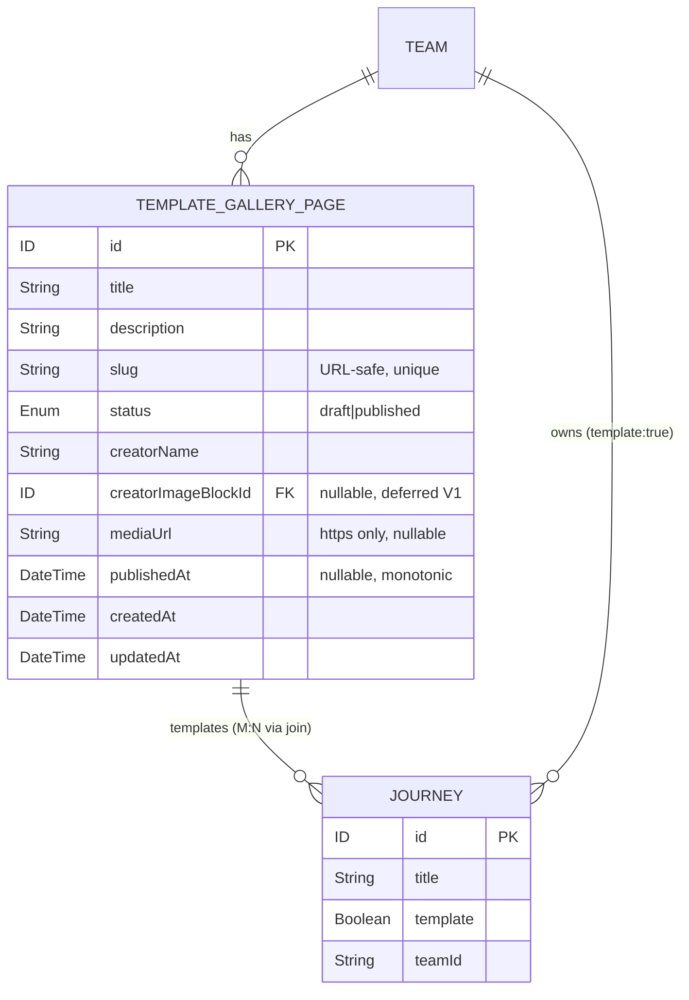

# NES-1539: Frontend publish flow for the Local Template Library

## Enhancement Summary

**Deepened on:** 2026-05-01
**Sections enhanced:** 9 (Approach, DnD wiring, Cache strategy, Edit dialog, Creator image picker, Publish/Unpublish/Ungroup, Risks, Acceptance Criteria, Backend dependencies)
**Reviewers run in parallel:** kieran-typescript-reviewer · julik-frontend-races-reviewer · architecture-strategist · code-simplicity-reviewer · security-sentinel · performance-oracle · spec-flow-analyzer · best-practices-researcher · framework-docs-researcher

### Key improvements

1. **Architecture pushback (HIGH severity):** the frontend single-membership invariant on top of an M:N backend is the worst architectural smell — coordinate with Siyang to add a server-side `templateGalleryPageMoveJourney(fromId, toId, journeyId)` mutation **and** a uniqueness business rule. Fixes #6 + #7 + #8 from the architecture review and removes the two-mutation drag entirely. **Track in "Backend dependencies (parent branch follow-ups)".**
2. **Race-condition hardening:** per-collection action lock (publish/unpublish/edit/ungroup all disabled while any of those is in flight for that card) + a single drag mutex (refuse `handleDragEnd` while any DnD mutation is in flight) + edit-dialog auto-close when its bound id is evicted from cache. Fixes 4 of the 5 most consequential race bugs.
3. **Type-safety upgrades:** `assertNever` on the `ContentType` switch · discriminated-union `DropZoneId` instead of `String(...).startsWith('collection:')` parsing · typed `optimisticResponse` with codegen-derived shapes · `creatorImageBlockId: string | null` (never `undefined`) in Formik · explicit `ReactElement` return on every component.
4. **Simplicity cuts (per Siyang's "build simply" directive):** drop `<CollectionCreatorImagePicker>`, `<CollectionUngroupDialog>`, `<UnsectionedTemplates>`, `<CollectionCardMenu>` as separate components — inline them. Drop the dedicated `slugWarning.ts` helper. Drop `@dnd-kit/sortable`. Drop `enableReinitialize` on Formik. Drop Storybook stories from V1 (optional per AGENTS.md). Drop the read-only-edit-dialog branch — when published, just disable the Edit menu item with a tooltip.
5. **Performance fixes (V1):** memoize `unsectionedTemplates` derivation with a `Set` + a `templateId → Collection` `Map` for O(1) drag-source lookup (10× reduction at stated scale). Drop `enableReinitialize` to prevent Formik wiping unsaved edits during background DnD writes.
6. **Security tightenings:** match backend `SLUG_PATTERN` exactly in Yup · parse `mediaUrl` via `new URL()` (not regex) · gate public-URL render on the **network-confirmed** publish result, not the optimistic flip · add a "Change slug?" confirmation dialog when changing the slug on a previously-published collection · backend follow-up to reject updates on published collections (mirror publish's atomic predicate).
7. **DnD configuration explicit:** `collisionDetection={closestCenter}` (matches in-repo `DragDropWrapper.tsx:124` precedent) · use `data-no-dnd` attributes on 3-dot menu buttons to avoid swallowing taps on touch · `accessibility={{ announcements: ... }}` for keyboard a11y · disable all draggable handles when `activeTemplateId != null` to avoid menu-during-drag collisions.
8. **Edit-dialog hardening:** discard-changes confirmation when `formik.dirty` and user clicks close · `getDirtyValues(values, initialValues)` mapper using `lodash.isEqual` to compute the diff payload (Yup cannot express tri-state `undefined leaves alone, null clears`) · re-populate slug from server-canonical response after save (server `slugify`'s the input).
9. **Spec-flow gaps closed:** empty-state copy, publish-disabled-when-empty, snackbar copy table with Undo-on-unpublish, mutation-button disabled-while-in-flight, save spinner, validateOnBlur on slug, title truncation, cold-load tab selection, accessibility announcements, archived-template filter, retry button on DnD error.

### New considerations discovered

- **MUI version mismatch in plan headers:** repo is on **MUI v7.1.1**, not v5. Dialog/TextField APIs the plan uses are stable v5→v7 — no implementation impact, but plan headers were corrected.
- **`@dnd-kit/sortable` is unnecessary for V1.** Cross-container DnD only needs `@dnd-kit/core`'s `useDraggable` + `useDroppable`. `sortable` is for within-list reordering, deferred to V2.
- **dnd-kit v6 vs v7 docs trap:** Context7's dndkit page returns v7 (`@dnd-kit/react` with `DragDropProvider`); repo is on v6.3.1 (`@dnd-kit/core` with `<DndContext>`). Authoritative reference is the in-repo `DragDropWrapper.tsx`, not Context7.
- **Backend follow-ups expanded** from 2 items to 5: `templateGalleryPageUnpublish`, `creatorImageSrc` input, `templateGalleryPageMoveJourney`, "reject update on published collections", server-side length caps. See "Backend dependencies".

---

## Overview

Add a new tab in `apps/journeys-admin` — **"Collections"** (alongside the existing "Projects" and "Templates" tabs) — that lets a team admin group team templates into `TemplateGalleryPage` entities ("collections"), drag templates into them, edit each collection's metadata in a modal, publish (or unpublish) the public-facing gallery page, and "ungroup" (hard-delete) a collection while returning its templates to the flat list.

The backend (NES-1547) is already implemented on the parent branch and exposes `templateGalleryPageCreate / Update / Publish / Delete` mutations and a `templateGalleryPages(teamId)` query. This ticket is **frontend-only** and wires those operations to a new UI surface — **plus** one small backend follow-up: a new `templateGalleryPageUnpublish(id)` mutation (see "Backend dependencies" below).

## Approach (revised per Siyang)

> **Architectural decision (2026-05-01):** Build the entire collections UI as a **brand-new tab + tab panel** alongside the existing `Templates` tab. **Do not modify** the existing templates tab content. This avoids polluting `JourneyListContent` with feature-specific branches and keeps the new feature isolated and easy to revert.
>
> **No LaunchDarkly flag for now.** Siyang will add the `templateGalleryPage` flag next week as a thin wrapper around the new tab's visibility (gate the `contentTypeOptions[2]` entry and the `TabPanel`). The plan below leaves a single, obvious gating point so adding the flag is a one-line change.

The tab:
- Tab label: **"Collections"** (compact: `t('Collections')`; mobile: same).
- URL: `/?type=collections`.
- `ContentType` union extended: `'journeys' | 'templates' | 'collections'`.
- Tab is suppressed in **Shared With Me** mode (consistent with existing tabs — `JourneyListView` already forces `?type=journeys` when `activeTeam === null`).

## Research Insights & Refinements

This section consolidates findings from the parallel review pass. Where it conflicts with earlier sections, **this section wins** — original sections were preserved for traceability but the implementation should follow the refinements below.

### A. Type safety (kieran-typescript-reviewer)

- **`ContentType` switch must be exhaustive.** Use a `switch (contentType) { case 'journeys': ... case 'templates': ... case 'collections': ... default: assertNever(contentType) }` in `JourneyList.renderList`, not the `if (contentType === 'collections') return <X />; return <Y />` form. Add `function assertNever(x: never): never { throw new Error(...) }` to `apps/journeys-admin/src/libs/assertNever/`.
- **Drag-id encoding is a discriminated union, not string-prefix parsing.**
  ```ts
  type DropZoneId =
    | { kind: 'unsectioned' }
    | { kind: 'collection'; id: string }
  function encodeDropZoneId(z: DropZoneId): string { return z.kind === 'unsectioned' ? 'unsectioned' : `collection:${z.id}` }
  function parseDropZoneId(raw: UniqueIdentifier): DropZoneId | null { /* ... */ }
  ```
  `handleDragEnd` switches on the parsed `kind`. No more `String(over.id)` + `.replace('collection:', '')`.
- **Optimistic responses are typed with `satisfies`.** Each `optimisticResponse` payload is constrained to the codegen-derived `TemplateGalleryPageUpdateMutation['templateGalleryPageUpdate']` shape. Every nested object (`templates[]`, `creatorImageBlock`) includes `__typename` — Apollo silently rejects optimistic data missing `__typename` and falls back to the network response, defeating the optimism.
- **Formik field shape is `string | null` for nullable fields.** Never `undefined`. `initialValues` is `''` becomes `null` for empty inputs. The submit-time diff converts unchanged values to `undefined` (omits from payload) and explicitly-emptied values to `null` (clears server-side).
- **Yup cannot express the tri-state `undefined leaves alone, null clears`.** Add a `getDirtyValues(values, initialValues, isEqual)` helper (using `lodash.isEqual` for nested object fields) in the dialog file. Yup validates the form's *current* state; the helper produces the wire payload. Unit-test the helper directly.
- **`process.env.NEXT_PUBLIC_JOURNEYS_URL` is `string | undefined`.** Wrap in a typed helper `function buildPublicGalleryUrl(slug: string): string` that throws at module load if the env var is missing. Single source of truth for the future NES-1552 swap.
- **Codegen-derived fragments only.** The `cache.modify` create-path uses the fragment from `__generated__/GetTemplateGalleryPagesQuery` — no inline `gql\`fragment ...\`` literals.
- **All new components declared `function X(props: XProps): ReactElement`.** Per `apps/journeys-admin/AGENTS.md`. No `JSX.Element`, no implicit returns.

### B. Race conditions & DOM lifecycle (julik-frontend-races-reviewer) — most consequential

The five concrete race bugs to fix in V1:

1. **Stale-closure on inter-collection drag (silent data loss).** `handleDragEnd` reads `target.templates.map(t => t.id)` from a closed-over `collections` array. Between the source-remove `await` and the target-add, an external cache write can change `target.templates`. Sending the closed-over `journeyIds` then REPLACES the target collection's join with stale data, dropping any concurrent additions. **Fix:** read the target's `templates` from Apollo cache (`client.cache.readFragment`) immediately before issuing the second mutation, not from the closure.
2. **Inter-drag race (concurrent `journeyIds` REPLACE).** Two `handleDragEnd` invocations against the same collection can clobber each other. **Fix:** a single drag mutex — `isDragMutationInFlight` boolean state. Refuse `handleDragEnd` while one is in flight (or queue the next op behind `.finally()`).
3. **Out-of-order publish/unpublish responses (UI lies for seconds).** Apollo merge order on the client is not monotonic. **Fix:** a per-collection action lock — `mutatingCollectionIds: Set<string>` — that disables Publish, Unpublish, Edit, and Ungroup on a card while any of those mutations is in flight for that card.
4. **Cache eviction crashes the open Edit dialog.** `cache.evict` invalidates references; the dialog's `useQuery` returns `null` and `initialValues.title` reads from undefined. **Fix:** in `<CollectionDialog>`, treat `data == null && previouslyHadData` as deletion — auto-close via `useEffect` and snackbar `t('This collection was removed.')`. Top-of-component guard: `if (mode === 'edit' && collection == null) return null`.
5. **Touch sensor + 3-dot menu collision.** TouchSensor's 200ms activation captures the tap before the IconButton's `onClick`. **Fix:** add `data-no-dnd` attribute to all in-card interactive elements (3-dot button, menu items, Publish/Unpublish CTAs); custom sensor `activationConstraint` predicate ignores events whose `target` matches `[data-no-dnd], button, [role="menuitem"]`. Or wrap with `<div onPointerDown={(e) => e.stopPropagation()}>`.

Also: **`cache.modify` filter must run before `cache.evict`** (preserves the canonical `useMenuBlockDeleteMutation` ordering — flipping invites dangling refs and "Cache data may be lost" warnings).

### C. Architecture pushback (architecture-strategist)

The single concern worth blocking on (severity HIGH): **the frontend single-membership invariant on top of an M:N backend.** Three compounding issues, one root cause:

- The invariant is not server-enforced; concurrent admins or API clients can multi-place a template.
- The two-mutation drag exists only because the backend has no atomic "move" operation.
- The "unsectioned templates" derivation exists only because the backend has no equivalent query.

**Recommend (coordinate with Siyang):** add three backend touchups to the parent branch alongside the already-planned `templateGalleryPageUnpublish` and `creatorImageSrc`:

- `templateGalleryPageMoveJourney(fromId: ID, toId: ID, journeyId: ID!): MoveResult!` — atomic, transactional. Collapses the two-mutation drag to one round-trip; eliminates the orphan-on-partial-failure risk; eliminates 60% of the race-condition complexity.
- A unique business rule (or partial unique index) on `(journeyId)` per team across `templateGalleryPageTemplate`.
- Optional: `templatesNotInAnyGalleryPage(teamId)` query (or a `notInGalleryPage: Boolean` filter on the existing query) to push the "unsectioned" derivation server-side. (Lower priority; client-side derivation is fine for V1.)

If the backend changes are off the table for V1, document the invariant prominently in `<TemplateGalleryPageList>`'s header and add an integration test that fails if `templateGalleryPages(teamId)` ever returns the same template id in two collections.

Also: **drop the `<CollectionCreatorImagePicker>` wrapper** (it's a thin pass-through that defers the same cross-tree coupling problem one file deeper). Inline the dynamic `<ImageLibrary>` import in `CollectionDialog.tsx`. File a follow-up to lift `<ImageLibrary>` into a shared lib (benefits 5 consumers, not just this one).

### D. Simplicity cuts (code-simplicity-reviewer) — apply per Siyang's "build simply"

Components to **inline rather than extract** in V1:

- `<CollectionCreatorImagePicker>` → inline `dynamic(() => import('.../ImageLibrary'))` in `CollectionDialog.tsx` (3 props, no wrapper logic).
- `<CollectionUngroupDialog>` → inline as a `<Dialog>` inside `CollectionCard` under `useState<boolean>` for `ungroupOpen`. The card already has the collection in scope.
- `<UnsectionedTemplates>` → inline as a `<Box ref={setNodeRef}>` with one `useDroppable({id:'unsectioned'})` call inside `TemplateGalleryPageList.tsx`.
- `<CollectionCardMenu>` → inline as a `<Menu>` block at the bottom of `CollectionCard.tsx` (3 menu items, no reuse).

Other cuts:

- **Mutation hooks** — keep five separate hook directories per the AGENTS.md naming pattern (Style B); skip the "merge into one file" alternative the simplicity reviewer floated. The directory boilerplate is small and the team's convention is unambiguous.
- **`cache.modify` + `cache.evict` + `cache.gc` for delete** — keep this approach (canonical, optimistic, snappy). `refetchQueries: ['GetTemplateGalleryPages']` was offered as a simpler V1, but the cache-surgery pattern is the existing precedent and the optimistic UX is worth the 25 LOC.
- **Three creator-image persistence strategies** — collapsed to: "Backend will accept `creatorImageSrc: String` on Create/Update inputs (Siyang to confirm). Frontend builds against this assumption; if the schema lands differently, only `CollectionDialog`'s onChange handler needs revision." Strategies (2) and (3) explicitly forbidden.
- **Read-only edit dialog + inline Unpublish CTA** — replaced with simpler "When the collection is published, the Edit menu item is disabled with a tooltip `Unpublish to edit`." Unpublish lives only in the card menu. No dialog opens, no banner renders, no read-only branch exists.
- **`@dnd-kit/sortable`** — drop. V1 only uses `useDraggable` + `useDroppable` from `@dnd-kit/core`. Add `sortable` only when within-collection reordering ships (V2).
- **`KeyboardSensor`** — keep registered (per `.claude/rules/frontend/apps.md` a11y requirement on interactive elements), but pair with proper `accessibility={{ announcements }}` config — partial implementation is worse than none. See section G below for details.
- **Storybook stories** — drop from V1. `AGENTS.md:28` marks them optional and several existing dialogs (e.g. `DeleteJourneyDialog`) ship without. Spec coverage covers the logic. **Reverse if the team has a strict story-coverage policy.**
- **Slug live-URL preview + copy button + dedicated `slugWarning.ts` helper** — drop. Just `<TextField helperText={t('Changing the slug breaks existing public links.')} />`. The copy button on the published-card public URL stays (it's the actual user-facing action).
- **Conditional draft/published Ungroup body copy** — keep one paragraph: _"Ungrouping dissolves this collection. Templates inside return to the flat list. Any public URL will return 404."_ The second sentence is harmless when the collection was never published.

### E. Security tightenings (security-sentinel)

Frontend changes for V1:

1. **Match backend `SLUG_PATTERN` exactly** in Yup: `/^[a-z0-9]+(-[a-z0-9]+)*$/` (rejects leading/trailing/consecutive hyphens). Source the regex + reserved words from a single shared constants module. Pre-block `RESERVED_SLUGS` via `.notOneOf([...])`.
2. **`mediaUrl` validation parses with `new URL()`**, not just `^https://`. Reject hosts matching `localhost`, `*.localhost`, IPv4 literals, IPv6 literals, and `.local` suffixes (defense-in-depth — backend should mirror).
3. **Public URL render gates on the network-confirmed publish result**, not the optimistic flip. Detect optimistic responses (Apollo's internal `__optimistic` flag, or compare against `useMutation`'s `loading` state). Until confirmed, render a "Publishing…" indicator instead of the URL+copy button.
4. **Slug-rename confirmation when slug field is dirty AND `publishedAt != null`.** A second `<Dialog>` titled _"Change slug?"_ with body _"The old URL `https://…/{previousSlug}` will return 404. Existing links break."_ — not just helperText.
5. **After mutate, repopulate the slug field from the server-canonical response.** Backend's `slugify(input, { lower: true, strict: true })` may transform the user's input. The dialog must show the canonical form before closing or the user shares a non-functional URL.

Backend follow-ups (parent branch — Phase 0):

6. **Validate `creatorImageSrc` if strategy (1) is adopted** — `assertHttpsUrl(creatorImageSrc, 'creatorImageSrc')` plus a host allowlist limited to `imagedelivery.net`.
7. **Reject `templateGalleryPageUpdate` on published collections.** Mirror publish's atomic predicate: `updateMany where: { id, status: 'draft' }`. "Published is immutable" must be server-enforced, not just frontend-gated.
8. **Length caps on `title`/`description`/`creatorName`/`mediaUrl`** in Pothos input `validate` (mirror client Yup limits).
9. **Tighten `mediaUrl` host validation** to reject literal-IP and `.local`/`localhost` hosts (mirror frontend).
10. **Collapse `SlugTakenError` and `SlugReservedError` into `SlugUnavailable`** to remove a cross-team enumeration oracle.

### F. Performance fixes (performance-oracle) — top 2 V1 changes

1. **Memoize the unsectioned-templates derivation** with a `Set` and a parallel `templateId → Collection` `Map`:
   ```ts
   const collectedIds = useMemo(
     () => new Set(collections.flatMap((c) => c.templates.map((t) => t.id))),
     [collections]
   )
   const templateIdToCollection = useMemo(() => {
     const m = new Map<string, TemplateGalleryPage>()
     for (const c of collections) for (const t of c.templates) m.set(t.id, c)
     return m
   }, [collections])
   const unsectioned = useMemo(
     () => allTemplates.filter((t) => !collectedIds.has(t.id)),
     [allTemplates, collectedIds]
   )
   ```
   `handleDragEnd`'s source-collection lookup becomes `templateIdToCollection.get(templateId)` — O(1), not O(N×M). At 100 templates × 10 collections this drops from ~10 000 ops/render to ~300, and re-derives only when `collections` or `allTemplates` reference-change.
2. **Drop `enableReinitialize` on the Formik in `<CollectionDialog>`.** Background DnD writes return new `templateGalleryPages` references on every cache notification, blowing away unsaved typing in the dialog. **Fix:** snapshot `initialValues` once on dialog open, keyed only on `collection?.id`:
   ```ts
   const initialValues = useMemo(() => buildInitialValues(collection), [collection?.id])
   // omit enableReinitialize entirely
   ```

Other performance items (verified; no V1 action):

- Apollo `cache.modify` re-render scope is bounded to one parent subscriber (the page), not 10 cards. Adding per-card `useQuery` would be strictly worse. Don't.
- Optimistic response construction is O(K) (K = templates in the affected collection); no N×M risk.
- dnd-kit at 50–100 cards stays at 60fps on mid-tier hardware. Add `React.memo` on `<TemplateCard>` keyed on `template.id + isDragOverlay` and skip virtualization until > 200 templates.
- `<ImageLibrary>` chunk is correctly deduped via the `webpackChunkName: "Editor/ImageLibrary/ImageLibrary"` magic comment. Re-verify the import path string at implementation time (build-error guard, not a perf bug).
- `useAdminJourneysQuery` is a cache-hit on tab switch (default `cache-first`).
- Storybook stories don't ship to prod. (Skipped from V1 anyway per simplicity cuts.)
- `templateGalleryPages(teamId)` becomes noticeable past ~50 collections (~350ms wire). Cursor pagination is the V3 follow-up.

### G. Drag-and-drop configuration explicit (best-practices + framework-docs)

- **`collisionDetection={closestCenter}`** — matches the in-repo precedent at `DragDropWrapper.tsx:124`. Best-practices research suggested `closestCorners` for stacked Kanban-style zones; we accept `closestCenter` for repo consistency. Composed `pointerWithin → closestCenter` fallback is **not needed for V1** (KeyboardSensor uses its own coordinate path).
- **Sensors:** `MouseSensor({distance: 8})`, `TouchSensor({delay: 200, tolerance: 5})`, `KeyboardSensor` — all per `DragDropWrapper.tsx:63-68` precedent.
- **Each in-card interactive element gets `data-no-dnd`** so the sensor `activationConstraint` predicate ignores events that originate on those targets:
  ```ts
  const shouldHandleEvent = ({ event }: { event: { target: EventTarget | null } }) =>
    !(event.target instanceof Element && event.target.closest('[data-no-dnd], button, [role="menuitem"]'))
  ```
  Apply via `MouseSensor` and `TouchSensor` activation constraints.
- **`<DragOverlay>` stays mounted at all times.** Conditionally render only its children (`<DragOverlay>{activeId ? <TemplateCard isDragOverlay /> : null}</DragOverlay>`). Don't toggle the overlay component itself — that breaks drop animations.
- **`accessibility.announcements`** explicit config:
  ```ts
  accessibility={{
    announcements: {
      onDragStart: ({ active }) => t('Picked up template {{ id }}', { id: active.id }),
      onDragOver: ({ active, over }) => over ? t('Template hovering over {{ zone }}', { zone: zoneLabel(over.id) }) : t('Template no longer over a drop zone'),
      onDragEnd: ({ active, over }) => over ? t('Template dropped on {{ zone }}', { zone: zoneLabel(over.id) }) : t('Drag cancelled'),
      onDragCancel: () => t('Drag cancelled')
    }
  }}
  ```
  Each drop zone is `tabIndex={0}` with `aria-label={t('Drop here to add to {{ collectionTitle }}', ...)}`. Keyboard flow: Tab to a `<TemplateCard>` → Space to lift → arrow keys to navigate → Space to drop → Escape to cancel.
- **Disable all drags while a drag is in flight.** `useDraggable({ disabled: activeTemplateId != null && activeTemplateId !== template.id })` to prevent picking up a second card mid-drag.

### H. Edit dialog hardening (best-practices + spec-flow)

- **Discard-changes confirmation.** Intercept `onClose`; if `formik.dirty && reason !== 'submit'`, show a secondary `<Dialog>` _"Discard unsaved changes?"_ (Cancel / Discard). Filter `reason === 'backdropClick' && formik.dirty` to ignore stray backdrop clicks entirely. Pattern: standard MUI community recipe; not built-in. Reuse the same modal for both Create and Edit dialogs.
- **`getDirtyValues(values, initialValues)` mapper using `lodash.isEqual`.** Built once in the dialog file; unit-tested directly. Maps unchanged → `undefined` (omit), explicitly-emptied → `null` (clears server-side).
- **Slug field uses `validateOnBlur` (not validateOnChange).** Avoids per-keystroke regex errors on transitional inputs like `my new` while typing `my-new-collection`.
- **Save button binds to `isSubmitting`.** Spinner replaces the label; button disabled; dialog `onClose` no-ops while submitting (mirror `TeamUpdateDialog.tsx:158-180` precedent).
- **Re-populate slug from server response.** After `templateGalleryPageUpdate` resolves, the dialog reads the canonical slug from the returned row before closing — server's `slugify()` may have transformed the user's input.
- **Field error mapping from GraphQL errors.** In the `onSubmit` catch, parse `error.graphQLErrors[0].extensions.field` and call `helpers.setFieldError(field, message)`. Field names match Formik state keys.

### I. Spec-flow gaps closed (spec-flow-analyzer)

Adding to "Acceptance Criteria → Functional Requirements":

- Empty states: separate copy + CTAs for (no templates, no collections) / (has templates, no collections) / (all templates collected).
- **Publish disabled (with tooltip) when `templates.length === 0`.** Don't allow publishing an empty collection.
- All 3-dot menus on `<TemplateCard>` and `<CollectionCard>` render `disabled` and `aria-disabled='true'` while `activeTemplateId != null`.
- All mutation-triggering buttons (Publish, Unpublish, Ungroup confirm, Save) disable on click and remain disabled until the mutation settles. Spec: simulating two rapid clicks fires exactly one mutation.
- Snackbar copy table:

  | Action | Success | Error | Undo? |
  |---|---|---|---|
  | Create | _"Collection created"_ | _"Couldn't create collection"_ | No |
  | Update | _"Collection updated"_ | _"Couldn't save changes"_ | No |
  | Publish | _"Collection published"_ | _"Couldn't publish"_ | No |
  | Unpublish | _"Collection unpublished"_ | _"Couldn't unpublish"_ | **Yes** (10s, re-publishes) |
  | Ungroup | _"Collection ungrouped"_ | _"Couldn't ungroup"_ | No (modal already confirmed) |
  | DnD move | _"Moved {{title}} to {{collection}}"_ | _"Couldn't move {{title}} to {{collection}}"_ + Retry | Retry |

- Card title truncates to 2 lines (`WebkitLineClamp: 2`) with full title via `<Tooltip>`. `direction="auto"` for RTL.
- Cold-load on `/?type=collections` selects the third Tab on first paint without flicker.
- Filter `useAdminJourneysQuery` results to `template === true && status === 'published'`; archived/trashed templates are not draggable and not displayed in the unsectioned pool.
- Unsectioned pool has `max-height: 60vh; overflow-y: auto`; dnd-kit's `autoScroll` modifier is registered for drag-near-edge auto-scroll.
- Keyboard-only completion of every flow (create, edit, drag, publish, unpublish, ungroup) verified by manual a11y test in the PR description.

### J. Phase 0 dependency hygiene (architecture-strategist)

**Hard-block the merge order:** Phase 0 backend additions must land on `siyangcao/nes-1547-backend-template-gallery-page-api` **before** the frontend PR opens for review. Frontend rebases to pick up the schema, then writes hooks against real generated types — **no placeholder hooks**, no hand-rolled `gql.tada` shims, no `any` casts to silence codegen failures. The "frontend can begin against placeholder hooks" framing of earlier drafts has been removed; only the small frontend stubs that don't reference `templateGalleryPageUnpublish` or `creatorImageSrc` can ship in parallel.

---

## Problem Statement / Motivation

Teams want to publish curated subsets of their templates as a public gallery page (eventually consumed by the public route built in NES-1552). Today, templates exist only as a flat list scoped to the JFP team-managed gallery. Local teams cannot:
1. Group their own templates into themed collections.
2. Add metadata (title, description, creator name + image, media URL) suitable for a public landing page.
3. Publish a stable slug-addressable gallery URL.

This ticket delivers (1)–(3) as a frontend layer over the NES-1547 API. NES-1538, NES-1552, and NES-1608 (right-panel help, public gallery, "Use Template" deep link) are explicitly **out of scope**.

## Proposed Solution

### High-level flow

```
[Collections tab]
 ├─ Header: "Create Collection" button + active team name
 ├─ Collections row(s):
 │   ├─ <CollectionCard /> (drop target, useDroppable)
 │   │   ├─ collection metadata strip (title, status pill, public URL if published, 3-dot menu)
 │   │   └─ contained <TemplateCard />[] (each useDraggable)
 │   └─ ... one card per TemplateGalleryPage
 └─ "All Templates" droppable:
     └─ <TemplateCard />[] for templates not in any collection (each useDraggable)

Dialogs (mounted at <CollectionsList> top level):
 ├─ <CollectionDialog mode="create"|"edit" />
 └─ <CollectionDeleteDialog /> (used for hard-delete + "unpublish")
```

### Single-membership invariant — server-enforced via `templateGalleryPageAssignJourney`

Per Siyang's update (2026-05-01), the backend now exposes:

```graphql
templateGalleryPageAssignJourney(journeyId: ID!, pageId: ID): TemplateGalleryPage!
```

`pageId == null` returns the journey to the flat list (unassigns). The mutation is atomic, transactional, and **enforces single-membership server-side** — the frontend no longer fakes the invariant on top of an M:N backend. Every drag fires exactly one mutation:

| Drop scenario | Mutation call |
|---|---|
| Unsectioned → collection X | `assignJourney({ journeyId, pageId: X })` |
| Collection A → collection B | `assignJourney({ journeyId, pageId: B })` (server moves it atomically) |
| Collection A → unsectioned | `assignJourney({ journeyId, pageId: null })` |

`unsectionedTemplates` is still derived client-side as `allTemplates − flatten(collections.templates)` (with the Set-based memoization from Research Insights → F.1). The two-mutation pattern, the inter-drag race mitigations, and the saga-rollback discussion are now obsolete.

Published collections remain immutable in the UI: cards inside are non-draggable; the collection itself is not a drop target. Backend may or may not enforce this on `assignJourney` — verify and fall through to the optimistic-rollback pattern if it doesn't.

### Publish lock

A `TemplateGalleryPage` with `status === 'published'` is treated as immutable in the UI. Specifically:
- Cards inside are non-draggable (`useDraggable({ disabled: true })`); the card wraps with `<Tooltip title={t('Published — unpublish to edit')} />`.
- The collection itself is not a drop target (`useDroppable` returns `disabled: true`).
- The "Edit" menu item opens the dialog in **read-only mode** with a banner: _"This collection is published. Unpublish to edit."_ and a single inline **Unpublish** button (which calls the new `templateGalleryPageUnpublish` mutation, no confirmation). After unpublishing, the dialog re-renders in normal edit mode against the same id without closing — UX is one click and a state flip.

### Publish / Unpublish / Ungroup — three separate actions

Per Siyang's update (2026-05-01), the destructive surface is split into **two distinct buttons** with non-overlapping semantics:

| Action | Status before → after | Backend call | Public URL effect | Confirmation? |
|---|---|---|---|---|
| **Publish** | `draft` → `published` | `templateGalleryPagePublish(id)` (existing) | URL goes live | No |
| **Unpublish** | `published` → `draft` | `templateGalleryPageUnpublish(id)` _(**new — backend dependency**)_ | URL returns 404; collection + templates preserved | No (one click; toast confirms) |
| **Ungroup** | any → entity deleted | `templateGalleryPageDelete(id)` (existing) | URL returns 404; templates return to the flat "All Templates" list | **Yes** (full modal) |

Button visibility per state:
- **Draft collection card menu:** `Publish`, `Edit`, `Ungroup`.
- **Published collection card menu:** `Unpublish`, `Edit (disabled — Unpublish to edit)`, `Ungroup`.

"Ungroup" copy (modal): _"Ungroup this collection?"_ Body: _"This dissolves the collection — templates inside return to the flat list. {{publishedAddon}}"_ where `publishedAddon` is _"The public URL `https://…/collections/<slug>` will return 404."_ when the collection was published, otherwise empty. Submit button label: `Ungroup`.

> **Backend dependency: `templateGalleryPageUnpublish(id)` mutation.** The parent branch (NES-1547) only exposes a one-way `templateGalleryPagePublish` (atomic, monotonic). Splitting "Unpublish" from "Ungroup" requires a new mutation that flips `status: published → draft`. Suggested shape (mirrors `templateGalleryPagePublish`):
>
> - Auth: `isInTeam(teamId)` (same pattern as the publish/delete mutations).
> - Atomic via `updateMany({ where: { id, status: 'published' }, data: { status: 'draft' } })`.
> - **Open question for backend:** preserve `publishedAt` (so the original publish timestamp is retained for analytics) or null it out? **Plan recommends preserving** — `publishedAt` becomes "last-published" history. Frontend treats `status === 'draft' && publishedAt != null` as "previously published" if we ever need to surface that.
> - Idempotent re-unpublish: skip the SQL if already draft.
> - Error mapping: same NOT_FOUND / FORBIDDEN shape as siblings.
>
> This mutation is **a small addition to the parent branch** (≈40 lines + spec, mirroring the publish file). Coordinate with Siyang to land it on `siyangcao/nes-1547-backend-template-gallery-page-api` _before_ merging this PR. The frontend hook (`useTemplateGalleryPageUnpublishMutation`) is included in the file layout below; if the backend isn't ready when frontend lands, gate the Unpublish button on the mutation existing in the schema (typed-codegen fail will catch it).

## Technical Approach

### File layout

> **Note:** the layout below is the original structure. Per "Research Insights → D" (simplicity cuts), the implementer should **inline** `<CollectionUngroupDialog>`, `<CollectionCreatorImagePicker>`, `<UnsectionedTemplates>`, and `<CollectionCardMenu>` into their parent components — keeping the file count to ~6 components instead of 10. The file list is preserved for traceability.

```
apps/journeys-admin/src/components/TemplateGalleryPageList/
├── index.ts
├── TemplateGalleryPageList.tsx          # top-level: queries + DndContext + layout
├── TemplateGalleryPageList.spec.tsx
├── TemplateGalleryPageList.stories.tsx
├── data.ts                               # test fixtures: getCollectionsMock, etc.
├── CollectionCard/
│   ├── index.ts
│   ├── CollectionCard.tsx                # one collection (useDroppable + child template cards)
│   ├── CollectionCard.spec.tsx
│   └── CollectionCardMenu/               # 3-dot: Edit, Publish/Unpublish, Delete
│       ├── index.ts
│       ├── CollectionCardMenu.tsx
│       └── CollectionCardMenu.spec.tsx
├── CollectionDialog/
│   ├── index.ts
│   ├── CollectionDialog.tsx              # create + edit (mode prop), Formik + Yup
│   ├── CollectionDialog.spec.tsx
│   └── slugWarning.ts                    # helper: "Changing slug breaks public links"
├── CollectionUngroupDialog/
│   ├── index.ts
│   ├── CollectionUngroupDialog.tsx       # confirmation modal for hard-delete (a.k.a. "Ungroup")
│   └── CollectionUngroupDialog.spec.tsx
├── CollectionCreatorImagePicker/
│   ├── index.ts
│   ├── CollectionCreatorImagePicker.tsx  # thin wrapper over the editor's <ImageLibrary />
│   └── CollectionCreatorImagePicker.spec.tsx
├── TemplateCard/
│   ├── index.ts
│   ├── TemplateCard.tsx                  # thin adapter: useDraggable + existing JourneyCard
│   └── TemplateCard.spec.tsx
└── UnsectionedTemplates/
    ├── index.ts
    ├── UnsectionedTemplates.tsx          # the "All Templates" droppable zone
    └── UnsectionedTemplates.spec.tsx

apps/journeys-admin/src/libs/
├── useTemplateGalleryPagesQuery/
│   ├── useTemplateGalleryPagesQuery.ts
│   ├── useTemplateGalleryPagesQuery.mock.ts
│   └── index.ts
├── useTemplateGalleryPageCreateMutation/
├── useTemplateGalleryPageUpdateMutation/
├── useTemplateGalleryPagePublishMutation/
├── useTemplateGalleryPageUnpublishMutation/    # backend landed
├── useTemplateGalleryPageDeleteMutation/
└── useTemplateGalleryPageAssignJourneyMutation/ # NEW — single-mutation drag
```

Naming follows `apps/journeys-admin/AGENTS.md` (`%UiType%%ComponentFunction%`, custom hook `use{Action}{Resource}{Suffix}`).

### Tab integration touchpoints (small, surgical edits)

1. `apps/journeys-admin/src/components/JourneyList/JourneyListView/JourneyListView.tsx:21`
   ```ts
   export type ContentType = 'journeys' | 'templates' | 'collections'
   ```
2. `apps/journeys-admin/src/components/JourneyList/JourneyListView/JourneyListView.tsx:62-73` — append a third option:
   ```ts
   { queryParam: 'collections', displayValue: t('Collections'), tabIndex: 2 }
   ```
3. `apps/journeys-admin/src/components/JourneyList/JourneyListView/DisplayModes/TeamMode/TeamMode.tsx:62-110` — add a third `<Tab>` and a third `<TabPanel name="collections-content-panel" ...>` rendering `renderList('collections', selectedStatus)`. (When the LD flag lands, wrap **only** these two new JSX nodes with `{templateGalleryPage === true && (...)}` — that's the entire flag-gating change.)
4. `apps/journeys-admin/src/components/JourneyList/JourneyList.tsx:95-111` — extend `renderList` to branch on `contentType === 'collections'`:
   ```tsx
   if (contentType === 'collections') return <TemplateGalleryPageList />
   return <JourneyListContent ... />
   ```
5. `apps/journeys-admin/pages/index.tsx:36-37` — extend the local `ContentType` cast: `(router?.query?.type as 'journeys' | 'templates' | 'collections')`. Keep `showSidePanel` false for `'collections'`.

No other files in the existing templates tab tree are touched.

### GraphQL operations (typed via Apollo codegen)

All five live in `apps/journeys-admin/src/libs/use*` directories using Style B (extracted custom hook + `.mock.ts`) per `apps/journeys-admin/AGENTS.md:108-118`. Codegen fires via `pnpm dlx nx run journeys-admin:codegen` after each `gql` template addition.

```graphql
# useTemplateGalleryPagesQuery.ts
query GetTemplateGalleryPages($teamId: ID!) {
  templateGalleryPages(teamId: $teamId) {
    id
    title
    description
    slug
    status
    creatorName
    creatorImageBlock { id ... on ImageBlock { src alt } }
    mediaUrl
    publishedAt
    updatedAt
    templates { id title primaryImageBlock { id ... on ImageBlock { src alt } } }
  }
}

mutation TemplateGalleryPageCreate($input: TemplateGalleryPageCreateInput!) {
  templateGalleryPageCreate(input: $input) {
    id title description slug status creatorName mediaUrl
    creatorImageBlock { id ... on ImageBlock { src alt } }
    publishedAt updatedAt templates { id title }
  }
}

mutation TemplateGalleryPageUpdate($id: ID!, $input: TemplateGalleryPageUpdateInput!) {
  templateGalleryPageUpdate(id: $id, input: $input) {
    id title description slug status creatorName mediaUrl
    creatorImageBlock { id ... on ImageBlock { src alt } }
    updatedAt templates { id title }
  }
}

mutation TemplateGalleryPagePublish($id: ID!) {
  templateGalleryPagePublish(id: $id) {
    id status publishedAt updatedAt slug
  }
}

# NEW — depends on backend follow-up on the parent branch
mutation TemplateGalleryPageUnpublish($id: ID!) {
  templateGalleryPageUnpublish(id: $id) {
    id status publishedAt updatedAt
  }
}

mutation TemplateGalleryPageDelete($id: ID!) {
  templateGalleryPageDelete(id: $id) { id }
}
```

### Cache update strategy

- **Create** → `cache.modify` on `Query.templateGalleryPages({ teamId })` field, append a `writeFragment` ref. Pattern: `apps/journeys-admin/src/libs/useTeamCreateMutation/useTeamCreateMutation.tsx:46-65`.
- **Update** (metadata or `journeyIds`) → no `update()` callback needed; Apollo merges by `id` since `templateGalleryPage` returns the canonical row. Use `optimisticResponse` for snappy DnD (recompute the new `templates` array client-side).
- **Publish** → ditto; merge by id. `optimisticResponse` flips `status` and stamps a temporary `publishedAt: new Date().toISOString()`.
- **Unpublish** (NEW) → ditto; merge by id. `optimisticResponse` flips `status` back to `'draft'`. `publishedAt` left unchanged client-side (server decides; per "Backend dependencies" we recommend preserve).
- **Ungroup / Delete** (hard) → `cache.modify` filter to remove from the list + `cache.evict({ id: cache.identify({ __typename: 'TemplateGalleryPage', id }) })` + `cache.gc()`. Pattern: `apps/journeys-admin/src/libs/useMenuBlockDeleteMutation/useMenuBlockDeleteMutation.ts:36-58`. The previously-collected templates automatically re-appear in the `unsectioned` derivation since they're no longer in any collection.
- **Templates list** (the "All Templates" pool) → reuse the existing `useAdminJourneysQuery({ template: true, teamId })` rather than introducing a new query. `useAdminJourneysQuery` already exists at `apps/journeys-admin/src/libs/useAdminJourneysQuery/useAdminJourneysQuery.ts`.

### Drag-and-drop wiring

Library: `@dnd-kit/core` + `@dnd-kit/sortable` (already in repo at root `package.json`; reference impl at `apps/journeys-admin/src/components/Editor/Slider/Content/Canvas/DragDropWrapper/DragDropWrapper.tsx`).

Topology:
```
<DndContext onDragStart={...} onDragEnd={...} sensors={[Mouse,Touch,Keyboard]}>
  <UnsectionedTemplates />            // useDroppable({ id: 'unsectioned' })
  <CollectionCard id="abc" .../>      // useDroppable({ id: 'collection:abc' })
  ...
  <DragOverlay>{activeTemplate && <TemplateCard isDragOverlay/>}</DragOverlay>
</DndContext>
```

**Drag id encoding:** drop zones use `unsectioned` and `collection:<id>` to make the source/target unambiguous in `handleDragEnd`. Draggable id is the bare `template.id`.

**`handleDragEnd` algorithm** (pseudocode — single-mutation per Siyang's update):
```ts
function handleDragEnd({ active, over }: DragEndEvent) {
  if (over == null) return
  const templateId = String(active.id)
  const target = parseDropZoneId(over.id) // typed: { kind: 'unsectioned' } | { kind: 'collection', id }
  if (target == null) return

  const sourceCollection = templateIdToCollection.get(templateId) // O(1) Map lookup
  const targetPageId = target.kind === 'collection' ? target.id : null

  // No-op
  if (sourceCollection?.id === targetPageId) return
  if (sourceCollection == null && targetPageId == null) return

  // UI guard: published collections are immutable
  if (sourceCollection?.status === 'published') return
  if (target.kind === 'collection') {
    const targetColl = collectionsById.get(target.id)
    if (targetColl?.status === 'published') return
  }

  // Single atomic mutation — backend enforces single-membership.
  await assignJourney({
    journeyId: templateId,
    pageId: targetPageId,
    optimisticResponse: buildAssignOptimisticResponse({ templateId, sourceCollection, targetPageId })
  })
}
```

Sensors for V1: `MouseSensor` (8px activation), `TouchSensor` (200ms / 5px). **`KeyboardSensor` is deferred to V2** per Siyang (2026-05-01) — V1 ships without keyboard DnD a11y. Cards are still keyboard-focusable for menu/dialog access; only the drag interaction is mouse/touch only.

### Edit dialog (`CollectionDialog`)

- Stack: `<Dialog>` from `@core/shared/ui/Dialog` + Formik + Yup. Pattern: `TeamUpdateDialog`, `JourneyDetailsDialog`, `SlugDialog` (see findings).
- Fields:

  | Field | Required | Validation | UI |
  |---|---|---|---|
  | `title` | yes (create + edit) | `string().required().max(100)` | TextField, autofocus on open |
  | `description` | no | `string().max(500)` | TextField multiline rows 3 |
  | `creatorName` | yes | `string().required().max(100)` | TextField |
  | `creatorImageBlockId` | no | block must belong to a team-owned Journey (server-side `validateCreatorImageBlock`) | **`<CollectionCreatorImagePicker />`** — thin wrapper around the existing `<ImageLibrary />` (see "Creator image picker — reuse" section below) |
  | `mediaUrl` | no | `string().matches(/^https:\/\//, t('Must be an https URL')).max(2048)` | TextField with `helperText="https://…"` |
  | `slug` | edit only | `string().matches(/^[a-z0-9-]+$/).max(100)` | TextField with **bold warning helperText** below: _"Changing the slug breaks existing public links to this collection."_ |
  | `journeyIds` | no | n/a | **Not in dialog** — managed via DnD only |

- On submit (create): call `templateGalleryPageCreate({ teamId, title, description, creatorName, mediaUrl })` → snackbar success → close.
- On submit (edit): call `templateGalleryPageUpdate(id, input)` with **only changed fields** (compute diff from `initialValues`). This respects the backend's `undefined leaves alone, null clears it` semantics.
- On error: surface backend `field` extension as Formik field error (`error.graphQLErrors[0].extensions.field` + message). Examples we know about: `slug` (collision), `mediaUrl` (https), `creatorImageBlockId` (foreign team).
- For **published** collections in edit mode: render a banner "This collection is published. Unpublish & delete to edit." instead of the form. Fields are not disabled — the form simply isn't rendered.
- Public URL preview: when `status === 'published'`, show `<Typography>{publicUrl}</Typography>` with a copy button. Public URL formula: `${process.env.NEXT_PUBLIC_JOURNEYS_URL}/collections/<slug>` — **placeholder until NES-1552 lands**; document the formula in a single constant so the future PR has one place to swap it.

### Creator image picker — reuse `<ImageLibrary />`

Per Siyang's update (2026-05-01), do **not** build a new image picker. Reuse the existing editor component at `apps/journeys-admin/src/components/Editor/Slider/Settings/Drawer/ImageLibrary/ImageLibrary.tsx` (the same component used by `ImageEdit`, `ImageSource`, `VideoBlockEditorSettingsPosterLibrary`, and `HostAvatarsButton`).

**Component contract** (verified at `ImageLibrary.tsx:42-86`):
```ts
interface ImageLibraryProps {
  variant?: 'drawer' | 'dialog'
  open: boolean
  onClose?: () => void
  onChange: (image: ImageBlockUpdateInput) => Promise<void>
  onDelete?: () => Promise<void>
  selectedBlock?: ImageBlock | null
  loading?: boolean
  showAdd?: boolean
  error?: boolean
}
```
The component is a UI shell over `<ImageBlockEditor>`; the consumer wires persistence in `onChange`. Pass `variant="dialog"` so it renders inside its own MUI Dialog (consistent with `HostAvatarsButton`'s pattern of opening the picker over the form).

**Reuse pattern (mirroring `HostAvatarsButton.tsx:14-20`):**
```tsx
const ImageLibrary = dynamic(
  async () => await import(
    /* webpackChunkName: "Editor/ImageLibrary/ImageLibrary" */
    '../../../Editor/Slider/Settings/Drawer/ImageLibrary'
  ).then((mod) => mod.ImageLibrary),
  { ssr: false }
)
```
This deduplicates the same chunk that the editor already lazy-loads — no double-shipping.

**The hard part — persistence path.** The backend constraint is server-enforced: `creatorImageBlockId` must reference a `Block` whose parent `Journey.teamId` equals the gallery page's `teamId` (see `apis/api-journeys-modern/src/schema/templateGalleryPage/validateCreatorImageBlock.ts:15-39`). `<ImageLibrary>` itself doesn't create blocks — its `onChange` returns an `ImageBlockUpdateInput` (`{ src, alt, blurhash, width, height }`). The consumer is responsible for translating that into a Block id.

There are **three viable persistence strategies**, and the right one is a **backend coordination decision with Siyang**:

1. **(Preferred) Extend the backend to accept a raw URL.** Add `creatorImageSrc: String` (and optionally `creatorImageAlt`, `creatorImageBlurhash`) to `TemplateGalleryPageCreateInput` / `UpdateInput`. The backend creates an `ImageBlock` parented to the `TemplateGalleryPage` itself (requires extending the `Block.journey` relation to be optional, or adding a new `Block.templateGalleryPageId` parent column). Frontend just hands over the URL — simplest UI, simplest mental model, no team-foreign-key footgun. Recommend this.
2. **Pick from existing team-owned ImageBlocks.** Hook `<ImageLibrary>` up with a "browse my team's images" mode. Requires a new query `teamImageBlocks(teamId)` and significant UX work for filtering large pools. **Not recommended for V1.**
3. **Frontend creates a Block under the first template in the collection.** Reuse the existing `imageBlockCreate(input: { journeyId, ... })` mutation, parenting the Block to `collection.templates[0].id`. Works with no backend changes, but is fragile: ungrouping templates orphans the Block; ordering changes the parent silently. **Not recommended.**

**Plan recommendation:** ship the UI now using strategy (1). Coordinate with Siyang to add `creatorImageSrc` to the backend Create/Update inputs on the parent branch. While that backend change is in flight, frontend can build against a placeholder mutation hook (`useTemplateGalleryPageUpdateMutation` extended to accept `creatorImageSrc`); flip to the typed-codegen output once the schema lands. Document the choice in the PR description so reviewers know why the schema diff exists.

> **Action item for Siyang (backend):** decide on persistence strategy. The plan recommends adding `creatorImageSrc: String` (+ optional `creatorImageAlt`, `creatorImageBlurhash`) to `TemplateGalleryPageCreateInput` / `UpdateInput` and parenting the auto-created `ImageBlock` to the `TemplateGalleryPage` row (extends the `Block` parent relation). If a different strategy is chosen, the frontend wrapper component is the only file that needs revision.

### Ungroup confirmation (`CollectionUngroupDialog`)

Mirror `apps/journeys-admin/src/components/JourneyList/JourneyCard/JourneyCardMenu/DeleteJourneyDialog/DeleteJourneyDialog.tsx`. Title: _"Ungroup this collection?"_

Body, conditional on prior status:
- **was draft:** _"This dissolves the collection. Templates inside return to the flat list."_
- **was published (or currently published):** _"This dissolves the collection. Templates inside return to the flat list. The public URL `https://…/collections/<slug>` will return 404."_

Submit button label: `Ungroup` (not "Delete"). Submit calls `templateGalleryPageDelete(id)` → optimistic remove from cache → snackbar `t('Collection ungrouped')` → close. The cache eviction triggers a re-derivation of the unsectioned templates list, automatically re-rendering the freed templates in the "All Templates" zone.

### State ownership

- The list of collections lives in Apollo cache (sourced from `templateGalleryPages` query).
- The list of templates lives in Apollo cache (`useAdminJourneysQuery`).
- The "selected collection for editing" is local React state in `<TemplateGalleryPageList>` (`useState<string | null>` for the collection id; the dialog is open when non-null).
- Drag overlay state (`activeTemplateId`) is local React state.
- **No global state, no useReducer, no zustand.** Keep simple per "designs not finalized."

### Snackbar / error handling

- Use the existing `useSnackbar` from `notistack` (`enqueueSnackbar` directly is acceptable per existing precedent in `TeamUpdateDialog`/`DeleteJourneyDialog`; the global wrapper note in `mobile-snackbar-blocking-ui-no-dismiss-button.md` is for new long-lived snackbars, not the per-action toasts here).
- Distinguish `ApolloError.networkError` vs GraphQL field errors when surfacing in the dialog (`TeamUpdateDialog.tsx:91-109` is the precedent).

### i18n

- Hook: `useTranslation('apps-journeys-admin')` (`apps/journeys-admin/AGENTS.md:122`).
- Keys are inline English strings: `t('Create Collection')`, `t('Add to {{ collectionTitle }}', { collectionTitle })`. **No** dotted/nested keys.
- After the PR: run `pnpm dlx nx run journeys-admin:extract-translations` to populate `libs/locales/en/apps-journeys-admin.json`.
- Tests: `import '../../../../test/i18n'` to bootstrap the namespace (path adjusted for nesting depth).

## System-Wide Impact

### Interaction graph

- New tab → triggers `useAdminJourneysQuery({ template: true, teamId })` (already cached if the user previously viewed Templates tab) and `useTemplateGalleryPagesQuery({ teamId })` (new).
- DnD → fires up to **two** `templateGalleryPageUpdate` mutations sequentially. Each mutation triggers a Pothos resolver that runs `filterToTeamTemplates` (NES-1547) and rebuilds the join table inside a transaction.
- Publish → fires `templateGalleryPagePublish`; idempotent on the backend. UI relies on the returned canonical row.
- Delete → fires `templateGalleryPageDelete`; cascade deletes join rows. UI evicts the cached entity and filters the list field.

### Error & failure propagation

- **Sequential DnD mutations partial failure.** Source-remove succeeds, target-add fails → template ends up "lost" in unsectioned (visually). Mitigation: (a) on second-mutation failure, fire a compensating mutation to re-add to source (saga-style rollback), or (b) accept the orphan and surface a snackbar prompting the user to retry. **Decision for V1: option (b)** with explicit error snackbar — saga rollback adds complexity for an edge case.
- **Optimistic response divergence.** If the server returns a different `templates` ordering than our optimistic guess (since `journeyIds` REPLACES and order is preserved), the UI flickers. Mitigation: derive optimistic templates from the same array we send (`journeyIds`), preserving order client-side.
- **Slug collision on update.** Surface as field error in dialog (Formik); user retries with a new slug.
- **Published-collection drag attempt** is a UI no-op (handlers early-return). Backend never sees the request.
- **Stale-cache after team switch.** `templateGalleryPages` query is keyed by `teamId`; Apollo refetches automatically on variable change.

### State lifecycle risks

- **Unsectioned templates view is computed (`allTemplates - flatten(collections.templates)`).** If the two queries race (collections returns before templates), the unsectioned set transiently includes already-collected templates. Mitigation: gate render on `loading === false` for both queries; show a skeleton during initial load.
- **Optimistic update on a published collection.** Cannot happen because handlers block dragging into/out-of published collections. Add a unit test asserting the early-return paths.
- **Duplicate-membership edge case.** If the backend ever changes to allow multi-membership, the frontend's "single collection per template" assumption breaks. Document this as a frontend-only invariant in the component header.

### API surface parity

- No mobile-specific surface for V1 (the prototype hides the side panel below `md`; we mirror — show only the cards grid, no side panel, no drag on touch is **rejected** since we want touch dnd via TouchSensor).
- No keyboard-only flow other than dnd-kit's KeyboardSensor — see "a11y" below.
- No deep-link to a specific collection (would be `/?type=collections&collection=<id>`); leave for a follow-up if PMs ask.

### Integration test scenarios

1. **Drag template from unsectioned → empty draft collection.** Expect single mutation, optimistic UI shows immediately, backend confirms, no flicker.
2. **Drag template between two draft collections.** Expect two mutations sequentially; both optimistic; final state shows template in target only.
3. **Open edit dialog → change title + slug → save.** Expect one mutation with both fields, dialog closes, card reflects new title; if slug changed, public URL string updates.
4. **Publish → public URL displayed → unpublish (delete confirmation) → confirm.** Expect status transition, publish mutation, then delete mutation; collection disappears from list; templates re-appear in unsectioned.
5. **Slug collision on update.** Mock backend returns `extensions: { code: 'CONFLICT', field: 'slug' }`; expect Formik field error; dialog stays open.

## Acceptance Criteria

### Functional Requirements

- [ ] New "Collections" tab visible alongside "Projects" and "Templates" tabs in `TeamMode` (not in `SharedWithMeMode`).
- [ ] Tab routes to `/?type=collections` and is selected when the URL matches.
- [ ] Collections tab renders all `TemplateGalleryPage`s for the active team via `templateGalleryPages(teamId)`.
- [ ] "All Templates" droppable shows team templates that are not in any collection (derived: `allTeamTemplates − flatten(collections.templates)`).
- [ ] "Create Collection" button opens `CollectionDialog` in create mode.
- [ ] Create dialog requires `title` + `creatorName`; allows `description`, `mediaUrl` (https-only validation client-side), `creatorImageBlock` via the reused `<ImageLibrary />` picker.
- [ ] Submitting create calls `templateGalleryPageCreate`, closes dialog, shows snackbar, and adds the new (empty, draft) collection at the top of the list.
- [ ] Each `CollectionCard` has a 3-dot menu with **Edit**, **Publish** (draft only) / **Unpublish** (published only), and **Ungroup**.
- [ ] Edit menu opens `CollectionDialog` in edit mode pre-filled with current values.
- [ ] On a published collection, Edit dialog renders a banner + inline **Unpublish** CTA instead of the form.
- [ ] Slug field renders a warning helperText explaining link breakage; only shown in edit mode.
- [ ] Drag a template from unsectioned to a draft collection → fires `templateGalleryPageUpdate`, template appears nested.
- [ ] Drag a template between two draft collections → fires two updates sequentially; template ends up in target only.
- [ ] Drag onto a published collection is blocked (no mutation, no visual feedback as drop target).
- [ ] Drag from a published collection is blocked (cards inside are non-draggable).
- [ ] **Publish** button calls `templateGalleryPagePublish`, status pill updates, public URL renders.
- [ ] **Unpublish** button calls `templateGalleryPageUnpublish` (new mutation), status flips to draft, public URL hidden, drag/edit unlocks.
- [ ] **Ungroup** menu item opens `CollectionUngroupDialog`; confirmation calls `templateGalleryPageDelete`; collection is removed from cache and its templates re-appear in the "All Templates" zone.
- [ ] Creator image picker reuses the existing `<ImageLibrary />` component via dynamic import (no new picker code).
- [ ] All user-facing strings wrapped in `t()` from `useTranslation('apps-journeys-admin')`.

### Non-functional Requirements

- [ ] Keyboard-accessible drag (`KeyboardSensor` from `@dnd-kit/core` registered).
- [ ] All buttons / interactive elements have `aria-label`, `tabIndex`, `onKeyDown` (per `.claude/rules/frontend/apps.md`).
- [ ] No `any` types — all GraphQL operations strongly typed via Apollo codegen.
- [ ] Optimistic updates for create / update / delete / publish — UI feels instant.
- [ ] No raw `<div>` / `<button>` / custom CSS — MUI components only (per repo rules).

### Quality Gates

- [ ] Unit tests for: `TemplateGalleryPageList` (renders three states: loading, empty, populated), `CollectionCard` (renders draft + published variants, fires menu actions), `CollectionDialog` (create + edit + slug warning + validation), `CollectionDeleteDialog` (calls delete on confirm), `handleDragEnd` algorithm (table-driven: 6 scenarios).
- [ ] Each new `useXxxMutation` hook has a `.mock.ts` factory + a `.spec.ts` (or test colocated in the consuming spec).
- [ ] Codegen run: `pnpm dlx nx run journeys-admin:codegen`. Generated files in `apps/journeys-admin/__generated__/`.
- [ ] Translation extraction run: `pnpm dlx nx run journeys-admin:extract-translations`.
- [ ] Lint clean: `pnpm dlx nx run journeys-admin:lint`.
- [ ] All Jest tests run via `npx jest --config apps/journeys-admin/jest.config.ts --no-coverage '<spec-path>'` (per `.claude/rules/running-jest-tests.md`).

## Backend dependencies (parent branch — being landed by Siyang)

Status updates as of 2026-05-01 (per Siyang):

1. ✅ **`templateGalleryPageUnpublish(id: ID!): TemplateGalleryPage!`** — landed on parent branch.
2. ✅ **`templateGalleryPageAssignJourney(journeyId: ID!, pageId: ID): TemplateGalleryPage!`** — being landed now. Single atomic mutation. `pageId == null` returns the journey to the flat list. Enforces single-membership server-side. **Replaces** the previously-planned two-mutation drag.
3. **Creator image persistence** — TBD. Frontend uses the existing `templateGalleryPageUpdate(input: { creatorImageBlockId })` path against an `ImageBlock` whose parent journey is in the same team. Verify with Siyang whether (a) `creatorImageSrc` raw-URL input lands, or (b) we wire to an existing journey-parented Block.
4. **(Optional, V2)** Server-side immutability check on published collections; server-side length caps. Not required for V1 ship.

Frontend writes hooks against the real generated types after `pnpm dlx nx run journeys-admin:codegen`.

## Out of scope (V1) — defer with clear notes

- **LaunchDarkly flag wiring.** Flag will be added by Siyang next week. Plan leaves a single conditional point at `TeamMode.tsx` (the third `<Tab>` + third `<TabPanel>` JSX) so the gating change is `{templateGalleryPage === true && <>…</>}`.
- **Public gallery page.** NES-1552. The placeholder URL formula in `CollectionDialog` will resolve to a real route once that ticket lands.
- **Right-panel help/info.** NES-1538.
- **"Use Template" deep link** from the public gallery. NES-1608.
- **Template ordering within a collection.** The backend supports it (`order` column in the join); V1 frontend just appends. Drag-to-reorder within a collection is a follow-up.
- **Pagination on `templateGalleryPages`.** Backend returns the full team list. Acceptable for V1 (teams won't have hundreds of collections soon); flag as a scaling concern in a follow-up.
- **Mobile DnD polish.** TouchSensor is registered, but the side-panel-on-mobile UX from the prototype is deferred — V1 mobile shows the cards stacked, dnd works but cramped.

## Risks & Mitigations

| Risk | Likelihood | Impact | Mitigation |
|---|---|---|---|
| Single-membership invariant on M:N backend (frontend-only) | Medium | High | **Coordinate Phase 0 backend `templateGalleryPageMoveJourney` + uniqueness rule.** If unavailable, document the invariant in `<TemplateGalleryPageList>` header + add an integration test. |
| Two-mutation DnD partial failure orphans a template | Low | Medium | Eliminated when `templateGalleryPageMoveJourney` lands (Phase 0 #4). Until then: drag mutex, snackbar with template-specific retry CTA, refetch on second-mutation failure to resync. |
| Race-condition cluster (stale closure on drag, inter-drag clobber, out-of-order publish/unpublish, edit-dialog crash on cache evict, touch-sensor menu collision) | Medium | High | Per-collection action lock + drag mutex + dialog auto-close on entity-evict + `data-no-dnd` attributes on in-card interactives. See "Research Insights → B." |
| Optimistic response order mismatches server | Medium | Low | Compute optimistic `templates` from the same `journeyIds` we send |
| Slug collisions surface as opaque errors | Low | Medium | Map `extensions.field === 'slug'` to a Formik field error |
| Tab visible to all teams pre-flag | High | Low | Acceptable per Siyang's instruction; flag wraps two JSX nodes once it lands |
| `creatorImageBlock` persistence strategy still TBD on backend | Medium | Medium | Plan recommends `creatorImageSrc` input field; coordinate with Siyang before frontend-only branch is merged. Frontend can build wrapper UI against placeholder mutation hook in parallel. |
| `templateGalleryPageUnpublish` not yet on parent branch | Medium | Medium | Add the mutation to the parent branch (Phase 0). If schema is missing at codegen time, hook fails to type-check — this is the desired forcing function. |
| `@dnd-kit` interaction with MUI Tab focus management | Low | Low | Reference impl already uses dnd-kit + MUI in the editor canvas; same patterns apply |
| Reused `<ImageLibrary />` lazy-import path is brittle from a sibling-tree consumer | Low | Low | `HostAvatarsButton` already uses the same dynamic-import path from a non-editor location; mirror its precedent verbatim |

## Dependencies & Prerequisites

- **Parent branch (must be merged or rebased first):** `siyangcao/nes-1547-backend-template-gallery-page-api` (see PR currently open).
- **Codegen schema source:** `apis/api-gateway/schema.graphql` must contain `TemplateGalleryPage` types — present on the parent branch (lines 2293+, 2309+, 2319+, 2324+) but **not** on `main` yet. Codegen on the new branch picks up the parent's schema since the new branch is based on it.
- **No new npm dependencies.** `@dnd-kit/core` and `@dnd-kit/sortable` already in `package.json`.

## Implementation Phases

### Phase 0 — Backend follow-ups (parallel track, Siyang) — **must land before frontend merge**

1. Add `templateGalleryPageUnpublish(id)` mutation on the parent branch.
2. Add `creatorImageSrc` (+ optional `creatorImageAlt`, `creatorImageBlurhash`) to `TemplateGalleryPageCreateInput` / `UpdateInput`; auto-create an `ImageBlock` parented to the `TemplateGalleryPage`. Validate via `assertHttpsUrl` + `imagedelivery.net` host allowlist.
3. Reject `templateGalleryPageUpdate` on published collections (`updateMany where: { id, status: 'draft' }`).
4. Add `templateGalleryPageMoveJourney(fromId, toId, journeyId)` mutation (strongly recommended; collapses the two-mutation drag).
5. (Optional) Server-side length caps on title/description/creatorName/mediaUrl.

Frontend tab-plumbing (Phase 1) and read-path scaffolding (Phase 2) can start in parallel — they don't reference the new mutations. Phases 3–5 require items 1–4 to be merged on the parent branch first.

### Phase 1 — Tab plumbing (small, independently mergeable)

1. Extend `ContentType` union in `JourneyListView.tsx` to include `'collections'`.
2. Add the third `contentTypeOption` and the third `<Tab>` + `<TabPanel>` in `TeamMode.tsx`.
3. Add the `'collections'` branch in `JourneyList.renderList`.
4. Stub `<TemplateGalleryPageList />` rendering `<Typography>{t('Collections — coming soon')}</Typography>`.

Smoke-test by visiting `/?type=collections` locally. No GraphQL yet.

### Phase 2 — Read path

1. Write `useTemplateGalleryPagesQuery` hook + mock + codegen.
2. Render `<CollectionCard>` and `<UnsectionedTemplates>` with real data.
3. Add empty-state rendering (no collections, no templates pool, mixed).
4. Wire `useAdminJourneysQuery({ template: true, teamId })` for the templates pool.

### Phase 3 — Write path: create + edit + ungroup (no DnD yet)

1. Write `useTemplateGalleryPageCreateMutation` + cache append.
2. Write `useTemplateGalleryPageUpdateMutation`.
3. Write `useTemplateGalleryPageDeleteMutation` + cache evict.
4. Build `<CollectionDialog>` (Formik + Yup) and wire create/edit.
5. Build `<CollectionUngroupDialog>`.
6. Build `<CollectionCreatorImagePicker>` wrapping `<ImageLibrary />`.
7. Wire `<CollectionCardMenu>` (Edit + Ungroup; Publish/Unpublish stubbed until Phase 4).

### Phase 4 — Publish / Unpublish path

1. Write `useTemplateGalleryPagePublishMutation`.
2. Write `useTemplateGalleryPageUnpublishMutation` (depends on Phase 0 #1).
3. Wire Publish (drafts) and Unpublish (published) menu items.
4. **Disable the "Edit" menu item with a tooltip `t('Unpublish to edit')` when `status === 'published'`.** No banner, no inline CTA, no read-only dialog branch (per Research Insights → D).
5. Render public URL + copy button on published cards — gated on the **network-confirmed** publish result, not the optimistic flip (per Research Insights → E.3).
6. Per-collection action lock: while any of Publish / Unpublish / Update / Delete is in flight for a card, disable all four buttons on that card.

### Phase 5 — Drag and drop

1. Add `<DndContext>` (with `collisionDetection={closestCenter}` per repo precedent), sensors, `<DragOverlay>` (mounted continuously; conditional children) around the cards grid.
2. Wire `useDroppable` on `<CollectionCard>` and the unsectioned `<Box>`; `useDraggable` on `<TemplateCard>`.
3. Implement `handleDragEnd` using the typed `DropZoneId` discriminated union (per Research Insights → A) — read the target's `templates` from cache *just before* the second mutation (per Research Insights → B.1).
4. Add `MouseSensor`, `TouchSensor`, `KeyboardSensor` with `data-no-dnd` activation predicate (per Research Insights → G).
5. Add `accessibility.announcements` config (per Research Insights → G).
6. Drag mutex: refuse `handleDragEnd` while any DnD mutation is in flight; disable other drags via `useDraggable({ disabled })` (per Research Insights → B.2).
7. **If Phase 0 #4 (`templateGalleryPageMoveJourney`) landed,** swap the two-mutation sequence for a single mutation call.

### Phase 6 — Polish + tests

1. Storybook stories for `<TemplateGalleryPageList>` (loading / empty / populated / mixed states), `<CollectionDialog>` (create / edit / published-banner), `<CollectionUngroupDialog>`.
2. Spec coverage per "Quality Gates" above.
3. Snackbar messages, focus management, mobile breakpoints.

Each phase is a separate commit; bundling Phase 1+2 into one PR is fine, but Phases 3, 4, 5 should be separate commits inside the same PR for reviewability.

## ERD (frontend cache shape)



## Sources & References

### Internal references

- **Backend API (NES-1547, parent branch):**
  - `apis/api-journeys-modern/schema.graphql` (parent branch) — types lines 2293-2332; mutations lines 1558-1561; query lines 1945-1946.
  - `apis/api-journeys-modern/src/schema/templateGalleryPage/templateGalleryPage.ts` — Pothos object def with same-team filter on `templates`.
  - `apis/api-journeys-modern/src/schema/templateGalleryPage/templateGalleryPageCreate.mutation.ts:14-96` — defaults `status: 'draft'`, slug auto-generated, retry on `P2002`.
  - `apis/api-journeys-modern/src/schema/templateGalleryPage/templateGalleryPageUpdate.mutation.ts:15-112` — `journeyIds` REPLACES the full set; `mediaUrl/creatorImageBlockId: undefined leaves alone, null clears`.
  - `apis/api-journeys-modern/src/schema/templateGalleryPage/templateGalleryPagePublish.mutation.ts:10-79` — atomic + idempotent; `publishedAt` monotonic.
  - `apis/api-journeys-modern/src/schema/templateGalleryPage/templateGalleryPageDelete.mutation.ts:10-43` — hard delete; cascades join rows.
  - `apis/api-journeys-modern/src/schema/templateGalleryPage/validateCreatorImageBlock.ts:15-39` — Block must belong to a Journey owned by same team.
  - `apis/api-journeys-modern/src/schema/templateGalleryPage/assertHttpsUrl.ts:8-26` — only `https:` accepted.
  - `apis/api-journeys-modern/src/schema/templateGalleryPage/generateUniqueSlug.ts` — backend handles slug normalization on create; frontend just sends raw title.

- **Frontend tab system (existing):**
  - `apps/journeys-admin/src/components/JourneyList/JourneyListView/JourneyListView.tsx:21,62-73` — `ContentType` union + tab options.
  - `apps/journeys-admin/src/components/JourneyList/JourneyListView/DisplayModes/TeamMode/TeamMode.tsx:42-110` — Tabs + TabPanels.
  - `apps/journeys-admin/src/components/JourneyList/JourneyList.tsx:95-111` — `renderList` switch.
  - `apps/journeys-admin/pages/index.tsx:36-37` — `currentContentType` cast.

- **Patterns to clone:**
  - Dialog wrapper: `libs/shared/ui/src/components/Dialog/Dialog.tsx:78-142`.
  - Title-edit dialog: `apps/journeys-admin/src/components/Team/TeamUpdateDialog/TeamUpdateDialog.tsx:19-200` (Formik + Yup + ApolloError handling + snackbar).
  - URL-with-preview dialog: `apps/journeys-admin/src/components/Editor/Toolbar/Items/ShareItem/SlugDialog/SlugDialog.tsx:31-137` (slug live preview).
  - Title+description+optimistic dialog: `apps/journeys-admin/src/components/Editor/Toolbar/JourneyDetails/JourneyDetailsDialog/JourneyDetailsDialog.tsx:1-227`.
  - Hard-delete confirmation: `apps/journeys-admin/src/components/JourneyList/JourneyCard/JourneyCardMenu/DeleteJourneyDialog/DeleteJourneyDialog.tsx:29-97`.
  - Cache append on create: `apps/journeys-admin/src/libs/useTeamCreateMutation/useTeamCreateMutation.tsx:46-65`.
  - Cache evict on delete: `apps/journeys-admin/src/libs/useMenuBlockDeleteMutation/useMenuBlockDeleteMutation.ts:36-58`.
  - DnD reference: `apps/journeys-admin/src/components/Editor/Slider/Content/Canvas/DragDropWrapper/DragDropWrapper.tsx:1-153`.

- **Repo conventions:**
  - `apps/journeys-admin/AGENTS.md` — component / hook / i18n / GraphQL conventions (see lines 21-32, 70-80, 106-118, 122-127, 131-138, 175-181).
  - `.claude/rules/frontend/apps.md` — MUI-only, early returns, accessibility.
  - `.claude/rules/running-jest-tests.md` — `npx jest --config <app>/jest.config.ts --no-coverage '<spec>'` (never `nx test`, always `--no-coverage`).
  - `apps/journeys-admin/apollo.config.js` — codegen target.

### External references

- `@dnd-kit/core` docs — sensors, `useDroppable`, `useDraggable`, `<DragOverlay>`. https://docs.dndkit.com/
- Apollo Client `cache.modify` + `optimisticResponse` — already exemplified in repo.

### Related work

- **PR #9018** (`15-04-SC-feat-folders-demo-prototype`) — the reference prototype (`FoldersDemo`). Patterns reused: `@dnd-kit/core` topology, drop-zone-id encoding, single-membership invariant, `dragDisabled` lock for published collections. Patterns rejected: per-keystroke updates, `Date.now()` ids, no-confirmation delete, hard-coded mock data.
- **NES-1547** — backend API (parent branch).
- **NES-1538** — right-panel help info (separate ticket, not implemented here).
- **NES-1552** — public gallery page consuming `templateGalleryPageBySlug` (separate ticket).
- **NES-1608** — "Use Template" deep link (separate ticket).

### Adjacent learnings consulted

- `docs/solutions/ui-bugs/mobile-snackbar-blocking-ui-no-dismiss-button.md` — keep snackbars dismissable; use existing `SnackbarProvider` defaults.
- `docs/solutions/runtime-errors/reactflow-multiple-usenodesstate-infinite-rerender.md` — when state is split across multiple owners, route changes carefully (relevant to the `unsectioned = all - flattened(collections)` derivation; we keep it derived rather than mirrored).
- `docs/solutions/logic-errors/plausible-analytics-event-name-mismatch-qa359.md` — stale-closure trap in handlers; ensure `handleDragEnd` captures the latest `collections` snapshot (it will, since it's a fresh closure on each render — but `useCallback` with stale deps would break it; avoid `useCallback` here).
- `docs/solutions/logic-errors/pothos-query-parameter-ignored-nested-resolution-failure.md` — assert no GraphQL errors in list-query specs, not just `data != null`.
- `docs/solutions/security-issues/google-sync-missing-integration-ownership-guard.md` — UI dialog/flag is not the auth boundary; resolver-side `isInTeam` check (already in NES-1547) is.

## Open Questions

1. **Tab label** — _Resolved (2026-05-01, Siyang):_ **"Collections"**. URL `/?type=collections`.
2. **Image picker** — _Resolved (2026-05-01, Siyang):_ Reuse the existing `<ImageLibrary />` from the journey editor. Backend persistence strategy (preferred: `creatorImageSrc` input + auto-create Block parented to `TemplateGalleryPage`) needs Siyang's confirmation — see "Backend dependencies".
3. **Unpublish UX** — _Resolved (2026-05-01, Siyang):_ **Unpublish** and **Ungroup** are separate buttons with non-overlapping semantics. **Unpublish** flips status back to draft (requires new backend mutation `templateGalleryPageUnpublish`); **Ungroup** is the existing hard delete (`templateGalleryPageDelete`) and dissolves the collection so templates return to the flat list.
4. **Drag-to-reorder within a collection**: ship V1? Plan says **no**. Confirm.
5. **`publishedAt` on unpublish**: preserve as "last-published" timestamp, or null it out? Plan recommends **preserve**. Confirm with Siyang during backend mutation design.
