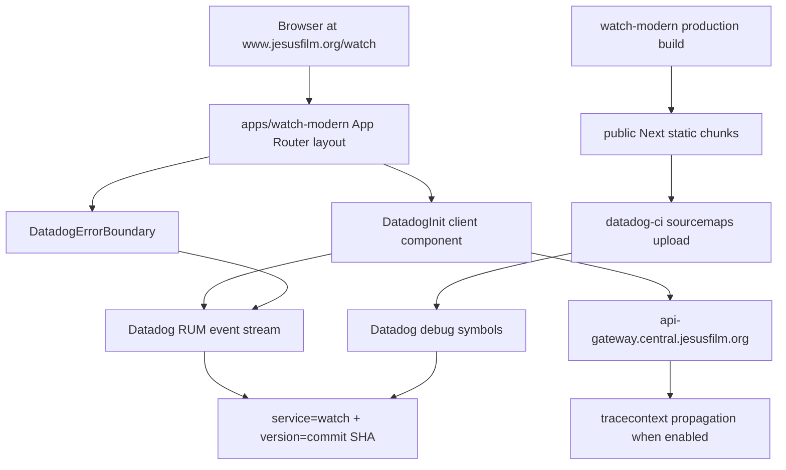

# feat: Reuse legacy Watch Datadog setup in watch-modern

## Summary

Align `apps/watch-modern` Datadog RUM and sourcemap behavior with the legacy public Watch setup while keeping the App Router SDK integration already present on `origin/main`. Production telemetry must represent the user-facing app at `https://www.jesusfilm.org/watch`, not the staging or preview host.

This plan targets `apps/watch-modern` as it exists on `origin/main` and in the linked GitHub tree at `https://github.com/JesusFilm/core/tree/main/apps/watch-modern`. If an implementation worktree does not have that app materialized locally, sync to current `origin/main` before execution.

---

## Problem Frame

Legacy `apps/watch` initialized Datadog RUM with `service: 'watch'`, `site: 'datadoghq.com'`, Vercel environment and commit SHA tags, 50 percent session sampling, 10 percent session replay sampling, interaction tracking, and `mask-user-input` privacy. It uploaded sourcemaps under the same `watch` service and release SHA.

`apps/watch-modern` already has a modern SDK-based RUM integration using `@datadog/browser-rum`, `@datadog/browser-rum-react`, `trackResources`, `trackLongTasks`, gateway trace propagation, and a React error boundary. The gap is that it currently tags RUM and sourcemaps as `watch-modern`, which breaks old Watch dashboard/query continuity and violates the user's request to reuse the old website setup.

---

## Requirements

**RUM Parity**

- R1. `apps/watch-modern` must tag production RUM events with the legacy Watch service name `watch`.
- R2. RUM events must keep the old Watch sampling and privacy behavior: 50 percent session sample, 10 percent session replay sample, user interaction tracking enabled, and `mask-user-input`.
- R3. RUM `env` and `version` must continue to come from Vercel environment and deploy commit SHA values so release filtering matches deploys. The deploy flow writes `NEXT_PUBLIC_VERCEL_GIT_COMMIT_SHA` into Vercel's `VERCEL_GIT_COMMIT_SHA`; `apps/watch-modern/src/env.ts` must expose that same SHA as `NEXT_PUBLIC_DATADOG_VERSION`.
- R4. Missing Datadog application id or client token must disable RUM initialization without throwing.
- R5. React runtime errors in the App Router tree must continue to be captured by Datadog and show a recoverable user-facing fallback.

**Production Domain and Routing**

- R6. Production validation must treat `https://www.jesusfilm.org/watch` as the user-facing Watch surface.
- R7. Staging or preview hosts, including `watch.jesusfilm.org`, must be treated as non-production validation surfaces and must not drive production Datadog dashboard assumptions.
- R8. Datadog validation queries and sourcemap minified path prefixes must account for `basePath: '/watch'` and the current production/stage `assetPrefix: '/watch/modern'`. Do not add new RUM view/resource filtering code unless built/runtime evidence proves current SDK event paths are wrong.

**Sourcemaps and Release Correlation**

- R9. Datadog sourcemap upload for `watch-modern` must use `service=watch` and a release version equal to the same deploy commit SHA emitted by RUM as `version`.
- R10. Sourcemap `--minified-path-prefix` must match the actual public URL path where Next serves `watch-modern` JavaScript chunks after `basePath` and `assetPrefix` are applied.
- R11. Production browser source maps must remain enabled for the Next build so Datadog can unminify production stack traces, but `*.js.map` files must not be publicly fetchable after deployment. Upload maps to Datadog, then delete them from the deployed artifact or block them at the host/CDN, and prove representative map URLs return `403` or `404`.

**Observability Scope**

- R12. Existing modern additions such as resource tracking, long-task tracking, React plugin support, and gateway trace propagation may stay if they preserve R1-R11. Trace propagation must stay limited to the central and stage gateway origins/patterns already intended for API calls, with no trace headers sent to Mux, Algolia, Datadog intake, static assets, or arbitrary third-party URLs.
- R13. Datadog RUM must not replace Mux playback analytics or future first-party watch event collection.
- R14. RUM and replay privacy must go beyond `mask-user-input`: redact query strings, URL fragments, and email-like values from view/referrer/resource/error URLs and action/error strings, and add `data-dd-privacy` annotations for sensitive DOM regions discovered during smoke testing.

**Verification**

- R15. Automated tests must cover Datadog initialization, disabled initialization, config values, redaction behavior, trace-propagation allowlists, and the mounted error-boundary wrapper. A project-config test or reviewed config check must cover sourcemap service, release, and per-environment minified path prefix alignment.
- R16. A staging smoke check must prove RUM events appear under `service:watch`, the expected `env` and `version`, and a URL beginning with the staging mounted Watch path, expected as `https://watch.jesusfilm.org/watch` unless deployment config proves another path. Production launch smoke must use `https://www.jesusfilm.org/watch`.

---

## High-Level Technical Design

The implementation should centralize the RUM constants used by the init component and tests. The deployment target then uses the same service and release version for sourcemap upload, with the minified path prefix matched to the actual served Next asset path.

---

## Key Technical Decisions

- KTD1. Use `service: 'watch'` for `apps/watch-modern`: The user's goal is old Watch Datadog setup reuse. Keeping `watch-modern` would create clean migration telemetry, but it would fragment existing Watch RUM dashboards, monitors, and sourcemap symbol lookup.
- KTD2. Keep the SDK integration instead of restoring the old script tag: `apps/watch-modern` already imports `@datadog/browser-rum` and `@datadog/browser-rum-react`, which is the right shape for App Router and testability. Parity should come from matching service/env/version/sampling/privacy behavior, not from reintroducing inline script injection.
- KTD3. Match sourcemaps to RUM tags: Datadog sourcemap upload `--service` and `--release-version` must match the RUM `service` and `version` tags. The `watch-modern` upload target should therefore stop uploading symbols as `service=watch-modern`, and `GIT_COMMIT_SHA` must equal the runtime `NEXT_PUBLIC_DATADOG_VERSION` SHA for the same deploy.
- KTD4. Make asset URL prefixes environment-aware: Current config combines `basePath: '/watch'` with `assetPrefix: '/watch/modern'` for production/stage, while preview can serve a different static chunk path. A single hard-coded `--minified-path-prefix=/_next/static/` is not enough. Use an env-driven upload script or per-environment upload targets, then capture built HTML script URLs as evidence.
- KTD5. Keep Datadog observability separate from product analytics: RUM can cover page views, errors, resources, long tasks, and frontend trace correlation. Playback behavior stays with Mux analytics, and future first-party watch events stay out of this plan.
- KTD6. Use `www.jesusfilm.org/watch` for production validation: `watch.jesusfilm.org` may remain useful for staging or development, but production RUM queries and smoke proof should filter for the mounted public URL.
- KTD7. Keep source maps private after upload: `productionBrowserSourceMaps: true` is acceptable only when deploy artifacts or edge controls prevent public `*.js.map` downloads.

---

## Implementation Units

### U1. Centralize Datadog RUM Configuration

- **Goal:** Make the Watch Datadog config explicit, testable, and aligned with the legacy `watch` service.
- **Requirements:** R1, R2, R3, R4, R12, R14, R15.
- **Dependencies:** None.
- **Files:** `apps/watch-modern/src/components/Datadog/Init/Init.tsx`, `apps/watch-modern/src/components/Datadog/Init/config.ts`, `apps/watch-modern/src/components/Datadog/Init/Init.spec.tsx`, `apps/watch-modern/src/env.ts`.
- **Approach:** Extract a small Datadog config builder or constants module that returns no config when required public credentials are absent. Preserve `sessionSampleRate: 50`, `sessionReplaySampleRate: 10`, `trackUserInteractions: true`, `trackResources: true`, `trackLongTasks: true`, `defaultPrivacyLevel: 'mask-user-input'`, React plugin setup, and current gateway trace propagation. Change the service constant to `watch`. Add a `beforeSend` redaction helper for query strings, fragments, and email-like values in URL/string event fields. Pin `allowedTracingUrls` to the central and stage gateway origins/patterns only.
- **Patterns to Follow:** `apps/watch-modern/src/components/Datadog/Init/Init.tsx` for current SDK integration; `apps/watch/pages/_app.tsx` for legacy Watch service, sample, replay, env, version, and privacy values.
- **Test Scenarios:** Use an explicit env-subset config builder or mock `@/env` before importing `Init` so unrelated env validation, such as Cloudflare Stream settings, cannot fail the Datadog tests. With application id and client token present, `datadogRum.init` is called once with `service: 'watch'`, Vercel env, commit SHA version, sample/replay rates, privacy level, resource/long-task tracking, and gateway trace propagation. With either credential missing, `datadogRum.init` is not called. Re-rendering under React strict-mode style effects does not initialize twice. An init exception is caught and logged without breaking render. Redaction tests cover query strings, fragments, and email-like values. Trace tests prove only gateway URLs match the allowlist and representative Mux, Algolia, Datadog intake, static asset, and arbitrary third-party URLs do not.
- **Verification:** Unit tests prove the config values, and the code exposes one authoritative service constant used by later units.

### U2. Preserve Datadog Error Boundary Coverage

- **Goal:** Verify the existing Datadog React error boundary remains mounted in the App Router tree.
- **Requirements:** R5, R15.
- **Dependencies:** U1.
- **Files:** `apps/watch-modern/src/app/layout.tsx`, `apps/watch-modern/src/components/Datadog/ErrorBoundary/ErrorBoundary.spec.tsx`, `apps/watch-modern/setupTests.tsx`.
- **Approach:** Keep the existing `DatadogErrorBoundary` component behavior unchanged. Add only the smallest useful test coverage around the mounted wrapper and fallback behavior if current coverage is insufficient for confidence. Do not refactor the fallback UI as part of Datadog service parity.
- **Patterns to Follow:** Existing `DatadogErrorBoundary` component and `next-intl` test setup patterns in `apps/watch-modern/setupTests.tsx`.
- **Test Scenarios:** The layout or wrapper path keeps children inside `DatadogErrorBoundary`. If fallback coverage is added, a child render error shows the existing fallback, reset still works, and normal children render without showing fallback text.
- **Verification:** Error-boundary tests pass without needing live Datadog credentials.

### U3. Align Sourcemap Upload with RUM Service and Asset Paths

- **Goal:** Make production stack traces unminify under the same Datadog service/version that RUM emits.
- **Requirements:** R6, R8, R9, R10, R11, R15.
- **Dependencies:** U1.
- **Files:** `apps/watch-modern/project.json`, `apps/watch-modern/next.config.mjs`, `apps/watch-modern/scripts/upload-sourcemaps.mjs`, `apps/watch-modern/project.spec.ts`.
- **Approach:** Replace the single hard-coded upload command with an env-driven script or explicit per-environment upload targets. The upload must use `--service=watch` and `--release-version=$GIT_COMMIT_SHA`, where `$GIT_COMMIT_SHA` is the same commit SHA exposed to RUM as `NEXT_PUBLIC_DATADOG_VERSION`. Select the minified path prefix from the deployment context and captured built HTML script URLs: production/stage are expected to use `/watch/modern/_next/static/` with the current `assetPrefix`, while preview may use `/watch/_next/static/` if no asset prefix is applied. Keep `productionBrowserSourceMaps: true`, upload maps, and then remove or block public access to `*.js.map`.
- **Patterns to Follow:** `apps/watch/project.json` for legacy `--service=watch` and release SHA upload; `.github/workflows/app-deploy.yml` for deploy-time `GIT_COMMIT_SHA` and `DATADOG_API_KEY` handoff.
- **Test Scenarios:** Add a Vitest project-config test at `apps/watch-modern/project.spec.ts` that reads `apps/watch-modern/project.json` as JSON and asserts the upload path uses `service=watch`, release `$GIT_COMMIT_SHA`, and the env-driven script or per-env targets. Unit-test the upload script's prefix selection for production, stage, and preview contexts. Build-output inspection confirms selected minified path prefixes match emitted script URLs.
- **Verification:** A dry-run or reviewed CI log shows sourcemaps uploaded for the same service/version pair used by RUM. Staging and production smoke confirm representative emitted `.js.map` URLs return `403` or `404` while Datadog unminification still works.

### U4. Validate Environment and Deployment Wiring

- **Goal:** Ensure staging and production deploys provide the same Datadog env/version inputs the old Watch setup used.
- **Requirements:** R3, R6, R7, R16.
- **Dependencies:** U1, U3.
- **Files:** `apps/watch-modern/src/env.ts`, `apps/watch-modern/project.json`, `.github/workflows/app-deploy.yml`, `apps/watch-modern/README.md` or `docs/observability/watch-modern-datadog.md`.
- **Approach:** Keep `NEXT_PUBLIC_DATADOG_ENV` derived from `VERCEL_ENV` and `NEXT_PUBLIC_DATADOG_VERSION` derived from `VERCEL_GIT_COMMIT_SHA`, because `watch-modern` deploy already writes those values into Vercel build env files. Add a read-only environment matrix for production, staging, and preview: public RUM application id, public client token, Datadog site, RUM env, secret `DATADOG_API_KEY`, allowed deploy contexts, and rotation owner. `DATADOG_API_KEY` must remain CI/server-only and never use a `NEXT_PUBLIC_` name. If a value is missing or preview has production upload permissions without approval, record it as a release blocker or follow-up rather than mutating external configuration in this PR.
- **Patterns to Follow:** `apps/watch-modern/src/env.ts` runtime mapping; `apps/watch-modern/project.json` deploy commands; legacy `apps/watch/pages/_app.tsx` env/version usage.
- **Test Scenarios:** Env unit tests verify default Datadog site is `datadoghq.com`, `VERCEL_ENV=prod` maps to RUM env `prod`, and `VERCEL_GIT_COMMIT_SHA` maps to RUM version. Staging smoke confirms events appear with staging env and `https://watch.jesusfilm.org/watch` unless deployment config proves another mounted path. Production smoke confirms events appear with `https://www.jesusfilm.org/watch` URL after launch.
- **Verification:** Deployment configuration has the required Datadog public values and CI still passes sourcemap upload with `DATADOG_API_KEY`.

### U5. Add Datadog Smoke and Query Handoff Notes

- **Goal:** Give release reviewers a repeatable proof path for old Watch Datadog parity.
- **Requirements:** R6, R7, R13, R14, R16.
- **Dependencies:** U1, U3, U4.
- **Files:** `apps/watch-modern-e2e/src/e2e/page/watch.spec.ts`, `apps/watch-modern-e2e/playwright.config.ts`, `apps/watch-modern/README.md` or `docs/observability/watch-modern-datadog.md`.
- **Approach:** Extend e2e or operational docs with a staging smoke that visits `/watch`, triggers representative search, language, player, and recoverable error flows, and records the Datadog query reviewers should use. Add `data-dd-privacy` annotations only where the smoke reveals sensitive DOM text not protected by default masking and redaction. Keep the smoke from requiring real Datadog tokens in CI unless the environment already supplies them.
- **Patterns to Follow:** `apps/watch-modern-e2e/src/e2e/page/watch.spec.ts` for the current mounted route smoke; existing live Watch monitor paths under `apps/watch-e2e/src/monitoring/` and `apps/resources-e2e/src/monitoring/` for production URL expectations.
- **Test Scenarios:** E2E still opens `/watch` locally with no Datadog credentials. Staging manual smoke verifies RUM events under `service:watch`, the expected env/version, replay sampling enabled, privacy redaction applied, trace headers limited to gateway requests, and URL matching the staging mounted Watch route. Production launch smoke verifies URL filtering against `https://www.jesusfilm.org/watch`.
- **Verification:** Release notes or docs tell reviewers exactly how to distinguish production `www.jesusfilm.org/watch` events from staging/preview events.

---

## Acceptance Examples

- AE1. **Production RUM continuity**
  - **Given:** `watch-modern` is deployed to the user-facing domain.
  - **When:** A visitor opens `https://www.jesusfilm.org/watch`.
  - **Then:** Datadog receives RUM events under `service:watch` with the deploy env and commit SHA version.
  - **Covers:** R1, R3, R6.

- AE2. **Sourcemaps match RUM**
  - **Given:** The same deploy emits a browser error from a minified chunk.
  - **When:** Datadog receives the error.
  - **Then:** The stack trace can resolve against symbols uploaded with `service=watch` and the same release SHA, while direct requests for representative `.js.map` URLs return `403` or `404`.
  - **Covers:** R9, R10, R11.

- AE3. **Credentials missing is safe**
  - **Given:** A local or test environment omits the Datadog application id or client token.
  - **When:** The App Router layout renders.
  - **Then:** RUM initialization is skipped and the page still renders.
  - **Covers:** R4.

- AE4. **Staging does not define production truth**
  - **Given:** QA tests the staging or preview host.
  - **When:** Datadog events arrive.
  - **Then:** They are filtered by staging env and URL, while launch proof still uses `www.jesusfilm.org/watch`.
  - **Covers:** R7, R16.

- AE5. **Privacy and trace boundaries hold**
  - **Given:** A visitor uses search, language selection, player flows, and one recoverable error path.
  - **When:** RUM, replay, resource, and trace events are inspected.
  - **Then:** URL/string fields do not expose query strings, fragments, or email-like values, and trace headers are sent only to approved gateway origins.
  - **Covers:** R12, R14, R16.

---

## Scope Boundaries

**In Scope**

- Datadog RUM initialization parity for `apps/watch-modern`.
- Datadog React error boundary tests.
- Sourcemap upload service/version/path alignment.
- Env and deploy wiring needed for RUM and sourcemap correlation.
- Staging and launch smoke documentation for Datadog verification.

**Deferred to Follow-Up Work**

- Adding user identity to Datadog RUM after account work lands.
- Datadog browser logs collection, unless a separate observability requirement asks for it.
- First-party product analytics or recommendation events.
- Mux playback analytics changes.
- Broader cleanup of stale `watch.jesusfilm.org` production wording outside the narrow Datadog handoff note.

**Out of Scope**

- Datadog dashboard, monitor, alert, or saved-view changes. This plan only emits compatible RUM/sourcemap tags and documents query filters.
- External Datadog, Vercel, Doppler, or GitHub secret mutation. This plan may verify configuration read-only and record release blockers.
- Datadog user context. If added later, it must avoid direct PII and clear on sign-out.
- GTM, GA4, Meta Pixel, Google Ads, and Algolia Insights parity.
- Cloudflare caching or edge route rollout.
- Backend Datadog tracing changes outside the browser-to-gateway trace propagation already configured in `watch-modern`.

---

## System-Wide Impact

This change affects observability naming and release-debuggability for the public Watch migration. Switching `watch-modern` RUM to `service=watch` preserves old dashboard continuity but blends modern app traffic with legacy Watch traffic while both are live. Reviewers should filter by URL path, env, and version during overlap windows.

Sourcemap changes affect CI deployment behavior. If the minified path prefix is wrong, uploads may succeed while Datadog still cannot unminify production errors.

---

## Risks and Dependencies

- **Service-name ambiguity:** `service=watch` supports old dashboard continuity, while `service=watch-modern` supports migration isolation. This plan chooses continuity because the user asked to reuse the old setup.
- **Asset prefix mismatch:** Current `assetPrefix: '/watch/modern'` means the existing `--minified-path-prefix=/_next/static/` may not match served chunk URLs.
- **Environment-specific sourcemap paths:** Preview, stage, and production can serve different static chunk prefixes, so a single upload command can succeed while Datadog cannot unminify.
- **Public source-map exposure:** `productionBrowserSourceMaps: true` creates useful Datadog artifacts but can expose source if maps remain publicly fetchable.
- **Dual-app overlap:** If legacy Watch and `watch-modern` emit `service=watch` at the same time, dashboard queries need URL/version filters to separate them.
- **Stale subdomain references:** Some repo docs may still name `watch.jesusfilm.org`; launch validation should treat those as staging/dev references unless product explicitly says otherwise.
- **Datadog quota and privacy:** Keeping replay at 10 percent and masking inputs matches old behavior, but replay can still expose sensitive visible DOM or URL-derived strings unless redaction and smoke proof are in place.
- **Network trace propagation:** Existing `allowedTracingUrls` sends trace context to central and stage gateways. That is additive to old Watch RUM and must stay on an exact allowlist with staging CORS proof.
- **External configuration:** Datadog application id, client token, site, and API key live outside the repo in Vercel, Doppler, and GitHub secrets.

---

## Documentation and Operational Notes

- Add a short operational note with the launch Datadog query dimensions: `service:watch`, `env:<deploy env>`, `version:<commit sha>`, and URL beginning with `https://www.jesusfilm.org/watch`.
- Note that `watch.jesusfilm.org` is staging or development context, not the production Watch URL.
- Mention any stale `watch.jesusfilm.org` production wording discovered during implementation, but defer a broad docs sweep unless it directly affects Datadog release review.
- Document the chosen sourcemap minified path prefix and the built asset URL evidence that justified it.
- Document how public `.js.map` access is blocked or removed after Datadog upload.
- If old and modern Watch run concurrently under `service=watch`, document the temporary URL filters needed to separate traffic.

---

## Validation Plan

- Run `pnpm exec vitest run --config apps/watch-modern/vitest.config.mts` for Datadog component and config tests.
- Run `pnpm exec tsc -b apps/watch-modern/tsconfig.json`.
- Run `pnpm exec eslint apps/watch-modern`.
- For local e2e, start `watch-modern` first, then run `pnpm exec nx run watch-modern-e2e:e2e`; for deployed e2e, run with `DEPLOYMENT_URL=<preview-or-stage-url>` or the existing deployed-e2e environment flag.
- Inspect preview, staging, and production build/deploy emitted script URLs before finalizing sourcemap minified path prefixes.
- After staging deploy, query Datadog RUM for `service:watch`, staging env, deploy version, and the staging mounted Watch URL. Also confirm representative `.js.map` URLs return `403` or `404`.
- During staging smoke, verify trace headers are sent only to central/stage gateway origins and required gateway CORS headers allow those traces.
- During staging smoke, verify RUM/replay redaction across search, language, player, and recoverable error flows.
- After production launch, query Datadog RUM for `service:watch`, production env, deploy version, and `https://www.jesusfilm.org/watch`.

---

## Sources and Research

- `apps/watch/pages/_app.tsx`: legacy Watch Datadog RUM values: `service: 'watch'`, Vercel env/version, 50 percent sample, 10 percent replay, interaction tracking, and masked inputs.
- `apps/watch/project.json`: legacy Watch sourcemap upload uses `--service=watch` and `--release-version=$GIT_COMMIT_SHA`.
- `apps/watch-modern/src/components/Datadog/Init/Init.tsx`: current SDK-based RUM integration, React plugin, resource/long-task tracking, and gateway trace propagation.
- `apps/watch-modern/src/components/Datadog/ErrorBoundary/ErrorBoundary.tsx`: current Datadog React error boundary.
- `apps/watch-modern/src/env.ts`: current Datadog env validation and Vercel env/version mapping.
- `apps/watch-modern/project.json`: current deploy and sourcemap upload target, including `--service=watch-modern`.
- `apps/watch-modern/next.config.mjs`: `basePath: '/watch'`, `assetPrefix: '/watch/modern'` for production/stage, and `productionBrowserSourceMaps: true`.
- `.github/workflows/app-deploy.yml`: deploy and sourcemap upload steps provide `NEXT_PUBLIC_VERCEL_ENV`, `NEXT_PUBLIC_VERCEL_GIT_COMMIT_SHA`, `GIT_COMMIT_SHA`, and `DATADOG_API_KEY`.
- `apps/watch-modern-e2e/src/e2e/page/watch.spec.ts`: current `/watch` e2e smoke.
- `apps/watch-e2e/src/monitoring/watch.monitor.ts` and `apps/resources-e2e/src/monitoring/watch.monitor.ts`: existing production Watch monitor target `https://www.jesusfilm.org/watch`.
- `apps/docs/docs/06-quick-links.md`: known place to audit for stale `watch.jesusfilm.org` production wording.
- `docs/solutions/performance-issues/watch-non-cloudflare-performance-hardening-20260611.md`: prior launch-readiness guidance to prove app-owned route health before edge caching masks behavior.
- GitHub target tree from the request: `https://github.com/JesusFilm/core/tree/main/apps/watch-modern`.
- Next.js `productionBrowserSourceMaps` docs: `https://nextjs.org/docs/app/api-reference/config/next-config-js/productionBrowserSourceMaps`.
- Datadog Browser RUM setup docs: `https://docs.datadoghq.com/real_user_monitoring/application_monitoring/browser/setup/client/`.
- Datadog RUM advanced configuration docs for `beforeSend`: `https://docs.datadoghq.com/real_user_monitoring/application_monitoring/browser/advanced_configuration/`.
- Datadog Session Replay privacy options docs: `https://docs.datadoghq.com/session_replay/browser/privacy_options/`.
- Datadog JavaScript sourcemap upload docs: `https://docs.datadoghq.com/real_user_monitoring/guide/upload-javascript-source-maps/`.
