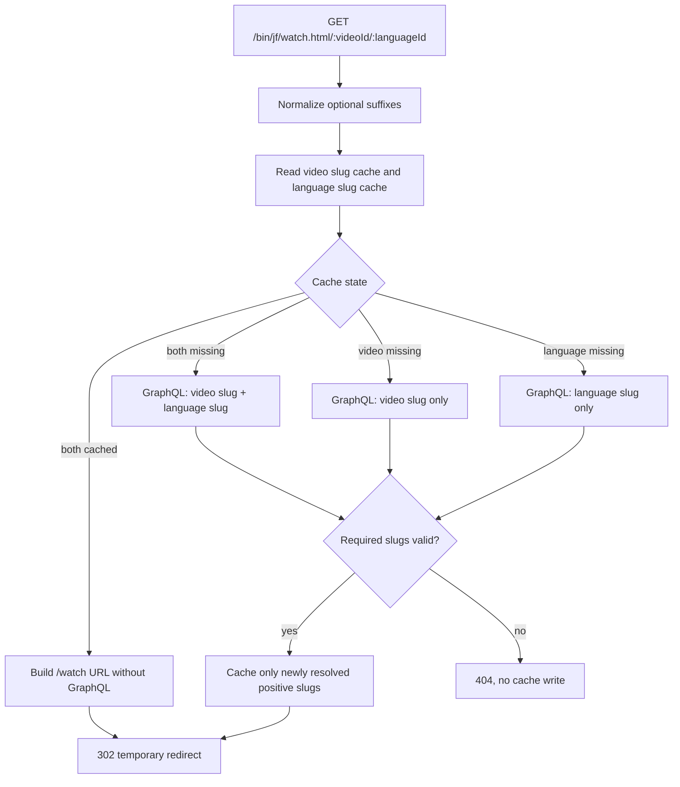

# feat: Move JF watch redirect to Cloudflare proxy

## Goal Capsule

- **Objective:** Add Cloudflare JF Proxy Worker ownership for `/bin/jf/watch.html/:videoId/:languageId` while preserving the public redirect contract and leaving existing app-local fallbacks in place for the initial production rollout.
- **Authority:** User route contract and follow-up cache requirements override inferred implementation convenience; the actual proxy owner is `workers/jf-proxy`, not `apps/arclight`.
- **Execution profile:** Behavior-preserving Worker route migration with focused Cloudflare Worker tests; app-local cleanup is deferred until after the Worker route has shipped and proven production-safe.
- **Stop conditions:** Stop if the Worker cannot reach the Core GraphQL endpoint needed to resolve video and language slugs, or if deployment routing for `/bin/*` is not actually handled by `workers/jf-proxy`.
- **Tail ownership:** The implementing agent owns Worker code, tests, and environment binding updates. App-local cleanup is follow-up work, not part of this delivery.

---

## Product Contract

### Summary

The JF watch ID redirect should be served by the Cloudflare JF Proxy Worker in `workers/jf-proxy`.
Incoming requests to `/bin/jf/watch.html/:videoId/:languageId` resolve a media component ID and language ID to the canonical watch URL `/watch/{videoSlug}.html/{languageSlug}.html`, using temporary redirect semantics and returning not found when either ID cannot be resolved to a slug.

### Problem Frame

Today the route is split across app-local ownership: both `apps/resources/next.config.js` and `apps/watch-modern/next.config.mjs` redirect `/bin/jf/watch.html/:videoId/:languageId` to the Resources API resolver at `apps/resources/pages/api/jf/watch.html/[videoId]/[languageId].ts`.
The actual Cloudflare proxy app is `workers/jf-proxy`, whose Wrangler config already routes `develop.jesusfilm.org/bin/*` and `www.jesusfilm.org/bin/*` through the Worker.
Owning this redirect in the Worker lets Cloudflare cache stable ID-to-slug mappings at the edge while existing app-local behavior remains available during rollout.

### Requirements

- R1. `workers/jf-proxy` accepts `GET /bin/jf/watch.html/:videoId/:languageId`.
- R2. Incoming `videoId` and `languageId` parameters tolerate optional `.html` or `.htm` suffixes before lookup.
- R3. Requests with resolvable video and language slugs redirect to `/watch/{videoSlug}.html/{languageSlug}.html`.
- R4. Redirect responses remain temporary, using `302`.
- R5. Missing videos, missing languages, or missing slugs return 404 or the Worker’s equivalent not-found response.
- R6. Not-found lookup results and not-found responses are never cached.
- R7. Positive ID-to-slug mappings are cached independently for `videoId -> videoSlug` and `languageId -> languageSlug` in Cloudflare Worker cache storage.
- R8. GraphQL lookup scope follows cache misses: when both slug mappings are absent, one request may resolve both; when only one mapping is absent, GraphQL fetches only the missing side; when both are cached, no GraphQL request is made.
- R9. No video/language variant existence check is required for this route; slug resolution is the authority.

### Acceptance Examples

- AE1. Given `/bin/jf/watch.html/1_jf-0-0/529` resolves to video slug `jesus` and language slug `english`, when requested through the Worker route, then the response is a `302` redirect to `/watch/jesus.html/english.html`.
- AE2. Given the same IDs arrive as `/bin/jf/watch.html/1_jf-0-0.html/529.html`, when requested through the Worker route, then lookup uses `1_jf-0-0` and `529` and redirects to the same canonical URL.
- AE3. Given the video ID or language ID cannot resolve to a slug, when requested through the Worker route, then the response is 404 and no negative cache entry is written.
- AE4. Given the video slug is cached but the language slug is not, when requested through the Worker route, then GraphQL is called only for the language slug, not for the video slug or any variant check.
- AE5. Given both slugs are cached, when requested through the Worker route, then the Worker redirects without GraphQL.

### Scope Boundaries

- The migration is limited to the JF watch ID redirect route; it does not touch Arclight, canonical watch page rendering, language switching, or video slug generation.
- The Worker keeps the existing proxy behavior for all other paths, including `/watch` cookie routing, header forwarding, and fallback not-found handling.
- The route remains a temporary redirect. Permanent redirect policy for other watch URLs stays unchanged.

### Deferred to Follow-Up Work

- Remove the duplicated app-local redirects and Resources API resolver only after the Cloudflare Worker route has shipped to production and the team is comfortable cutting over fully.

### Assumptions

- `workers/jf-proxy` is the Cloudflare proxy app intended by this migration.
- The Worker can be given a Core GraphQL endpoint binding, or can reuse an existing public gateway URL if one is already configured outside the currently visible Worker vars.
- Cloudflare’s Cache API (`caches.default`) is the right cache layer for positive slug mappings in this Worker.

---

## Planning Contract

### Key Technical Decisions

- KTD1. **Add a first-class Worker route before the generic proxy catch-all.** `workers/jf-proxy/src/index.ts` currently has well-known routes and then `app.get('*')` for proxy forwarding. The new `/bin/jf/watch.html/:videoId/:languageId` handler must be registered before the catch-all so it owns the route instead of forwarding to Resources.
- KTD2. **Resolve slugs directly in the Worker.** Add a small resolver helper in `workers/jf-proxy/src` that normalizes params, reads Cloudflare cache entries, calls Core GraphQL only for missing slug facts, writes positive cache entries, and returns a redirect URL or not-found outcome.
- KTD3. **Use Cloudflare Cache API for positive-only slug facts.** Cache `videoId -> videoSlug` and `languageId -> languageSlug` separately using normalized IDs in stable synthetic cache keys. Only cache successful non-empty slug results. Do not cache missing videos, missing languages, null slugs, GraphQL errors, or 404 responses.
- KTD4. **GraphQL follows cache misses and only resolves missing slug facts.** Cached slugs avoid re-fetching known slug fields. When both slugs are cached, the route redirects without GraphQL; when one is cached, GraphQL fetches only the missing slug; when both are missing, one GraphQL request can resolve both.
- KTD5. **Normalize before cache lookup.** Strip optional `.html`/`.htm` suffixes before cache-key construction and GraphQL variables so suffix forms do not fragment cache entries.
- KTD6. **Keep app-local ownership during initial rollout.** This plan adds Worker ownership and coverage but does not delete the Resources API resolver or app-local redirects. Cleanup belongs to a follow-up after production validation.

### High-Level Technical Design

The Worker route is an edge-owned slug translation route.
It does not verify video/language variants and it does not forward to the app-local `/api/jf/watch.html` resolver.

### Research Notes

- `workers/jf-proxy/src/index.ts` is the Cloudflare Worker app. It uses Hono, well-known route handlers, then a `GET *` proxy catch-all that forwards to `RESOURCES_PROXY_DEST` or `WATCH_PROXY_DEST`.
- `workers/jf-proxy/wrangler.toml` already routes `develop.jesusfilm.org/bin/*` and `www.jesusfilm.org/bin/*` to this Worker.
- `workers/jf-proxy/src/index.spec.ts` uses `cloudflare:test` `fetchMock` and `app.request`, which is the right place to add route, cache, and GraphQL call assertions.
- `apps/resources/pages/api/jf/watch.html/[videoId]/[languageId].ts` is the legacy resolver. It demonstrates suffix tolerance, temporary redirect behavior, and canonical watch URL shape, but the migrated Worker should resolve video and language slugs directly rather than depend on that app-local API.
- `apps/resources/next.config.js` and `apps/watch-modern/next.config.mjs` both currently claim `/bin/jf/watch.html/:videoId/:languageId` and point at the Resources API resolver.
- `docs/solutions/logic-errors/response-cache-empty-list-invalidation-2026-05-10.md` reinforces not caching empty/not-found outcomes when later data can make the result valid.

### System-Wide Impact

- Public `/bin/jf/watch.html/:videoId/:languageId` traffic is handled by `workers/jf-proxy` when the Worker route matches, while app-local route ownership remains in place as a rollout fallback.
- The Worker gains a Core GraphQL dependency and a cacheable slug-resolution path.
- Positive slug mappings gain Cloudflare edge cache state; not-found behavior remains uncached.
- Duplicate route ownership remains temporarily by design until the Worker route is proven in production.

### Risks & Dependencies

| Risk | Mitigation |
|---|---|
| Worker env lacks a Core GraphQL endpoint binding today. | Add an explicit Worker var such as `CORE_GRAPHQL_ENDPOINT` in `workers/jf-proxy/wrangler.toml`, or reuse the repo-approved gateway URL if one already exists in deployment config. Tests should inject the binding. |
| `caches.default` can be awkward to assert directly in Worker tests. | Isolate cache-key/read/write behavior in a small helper and cover behavior through `@cloudflare/vitest-pool-workers`; use distinct synthetic cache URLs per test to avoid cross-test collisions. |
| Existing catch-all proxy fallback could accidentally handle the route first. | Register the new route above `app.get('*')` and add a test that no fetch is made to `RESOURCES_PROXY_DEST` for the handled redirect route. |
| Positive slug cache can become stale after slug edits. | Use a bounded TTL in the cached Response’s `Cache-Control` header and keep the cache positive-only. |

---

## Implementation Units

### U1. Add Worker bindings and route ownership

- **Goal:** Make `workers/jf-proxy` own `/bin/jf/watch.html/:videoId/:languageId` before the generic proxy catch-all.
- **Requirements:** R1, R4
- **Dependencies:** None
- **Files:** `workers/jf-proxy/src/index.ts`, `workers/jf-proxy/wrangler.toml`, `workers/jf-proxy/src/index.spec.ts`
- **Approach:** Extend the Worker binding type with the Core GraphQL endpoint. Register a `GET /bin/jf/watch.html/:videoId/:languageId` handler above `app.get('*')`. Keep existing well-known and generic proxy behavior unchanged.
- **Patterns to follow:** Existing `app.get` route structure in `workers/jf-proxy/src/index.ts`; existing Worker tests in `workers/jf-proxy/src/index.spec.ts`.
- **Test scenarios:**
  - Route ownership: `/bin/jf/watch.html/video-1/529` is handled by the new route and does not fetch `RESOURCES_PROXY_DEST`.
  - Temporary redirect: a mocked successful resolver returns status `302`.
  - Existing proxy behavior: a normal non-watch route still forwards through the catch-all as before.
- **Verification:** Worker tests prove the new route is registered before the catch-all and no Arclight files are touched.

### U2. Implement Cloudflare positive-only slug cache helpers

- **Goal:** Cache successful slug facts independently in the Worker without representing not-found as cache state.
- **Requirements:** R6, R7, R8
- **Dependencies:** U1
- **Files:** `workers/jf-proxy/src/slugCache.ts`, `workers/jf-proxy/src/index.spec.ts`
- **Approach:** Add helpers that build normalized synthetic cache keys for video and language slug facts, read JSON or text slug payloads from `caches.default`, and write only non-empty slug values with a bounded TTL. Return `null` for cache miss, cache error, empty payload, or malformed payload.
- **Technical design:** Cache keys should be independent, for example one namespace for video IDs and one namespace for language IDs. The keys should use normalized IDs after suffix stripping.
- **Test scenarios:**
  - Positive video slug cache hit returns the video slug and avoids GraphQL for video.
  - Positive language slug cache hit returns the language slug and avoids GraphQL for language.
  - Empty, null, or missing slug is not written to cache.
  - Cache miss returns `null` and allows GraphQL lookup.
  - Distinct normalized IDs produce distinct cache keys; `.html` and no-suffix forms share the same key.
- **Verification:** No test can observe a not-found result coming back from cache.

### U3. Implement cache-aware Core GraphQL slug lookup

- **Goal:** Resolve only the missing slug facts needed to build the canonical watch URL.
- **Requirements:** R2, R3, R5, R6, R7, R8, R9
- **Dependencies:** U2
- **Files:** `workers/jf-proxy/src/resolveWatchRedirect.ts`, `workers/jf-proxy/src/index.ts`, `workers/jf-proxy/src/index.spec.ts`
- **Approach:** Normalize IDs, read both slug caches, choose a GraphQL document based on which slug facts are missing, write only newly resolved positive slugs, and return either a redirect URL or not-found outcome. The resolver should not query or validate a video/language variant.
- **Patterns to follow:** Existing Worker `fetch` style in `workers/jf-proxy/src/index.ts`; legacy URL construction in `apps/resources/pages/api/jf/watch.html/[videoId]/[languageId].ts`.
- **Test scenarios:**
  - Cold cache: both missing triggers one GraphQL request for video slug and language slug, then redirects to `/watch/jesus.html/english.html`.
  - Optional suffix handling: `video-1.html` and `529.htm` normalize before cache lookup and GraphQL variables use stripped IDs.
  - Video cached, language missing: GraphQL fetches only language slug and does not request video slug.
  - Language cached, video missing: GraphQL fetches only video slug and does not request language slug.
  - Both cached: no GraphQL request occurs and the route redirects from cached slug mappings.
  - Missing video slug: route returns 404 and does not write a video cache entry.
  - Missing language slug: route returns 404 and does not write a language cache entry.
  - GraphQL error or non-2xx response: route returns the Worker’s error/not-found convention without cache writes.
- **Verification:** Tests prove cache-hit/miss query selection, positive-only cache writes, suffix normalization, no variant-check GraphQL, and canonical URL encoding behavior.

### U4. Preserve canonical redirect response behavior

- **Goal:** Match the public redirect contract while running at the Worker layer.
- **Requirements:** R3, R4
- **Dependencies:** U3
- **Files:** `workers/jf-proxy/src/resolveWatchRedirect.ts`, `workers/jf-proxy/src/index.ts`, `workers/jf-proxy/src/index.spec.ts`
- **Approach:** Build the destination as `/watch/${encodedVideoSlug}.html/${encodedLanguageSlug}.html` and return a temporary redirect response. Keep response headers minimal and avoid caching the redirect response itself unless the implementation deliberately documents that Cloudflare should cache only the slug facts.
- **Patterns to follow:** Legacy Resources resolver for URL shape; existing Worker `Response` construction for explicit status/headers.
- **Test scenarios:**
  - Canonical redirect: video slug `jesus` and language slug `english` become `/watch/jesus.html/english.html`.
  - Encoding: URL-sensitive slug characters are encoded in the redirect location.
  - Status: valid redirect status is `302`.
- **Verification:** Worker tests assert exact status and `Location` header.

### U5. Run focused migration verification

- **Goal:** Prove the migrated route contract and guard against regressions in the Worker and touched app configs.
- **Requirements:** R1, R2, R3, R4, R5, R6, R7, R8, R9
- **Dependencies:** U1, U2, U3, U4
- **Files:** `workers/jf-proxy/project.json`, `workers/jf-proxy/vitest.config.ts`
- **Approach:** Run the Worker test target because it owns the new behavior. Broaden only if implementation changes shared package config or Worker deployment config.
- **Test scenarios:**
  - Worker unit tests cover valid redirect, temporary status, optional suffixes, cache hit/miss GraphQL selection, cached-slug redirect without GraphQL, missing slug not found, no negative caching, and catch-all non-regression.
  - Worker deployment config continues to include `/bin/*` routes for stage and prod.
- **Verification:** `jf-proxy:test` passes, and no app-local files are changed.

---

## Verification Contract

| Gate | Applies to | Done signal |
|---|---|---|
| Worker route and resolver tests | U1, U2, U3, U4 | Valid redirect, 302 status, suffix tolerance, cache miss selection, cache hit behavior without GraphQL, uncached not-found, no variant lookup, and 404 behavior are covered. |
| Worker catch-all regression tests | U1 | Existing proxy forwarding, cookie routing, and not-found fallback behavior remain unchanged. |
| Worker type/config check | U1, U2, U3, U4 | New bindings, helper modules, and Worker tests type-check under the Worker/Vitest config. |
| Manual contract check in a Worker environment | Whole plan | A valid ID/language request returns a temporary redirect to the canonical watch URL; a missing slug returns not found and does not create a negative cache entry. |

---

## Definition of Done

- `/bin/jf/watch.html/:videoId/:languageId` is owned by `workers/jf-proxy` and is registered before the generic proxy catch-all.
- No Arclight files are touched for this migration.
- Optional `.html` and `.htm` suffixes are normalized before cache lookup and GraphQL variables are built.
- Positive `videoId -> videoSlug` and `languageId -> languageSlug` mappings are independently cached through Cloudflare Worker cache APIs; not-found results are not cached.
- GraphQL lookup scope follows cache misses, and no variant existence check is performed.
- The redirect status remains `302`.
- Existing `apps/resources` and `apps/watch-modern` route ownership remains untouched for the initial production rollout.
- Focused Worker tests cover valid redirect, temporary status, optional suffix handling, missing slug behavior, cache behavior, no variant-check requirement, and catch-all non-regression.
- Abandoned implementation attempts, stale generated files, and dead imports are removed from the final diff.
