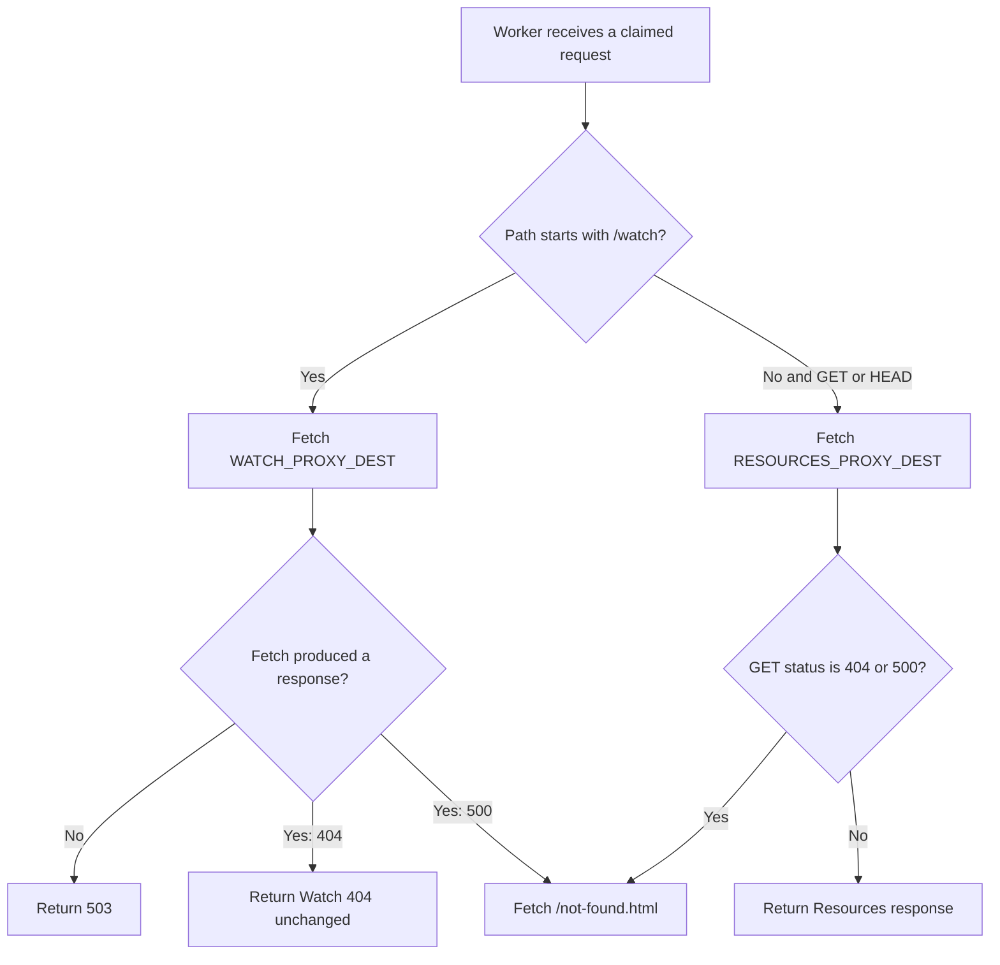

# Return Watch 404 responses through JF Proxy

## Summary

Make every 404 response received from the Watch proxy destination terminal at
the canonical-host Worker. Keep the legacy `/not-found.html` fallback for
non-Watch GET errors and Watch 500 responses so Forge's custom Watch 404
reaches browsers and crawlers without changing its status, body, headers, or
robots metadata.

## Problem Frame

`workers/jf-proxy` already sends every path classified by its `/watch*`
contract to `WATCH_PROXY_DEST`. After that destination returns a GET 404 or
500, the Worker currently discards the response and fetches
`/not-found.html` from the public host. On `www.jesusfilm.org`, that second
request is served by WordPress VIP, so invalid Watch URLs display the legacy
WordPress page even though Forge produced its custom Watch 404 correctly.

The edge must not replace a Watch application 404 with an unrelated site-wide
page. Forge owns missing-page classification and rendering. This repair is
limited to received Watch 404 responses; it preserves the historical fallback
for Watch 500 responses because Forge's production 500 disclosure and caching
contract has not been established.

## Requirements

### Watch response ownership

- R1. A GET request classified by the existing `/watch*` routing contract that
  receives a 404 must return that response without requesting
  `/not-found.html`.
- R2. Watch 404 responses must preserve the upstream status, body, content
  type, `x-powered-by`, and `x-middleware-rewrite` headers so Forge's custom
  not-found page remains a real 404; canonical and direct-Forge HTML must each
  contain a robots meta directive with `noindex`.
- R3. Watch GET 500 responses must retain the existing `/not-found.html`
  fallback until their disclosure and cache contract is reviewed separately.
- R4. Successful Watch responses, redirects, HEAD requests, non-GET requests,
  query strings, request forwarding, and destination selection must remain
  unchanged.

### Legacy compatibility and failure handling

- R5. Non-Watch GET responses with status 404 or 500 must retain the existing
  `/not-found.html` fallback, including request-header forwarding and fallback
  error behavior.
- R6. A failed upstream fetch must retain the existing 503 response because no
  application response exists to pass through.
- R7. Worker documentation must distinguish terminal Watch 404 responses from
  the fallback retained for Watch 500 and non-Watch GET errors.

### Verification

- R8. Focused Worker tests must cover terminal 404s for exact and nested Watch
  paths plus the retained Watch 500 and non-Watch error fallback.
- R9. The PR must record the post-merge rollout gate: production remains
  unresolved until a successful `jf-proxy` deployment from `main` is followed
  by canonical-host proof that multiple invalid Watch URL shapes return
  Forge's custom 404 and a valid Watch URL remains healthy.

## Assumptions

- The existing `pathname.startsWith("/watch")` classification and Cloudflare
  `/watch*` Route Pattern are intentional, including prefix matches such as
  `/watching`; changing that path boundary is separate work.
- Forge remains responsible for classifying valid, redirectable, and missing
  Watch URLs. JF Proxy does not inspect or rewrite Forge's response body.
- Feature branches do not deploy a public Worker. Browser proof during the PR
  can establish the pre-deploy failure and Forge-origin control, but canonical
  post-fix proof occurs after merge and production deployment.

## Key Technical Decisions

- KTD1. **Gate the 404 fallback with `!isWatchPath`.** The existing
  classification already selects the Watch destination and matches deployed
  Route Patterns, so it is the smallest authoritative boundary for terminal
  not-found behavior.
- KTD2. **Pass through received Watch 404s only.** This fixes the reported
  missing-page substitution without newly exposing Forge 500 bodies, headers,
  or cache policy through the canonical host.
- KTD3. **Keep the remaining fallback behavior intact.** Resources and other
  Worker-owned paths continue fetching `/not-found.html` for GET 404/500
  responses, and Watch GET 500s retain that established behavior.
- KTD4. **Prove transport fidelity in Worker tests.** Tests assert status,
  body, `content-type`, `x-powered-by`, and `x-middleware-rewrite` rather than
  only checking that a fallback request was skipped.
- KTD5. **Separate PR completion from production resolution.** The repository
  workflow deploys `jf-proxy` only from `main` or `stage`; the PR records a
  required post-merge canonical route matrix instead of claiming an
  undeployed fix.

## High-Level Technical Design

## Implementation Units

### U1. Encode terminal Watch 404 behavior

- **Goal:** Make Watch destination 404s terminal without weakening the
  remaining fallback compatibility.
- **Requirements:** R1, R2, R3, R4, R5, R6, R8
- **Dependencies:** None
- **Files:**
  - `workers/jf-proxy/src/index.ts`
  - `workers/jf-proxy/src/index.spec.ts`
- **Approach:** Change the existing GET 404/500 fallback condition so a Watch
  404 bypasses it while Watch 500 and non-Watch 404/500 responses retain it.
  Add table-driven Watch GET tests across exact and nested paths, with distinct
  upstream bodies and headers. Leave the existing non-Watch and network-error
  tests as regression coverage.
- **Test scenarios:**
  1. `GET /watch` receives a Forge-shaped 404 and returns the same status, body,
     content type, and marker header.
  2. A deeply nested invalid Watch path receives the same terminal 404
     behavior without a `/not-found.html` fetch.
  3. A Watch GET 500 still fetches `/not-found.html`.
  4. Watch HEAD and non-GET error responses retain their existing pass-through
     behavior.
  5. Non-Watch GET 404 and 500 responses still use `/not-found.html`.
  6. A Watch upstream network exception still returns 503.
- **Verification:** Run:
  - `pnpm exec vitest run --config workers/jf-proxy/vitest.config.ts workers/jf-proxy/src --coverage=false`
  - `pnpm exec tsc --noEmit -p workers/jf-proxy/tsconfig.app.json`
  - `pnpm exec eslint --config workers/jf-proxy/eslint.config.mjs workers/jf-proxy/src/index.ts workers/jf-proxy/src/index.spec.ts`
  - `pnpm exec prettier --check workers/jf-proxy/src/index.ts workers/jf-proxy/src/index.spec.ts workers/jf-proxy/README.md workers/jf-proxy/CONTEXT.md CONTEXT-MAP.md docs/plans/2026-07-25-001-fix-jf-proxy-watch-error-passthrough-plan.md`
  - `pnpm exec wrangler deploy --dry-run --env prod --config workers/jf-proxy/wrangler.toml`
  - `git diff --check`

### U2. Document the split edge contract and rollout gate

- **Goal:** Make the response-ownership boundary discoverable and leave a
  durable, executable post-merge verification gate.
- **Requirements:** R7, R9
- **Dependencies:** U1
- **Files:**
  - `workers/jf-proxy/README.md`
  - `workers/jf-proxy/CONTEXT.md`
  - `CONTEXT-MAP.md`
- **Approach:** Update the request flow, error handling, and domain language so
  the Error Fallback excludes Watch 404s but still covers Watch 500s. Record
  pre-deploy canonical and direct-Forge probes in the PR body under
  `Production evidence`, then leave the post-merge route matrix there as an
  unchecked rollout gate. The PR author owns the tail: within 30 minutes of a
  successful main-branch Worker Deploy, run the matrix below and record the
  final results in a PR comment.
- **Test scenarios:**
  1. The reported invalid URL returns HTTP 404 with Forge custom-page text,
     `x-powered-by: Next.js`, an `x-middleware-rewrite` ending in
     `/watch/en/en/404`, a robots meta directive containing `noindex`, and no
     `x-powered-by: WordPress VIP` after deployment.
  2. A malformed short Watch path and a separate over-segmented Watch path
     return the same custom 404 contract.
  3. A valid Watch page remains 200 with an expected Watch
     `x-middleware-rewrite`.
  4. The direct Forge destination remains the control for status, body, and
     headers.
  5. Browser hard navigation retains the invalid public URL while rendering
     the custom page.
  6. Canonical controls cover one stable `/watch/_next/*` asset, one Watch
     image or font, one `/watch/api/*` GET, one HEAD request, one representative
     POST/RSC response, and one invalid Resources-owned path.
- **Verification:** PR completion requires the unchecked rollout checklist and
  pre-deploy baseline, not a production-fix claim. Production resolution is a
  separate tail owned by the PR author. Record the deployed commit SHA; use a
  unique query token for each page probe; capture `cf-cache-status` and `age`;
  repeat the three invalid canonical probes twice; compare their HTML
  `noindex` directives with direct Forge controls; run the six valid/legacy
  controls once; and record all 15 canonical/control checks plus sampling
  limits in a PR comment.

## Scope Boundaries

### In scope

- `workers/jf-proxy` 404 response handling for paths under its existing
  `/watch*` classification.
- Focused Worker tests, Worker documentation, pre-deploy browser evidence, and
  the post-merge production verification contract.

### Out of scope

- Forge custom 404 rendering, route-manifest admission, redirect decisions,
  canonical URL builders, or Watch page content.
- Cloudflare Route Pattern or proxy-destination changes.
- Redefining `/watch*` as a segment-only `/watch` and `/watch/**` matcher.
- Removing the non-Watch `/not-found.html` fallback or redesigning its page.
- Converting 404 responses to HTTP 200 or changing the current Watch 500
  fallback.

## System-Wide Impact

- **Canonical routing:** The Worker stops replacing received Watch 404
  responses but does not change which requests reach Forge.
- **SEO:** Invalid Watch URLs keep an HTTP 404 and Forge's not-found metadata;
  no soft-404 behavior is introduced.
- **Diagnostics:** Canonical Watch 404 status, body, and response markers
  reflect the Watch destination, so production probes can distinguish missing
  pages from transport failures.
- **Legacy resources:** Non-Watch GET 404/500 behavior remains unchanged.

## Risks & Dependencies

- **Production behavior is deployment-gated.** The code cannot affect `www`
  until the PR merges and the production Worker Deploy succeeds.
- **Shared catch-all regression.** The catch-all serves several claimed path
  sections; narrow conditional logic and retained Resources fallback tests
  bound the change.
- **Watch 500 policy remains legacy behavior.** This repair does not expose
  Forge 500 responses until their disclosure and caching contract is reviewed.
- **Prefix routing is broader than a path segment.** Preserving the existing
  `/watch*` contract avoids an unrelated Route Pattern change.

## Rollout & Rollback

- **Go signal:** The production Worker Deploy succeeds, all 15 rollout checks
  pass within 30 minutes, invalid canonical Watch probes match the direct Forge
  404 and `noindex` contract on both repetitions, and valid Watch controls
  remain healthy.
- **Rollback triggers:** Roll back if valid Watch paths regress, invalid paths
  lose their real 404/custom body, response headers are corrupted, or Watch
  5xx materially increase after deployment.
- **Rollback procedure:** Revert the merged commit on `main`, wait for the same
  Worker Deploy production job to publish the previous Worker, then rerun the
  canonical and direct-Forge route matrix before declaring recovery.

## Sources / Research

- `workers/jf-proxy/src/index.ts` contains the status-based
  `/not-found.html` fallback after the Watch/Resources destination decision.
- `workers/jf-proxy/src/index.spec.ts` contains the existing non-Watch
  fallback and Watch non-GET pass-through contracts.
- `workers/jf-proxy/wrangler.toml` claims `www.jesusfilm.org/watch*` and points
  it at the Watch destination in production.
- `.github/workflows/worker-deploy.yml` deploys the production Worker only
  from `main`.
- `docs/plans/2026-07-23-002-fix-jf-proxy-post-search-monitor-plan.md`
  established that non-GET Watch application responses should cross the
  canonical proxy unchanged; this plan supersedes its deliberate preservation
  of the GET Watch 404 fallback.
