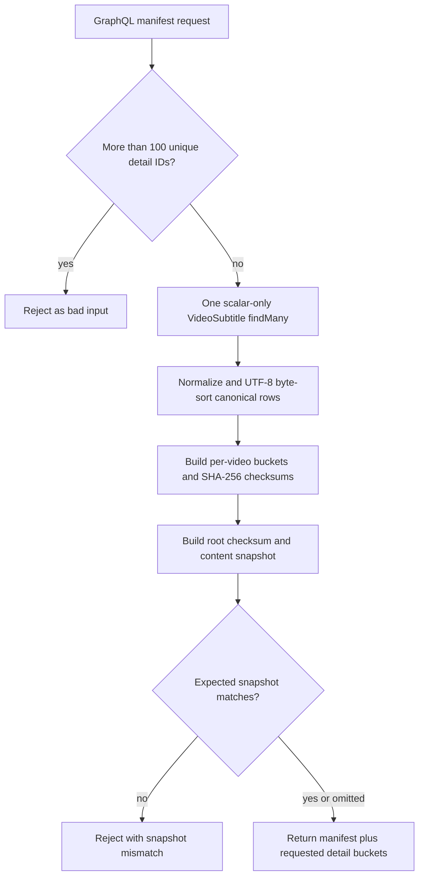

# Video Subtitle Checksum Manifest - Plan

## Goal Capsule

- **Objective:** Add a source-authoritative `api-media` GraphQL contract for trusted synchronization clients that detects and localizes drift in Core's repairable video-subtitle projection without depending on `updatedAt` completeness.
- **Authority:** The user request governs product behavior. Core repository instructions and the Media context govern implementation. This plan governs technical sequencing where neither source is more specific.
- **Execution profile:** One backward-compatible Core PR. No Prisma schema change, migration, historical snapshot store, or Forge consumer change is in scope.
- **Stop conditions:** Stop if the response cannot be derived from one PostgreSQL snapshot, if the public response cache cannot be bypassed for the query, or if generated GraphQL artifacts cannot represent the proposed contract without a breaking change.
- **Tail ownership:** The LFG pipeline owns implementation, focused verification, review, commit, push, PR creation, and CI follow-through.

---

## Product Contract

### Summary

Add a versioned subtitle-synchronization checksum manifest to `api-media`.
The query returns a content-addressed snapshot, a root checksum, per-video checksums, and guarded detail buckets derived from the same source read.

### Problem Frame

The current public `videoSubtitles` query is offset-paginated and caps an omitted limit at 100 records.
Its deterministic `updatedAt` and `id` ordering helps pagination, but independent pages do not share a database snapshot.
An incomplete or damaged downstream copy can therefore look healthy when synchronization relies only on timestamps or on parent records that did not change.

A checksum manifest must be authoritative for the data that Core can return and a downstream system can repair.
It must also avoid a false promise: a content token cannot reopen an old PostgreSQL MVCC snapshot after the original request ends.

### Actors

- A1. **Synchronization consumer:** Fetches the manifest, compares local buckets, requests mismatched details, and verifies the final state.
- A2. **Core `api-media`:** Reads the complete canonical subtitle projection, builds checksums, and rejects stale detail requests.
- A3. **Core operator:** Reviews query cost, cache behavior, schema compatibility, and diagnostics.

### Requirements

**Authoritative manifest**

- R1. `api-media` exposes one interop-authorized root query named `videoSubtitleChecksumManifest` that reads the complete canonical subtitle synchronization projection directly from Core's media database. A request without valid existing `isValidInterop` scope is rejected before the database read.
- R2. The query has the additive SDL shape `videoSubtitleChecksumManifest(detailsForVideoIds: [ID!], expectedSnapshot: String): VideoSubtitleChecksumManifest!`. The result exposes `version: Int!` with value `1`, `snapshot: String!`, `totalCount: Int!`, `rootChecksum: String!`, `buckets: [VideoSubtitleChecksumBucket!]!`, and `details: [VideoSubtitleChecksumDetail!]!`; each bucket exposes non-null `videoId: ID!`, `count: Int!`, and `checksum: String!`.
- R3. `buckets` contains only videos with one or more source subtitles, and `totalCount` equals the sum of all bucket counts.
- R4. The query bypasses Yoga public response caching so each execution reflects a current database statement snapshot.

**Canonical checksum contract**

- R5. Canonicalization version 1 hashes the repairable metadata tuple `[id, videoId, languageId, edition, primary, vttSrc, vttVersion, srtSrc, srtVersion, value]`, where `value` is `vttSrc ?? srtSrc ?? ''`. The two non-null integer version fields are included because Core can revise an object at the same URL by incrementing its version.
- R6. Version 1 preserves `null`, distinguishes `null` from an empty string, preserves stored Unicode code points without normalization, and serializes fixed-position JSON arrays as UTF-8 without whitespace.
- R7. Rows sort by UTF-8 byte order of `id`, buckets sort by UTF-8 byte order of `videoId`, and no checksum depends on database collation, response order, or locale.
- R8. Per-video and root inputs include separate domain identifiers and the canonicalization version, then use SHA-256 with lowercase hexadecimal output.
- R9. The root preimage commits to `totalCount` and the ordered `[videoId, count, checksum]` bucket tuples.
- R10. Any future change to fields, tuple positions, ordering, encoding, null handling, derived-value rules, or digest algorithm requires a new canonicalization version. Consumers must compare `version` before comparing checksums; an unsupported version is a contract incompatibility that stops reconciliation, not data drift. Future versions must be introduced additively with a documented overlap and deprecation window.

**Snapshot-aware detail reads**

- R11. The root query accepts optional `detailsForVideoIds` and `expectedSnapshot` arguments.
- R12. One scalar-only Prisma `findMany` result supplies the manifest, all requested detail rows, and every checksum returned by one field execution.
- R13. `details` returns one deterministic entry for every unique requested video ID, including an explicit zero-count, empty-subtitle entry when Core has no subtitles for that video.
- R14. Each detail entry returns non-null `videoId: ID!`, `count: Int!`, `checksum: String!`, and `subtitles: [VideoSubtitleChecksumRecord!]!`. Each flattened record exposes `id: ID!`, `videoId: ID!`, `languageId: ID!`, `edition: String!`, `primary: Boolean!`, `vttSrc: String`, `vttVersion: Int!`, `srtSrc: String`, `srtVersion: Int!`, and `value: String!`.
- R15. If `expectedSnapshot` does not equal the freshly computed snapshot, the non-null root field fails with GraphQL extension code `SUBTITLE_SNAPSHOT_MISMATCH` and returns no manifest or detail data.
- R16. Omitted, `null`, or empty `detailsForVideoIds` returns no detail entries; duplicate IDs are de-duplicated; detail entries sort by UTF-8 byte order of `videoId`; and more than 100 unique requested IDs fails with GraphQL extension code `BAD_USER_INPUT` before the database read.
- R17. A snapshot identifies equivalent canonical content, not a historical moment; separate calls may return different snapshots and an old token is not dereferenceable. Version 1 constructs the exact opaque token `subtitle-sync:v1:<rootChecksum>`.

**Compatibility and observability**

- R18. The existing `videoSubtitles` and `videoSubtitlesCount` fields remain unchanged, but their descriptions and the new query make clear that separate paginated reads are not snapshot-compatible with this manifest.
- R19. The manifest protects exactly the R5 synchronization projection, including source URLs and their Core version counters. It excludes `createdAt`, `updatedAt`, asset IDs, asset relations, publisher-only fields outside the projection, and the bytes stored behind VTT or SRT URLs; it must not be described as proving whole-record or object-byte equality.
- R20. The new query uses existing interop authentication, limits requested detail IDs, and performs one complete scalar read even for a manifest-only request. Existing public subtitle queries remain public and unchanged.
- R21. Generated `api-media`, gateway, and gql.tada artifacts include the additive contract.
- R22. A representative 12,000-row, 1,200-bucket manifest-only fixture produces at most 512 KiB of GraphQL JSON and the pure canonicalization/build step completes within one second on the PR validation machine; record the measurement in the PR instead of making wall-clock timing a flaky unit-test assertion.
- R23. The Core PR documents the required Forge follow-up: send the interop token, independently implement version 1 from the golden vectors, repair only differing buckets, and perform a final manifest verification. The existing Forge health dashboard must not treat this endpoint as adopted until that consumer work ships.

### Key Flows

- F1. **Nightly discovery**
  - **Trigger:** A synchronization consumer starts a drift audit.
  - **Actors:** A1, A2
  - **Steps:** Fetch the manifest without details, compare the root, then compare per-video buckets only when the root differs.
  - **Outcome:** Matching roots require no detailed Core payload or downstream writes.
  - **Covered by:** R1-R10, R17, R20-R22

- F2. **Targeted repair**
  - **Trigger:** One or more local bucket checksums differ from Core.
  - **Actors:** A1, A2
  - **Steps:** Request up to 100 video IDs through `detailsForVideoIds` and pass the discovery snapshot as `expectedSnapshot`; Core recomputes once and returns rows only when the content token still matches.
  - **Outcome:** Returned checksums and rows describe one database statement snapshot.
  - **Covered by:** R11-R16

- F3. **Delete-to-zero repair**
  - **Trigger:** The local system has subtitles for a video that is absent from Core's source buckets.
  - **Actors:** A1, A2
  - **Steps:** Request that video ID in the guarded detail call and receive an explicit zero-count detail entry with an empty subtitle list.
  - **Outcome:** The consumer can delete local source-owned rows without treating absence, errors, or truncation as authoritative data.
  - **Covered by:** R3, R13-R16

- F4. **Concurrent source change**
  - **Trigger:** Core subtitle metadata changes after discovery or during downstream repair.
  - **Actors:** A1, A2
  - **Steps:** A guarded detail request fails when its expected snapshot is stale; after applying a valid repair, the consumer fetches the manifest again and restarts if the source token changed.
  - **Outcome:** The consumer never claims convergence from rows paired with a different manifest state.
  - **Covered by:** R12, R15, R17

### Acceptance Examples

- AE1. **Stable permutation**
  - **Covers:** R5-R10
  - **Given:** The same subtitle records arrive from Prisma in different orders.
  - **When:** Version 1 canonicalization builds both manifests.
  - **Then:** Canonical bytes, bucket checksums, root checksum, and snapshot are identical.

- AE2. **Localized change**
  - **Covers:** R2-R10
  - **Given:** One canonical field changes on one subtitle.
  - **When:** A new manifest is built.
  - **Then:** That video's count or checksum and the root checksum change, while unrelated bucket checksums remain stable.

- AE2a. **Same-URL source revision**
  - **Covers:** R5, R8-R10
  - **Given:** A subtitle keeps the same source URL but its corresponding Core version counter increments.
  - **When:** Version 1 canonicalization builds a new manifest.
  - **Then:** That video's checksum and the root checksum change.

- AE3. **Non-canonical timestamp change**
  - **Covers:** R5, R19
  - **Given:** Only `createdAt`, `updatedAt`, or a publisher-only asset field changes.
  - **When:** A version 1 manifest is built.
  - **Then:** Its checksum values do not change.

- AE4. **Safe empty source bucket**
  - **Covers:** R3, R13-R16
  - **Given:** The consumer requests details for a video with no Core subtitles.
  - **When:** The expected snapshot still matches.
  - **Then:** `details` contains that video with count zero, the versioned empty-bucket checksum, and an empty subtitle list.

- AE5. **Stale repair plan**
  - **Covers:** R12, R15, R17
  - **Given:** Core changes after the consumer reads the discovery manifest.
  - **When:** The consumer requests details with the old snapshot.
  - **Then:** The root field fails with the snapshot-mismatch code and exposes no partial authoritative data.

- AE6. **Detail cap**
  - **Covers:** R16, R20
  - **Given:** An interop caller submits more than 100 unique detail IDs.
  - **When:** The query validates its arguments.
  - **Then:** It fails as bad input before the database read.

- AE7. **Authorization boundary**
  - **Covers:** R1, R20
  - **Given:** A caller has no valid interop scope.
  - **When:** It requests the manifest.
  - **Then:** Authorization fails before any full-table subtitle read.

- AE8. **Unsupported canonicalization version**
  - **Covers:** R10, R23
  - **Given:** A consumer receives a manifest version it does not implement.
  - **When:** It starts reconciliation.
  - **Then:** It stops with a contract-incompatibility signal and does not classify rows as drifted or write repairs.

### Success Criteria

- A manifest-only audit needs one Core GraphQL request and one scalar-only database statement.
- A guarded detail response can be proven to use the same rowset as its checksums and snapshot.
- Hard-coded golden vectors are sufficient for an independent Forge implementation to reproduce version 1.
- The additive schema passes Core's focused tests, type checks, lint, generation, gateway composition, and code generation.
- The representative-size benchmark satisfies R22 and its row count, bucket count, elapsed build time, and serialized response size appear in the PR description.

### Scope Boundaries

- This PR does not change Forge or any other consumer; R23 is a documented downstream dependency, not code in this PR.
- This PR does not materialize or retain historical database snapshots.
- This PR does not checksum VTT or SRT object bytes.
- This PR does not change the behavior, signature, authorization, pagination, or limit of the existing paginated subtitle query; it may clarify that query's schema description.
- This PR does not add Prisma columns, indexes, migrations, queues, caches, or scheduled jobs.
- New rate-limiting infrastructure, signing or HMAC authenticity, and persisted audit history are follow-up concerns, not part of version 1 drift detection. Existing interop authorization is required in this PR to bound access to the full-table operation.

---

## Planning Contract

### Key Technical Decisions

- KTD1. **Compute the manifest in Core from live source data.** (session-settled: user-directed — chosen over a Forge-only checksum of existing query results: an incomplete source response can otherwise make both sides agree on damaged data.) Governs R1-R4 and R20.
- KTD2. **Use hierarchical root and per-video checksums.** (session-settled: user-directed — chosen over one whole-table checksum: the root detects drift while buckets localize targeted repair.) Governs R2-R3 and R9.
- KTD3. **Use a guarded content-addressed snapshot contract.** (session-settled: user-directed — chosen over independent manifest and detail reads: concurrent writes can otherwise pair hashes with different rows.) A later request recomputes and compares the token; it does not reopen an old MVCC snapshot. Governs R11-R17.
- KTD4. **Version and golden-test the canonical bytes.** (session-settled: user-directed — chosen over implementation-defined hashing: Core and Forge need a byte-stable cross-repository contract.) Governs R5-R10 and R21.
- KTD5. **Use one scalar-only Prisma statement and computed Pothos DTOs.** PostgreSQL gives one `SELECT` one `READ COMMITTED` statement snapshot. A dedicated DTO prevents relation resolvers from adding reads outside that rowset. Governs R12-R14.
- KTD6. **Use fixed-position JSON tuples with domain separation.** Arrays remove object-key ordering ambiguity, while UTF-8 byte sorting avoids locale and database-collation drift. Governs R5-R10.
- KTD7. **Disable response caching at the root query coordinate.** Aggregate DTO invalidation is not tied to existing subtitle mutations, so a cached public response would violate source-authoritative freshness. Governs R4.
- KTD8. **Use existing interop authorization for the aggregate query.** The existing public paginated fields do not justify exposing an unauthenticated full-table scan. Interop requests already bypass Yoga's public response cache; the coordinate TTL remains zero as defense in depth. Governs R1, R4, and R20.
- KTD9. **Keep the global expected-snapshot guard for version 1.** An unrelated Core mutation may force a targeted repair batch to retry, but the global guard is the simplest proof that detail rows and discovery state still describe the same whole source. This is acceptable for a nightly audit at the present mutation rate. Consumers use bounded retries and defer the run rather than loop indefinitely; per-bucket guards are a follow-up if measured contention prevents completion. Governs R15 and R17.

### Assumptions

- Version 1 includes derived `value` because Forge currently persists it and a damaged downstream value must change the consumer's independently computed checksum; it remains redundant with the two source URL fields by design.
- Subtitle metadata and source URLs are the repair boundary. File-byte integrity needs a separate object-storage contract.
- Forge will need an interop credential and header support before adopting the endpoint; the Core contract does not fall back to public access.
- One complete scan of the current subtitle table is acceptable for a nightly audit; the observed dataset is about eleven thousand rows, and the response omits detail rows unless requested.
- A consumer performs a final manifest read after applying changes before claiming global convergence.
- The present subtitle mutation rate is low enough for a global guarded retry to finish during the nightly audit window; this assumption must be revisited if retry telemetry shows repeated starvation.

### High-Level Technical Design



The version 1 preimages are fixed arrays:

```text
["jfp.subtitle-sync.video", 1, videoId, [
  [id, videoId, languageId, edition, primary, vttSrc, vttVersion, srtSrc, srtVersion, value],
  ...
]]

["jfp.subtitle-sync.root", 1, totalCount, [
  [videoId, count, checksum],
  ...
]]
```

The digest is SHA-256 over `Buffer.from(JSON.stringify(preimage), 'utf8')` and is exposed as `sha256:<64 lowercase hex characters>`.
The snapshot is opaque to clients and version 1 constructs it as `subtitle-sync:v1:<rootChecksum>`.

### System-Wide Impact

- **GraphQL schema:** New computed DTOs, one additive query, two optional arguments, and generated subgraph/gateway/client introspection changes.
- **Database:** One full scalar projection per request. No schema or migration change.
- **Caching:** `Query.videoSubtitleChecksumManifest` receives TTL zero in the Yoga response-cache configuration.
- **Consumers:** Existing clients are unaffected. A Forge follow-up must add interop credentials and independently reproduce version 1 before using the guarded detail flow instead of `videoSubtitles` pages.
- **Security:** SHA-256 detects drift but does not authenticate Core against an attacker who can replace both data and manifest.

### Risks and Mitigations

| Risk | Consequence | Mitigation |
|---|---|---|
| A future resolver adds a relation load | Rows and hashes could span statements | Use a dedicated scalar DTO, exact Prisma `select`, and a resolver test that asserts one `findMany` call |
| An aggregate scan is abused | Memory, DB, or network amplification | Require existing interop authorization before the database read, cap unique detail IDs at 100, omit details by default, and measure representative payload cost |
| Response cache serves an aggregate after a mutation | A stale result appears source-authoritative | Set the root schema coordinate TTL to zero and test the exported cache configuration |
| Canonicalization changes silently | Core and Forge produce incompatible digests | Version every semantic change and pin literal canonical strings plus literal golden hashes |
| Source changes during downstream writes | Consumer ends at a mixed state | Guard details with `expectedSnapshot` and require a post-write manifest verification |
| URL target bytes change in place | Metadata checksum remains equal | State the metadata-only boundary and handle object integrity separately |
| A source object is revised at the same URL | URL-only checksum remains equal | Hash and return `vttVersion` and `srtVersion` in the version 1 projection |
| Unrelated writes repeatedly invalidate detail batches | A nightly repair cannot finish | Use bounded consumer retries, record failures, and add per-bucket guards only if measured contention warrants a versioned protocol extension |

### Research Sources

- `apis/api-media/src/schema/video/videoSubtitle/videoSubtitle.ts` — existing public pagination, source fields, and query conventions.
- `libs/prisma/media/db/schema.prisma` — authoritative subtitle model and uniqueness rules.
- `apis/api-media/src/yoga.ts` — public response-cache policy and schema-coordinate TTL overrides.
- `docs/brainstorms/2026-05-06-media-sync-endpoints-requirements.md` and `docs/plans/2026-05-06-001-feat-media-sync-endpoints-plan.md` — prior flat sync-query intent and compatibility constraints.
- [PostgreSQL transaction isolation](https://www.postgresql.org/docs/current/transaction-iso.html) — one `READ COMMITTED` statement sees one committed snapshot; later statements can see newer data.
- [GraphQL normal and serial execution](https://spec.graphql.org/October2021/#sec-Normal-and-Serial-Execution) — sibling query fields are not a sequencing boundary for shared snapshots.
- [RFC 8785 JSON Canonicalization Scheme](https://www.rfc-editor.org/rfc/rfc8785.html) — UTF-8 primitive serialization guidance; version 1 avoids object-key ordering through fixed arrays.
- [Node.js crypto hashing](https://nodejs.org/api/crypto.html#hashupdatedata-inputencoding) — SHA-256 and explicit UTF-8 input behavior.

---

## Implementation Units

### U1. Canonicalization and manifest builder

- **Goal:** Implement the version 1 canonical byte contract and pure hierarchical manifest builder.
- **Requirements:** R2-R10, R13-R14, R17, R19, R22
- **Files:**
  - `apis/api-media/src/schema/video/videoSubtitle/videoSubtitleChecksum.ts`
  - `apis/api-media/src/schema/video/videoSubtitle/videoSubtitleChecksum.spec.ts`
- **Approach:** Define scalar source and sync DTO types, an explicit UTF-8 comparator, fixed tuple builders, SHA-256 helpers, per-video grouping, empty requested buckets, root construction, and opaque snapshot construction. Keep database and GraphQL concerns out of the pure module.
- **Test scenarios:** Literal canonical JSON and digest vectors; empty dataset; shuffled order; null versus empty; quotes, slashes, CR/LF, emoji, and composed/decomposed Unicode; each canonical field mutation including both version counters; timestamp immunity at the source-type boundary; moved and removed rows; empty video checksum; total-count invariant; generated representative-size payload measurement.
- **Verification:** Run the focused checksum spec and confirm expected strings and hashes are literal constants, not outputs produced by the helper under test.
- **Dependencies:** None.

### U2. Snapshot-aware GraphQL contract

- **Goal:** Expose the manifest and guarded details from one Core source rowset.
- **Requirements:** R1-R3, R11-R18, R20, R23
- **Files:**
  - `apis/api-media/src/schema/video/videoSubtitle/videoSubtitleChecksumManifest.ts`
  - `apis/api-media/src/schema/video/videoSubtitle/videoSubtitleChecksumManifest.spec.ts`
  - `apis/api-media/src/schema/video/videoSubtitle/index.ts`
  - `apis/api-media/src/schema/video/videoSubtitle/videoSubtitle.ts`
- **Approach:** Register computed Pothos object references for the manifest, bucket, detail bucket, and flattened subtitle DTO with the exact R2/R14 nullability. Apply existing `isValidInterop` authorization before resolution. Validate and de-duplicate requested IDs before the database call. Use one `prisma.videoSubtitle.findMany` with an exact scalar `select`, feed its array into U1, reject a stale `expectedSnapshot` with the R15 code, and return UTF-8-sorted details including requested zero-source videos. Clarify the existing paginated field descriptions without behavioral changes.
- **Test scenarios:** Unauthorized request fails before read; authorized manifest query; exact `select`; one `findMany`; exact SDL/nullability; no details by default; requested and duplicate IDs; requested missing ID; deterministic detail order; 100-ID boundary; over-limit `BAD_USER_INPUT` before read; matching expected snapshot; stale `SUBTITLE_SNAPSHOT_MISMATCH` with no data; database failure with no empty-manifest fallback.
- **Verification:** Run both video-subtitle checksum specs through the `api-media` Vitest configuration.
- **Dependencies:** U1.

### U3. Freshness and generated contract

- **Goal:** Prevent stale aggregate responses and publish the additive schema through Core's generated artifacts.
- **Requirements:** R4, R18, R21
- **Files:**
  - `apis/api-media/src/yoga.ts`
  - `apis/api-media/src/schema/video/videoSubtitle/videoSubtitleChecksumManifest.spec.ts`
  - `apis/api-media/schema.graphql`
  - `apis/api-gateway/schema.graphql`
  - gql.tada/codegen outputs changed by `nx run-many -t codegen --skip-nx-cache`
- **Approach:** Export the response-cache coordinate map, assign TTL zero to the new root query as defense in depth even though interop requests bypass public caching, assert the coordinate in the manifest spec, generate the media schema, recompose the gateway, and regenerate consumers. Document the downstream Forge adoption dependency in the PR. Do not hand-edit generated files.
- **Test scenarios:** Cache configuration includes the exact query coordinate with zero TTL; generated media and gateway schemas contain all DTO fields, arguments, nullability, and descriptions; codegen has no stale-cache artifact.
- **Verification:** Run schema generation, gateway composition, and uncached codegen, then inspect the generated diff for only expected additive changes.
- **Dependencies:** U2.

---

## Verification Contract

| Gate | Command | Covers | Done signal |
|---|---|---|---|
| Canonical and resolver tests | `pnpm exec vitest run --config apis/api-media/vitest.config.mts 'apis/api-media/src/schema/video/videoSubtitle' --coverage=false` | U1-U3 | Golden vectors, GraphQL semantics, stale-snapshot behavior, and cache configuration pass |
| Formatting | `pnpm exec nx format:check --files=apis/api-media/src/schema/video/videoSubtitle/videoSubtitleChecksum.ts,apis/api-media/src/schema/video/videoSubtitle/videoSubtitleChecksum.spec.ts,apis/api-media/src/schema/video/videoSubtitle/videoSubtitleChecksumManifest.ts,apis/api-media/src/schema/video/videoSubtitle/videoSubtitleChecksumManifest.spec.ts,apis/api-media/src/schema/video/videoSubtitle/index.ts,apis/api-media/src/yoga.ts` | U1-U3 | No formatting diff |
| Lint | `pnpm exec nx run api-media:lint` | U1-U3 | API lint exits zero |
| Type check | `pnpm exec nx run api-media:type-check` | U1-U3 | TypeScript 7 check exits zero |
| Media schema | `pnpm exec nx run api-media:generate-graphql` | U2-U3 | `apis/api-media/schema.graphql` regenerates cleanly |
| Gateway schema | `pnpm exec nx run api-gateway:generate-graphql` | U3 | Federation composition succeeds and gateway schema is current |
| Consumer codegen | `pnpm exec nx run-many -t codegen --skip-nx-cache` | U3 | All generated consumers complete without stale cache output |
| PR scope audit | `git diff --check` and `git status --short` | U1-U3 | No whitespace errors, manual generated edits, Prisma change, or unrelated files |

Browser testing is not applicable because this PR adds no browser surface, UI route, client behavior, or rendered state.

---

## Definition of Done

- R1-R23 are implemented or explicitly blocked by evidence that invalidates this plan.
- Manifest-only and guarded-detail responses use exactly one scalar-only subtitle read.
- Snapshot mismatch, zero-source details, and error handling cannot be mistaken for authoritative deletion data.
- Canonical version 1 is documented by literal byte strings and literal golden SHA-256 digests that another repository can copy.
- The version 1 projection includes and returns both Core subtitle-file version counters, and the contract names every excluded field category so health cannot be overclaimed.
- Yoga response caching is disabled and test-covered for the root query coordinate.
- Existing subtitle queries and mutations remain backward compatible.
- Unauthorized callers cannot trigger the aggregate read, unsupported consumer versions halt without writes, and the required Forge adoption work is explicit in the PR.
- Representative-size cost and payload measurements meet R22 and are recorded in the PR.
- Generated media, gateway, and client artifacts are committed through their normal generators.
- Focused tests, formatting, lint, type check, schema generation, gateway composition, codegen, and diff checks pass or have a documented external blocker.
- No abandoned experiment, unused helper, debug logging, generated scratch file, schema migration, or unrelated refactor remains in the diff.
- The branch is pushed and a JesusFilm/core pull request explains the snapshot guarantee, retry protocol, metadata-only boundary, query cost, and verification evidence.
