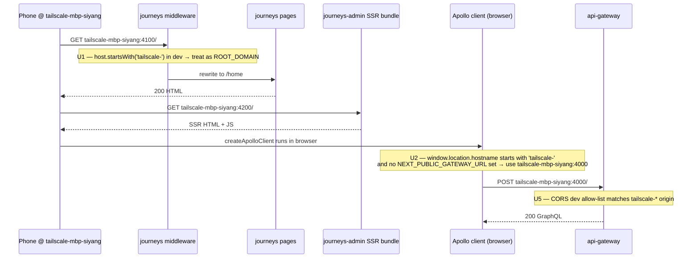
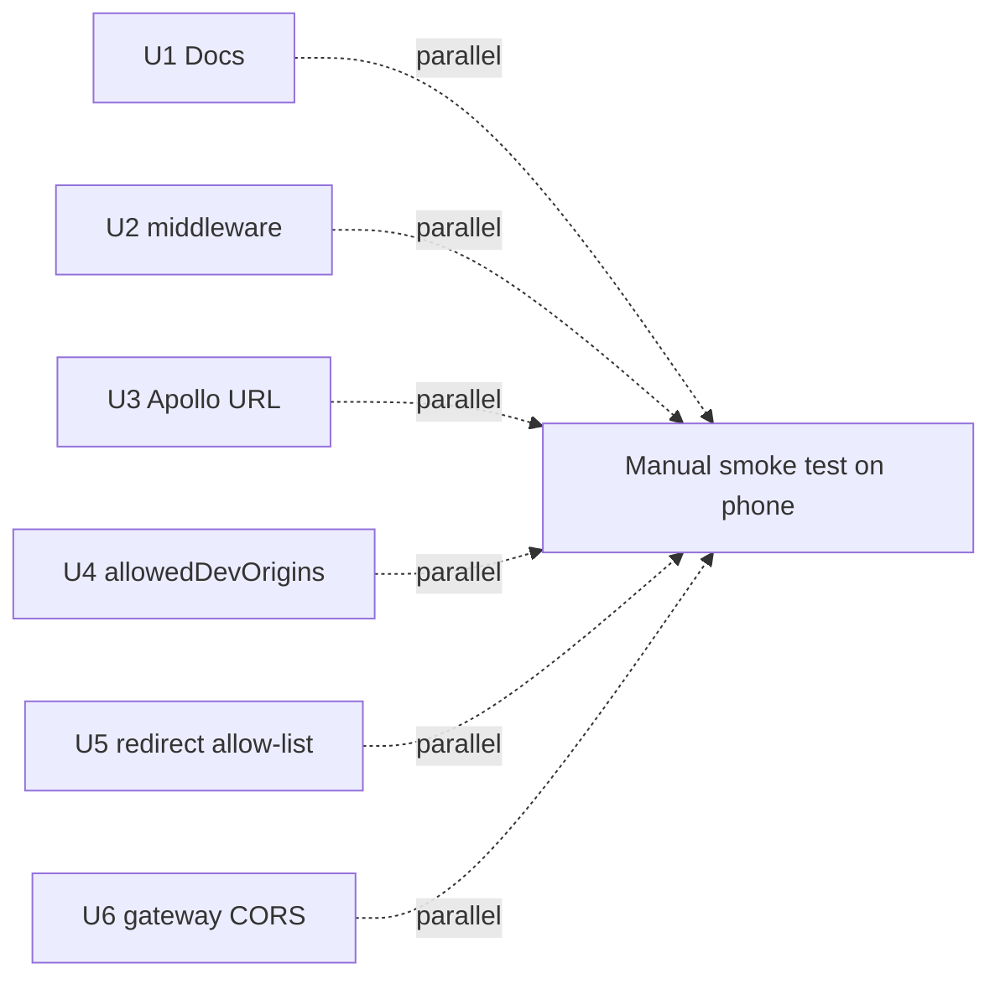

# feat(NES-1659): Tailscale dev-server access — setup docs + remove hardcoded hostnames

## Summary

Add manual Tailscale setup documentation so developers can share their local `journeys` / `journeys-admin` / `api-gateway` over the Tailnet for cross-device testing, audit the codebase for hostname assumptions that break the moment the dev server is reached over a non-`localhost` host, and ship the minimum code changes (Next.js middleware host check, Apollo gateway URL derivation from `window.location`, `allowedDevOrigins` entries, gateway CORS dev regex) that let those Tailscale hostnames work without per-developer env var fiddling.

This is **two deliverables in one PR**: a setup doc (workaround anyone can use today) plus the four code changes that remove the friction (preferred path).

---

## Problem Frame

Today a developer can run `nx serve journeys`, `nx serve journeys-admin`, and `nx serve api-gateway` on their workstation, but the moment they try to load `http://tailscale-mbp-siyang:4100` from a phone / iPad / co-worker's machine over Tailscale MagicDNS, three things break:

1. **`apps/journeys/middleware.ts`** uses `req.headers.get('host')` and rewrites every non-`NEXT_PUBLIC_ROOT_DOMAIN` host into `/[hostname]/[slug]` — so a Tailscale hostname falls through to "treat this as a custom-journey-domain" instead of the dev root.
2. **`apps/journeys-admin/src/libs/apolloClient/apolloClient.ts`** defaults the gateway URL to `http://localhost:4000` — the _phone_ doesn't have a localhost at port 4000, so every GraphQL request fails the second the bundle ships to a non-host device.
3. **`allowedDevOrigins`** doesn't exist in either `next.config.js`. On Next.js 15.5 this is currently a warning ("blocked in a future major version"); on 16.x it's a hard block. We are on 15.5.10 today but will upgrade — fix it now to avoid the regression.
4. **`apis/api-gateway/gateway.prod.config.ts`** CORS regex only allows `http://localhost:\d+` for dev origins — a request from `http://tailscale-mbp-siyang:4100` is rejected.

Net effect: every developer who wants to test on a real mobile device has to either (a) tunnel through ngrok, (b) hand-set five env vars, or (c) skip mobile testing. This plan removes the friction.

---

## Linear Ticket Reference

The Linear ticket URL is in frontmatter. Linear MCP is **not** connected in this environment — the agent was unable to pull the ticket body directly. The user-supplied spec in the invocation message is treated as authoritative; if the Linear body diverges, the user should flag during review and this plan will be revised. This is called out as **Blocker B1** below.

---

## Requirements

- R1. A developer following `docs/development/tailscale-dev-access.md` end-to-end can load `journeys` and `journeys-admin` over a Tailscale MagicDNS hostname on a second device with no per-app env-var changes other than the documented setup.
- R2. The four target code surfaces accept any host matching `tailscale-*` (case-insensitive, dev mode only) without breaking existing `localhost`, `your.nextstep.is`, or Vercel-preview behavior.
- R3. The codebase audit (Part 2) is complete: every hardcoded `localhost`, `127.0.0.1`, `:4000`, `:4100`, `your.nextstep.is`, `admin.nextstep.is` in production code paths is either (a) confirmed safe, (b) included in this plan as a code change, or (c) explicitly deferred with rationale.
- R4. The `tailscale-` hostname prefix is the **dev-only** opt-in marker — no Tailscale logic ships in production builds (gated on `process.env.NODE_ENV === 'development'`).
- R5. No regression to existing unit tests in `apps/journeys-admin/middleware.spec.ts`, `apps/journeys-admin/src/libs/apolloClient/apolloClient.test.ts`, or `apps/journeys-admin/src/libs/auth/getAuthTokens` specs.
- R6. New behavior has test coverage: middleware host-prefix branch, Apollo gateway URL derivation in dev, gateway CORS dev-mode allow-list.

---

## Scope Boundaries

- **In scope:** `apps/journeys/middleware.ts`, `apps/journeys/next.config.js`, `apps/journeys-admin/next.config.js`, `apps/journeys-admin/src/libs/apolloClient/apolloClient.ts`, `apis/api-gateway/gateway.prod.config.ts` (CORS), `apps/journeys-admin/src/libs/auth/getAuthTokens.ts` (dev-host allowlist), one new doc file under `docs/development/`.
- **Not in scope:** Tailscale ACL config, MagicDNS DNS server setup at the org level, Tailscale subnet routers, any prod cert/HTTPS work, any other Next.js app (`watch`, `videos-admin`, `arclight`, `resources`, `short-links`, `cms`) — flagged as scope additions below but deferred unless the user widens scope.
- **Not in scope:** Adding a regex matcher for `allowedDevOrigins` — Next.js docs confirm wildcards (`*.foo.com`) are supported but **regex is not** (see Open Question Q1 below). The plan uses wildcards.

### Deferred to Follow-Up Work

- **Other Next apps** (`watch`, `videos-admin`, `arclight`, `resources`, `short-links`, `cms`): each has its own `next.config.*` and Apollo client. Audit findings show they consume `NEXT_PUBLIC_GATEWAY_URL` via `process.env` (no localhost fallback baked in), so the smaller blast-radius fix is to document setting that env var. Code changes deferred to a follow-up unless a developer asks to test those apps over Tailscale this iteration.
- **`apps/journeys-admin/src/components/Editor/Toolbar/Items/ShareItem/QrCodeDialog/QrCodeDialog.tsx` (`isLocal ? ':4100' : ''`)**: the QR code dialog hardcodes the dev port. Out of scope — the QR code is for a published journey URL, not for cross-device dev testing, but flag as scope addition for user approval.

---

## Context & Research

### Relevant Code and Patterns

- `apps/journeys/middleware.ts:24-26` — single source of host parsing in journeys.
- `apps/journeys-admin/src/libs/apolloClient/apolloClient.ts:109-122` — `createApolloClient(token)` constructs both `httpLink` and `sseLink` from a single `gatewayUrl` string. Both must be updated together.
- `apps/journeys-admin/src/libs/auth/getAuthTokens.ts:59-63` — `ALLOWED_REDIRECT_HOSTS` is the existing "dev hosts allow-list" pattern; mirror it.
- `apis/api-gateway/gateway.prod.config.ts:23-65` — `cors(request)` function with origin allow-list including a `^http://localhost:\d+$` regex. Same regex-set pattern is the right home for a Tailscale dev regex.
- `apis/api-gateway/src/common.config.ts:14` — `port: 4000` hardcoded; the `host` field is **not** set, so Hive Gateway uses its OS default (`0.0.0.0` on macOS/Linux — see Open Question Q4).

### Institutional Learnings

- No `docs/solutions/` entry exists for Tailscale or non-localhost dev access. This plan should produce one once shipped (post-PR follow-up via `ce-compound`).
- `apps/journeys/AGENTS.md` (read) — Pages Router, `pages/[hostname]/[journeySlug].tsx` is the catch-all dynamic route. Anything middleware doesn't rewrite to `/home/*` lands here, which is why a Tailscale hostname currently breaks the dev UX (it tries to load a journey with slug = the Tailscale hostname).
- `apps/journeys-admin/middleware.spec.ts` — existing spec uses `http://localhost:4200/...`. Tailscale tests should add new spec rows, not replace the existing ones.

### External References

- Next.js 16 docs (`https://nextjs.org/docs/app/api-reference/config/next-config-js/allowedDevOrigins`) — confirms wildcard syntax `'*.local-origin.dev'` is supported. Regex objects are not mentioned and are not in the example. This is the **Open Question Q1** verification result.
- Next.js 15 docs (`https://nextjs.org/docs/15/app/api-reference/config/next-config-js/allowedDevOrigins`) — same wildcard syntax shown in v15.5.18 docs. Forward-compatible.
- Hive Gateway docs (`https://the-guild.dev/graphql/hive/docs/api-reference/gateway-config`) — `host` configurable in config file. CLI source review confirms `host: '0.0.0.0'` is the default on macOS/Linux and `127.0.0.1` on Windows/WSL. So **the gateway already accepts Tailnet traffic on macOS/Linux dev machines**; no `host` config change needed (Open Question Q4 resolved).

---

## Audit findings (first pass)

These are concrete hits from the codebase audit. Filename:line.

### A. `apps/journeys/middleware.ts`

- L24-26: `let hostname = req.headers.get('host') ?? ''` — comment explicitly enumerates "your.nextstep.is, localhost:4100, example.com" as known shapes. **Target of code change U1.**

### B. `apps/journeys/next.config.js`

- L14: `{ protocol: 'http', hostname: 'localhost' }` in `images.remotePatterns`. **Safe** — only restricts `next/image` optimizer source domains, doesn't affect dev origin check.
- No `allowedDevOrigins` key. **Target of code change U3.**

### C. `apps/journeys-admin/next.config.js`

- L14: same `images.remotePatterns` localhost entry. **Safe.**
- No `allowedDevOrigins` key. **Target of code change U3.**

### D. `apps/journeys-admin/src/libs/apolloClient/apolloClient.ts`

- L113: `process.env.NEXT_PUBLIC_GATEWAY_URL || 'http://localhost:4000'`. **Note:** spec called this "hardcoded to a specific dev URL"; the actual code reads an env var with a localhost _fallback_. The defect under Tailscale is: when `NEXT_PUBLIC_GATEWAY_URL` is _unset_ (most dev setups), the phone receives a bundle pointing at `http://localhost:4000` which doesn't resolve on the phone. **Target of code change U2.**

### E. `apps/journeys-admin/src/libs/auth/getAuthTokens.ts`

- L47: `new URL(ctx.resolvedUrl, 'https://admin.nextstep.is')` — fallback base for relative paths. **Safe** — base only used when `ctx.resolvedUrl` is already relative; doesn't matter for Tailscale routing.
- L59-63: `ALLOWED_REDIRECT_HOSTS = ['localhost:4200', 'admin.nextstep.is', 'admin-stage.nextstep.is']`. **Target of code change U4** — Tailscale hostname must be allowed in dev for the sign-in redirect flow, otherwise users on the phone bounce to a 400 "invalid redirect host".

### F. `apis/api-gateway/src/common.config.ts`

- L14: `port: 4000`. **Safe** — port is fine; no `host` set, defaults to `0.0.0.0` on macOS/Linux per Hive Gateway source. **The spec's concern about `127.0.0.1`-only binding is wrong on this repo**; no change needed. Flag as Open Question Q4 closed.

### G. `apis/api-gateway/gateway.prod.config.ts`

- L50: `/^http:\/\/localhost:\d+$/` in the CORS allow-list. **Target of code change U5** — add a Tailscale dev regex sibling, dev-mode-gated.
- L18: `'http://0.0.0.0:4317'` is the OTLP exporter URL, unrelated.

### H. `apps/journeys-admin/src/libs/apolloClient/apolloClient.test.ts`

- L68, L113, L150: `new SSELink('http://localhost:4000')`. **Safe** — these are test fixtures, not runtime. No change needed unless U2 changes the SSELink constructor signature (it won't).

### I. `apps/journeys-admin/src/components/Editor/Toolbar/Items/ShareItem/QrCodeDialog/QrCodeDialog.tsx`

- L142: `const port = isLocal ? ':4100' : ''`. Audited but **out of scope** — flagged as Deferred (see Scope Boundaries). The QR code is for a published-journey URL given to end users; cross-device dev testing of the QR code itself is a different concern.

### J. Other apps (`watch`, `videos-admin`, `arclight`, `resources`, `short-links`, `cms`)

- All consume `process.env.NEXT_PUBLIC_GATEWAY_URL` directly with **no localhost fallback** (audit grep results: `apps/videos-admin/src/libs/apollo/makeClient.ts:15`, `apps/short-links/src/lib/apolloClient/apolloClient.ts:8`, etc.). **Safe** — these fail-closed when the env var is unset, so a developer running them under Tailscale just needs to set `NEXT_PUBLIC_GATEWAY_URL`. Document in Part 1.

### K. `apps/journeys/pages/.../[hostname]/...` — your.nextstep.is references

- 14 occurrences of `process.env.NEXT_PUBLIC_VERCEL_URL ?? 'your.nextstep.is'`. **Safe** — these are fallback display strings (oEmbed canonical URLs, share dialogs). Don't affect dev routing.

**Audit total**: 4 files require code changes (D, E, G, plus middleware A), 2 files require new keys (B, C). 1 file is a scope-addition candidate (I). No surprise additions beyond what the spec already named.

---

## Key Technical Decisions

- **Prefix `tailscale-` is the dev-only opt-in marker.** Developers name their Tailnet device `tailscale-<initials>-<machine>` (e.g. `tailscale-mbp-siyang`). MagicDNS then surfaces `http://tailscale-mbp-siyang:4100`. This is human-controlled, predictable, and gives every check (`host.startsWith('tailscale-')`) a single source of truth. Rationale: avoids encoding the Tailnet hash (`tail<hash>.ts.net`) which differs per organization and rotates.
- **All Tailscale acceptance is gated on `process.env.NODE_ENV === 'development'`** (or `NODE_ENV !== 'production'` where matching the existing dev/prod split is cleaner). No production build accepts a `tailscale-*` host.
- **Apollo gateway URL derivation** — use `window.location.protocol + '//' + window.location.hostname + ':4000'` only when `typeof window !== 'undefined'`, `NODE_ENV === 'development'`, `NEXT_PUBLIC_GATEWAY_URL` is unset, **and** `window.location.hostname.startsWith('tailscale-')`. Other dev hosts (localhost, IPs) keep today's `localhost:4000` fallback to avoid behavior change.
- **`allowedDevOrigins` uses wildcard syntax**, not regex. Per Next.js 15 + 16 docs, only string literals and `*.foo.com` wildcards are supported. Use `['tailscale-*']` (matches the bare hostname; Next strips port for the origin check) per the v16 docs example.
- **Branch name**: user wants `siyangcao/nes-1659-tailscale-dev-server-access`. This matches the existing CLAUDE.md regex pattern (`[a-z]+\/[a-z0-9]{2,4}-[0-9]+-[a-z0-9-]+` → `siyangcao/nes-1659-...`). Defer rename until user confirms.
- **PR title proposal**: `feat(NES-1659): Tailscale dev access — middleware + Apollo + CORS + docs` — **75 chars** before commitbot appends ` #(NNNN)` (commitlint cap 100, dangerfile reserves ~8 chars for `#NNNN`). Under the 92-char budget from memory. User to sanity-check.

---

## Open Questions

### Resolved During Planning

- **Q1. Does Next.js 16 `allowedDevOrigins` accept regex or wildcard entries?**
  **Answer**: Wildcards yes (`*.local-origin.dev`), regex no. Verified from Next.js v16.2.6 docs (`https://nextjs.org/docs/app/api-reference/config/next-config-js/allowedDevOrigins`, lastUpdated 2026-05-07) which show `allowedDevOrigins: ['local-origin.dev', '*.local-origin.dev']` as the only documented entry forms. Same syntax shown in v15.5.18 docs. Use `'tailscale-*'` as the dev origin entry.

- **Q2. Does `NEXT_PUBLIC_GATEWAY_URL` already exist as an env var elsewhere?**
  **Answer**: Yes, widely. Audited usage spans `apps/videos-admin/src/libs/environment.ts`, `apps/short-links/src/lib/apolloClient/apolloClient.ts`, `apps/arclight/src/lib/apolloClient/apolloClient.ts`, `apps/resources/src/libs/apolloClient/apolloClient.ts`, `apps/journeys-admin/pages/_app.tsx:94`. **Decision**: do not introduce a new env var name; keep `NEXT_PUBLIC_GATEWAY_URL` as the override and only derive from `window.location` when it's unset _and_ the host is `tailscale-*`. This matches the principle of least surprise.

- **Q3. Is the `host.startsWith('tailscale-')` check robust to port suffixes?**
  **Answer**: `req.headers.get('host')` in Next middleware includes the port (e.g. `tailscale-mbp-siyang:4100`). `startsWith` is unaffected. `window.location.hostname` returns the bare hostname (no port). Both check forms work.

- **Q4. Does the gateway already bind to `0.0.0.0` so Tailnet clients can reach it?**
  **Answer**: Yes on macOS and Linux. Verified from the Hive Gateway CLI source: default is `0.0.0.0` except on Windows/WSL where it's `127.0.0.1`. The repo's `apis/api-gateway/src/common.config.ts` does not set `host`, so the OS default applies. **No change needed**; gateway already reachable over Tailnet. This invalidates the spec's Part 3 item 4 — flag to the user as a scope-reducer.

### Deferred to Implementation

- **Q5. Should the Tailscale CORS regex be `^http:\/\/tailscale-[a-z0-9-]+(:\d+)?$` or `^https?:\/\/tailscale-[a-z0-9-]+(:\d+)?$`?**
  Tailscale MagicDNS serves over HTTP for self-hosted dev unless the developer enables Tailscale Funnel (which uses HTTPS). Defer; pick the regex during implementation after a 30-second test with Funnel enabled. Default plan: HTTP-only first, widen if needed.

- **Q6. Does `pages/_app.tsx:94`'s `<link rel="preconnect" href={process.env.NEXT_PUBLIC_GATEWAY_URL}>` need the same derivation?**
  Likely yes for max cache benefit, but preconnect is a hint not a hard dependency. Defer to implementation — if Apollo's URL changes via U2, audit the preconnect at the same time.

### Blocking

- **B1. Linear ticket body unread.** Linear MCP not connected. The Linear ticket may contain acceptance criteria, screenshots, or scope notes the user-supplied invocation didn't surface. **Action**: user to either paste the ticket body into a follow-up, or confirm "spec in the invocation is authoritative; proceed". The plan assumes the latter.

---

## High-Level Technical Design



_This illustrates the intended approach and is directional guidance for review, not implementation specification._

---

## Implementation Units

### Part 1 — Documentation

- U1. **Write `docs/development/tailscale-dev-access.md`**

  **Goal:** Self-service runbook so any developer can set up Tailscale dev access in under 15 minutes without asking the team.

  **Requirements:** R1, R3

  **Dependencies:** None

  **Files:**
  - Create: `docs/development/tailscale-dev-access.md`

  **Approach:**
  - Section outline:
    1. **Why this exists** — one paragraph: cross-device testing without ngrok, no prod cert needed.
    2. **Prerequisites** — Tailscale account joined to the JFP tailnet, admin invite confirmed, Tailscale macOS/Linux client installed (link to tailscale.com/download).
    3. **Step 1 — Install Tailscale and join the tailnet** — `brew install --cask tailscale`, sign-in flow, accept invite. _(Screenshot TBD)_.
    4. **Step 2 — Rename your device to `tailscale-<initials>-<machine>`** — Tailscale admin console → Machines → rename. _(Screenshot TBD)_.
    5. **Step 3 — Enable MagicDNS** — Tailscale admin console → DNS → Enable MagicDNS. _(Screenshot TBD)_.
    6. **Step 4 — Verify connectivity** — from a second device on the tailnet, `ping tailscale-<your-name>`.
    7. **Step 5 — Run the stack** — `nx serve api-gateway journeys journeys-admin` as usual. Note: no env var changes required after the code in this PR lands.
    8. **Step 5a — For pre-PR workaround** — set `NEXT_PUBLIC_GATEWAY_URL=http://<tailscale-host>:4000` and skip the middleware host check (paste this as the manual workaround for anyone testing before the PR merges).
    9. **Step 6 — Testing other apps over Tailscale** (`watch`, `videos-admin`, `arclight`, `resources`, `short-links`, `cms`) — set `NEXT_PUBLIC_GATEWAY_URL=http://<tailscale-host>:4000` in each app's `.env` (these apps have no localhost fallback).
    10. **Troubleshooting** — "I see a 'cross-origin blocked' warning", "Phone can ping but browser hangs", "Sign-in redirect bounces to localhost".
    11. **Screenshots TBD** — explicitly list the 4 placeholder screenshots and where they go in the doc.
  - Use H2 (`##`) for top-level sections, H3 (`###`) for sub-steps. No code fences for shell except actual commands. Cross-link from the root `README.md`'s "Getting Started" section as a follow-up bullet.

  **Patterns to follow:**
  - `docs/ai-foundations.md` for tone, heading depth, and code-fence convention.

  **Test expectation:** none -- documentation-only unit. Verification is the dogfood step in U2-U5 manual matrix.

  **Verification:**
  - File exists at the path.
  - User reviewer can follow the doc on a fresh device and reach the running journeys app over Tailscale.

---

### Part 2 — Code: middleware host-prefix support

- U2. **Add `tailscale-` host-prefix branch to `apps/journeys/middleware.ts`**

  **Goal:** When the request `host` header starts with `tailscale-` and we're in dev, treat it as the root domain (rewrite to `/home`) rather than as a custom-journey hostname.

  **Requirements:** R2, R4

  **Dependencies:** None (parallel with U3, U4, U5, U6)

  **Files:**
  - Modify: `apps/journeys/middleware.ts`
  - Test: `apps/journeys/middleware.spec.ts` _(create — does not exist today)_

  **Approach:**
  - After the existing Vercel preview-deployment check (around line 35), add a dev-mode branch:
    - If `process.env.NODE_ENV !== 'production'` and `hostname.toLowerCase().startsWith('tailscale-')`, set `hostname = process.env.NEXT_PUBLIC_ROOT_DOMAIN ?? hostname` so the existing root-domain rewrite below catches it.
    - Use `toLowerCase()` so a host header sent in mixed case still matches.
  - Add an early guard at function top: if `NODE_ENV === 'production'`, never enter the tailscale branch (defense in depth even though the env check above already handles it).
  - **Do not** change behavior for non-`tailscale-` hosts. The existing `/[hostname]/[slug]` rewrite continues to handle Vercel previews, custom domains, and `your.nextstep.is`.

  **Patterns to follow:**
  - The existing Vercel preview check at L29-35 is the model for "transform hostname before rewrite decision".

  **Test scenarios:**
  - Happy path: `host: 'tailscale-mbp-siyang:4100'`, `NODE_ENV: 'development'`, `NEXT_PUBLIC_ROOT_DOMAIN: 'localhost:4100'` → rewrites to `/home`, not `/tailscale-mbp-siyang:4100`.
  - Happy path: same host but `NODE_ENV: 'production'` → falls through to `/[hostname]` rewrite (no Tailscale shortcut in prod).
  - Edge case: `host: 'TAILSCALE-MBP-SIYANG:4100'` (uppercase) in dev → still matches via `toLowerCase()`.
  - Edge case: `host: 'tailscale-'` (the bare prefix with nothing after) in dev → matches; rewrites to `/home`. Document that this is intentional — the prefix is the contract.
  - Edge case: `host: 'tailscaleother.com'` in dev → does not match (the trailing hyphen is required by `startsWith('tailscale-')`).
  - Error path: `host` header missing entirely → `hostname = ''`, falls through to `/[hostname]/...` as today (no regression).
  - Integration: with `NEXT_PUBLIC_VERCEL_DEPLOYMENT_SUFFIX` set and a Vercel-preview host → Vercel branch wins; tailscale branch never runs (verifies ordering).

  **Verification:**
  - Running `nx serve journeys` on the host machine + loading `http://tailscale-<name>:4100/` from a second device renders the home page (not a 404 hostname-as-slug page).
  - `npx jest --config apps/journeys/jest.config.ts --no-coverage apps/journeys/middleware.spec.ts` passes.

---

### Part 2 — Code: Apollo gateway URL derivation

- U3. **Derive gateway URL from `window.location` in dev when host is `tailscale-*`**

  **Goal:** When the journeys-admin bundle is loaded over a Tailscale hostname, the browser's Apollo client should point at the same hostname's port 4000, not at `localhost:4000`.

  **Requirements:** R2, R4, R6

  **Dependencies:** None (parallel with U2, U4, U5, U6)

  **Files:**
  - Modify: `apps/journeys-admin/src/libs/apolloClient/apolloClient.ts`
  - Test: `apps/journeys-admin/src/libs/apolloClient/apolloClient.test.ts`

  **Approach:**
  - Replace L112-113's `gatewayUrl` constant with a small helper:
    - If `process.env.NEXT_PUBLIC_GATEWAY_URL` is set → use it (no change).
    - Else if `typeof window !== 'undefined'` and `process.env.NODE_ENV !== 'production'` and `window.location.hostname.toLowerCase().startsWith('tailscale-')` → return `\`${window.location.protocol}//${window.location.hostname}:4000\``.
    - Else → fall back to `'http://localhost:4000'` (today's behavior, preserves SSR + non-Tailscale dev).
  - **Important:** SSE link `new SSELink(gatewayUrl)` and HTTP link `new HttpLink({ uri: gatewayUrl })` must share the same computed URL. The current code reuses the constant — preserve that.
  - SSR consideration: on the server, `window` is undefined → falls back to env var or localhost (server _can_ reach localhost:4000 directly even when the request came over Tailscale, because the gateway runs on the same host machine). This is correct.

  **Patterns to follow:**
  - The pattern of "env-var-override with computed fallback" already exists in `apps/journeys-admin/src/libs/auth/getAuthTokens.ts` for the host allow-list.

  **Test scenarios:**
  - Happy path (env override): `NEXT_PUBLIC_GATEWAY_URL='https://stage-gw.example.com'`, `window.location.hostname='tailscale-mbp'` → uses env value. _(Verify env always wins.)_
  - Happy path (Tailscale derivation): env unset, `window.location.hostname='tailscale-mbp-siyang'`, `protocol='http:'`, `NODE_ENV='development'` → `http://tailscale-mbp-siyang:4000`.
  - Happy path (localhost preserved): env unset, `window.location.hostname='localhost'` → `http://localhost:4000`.
  - Edge case (HTTPS): `protocol='https:'`, hostname is `tailscale-*` → `https://tailscale-mbp:4000`. _(Supports Tailscale Funnel.)_
  - Edge case (SSR): `typeof window === 'undefined'` (Jest jsdom test forcing this) → falls back to localhost.
  - Edge case (production gate): env unset, hostname is `tailscale-mbp`, `NODE_ENV='production'` → uses localhost fallback (never derives in prod).
  - Integration: the SSE link and HTTP link receive the same URL string. _(Critical — they share connections via cookies for auth.)_

  **Verification:**
  - On a phone loading `http://tailscale-mbp-siyang:4200/`, the Network panel (or `chrome://inspect`) shows GraphQL POSTs going to `http://tailscale-mbp-siyang:4000/`, not `localhost:4000`.
  - `npx jest --config apps/journeys-admin/jest.config.ts --no-coverage apps/journeys-admin/src/libs/apolloClient/apolloClient.test.ts` passes.

---

### Part 2 — Code: `allowedDevOrigins`

- U4. **Add `allowedDevOrigins: ['tailscale-*']` to both `next.config.js` files**

  **Goal:** Suppress the Next.js dev-server cross-origin warning (15.x) / block (16.x) for Tailscale hostnames.

  **Requirements:** R2

  **Dependencies:** None (parallel with U2, U3, U5, U6)

  **Files:**
  - Modify: `apps/journeys/next.config.js`
  - Modify: `apps/journeys-admin/next.config.js`

  **Approach:**
  - Add `allowedDevOrigins: ['tailscale-*']` as a sibling of `images:` in both files.
  - Per Next.js 15.5 + 16.x docs, wildcards are supported; regex is not. Wildcard matches any hostname starting with `tailscale-` regardless of port (Next strips port for the origin check).
  - This setting is dev-only by Next.js's own semantics — no `NODE_ENV` gate needed in config.

  **Patterns to follow:**
  - No prior `allowedDevOrigins` usage in the repo; this is the first occurrence. Keep the change minimal and well-commented (link to Next.js docs URL inline).

  **Test scenarios:**
  - Test expectation: none -- pure config edit, behavior verified via dev-server console (no warning when loading over Tailscale).

  **Verification:**
  - Running `nx serve journeys` and loading `http://tailscale-mbp:4100/` produces no `Blocked cross-origin request` warning in the dev server stdout.
  - Same for `nx serve journeys-admin` on `:4200`.

---

### Part 2 — Code: redirect-host allow-list

- U5. **Add Tailscale prefix matching to `ALLOWED_REDIRECT_HOSTS` in `getAuthTokens.ts`**

  **Goal:** Sign-in success redirect from `tailscale-mbp:4200/users/sign-in?redirect=...` doesn't bounce to "invalid redirect host".

  **Requirements:** R2, R4, R5

  **Dependencies:** None (parallel with U2, U3, U4, U6)

  **Files:**
  - Modify: `apps/journeys-admin/src/libs/auth/getAuthTokens.ts`
  - Test: `apps/journeys-admin/src/libs/auth/getAuthTokens.spec.ts` _(file already exists per repo convention; add cases)_

  **Approach:**
  - Inside `redirectToApp` where `allowedHost(new URL(redirectUrl).host, ALLOWED_REDIRECT_HOSTS)` is called, augment the allow-check to additionally pass when:
    - `process.env.NODE_ENV !== 'production'`, **and**
    - the host (lowercased) starts with `tailscale-`.
  - Prefer changing the `allowedHost(...)` helper if it's a single-line predicate (audit during implementation) rather than the call site, so the dev-prefix logic is centralized.
  - **Do not** add `tailscale-*` directly to the `ALLOWED_REDIRECT_HOSTS` array — that array is exact-match and used in non-dev paths too.

  **Patterns to follow:**
  - The `ALLOWED_REDIRECT_HOSTS` array pattern itself, augmented with a dev-only prefix branch in the predicate.

  **Test scenarios:**
  - Happy path: `redirectUrl='http://tailscale-mbp:4200/journeys'` in dev → allowed.
  - Happy path: same in prod → rejected (falls back to `/` redirect per existing logic).
  - Edge case: `redirectUrl='http://tailscale-evil.com/'` in dev — matches `startsWith('tailscale-')`, so this **is** allowed. Document as an accepted dev-only risk (an attacker would already need to control DNS or the dev's hosts file; the prefix is dev-mode only). Out of scope to tighten further unless user asks.
  - Edge case: existing `localhost:4200` redirect still works.
  - Edge case: existing `admin.nextstep.is` redirect still works.
  - Error path: `redirectUrl` is an absolute URL with no scheme → caught by the existing `new URL(...)` try/catch.

  **Verification:**
  - On a phone, sign in via Firebase → land back on the originally-requested journey URL with the Tailscale host preserved.
  - All existing tests in `getAuthTokens.spec.ts` still pass.

---

### Part 2 — Code: gateway CORS dev regex

- U6. **Add Tailscale dev regex to `apis/api-gateway/gateway.prod.config.ts` CORS allow-list**

  **Goal:** A GraphQL request originating from `http://tailscale-mbp:4200` passes the gateway's CORS check.

  **Requirements:** R2, R4

  **Dependencies:** None (parallel with U2, U3, U4, U5)

  **Files:**
  - Modify: `apis/api-gateway/gateway.prod.config.ts`

  **Approach:**
  - Inside the `cors(request)` allow-list array (around L31-55), add a regex sibling to the existing `^http:\/\/localhost:\d+$` entry:
    - `/^http:\/\/tailscale-[a-z0-9-]+(:\d+)?$/`
  - **Gate on env**: only include this regex when `process.env.NODE_ENV !== 'production'`. Easiest: build the allow-list array conditionally before passing to `.some(...)`, or use spread with a conditional.
  - File name says "prod.config" but per the codebase this file is loaded for stage + production. Dev uses `gateway.config.ts` which extends `commonConfig` and does **not** set `cors`. Audit during implementation: does dev need CORS at all? If dev's gateway has no `cors` config, requests are allowed by default — in which case U6 may be a no-op for the literal Tailscale flow and only matters for stage testing. **Defer the exact placement to implementation; the test scenarios below cover both cases.**

  **Patterns to follow:**
  - The existing Vercel preview regex `/^https:\/\/([a-z0-9-]+)-jesusfilm[.]vercel[.]app$/` is the model for "regex entry alongside string entries in the allow-list".

  **Test scenarios:**
  - Happy path: origin `http://tailscale-mbp-siyang:4200` in dev (or stage with regex enabled) → matched, CORS allowed.
  - Edge case: `https://tailscale-mbp:4200` (Funnel HTTPS) → does **not** match the proposed regex (HTTP-only). Document the gap; widen regex in implementation if Funnel testing is needed (Open Question Q5).
  - Error path: production `NODE_ENV` → regex absent from allow-list; `http://tailscale-mbp:4200` is rejected. _(Critical — confirms the dev gate.)_

  **Verification:**
  - From the phone, GraphQL POSTs from `tailscale-mbp:4200` to `tailscale-mbp:4000` succeed (no CORS error in console).
  - In stage (if applied there), no regression to existing allowed origins.

---

## Implementation order

Suggested sequence — most units are independent and can be parallelized:



- **All six units have no inter-unit dependencies.** Land them in a single PR.
- **Recommended commit order** (for reviewability, not technical sequencing):
  1. U1 (docs) — sets context for reviewers reading the rest.
  2. U2 (middleware) — entry point for any request.
  3. U3 (Apollo) — what the browser does after middleware lets it through.
  4. U5 (redirect) — completes the auth round-trip.
  5. U4 (allowedDevOrigins) — config polish, removes the dev warning.
  6. U6 (CORS) — gateway-side polish.
- **Manual smoke test gate**: complete the full manual verification matrix below before merging.

---

## System-Wide Impact

- **Interaction graph:** middleware → SSR → bundle → Apollo (browser) → gateway. All four hops touched by this PR.
- **Error propagation:** A `tailscale-*` request that fails mid-chain (e.g. CORS error) should produce the existing Apollo error link's `UNAUTHENTICATED` handling — verified no regression in `apolloClient.test.ts`.
- **State lifecycle risks:** None — no caching, persistence, or stateful change.
- **API surface parity:** Other apps (`watch`, `videos-admin`, etc.) are unchanged but documented in U1. They fall back to `process.env.NEXT_PUBLIC_GATEWAY_URL` with no localhost fallback, which is the correct fail-closed posture for cross-device dev work.
- **Integration coverage:** Manual matrix below covers cross-layer scenarios; unit tests cover per-unit correctness.
- **Unchanged invariants:** Production behavior of all four target files is byte-identical when `NODE_ENV === 'production'`. All Tailscale acceptance is dev-only.

---

## Risks & Dependencies

| Risk                                                                                                                 | Mitigation                                                                                                                                                                 |
| -------------------------------------------------------------------------------------------------------------------- | -------------------------------------------------------------------------------------------------------------------------------------------------------------------------- |
| Developer names a non-dev machine `tailscale-*` and exposes it publicly                                              | Tailscale tailnet machines are never public-facing by default. Funnel opt-in is explicit and out-of-band. Risk is accepted.                                                |
| `host.startsWith('tailscale-')` is fooled by a malicious Host header in prod                                         | Dev gate (`NODE_ENV !== 'production'`) prevents any prod path. Defense in depth: ALB / Vercel rejects unrecognized hosts before middleware runs.                           |
| Next.js 16 upgrade later changes `allowedDevOrigins` semantics                                                       | Spec verified against both 15.5.18 and 16.2.6 docs; same wildcard syntax. Low risk.                                                                                        |
| Hive Gateway changes default `host` in a future version                                                              | Pin via explicit `host: '0.0.0.0'` in `common.config.ts`? **Decision: no**, to avoid coupling. If Hive ever changes this, the doc's troubleshooting section flags the fix. |
| `tailscale-*` wildcard in `allowedDevOrigins` is too permissive for shared dev environments (e.g. shared Codespaces) | Only matters in dev. Real risk is zero; warning suppression is the entire goal.                                                                                            |
| Linear ticket (B1) contains additional acceptance criteria not in the spec                                           | User to confirm; plan iterates if so.                                                                                                                                      |

---

## Documentation / Operational Notes

- **Doc home**: `docs/development/tailscale-dev-access.md`. Cross-link from root `README.md` "Getting Started" section in a follow-up if reviewer requests.
- **Screenshots TBD**: 4 placeholders in U1's outline. Capture during dogfood pass post-merge.
- **Rollout**: standard PR, no feature flag, no migration. Production impact: zero.
- **Monitoring**: not required — dev-only paths.
- **Post-merge follow-up**: log a `docs/solutions/tailscale-dev-access.md` learning entry via `ce-compound` once the doc has been used by at least one other developer.

---

## Test strategy (overall)

### Jest specs to add or update

Per `.claude/rules/running-jest-tests.md` — run from worktree root with explicit config:

```bash
# All specs touched by this PR
npx jest --config apps/journeys/jest.config.ts --no-coverage apps/journeys/middleware.spec.ts
npx jest --config apps/journeys-admin/jest.config.ts --no-coverage apps/journeys-admin/src/libs/apolloClient/apolloClient.test.ts
npx jest --config apps/journeys-admin/jest.config.ts --no-coverage apps/journeys-admin/src/libs/auth/getAuthTokens.spec.ts
```

- **`apps/journeys/middleware.spec.ts`** — does not exist yet; create. Mirror `apps/journeys-admin/middleware.spec.ts` for structure (mock `NextRequest`, assert rewrite URL).
- **`apolloClient.test.ts`** — add a new `describe('gateway URL derivation')` block. Use `jest.replaceProperty(window, 'location', ...)` or stub via `Object.defineProperty(window, 'location', ...)` to simulate a `tailscale-*` host. Existing SSE-link tests stay unchanged.
- **`getAuthTokens.spec.ts`** — verify exists during impl; add new cases for `tailscale-*` host acceptance in dev and rejection in prod.

### Manual verification matrix

| Scenario                                                                         | Expectation                                                                                                                                     |
| -------------------------------------------------------------------------------- | ----------------------------------------------------------------------------------------------------------------------------------------------- |
| `nx serve` all three, load `http://localhost:4100/` on host machine              | Unchanged — home page renders, GraphQL works.                                                                                                   |
| `nx serve` all three, load `http://localhost:4200/` on host machine              | Unchanged — admin renders, sign-in works.                                                                                                       |
| `nx serve` all three, load `http://tailscale-<name>:4100/` on phone over tailnet | Home page renders; no `Blocked cross-origin request` warning in dev stdout.                                                                     |
| `nx serve` all three, load `http://tailscale-<name>:4200/` on phone, sign in     | Sign-in flow completes; lands on requested page; GraphQL requests in Network panel target `tailscale-<name>:4000`.                              |
| Stage smoke (post-deploy)                                                        | All existing CORS-allowed origins still work; `tailscale-*` is rejected in stage (NODE_ENV=production).                                         |
| Prod-build smoke (`nx build journeys && nx start journeys`)                      | Tailscale code path never activates — set NODE_ENV=production and confirm a `tailscale-*` host falls through to `/[hostname]` rewrite as today. |

---

## Sources & References

- **Linear ticket:** https://linear.app/jesus-film-project/issue/NES-1659 _(body not read — Linear MCP not connected; Blocker B1)_
- **Next.js 16 allowedDevOrigins:** https://nextjs.org/docs/app/api-reference/config/next-config-js/allowedDevOrigins
- **Next.js 15 allowedDevOrigins:** https://nextjs.org/docs/15/app/api-reference/config/next-config-js/allowedDevOrigins
- **Hive Gateway config:** https://the-guild.dev/graphql/hive/docs/api-reference/gateway-config
- **Hive Gateway CLI default `host`:** verified from `https://github.com/graphql-hive/gateway/blob/main/packages/gateway/src/cli.ts` (default `0.0.0.0` on non-Windows)
- Related code: `apps/journeys/middleware.ts`, `apps/journeys-admin/src/libs/apolloClient/apolloClient.ts`, `apps/journeys-admin/src/libs/auth/getAuthTokens.ts`, `apis/api-gateway/gateway.prod.config.ts`, `apps/journeys/next.config.js`, `apps/journeys-admin/next.config.js`

---

## Proposed PR title (char-count check)

```
feat(NES-1659): Tailscale dev access — middleware + Apollo + CORS + docs
```

- Length: **72 chars** (well under the 92-char budget from memory; dangerfile will append ` #(NNNN)` putting final at ~81 chars, still under commitlint's 100-char cap).

## Proposed branch name

```
siyangcao/nes-1659-tailscale-dev-server-access
```

Matches the CLAUDE.md regex (`[a-z]+\/[a-z0-9]{2,4}-[0-9]+-[a-z0-9-]+`). All lowercase, no uppercase suffix. **Awaiting user confirmation before rename.**
