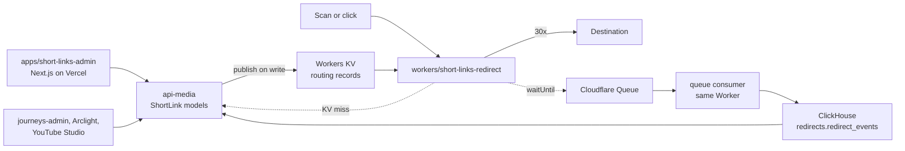

# Short Links Service: technical design and contracts

This is the contract every part of the short-link service is built against.
`README.md` beside it holds the product requirements. If the two disagree,
this file wins for shapes and names.

The service extends what already exists in core rather than adding a parallel
YouTube-only silo: the media context's `ShortLink` / `ShortLinkDomain` models
grow the fields the PRD asks for, api-media publishes routing records to a
Cloudflare edge store on every write, a new Worker serves redirects for every
short-link domain (nxstp.is, arc.gt, stg.arc.gt, and the new YouTube domain)
from that store, and a new admin app gives staff one place to mint links,
download QR codes, change destinations, and see scans.



## Components

| Piece                          | Path                                   | Role                                                                                             |
| ------------------------------ | -------------------------------------- | ------------------------------------------------------------------------------------------------ |
| Data + control plane           | `apis/api-media/src/schema/shortLink`  | Prisma models, Pothos schema, protection rules, edge publishing, ClickHouse reads, health checks |
| Redirect plane                 | `workers/short-links-redirect`         | Hono Worker: KV → api-media lookup, redirect, reserved paths, UTM pass-through, queue producer   |
| Analytics consumer             | `workers/short-links-redirect` (queue) | Batches queue messages into ClickHouse; parses user agent; never stores IP or raw UA             |
| Admin UI                       | `apps/short-links-admin`               | Links, campaigns, domains, QR download, destination history, Test Redirect, dashboards           |
| Legacy redirect surface (kept) | `apps/short-links`                     | Untouched. Cut a domain over by pointing its DNS / Cloudflare route at the Worker                |

## Data model (Prisma, `libs/prisma/media`)

Migration: `20260926045620_short_links_service`. All additive.

### `ShortLinkDomain` (new fields)

| Field               | Type                | Default       | Meaning                                                                                         |
| ------------------- | ------------------- | ------------- | ----------------------------------------------------------------------------------------------- |
| `redirectStatus`    | Int                 | 307           | 301, 302, 307 or 308. arc.gt uses 302 to match the Arclight keyword route.                      |
| `slugAllowedChars`  | String              | `A-Za-z0-9_-` | Regex character-class body. Validated on create.                                                |
| `slugMinLength`     | Int                 | 1             |                                                                                                 |
| `slugMaxLength`     | Int                 | 64            |                                                                                                 |
| `slugCaseSensitive` | Boolean             | true          | When false, pathnames are lower-cased on create and looked up lower-cased at the edge.          |
| `reservedPaths`     | String[]            | []            | First path segments never minted (`admin`, `api`, `.well-known`, arc.gt's `s`, `hls`, `dl`…).   |
| `fallbackTo`        | String?             | null          | Where unresolved traffic goes when `notFound = fallback`; where paused links go.                |
| `notFound`          | `ShortLinkNotFound` | `lostPage`    | `lostPage`, `fallback`, `passthrough`.                                                          |
| `passthroughOrigin` | String?             | null          | For `passthrough`: origin that receives the untouched path + query (arc.gt → api.arclight.org). |
| `autoFailover`      | Boolean             | false         | Health check may pause a failing link (never `videoEmbedded`).                                  |
| `edgePublishedAt`   | DateTime?           | null          | Last successful edge write.                                                                     |

### `ShortLink` (new fields)

| Field                 | Type                  | Notes                                                                                |
| --------------------- | --------------------- | ------------------------------------------------------------------------------------ |
| `name`, `description` | String?               | Labels.                                                                              |
| `assetClass`          | `ShortLinkAssetClass` | `standard` (default), `permanent`, `videoEmbedded`.                                  |
| `status`              | `ShortLinkStatus`     | `active` (default), `paused`, `retired`.                                             |
| `redirectStatus`      | Int?                  | Per-link override.                                                                   |
| `fallbackTo`          | String?               | Per-link override, used while paused.                                                |
| `placement`           | `ShortLinkPlacement?` | `description`, `endScreen`, `card`, `communityPost`, `inVideoQr`, `other`.           |
| `language`            | String?               | BCP-47.                                                                              |
| `tags`                | String[]              |                                                                                      |
| `videoId`             | String? → `Video`     | Core video. `SetNull` on video delete.                                               |
| `youtubeVideoId`      | String?               | YouTube's own id. Not a foreign key.                                                 |
| `campaigns`           | `ShortLinkCampaign[]` | Many-to-many.                                                                        |
| `destinationHistory`  | history rows          |                                                                                      |
| `deletedAt`           | DateTime?             | Soft delete only. `@@unique([pathname, domainId])` keeps the slug reserved.          |
| `edgePublishedAt`     | DateTime?             |                                                                                      |
| `healthStatus`        | `ShortLinkHealth?`    | `ok`, `notFound`, `serverError`, `timeout`, `dns`, `tls`, `redirectLoop`, `unknown`. |
| `healthCheckedAt`     | DateTime?             |                                                                                      |

`ShortLinkCampaign { id, name, description?, startsAt?, endsAt?, tags[], ownerId?, createdAt, updatedAt, shortLinks[] }`

`ShortLinkDestinationHistory { id, shortLinkId, from, to, changedBy?, changedAt, note? }` — written on every change to `to`.

`MediaRole` gains `shortLinkEditor` and `shortLinkAdmin`.

### Protection rules (enforced in resolvers, not only the UI)

| Rule                                      | `standard`                                      | `permanent`       | `videoEmbedded`         |
| ----------------------------------------- | ----------------------------------------------- | ----------------- | ----------------------- |
| Change `pathname`                         | never (pathnames are immutable for every class) | never             | never                   |
| Change `to`                               | editor                                          | admin             | admin + `note` required |
| Delete (soft)                             | editor                                          | admin             | admin                   |
| Automatic failover on failed health check | if domain opts in                               | if domain opts in | never                   |
| QR error-correction default               | M                                               | M                 | H                       |

"editor" = `shortLinkEditor`, `shortLinkAdmin`, `publisher`, or a valid interop token. "admin" = `shortLinkAdmin` or `publisher`. Interop callers (api-journeys, Arclight, YouTube Studio) create `standard` links only.

## Edge store contracts

### Keys

| Key                          | Written when                                  |
| ---------------------------- | --------------------------------------------- |
| `domain:<hostname>`          | domain created/updated/published              |
| `link:<hostname>/<pathname>` | link created/updated/published/paused/retired |

`hostname` is always lower-case. `pathname` is stored exactly as minted; when the domain is case-insensitive it is lower-cased both at publish and at lookup.

Deleted or retired links have their key deleted from KV.

### Domain record (`domain:<hostname>`)

```json
{
  "v": 1,
  "id": "uuid",
  "hostname": "arc.gt",
  "redirectStatus": 302,
  "fallbackTo": null,
  "notFound": "passthrough",
  "passthroughOrigin": "https://api.arclight.org",
  "reservedPaths": ["s", "hls", "dl", "dh", "v2", "api"],
  "slugCaseSensitive": true
}
```

### Routing record (`link:<hostname>/<pathname>`)

```json
{
  "v": 1,
  "id": "uuid",
  "to": "https://www.jesusfilm.org/watch/jesus.html",
  "status": 307,
  "fallbackTo": null,
  "paused": false,
  "assetClass": "videoEmbedded",
  "placement": "inVideoQr",
  "campaignIds": ["uuid"],
  "videoId": "1_jf-0-0",
  "youtubeVideoId": "dQw4w9WgXcQ",
  "language": "en"
}
```

`status` is the effective status (link override, else domain). `to` is the effective destination: for an arc.gt link that carries `brightcoveId` + `redirectType`, api-media publishes `to = <passthroughOrigin>/<pathname>` so the Arclight API keeps resolving Brightcove URLs exactly as it does today (one hop, same as the current wholesale redirect). `v` lets the Worker reject a shape it does not understand and fall through to the next store.

### Publish semantics (api-media)

- Publishing runs inside the mutation, after the Postgres write, inside the same `$transaction`; if KV rejects the write the transaction rolls back and the mutation fails.
- Local dev and tests: when `CLOUDFLARE_SHORT_LINKS_KV_NAMESPACE_ID` is unset, publishing is a no-op that resolves successfully (same pattern as the Vercel domain calls). `edgePublishedAt` is left unchanged, which is how the admin tells a skipped publish from a real one.
- Local dev with the Worker: `CLOUDFLARE_SHORT_LINKS_API_BASE_URL` points the Cloudflare client at the Worker's `wrangler dev` (`http://localhost:8788/client/v4`), which serves the same KV endpoints over its local store. There a namespace id is the Worker binding name. While it is set, `shortUrl` / `qrUrl` of the domain whose hostname matches that URL (`localhost`) use the Worker's origin, port included (`http://localhost:8788/<pathname>`); every other domain stays on `https://<hostname>`. Never set it in a deployed environment. See `workers/short-links-redirect/README.md`, "Publishing from a local api-media".
- Every KV write, single records included, uses the bulk endpoint (`PUT .../bulk`). The SDK's single-key `values.update` sends `{ value, metadata }` as a JSON body that Cloudflare stores verbatim as the value (cloudflare-typescript#2593). A bulk response that lists `unsuccessful_keys` fails the mutation.
- `shortLinkDomainPublish(id)` republishes the domain record and every live link on it (backfill / cutover / publish-gap repair).
- `shortLinkPublish(id)` republishes one link.

## Worker: `workers/short-links-redirect`

Bindings: `SHORT_LINKS_KV` (KV), `SHORT_LINKS_EVENTS` (Queue producer + consumer). Vars: `CORE_GRAPHQL_ENDPOINT`, `CLICKHOUSE_URL`, `CLICKHOUSE_DATABASE` (`redirects`). Secrets: `CLICKHOUSE_USER`, `CLICKHOUSE_PASSWORD`.

Request flow for `GET`/`HEAD` `https://<host>/<path>?<query>`:

1. Load `domain:<host>` from KV, else api-media `shortLinkDomainByHostname` (hit → write back to KV, log `publish_gap`). Unknown host → 404 lost page.
2. Strip a leading slash; if the path is empty, contains `/`, or its first segment is in `reservedPaths`, or it fails a cheap grammar check (`^[A-Za-z0-9_.~-]{1,64}$`) → not-found behaviour (`lostPage` 404 / `fallback` redirect / `passthrough` redirect to `passthroughOrigin + original path + query`).
3. Look up `link:<host>/<path>` (lower-cased when the domain is case-insensitive): KV → api-media `shortLinkByPath` with a 2 s timeout (hit → write back to KV, log `publish_gap`) → not-found behaviour.
4. `paused` → redirect to link `fallbackTo`, else domain `fallbackTo`, else not-found behaviour.
5. Build the destination: parse `to`; append every incoming query parameter except `qr` (UTMs pass through; existing destination params are kept). Redirect with `status`. `Cache-Control: no-store`.
6. `ctx.waitUntil(SHORT_LINKS_EVENTS.send(event))` after the response is built. Failures never affect the response.

`?qr=1` on the short URL marks attribution `qr`; the QR images the admin app renders encode `https://<host>/<pathname>?qr=1`.

Other routes: `/.well-known/*` → 404. Non-GET/HEAD → 405.

### Queue message

```json
{
  "v": 1,
  "ts": "2026-09-26T10:00:00.000Z",
  "hostname": "arc.gt",
  "pathname": "abc123",
  "linkId": "uuid",
  "campaignIds": [],
  "videoId": null,
  "youtubeVideoId": null,
  "placement": null,
  "destination": "https://...",
  "status": 302,
  "attribution": "qr",
  "country": "US",
  "userAgent": "Mozilla/5.0 ...",
  "referrerHost": "youtube.com",
  "language": "en",
  "utmSource": null,
  "utmMedium": null,
  "utmCampaign": null,
  "resolvedFrom": "kv"
}
```

`userAgent` is consumed by the queue consumer to derive `deviceClass` (`mobile`, `tablet`, `desktop`, `bot`, `unknown`), `os`, and `browser`, and is then dropped. No IP is ever put on the queue; `country` comes from `request.cf.country`.

### ClickHouse

```sql
CREATE DATABASE IF NOT EXISTS redirects;

CREATE TABLE IF NOT EXISTS redirects.redirect_events (
  ts               DateTime64(3, 'UTC'),
  hostname         LowCardinality(String),
  pathname         String,
  link_id          String,
  campaign_ids     Array(String),
  video_id         Nullable(String),
  youtube_video_id Nullable(String),
  placement        LowCardinality(Nullable(String)),
  destination      String,
  status           UInt16,
  attribution      LowCardinality(String),
  country          LowCardinality(Nullable(String)),
  device_class     LowCardinality(String),
  os               LowCardinality(String),
  browser          LowCardinality(String),
  referrer_host    Nullable(String),
  language         LowCardinality(Nullable(String)),
  utm_source       Nullable(String),
  utm_medium       Nullable(String),
  utm_campaign     Nullable(String),
  resolved_from    LowCardinality(String)
)
ENGINE = MergeTree
PARTITION BY toYYYYMM(ts)
ORDER BY (link_id, ts);
```

Inserted over HTTP (`INSERT INTO redirects.redirect_events FORMAT JSONEachRow`) with basic auth. api-media reads it the same way with `FORMAT JSON`.

## GraphQL additions (api-media)

Existing fields, arguments and error unions are unchanged; everything below is additive. Existing callers (api-journeys' QR-code service, journeys-admin, Arclight's keyword route, YouTube Studio) keep working.

```graphql
enum ShortLinkAssetClass { standard permanent videoEmbedded }
enum ShortLinkStatus { active paused retired }
enum ShortLinkPlacement { description endScreen card communityPost inVideoQr other }
enum ShortLinkNotFound { lostPage fallback passthrough }
enum ShortLinkHealth { ok notFound serverError timeout dns tls redirectLoop unknown }
# MediaRole gains shortLinkEditor and shortLinkAdmin

type ShortLinkDomain {
  # existing: id hostname apexName createdAt updatedAt services check
  redirectStatus: Int!
  slugAllowedChars: String!
  slugMinLength: Int!
  slugMaxLength: Int!
  slugCaseSensitive: Boolean!
  reservedPaths: [String!]!
  fallbackTo: String
  notFound: ShortLinkNotFound!
  passthroughOrigin: String
  autoFailover: Boolean!
  edgePublishedAt: DateTime
  linkCount: Int!
}

type ShortLink {
  # existing: id pathname to domain service brightcoveId redirectType bitrate sourceRef
  name: String
  description: String
  assetClass: ShortLinkAssetClass!
  status: ShortLinkStatus!
  redirectStatus: Int
  fallbackTo: String
  placement: ShortLinkPlacement
  language: String
  tags: [String!]!
  videoId: String
  youtubeVideoId: String
  campaigns: [ShortLinkCampaign!]!
  destinationHistory: [ShortLinkDestinationHistory!]!
  userId: String
  createdAt: DateTime!
  updatedAt: DateTime!
  deletedAt: DateTime
  edgePublishedAt: DateTime
  healthStatus: ShortLinkHealth
  healthCheckedAt: DateTime
  shortUrl: String!        # https://<hostname>/<pathname>
  qrUrl: String!           # shortUrl + ?qr=1 (what QR images encode)
}

type ShortLinkCampaign {
  id: ID! name: String! description: String startsAt: DateTime endsAt: DateTime
  tags: [String!]! ownerId: String createdAt: DateTime! updatedAt: DateTime!
  shortLinks: [ShortLink!]! linkCount: Int!
}

type ShortLinkDestinationHistory {
  id: ID! shortLinkId: String! from: String! to: String! changedBy: String changedAt: DateTime! note: String
}

enum ShortLinkResolutionSource { link linkFallback domainFallback passthrough lostPage reserved }
type ShortLinkResolution {
  found: Boolean!
  location: String          # null for lostPage
  status: Int!              # 404 for lostPage
  source: ShortLinkResolutionSource!
  shortLink: ShortLink
}

type ShortLinkStatsPoint { key: String!, count: Int!, qrCount: Int! }
type ShortLinkStats {
  total: Int! qr: Int! direct: Int!
  byDay: [ShortLinkStatsPoint!]!
  byLink: [ShortLinkStatsPoint!]!        # key = linkId
  byCampaign: [ShortLinkStatsPoint!]!    # key = campaignId
  byCountry: [ShortLinkStatsPoint!]!
  byDeviceClass: [ShortLinkStatsPoint!]!
  byPlacement: [ShortLinkStatsPoint!]!
  byReferrerHost: [ShortLinkStatsPoint!]!
  byAttribution: [ShortLinkStatsPoint!]!
}
input ShortLinkStatsFilter {
  linkId: String, campaignId: String, hostname: String, videoId: String, youtubeVideoId: String
  from: DateTime!, to: DateTime!
}

input ShortLinksFilter {
  hostname: String, search: String, status: ShortLinkStatus, assetClass: ShortLinkAssetClass
  campaignId: String, placement: ShortLinkPlacement, videoId: String, youtubeVideoId: String
  tag: String, service: Service, includeDeleted: Boolean
}

extend type Query {
  # existing: shortLinkByPath (now ignores deleted and retired links), shortLink(id), shortLinkDomains, shortLinkDomain
  shortLinks(hostname: String, filter: ShortLinksFilter, first, after, ...): ShortLinkConnection!   # existing connection, new optional filter
  shortLinkResolve(hostname: String!, pathname: String!): ShortLinkResolution!   # editor; mirrors the Worker
  shortLinkCampaigns(search: String, ...): ShortLinkCampaignConnection!          # editor
  shortLinkCampaign(id: String!): ShortLinkCampaign!                             # editor; NotFoundError
  shortLinkStats(filter: ShortLinkStatsFilter!): ShortLinkStats!                 # editor
}

extend type Mutation {
  shortLinkCreate(input: MutationShortLinkCreateInput!)   # existing + name description assetClass status redirectStatus fallbackTo placement language tags videoId youtubeVideoId campaignIds
  shortLinkUpdate(input: MutationShortLinkUpdateInput!)   # existing + same optional fields + note; `to` stays required
  shortLinkDelete(id: String!)                            # now a soft delete
  shortLinkPublish(id: String!): ShortLink!               # admin
  shortLinkBulkUpdate(input: { ids: [String!]!, status: ShortLinkStatus, addTags: [String!], removeTags: [String!], addCampaignIds: [String!], removeCampaignIds: [String!] }): [ShortLink!]!  # editor
  shortLinkDomainCreate / shortLinkDomainUpdate           # existing + redirectStatus slugAllowedChars slugMinLength slugMaxLength slugCaseSensitive reservedPaths fallbackTo notFound passthroughOrigin autoFailover (admin)
  shortLinkDomainPublish(id: String!): ShortLinkDomain!   # admin
  shortLinkCampaignCreate(input: { name!, description, startsAt, endsAt, tags }): ShortLinkCampaign!
  shortLinkCampaignUpdate(input: { id!, name, description, startsAt, endsAt, tags }): ShortLinkCampaign!
  shortLinkCampaignDelete(id: String!): ShortLinkCampaign!
}
```

## Auth scopes (api-media builder)

| Scope               | True when                                                         |
| ------------------- | ----------------------------------------------------------------- |
| `isShortLinkEditor` | roles include `shortLinkEditor`, `shortLinkAdmin`, or `publisher` |
| `isShortLinkAdmin`  | roles include `shortLinkAdmin` or `publisher`                     |
| `isSuperAdmin`      | `superAdmin` is set on the user in the users database (lazy)      |

Existing `isPublisher` + `isValidInterop` gates on the short link mutations stay, widened with `$any` to include the editor scope.

## Environment variables

### api-media

| Variable                                                      | Purpose                                                                                                |
| ------------------------------------------------------------- | ------------------------------------------------------------------------------------------------------ |
| `CLOUDFLARE_ACCOUNT_ID`                                       | already present                                                                                        |
| `CLOUDFLARE_SHORT_LINKS_API_TOKEN`                            | API token with Workers KV Storage:Edit                                                                 |
| `CLOUDFLARE_SHORT_LINKS_KV_NAMESPACE_ID`                      | KV namespace id; unset → publishing is a no-op                                                         |
| `CLOUDFLARE_SHORT_LINKS_API_BASE_URL`                         | local dev only: the Worker's local edge API; unset → api.cloudflare.com                                |
| `CLOUDFLARE_SHORT_LINKS_WORKER_NAME`                          | the deployed redirect Worker, e.g. `short-links-redirect-stage`; unset → infrastructure management off |
| `CLOUDFLARE_SHORT_LINKS_INFRA_API_TOKEN`                      | API token with Workers Scripts:Edit, Workers KV Storage:Edit, Workers Routes:Edit, Zone:Read           |
| `CLOUDFLARE_SHORT_LINKS_ALLOWED_HOSTNAMES`                    | comma-separated hostnames this environment may set up; empty → none                                    |
| `PG_DATABASE_URL_USERS`                                       | read-only use: the `superAdmin` flag of the caller                                                     |
| `SHORT_LINKS_CLICKHOUSE_URL`                                  | e.g. `https://xxx.us-east-2.aws.clickhouse.cloud:8443`; unset → stats return zeros                     |
| `SHORT_LINKS_CLICKHOUSE_USER`                                 |                                                                                                        |
| `SHORT_LINKS_CLICKHOUSE_PASSWORD`                             |                                                                                                        |
| `SHORT_LINKS_CLICKHOUSE_DATABASE`                             | default `redirects`                                                                                    |
| `SLACK_SHORT_LINKS_BOT_TOKEN`, `SLACK_SHORT_LINKS_CHANNEL_ID` | optional; health-check alerts                                                                          |

### Worker (`wrangler.toml` vars / `wrangler secret`)

`CORE_GRAPHQL_ENDPOINT`, `CLICKHOUSE_URL`, `CLICKHOUSE_DATABASE`; secrets `CLICKHOUSE_USER`, `CLICKHOUSE_PASSWORD`. The global KV namespace id is per environment in `wrangler.toml`.

### Admin app (`apps/short-links-admin`, Doppler project `short-links-admin`)

Same Firebase + gateway variables as `videos-admin` (`NEXT_PUBLIC_GATEWAY_URL`, `NEXT_PUBLIC_FIREBASE_*`, `AUTH_SECRET`, `FIREBASE_CLIENT_EMAIL`, `FIREBASE_PRIVATE_KEY`), plus `SHORT_LINKS_ADMIN_VERCEL_PROJECT_ID` in CI.

## Failure order

| Down                  | Effect                                                                                                                  |
| --------------------- | ----------------------------------------------------------------------------------------------------------------------- |
| ClickHouse or Queues  | Redirects continue; events delay or drop.                                                                               |
| api-media or Postgres | Known links redirect from the last published records; unknown paths get the domain's not-found behaviour; no new links. |
| KV                    | Every redirect goes through api-media and is written back; with api-media also down, uncached hosts get the lost page.  |
| Worker                | Nothing on the cut-over domains resolves. It is the one component with the 99.99% target.                               |

## Cutover per domain

1. Create KV namespace, Queue, and ClickHouse table (`clickhouse/0001_init.sql`).
2. Fill the ids into `wrangler.toml`, set the Worker secrets, deploy to stage.
3. Set the api-media env vars; run `shortLinkDomainPublish` for the domain (backfills every live link).
4. Add the hostname as a custom domain / route of the Worker. For nxstp.is this replaces the Vercel `apps/short-links` deployment; for arc.gt the domain is configured with `notFound = passthrough`, `passthroughOrigin = https://api.arclight.org`, `redirectStatus = 302`, `reservedPaths = [s, hls, dl, dh, v2, api]` so non-keyword paths keep reaching the Arclight API.
5. Watch `publish_gap` logs; zero is the goal.

## Path prefix (2026-09-28)

Decisions: the first domain is `jesus.film` and short links live under `/s/`. The admin app is reached on its own `vercel.app` URL; it is not served from the short-link domain and the Worker does not proxy it. This section amends everything above where they differ.

### `ShortLinkDomain.pathPrefix`

`pathPrefix String @default("")` is the path the short links live under, without leading or trailing slashes (`s`). Empty keeps a domain at the root, which is what nxstp.is and arc.gt use. Validated as empty or `^[A-Za-z0-9_-]+(/[A-Za-z0-9_-]+)*$`. `hostname` stays unique, so a hostname has exactly one prefix.

Migration `20260928120000_short_link_domain_path_prefix` adds the column and inserts the `jesus.film` row: `pathPrefix = s`, status 307, slug grammar `[a-z0-9-]{3,32}` case-insensitive, `notFound = fallback` to `https://www.jesusfilm.org`, and `dashboard`, `api`, `admin`, `_next`, `.well-known`, `favicon.ico`, `robots.txt` reserved.

### Short URL

`shortUrl = https://<hostname>/<pathPrefix>/<pathname>` when the prefix is non-empty, `https://<hostname>/<pathname>` otherwise. `qrUrl = shortUrl + ?qr=1`.

### Edge store

Keys are unchanged: `link:<hostname>/<pathname>` holds the bare pathname, never the prefix. The domain record gains `"pathPrefix": "s"` (empty string when unset). `v` stays 1 because nothing is deployed yet; the Worker treats a missing `pathPrefix` as empty.

### Worker request flow (amends step 2)

When `pathPrefix` is non-empty the request path must be `/<prefix>/<rest>`. A path outside the prefix, or exactly `/<prefix>` or `/<prefix>/`, gets the domain's not-found behaviour. Otherwise `<rest>` is what the existing slug checks, reserved-path check and lookup run against. Passthrough still forwards the original, unstripped path.

Route: `{ pattern = "jesus.film/s/*", zone_name = "jesus.film" }`, so the rest of the hostname stays free for other uses.

### Admin app

A standalone Vercel deployment served from the root of its `vercel.app` URL. No base path, no proxy, and no dependency on the short-link domain, so the admin stays reachable when the Worker or the domain is down.

## Per-domain KV namespaces and global slugs (2026-09-29)

Decision: each domain has its own Cloudflare KV namespace, and a slug that is not found on a domain falls back to a global slug. This section amends the "Edge store contracts", "Worker" and "Publish semantics" sections above where they differ.

### Namespaces

| Namespace                    | Binding                                                                                | Holds                           | Keys                                   |
| ---------------------------- | -------------------------------------------------------------------------------------- | ------------------------------- | -------------------------------------- |
| Global (one per environment) | `SHORT_LINKS_KV`                                                                       | domain records and global links | `domain:<hostname>`, `link:<pathname>` |
| One per domain               | named on the domain row (`KV_JESUS_FILM`, `KV_NXSTP_IS`, `KV_ARC_GT`, `KV_STG_ARC_GT`) | the domain's routing records    | `<pathname>` (bare slug, no prefix)    |

`ShortLinkDomain.kvNamespaceId` is the namespace id api-media publishes to; `ShortLinkDomain.kvBinding` is the Worker binding name, carried in the domain record so the Worker picks the namespace with `env[domain.kvBinding]`. A domain with no `kvNamespaceId` is not published (its links are not either); `edgePublishedAt` stays null. The global namespace id stays in `CLOUDFLARE_SHORT_LINKS_KV_NAMESPACE_ID`.

Superseded by "superAdmin-managed Cloudflare infrastructure" below: per-domain bindings on stage and prod are no longer declared in `wrangler.toml`. api-media creates the namespace and adds the binding to the live Worker through the Cloudflare API, and the deploy carries them over.

### Global links

`ShortLink.global Boolean @default(false)`. A global link still belongs to its own domain (that is its canonical `shortUrl`), and additionally resolves on every other domain that has no link of its own for the same pathname. Global pathnames are unique across all domains and never reissued: `ShortLinkGlobalSlug { pathname @id, shortLinkId @unique }` is written when a link becomes global and never deleted (a soft-deleted global link keeps its claim; the row is released only if the link is un-flagged while still live). Global pathnames must be lower-case so case-insensitive domains can find them (validate on create/update; `ZodError` on `input.pathname` / `input.global`). Toggling `global` needs `isShortLinkAdmin`.

### Domain record (amended)

Adds `"kvBinding": "KV_JESUS_FILM"` (nullable: a domain without a namespace is served only through global links and the api-media fallback).

### Routing record (amended)

`status` becomes nullable and holds only the link's own override (`redirectStatus`), never the owning domain's default, so a global link served on another domain takes that domain's status. Likewise `fallbackTo` is the link's own override only. The Worker already computes `record.status ?? domain.redirectStatus ?? 307`. Adds `"global": true|false` and `"hostname"` (the owning domain) for reporting.

### Worker lookup order (amends step 3)

1. Domain namespace `env[domain.kvBinding]` → `get(<slug>)` (skipped when `kvBinding` is null or the binding is absent, logged once per isolate as `missing_binding`).
2. Global namespace `SHORT_LINKS_KV` → `get("link:<slug>")`.
3. api-media `shortLinkByPath(hostname, pathname)`, which itself falls back to the global registry (below). A hit is written back to the namespace that should have had it (domain namespace when the returned link belongs to this domain and the binding exists, else the global namespace when the link is global) and logged as `publish_gap`.

`resolvedFrom` gains the values `kv-global` and `api`.

### api-media (amended)

- `shortLinkByPath(hostname, pathname)`: after the existing domain lookup misses, look up `ShortLinkGlobalSlug` by pathname (lower-cased when the requesting domain is case-insensitive) and return that link if it is live. `shortLinkResolve` does the same and reports `source: link` with the matched link.
- Publish: a link record goes to its domain's namespace as `<pathname>` (when the domain has `kvNamespaceId`), and additionally to the global namespace as `link:<pathname>` when `global` is true. Un-flagging or retiring/deleting removes the global key. `shortLinkDomainPublish` republishes into the domain namespace and refreshes the global keys of its global links.
- Inputs: `global` on `shortLinkCreate`/`shortLinkUpdate` (admin); `kvNamespaceId`, `kvBinding` on `shortLinkDomainCreate`/`shortLinkDomainUpdate` (admin; `kvBinding` validated as `^[A-Z][A-Z0-9_]*$`). `ShortLinksFilter.global: Boolean`.

### Admin app

Domain form gains "KV namespace id" and "Worker binding" fields (admin). Link form and detail gain a "Global" switch (admin only, with a hint that the slug will resolve on every domain) and a "Global" chip in the list. The links list filter gains a "Global" option.

### Migration

`20260929120000_short_link_per_domain_kv_and_global_slugs` adds the columns and the registry table and sets `kvBinding` for jesus.film, nxstp.is, arc.gt/core.arc.gt and stg.arc.gt. Namespace ids are filled per environment after the namespaces exist.

## superAdmin-managed Cloudflare infrastructure (2026-10-01)

Decisions: a domain's Cloudflare infrastructure is set up from the admin app by a **superAdmin** (the `superAdmin` flag on the user in the users database, not a media role), and api-media does the work through the Cloudflare API. Nothing creates or deletes a Cloudflare zone, and DNS records are never edited. This section amends everything above where they differ.

### Rollout

Only `jesus.film/s` and `jesus.movie/s` to start. Stage is proven first on `stage.jesus.film/s` and `stage.jesus.movie/s`, attached to `short-links-redirect-stage`; the base domains are attached to `short-links-redirect-prod` only after that. `CLOUDFLARE_SHORT_LINKS_ALLOWED_HOSTNAMES` enforces it per environment (stage: `stage.jesus.film,stage.jesus.movie`; prod: `jesus.film,jesus.movie`). `stage.jesus.film` and `jesus.film` share a zone, so the token cannot separate them; the allowlist does. nxstp.is and arc.gt are not in either list.

### Permissions

| Action                                                                        | Who                                       |
| ----------------------------------------------------------------------------- | ----------------------------------------- |
| Redirect, slug, services settings; `shortLinkDomainPublish`                   | `shortLinkAdmin`, `publisher`, superAdmin |
| Changing `pathPrefix`, `kvNamespaceId`, `kvBinding` (`shortLinkDomainUpdate`) | superAdmin                                |
| `shortLinkDomainCreate`, `shortLinkDomainDelete`                              | superAdmin                                |
| `ShortLinkDomain.infrastructure` and the four infrastructure mutations        | superAdmin                                |

A superAdmin with no media role reaches the Domains section of the admin and nothing else. The superAdmin lookup is lazy (only when the role scopes fail), cached per request, and fails closed.

`shortLinkDomainCreate` takes `vercel: Boolean` (default true, the legacy contract). The admin passes `false`: a Worker-served domain is never registered on the legacy Vercel project. `shortLinkDomainDelete` is refused while the domain has a KV setup. `kvBinding` must match `^KV_[A-Z0-9_]+$`.

### GraphQL

```graphql
type ShortLinkDomain {
  infrastructure: ShortLinkDomainInfrastructure! # superAdmin; ~5 Cloudflare calls, never select in a list
}
type ShortLinkDomainInfrastructure {
  configured: Boolean!
  workerName: String
  hostnameAllowed: Boolean!
  zone: ShortLinkDomainInfrastructureCheck!
  kvNamespace: ShortLinkDomainInfrastructureCheck!
  kvBinding: ShortLinkDomainInfrastructureCheck!
  attachment: ShortLinkDomainInfrastructureCheck!
}
type ShortLinkDomainInfrastructureCheck {
  state: ShortLinkDomainInfrastructureState! # ok | missing | mismatch | error | unknown
  detail: String!
}
# all superAdmin, idempotent, return the domain
shortLinkDomainKvSetup(id: String!)
shortLinkDomainKvRemove(id: String!)
shortLinkDomainWorkerAttach(id: String!)
shortLinkDomainWorkerDetach(id: String!)
```

### What each operation does (`schema/shortLink/infrastructure`)

Order is chosen so redirects keep working at every failure point (the Worker falls back domain KV → global KV → api-media).

- **KV setup**: find the namespace (the row's id, else the title `<workerName>:<hostname>`, else create it) → save `kvNamespaceId` → `publishDomainWithLinks` → prune keys that are no longer live when the namespace already existed → add the `KV_<HOSTNAME>` binding to the Worker → save `kvBinding` and republish the domain record. Also the repair for a binding a deploy dropped.
- **KV remove** (refused while attached): clear `kvBinding` and republish the domain record → remove the binding → clear `kvNamespaceId`. The namespace is left in Cloudflare.
- **Attach** (needs the KV setup): a domain with a path prefix gets the zone route `<hostname>/<pathPrefix>/*`; a root domain gets a Workers Custom Domain. Already attached to this Worker is a no-op; attached to another Worker is refused, with no override. A route needs the hostname to already have a proxied DNS record; a custom domain makes Cloudflare create the record and certificate and is refused when records already exist.
- **Detach**: deletes only routes / custom domains on the hostname that point at this Worker.

Teardown order is detach → remove KV → remove domain.

### Worker bindings

- Changing bindings uses `GET` / `PATCH /accounts/{a}/workers/scripts/{name}/settings` through the SDK's low-level client (the installed `cloudflare@4.2.0` has no method for it). PATCH carries one multipart part `settings` holding JSON, replaces the whole binding list and deploys; every binding to keep is sent as `{ type: "inherit", name }`.
- After every change the bindings are read back, and any binding lost that should have been kept fails the mutation loudly (recovery: redeploy the Worker). This is the guard for the one thing not provable without the real API.
- Read-modify-write is serialised across api-media tasks with a Postgres advisory lock.
- **Ownership**: bindings named `KV_*` belong to api-media; everything else belongs to `wrangler.toml`. api-media never adds or removes anything else.

### Deploy

`wrangler deploy` uploads exactly the bindings in its config and drops the rest, so `workers/short-links-redirect/scripts/deploy.ts` (the `deploy` target) reads the live Worker's bindings, writes `wrangler.deploy.toml` (`wrangler.toml`, minus the dev-only top-level namespaces, plus every live `KV_*` binding it does not declare) and deploys from that. It aborts without deploying when the live bindings cannot be read, unless the Worker has never been deployed. A setup that lands between its read and the upload is lost; the status then shows the binding missing and "Set up KV" repairs it.

`wrangler.toml` declares no `routes`: with none, a deploy leaves API-managed routes and custom domains alone; with any, wrangler replaces the whole set.

### Cutover per domain (replaces the list above)

1. Once per environment: the global namespace, queues, ClickHouse and Worker secrets as before; fill the namespace id into `wrangler.toml`; deploy.
2. Once per environment: set the api-media variables above (Doppler).
3. Per domain, by a superAdmin in the admin: Add domain (or open the existing one) → Set up KV → Attach to Worker. The hostname's zone must already be in the account, and for a prefixed domain the hostname must already have a proxied DNS record.
4. Watch `publish_gap` logs; zero is the goal.

### Not verified against the real API

Built from the SDK source, wrangler's own requests and the API reference, and exercised against a fake API only. Prove on stage before prod: (1) "Set up KV" leaves the Worker's secrets and queue binding intact; (2) a stage deploy keeps the binding; (3) attach, detach, remove KV and remove domain are each reflected in Cloudflare and the namespace is left in place; (4) attaching a hostname served by another Worker is refused.

### Local dev

Not emulated. With `CLOUDFLARE_SHORT_LINKS_API_BASE_URL` set (or the Worker name / token unset) the status reports `configured: false` and the mutations refuse; the manual KV fields (superAdmin) remain the local path.

## KV-only edge store (2026-10-02)

Decision: the D1 replica is removed. Workers KV is the only edge store, and api-media is the fallback when KV misses or cannot be read. This section amends everything above where they differ.

Why:

- The replica was written best-effort after the KV write, and read on a KV **miss**, not only on a KV error. A failed D1 delete for a deleted or retired link left a row that redirected that link again on every request, with nothing to reconcile it.
- It protected only the case where KV fails and api-media is unreachable at the same moment. The outage goal (redirects survive a control-plane outage) is met by KV alone.
- It cost an extra API call on every publish (30 rows per call on a domain republish), two extra reads on every unknown slug, and a database, migration, token permission and binding per environment.

What changed:

- **api-media** no longer writes D1. `CLOUDFLARE_SHORT_LINKS_D1_DATABASE_ID` is gone and the publishing token needs only Workers KV Storage:Edit.
- **Worker** lookup is domain KV → global KV → api-media. `resolvedFrom` is `kv`, `kv-global` or `api`. The `SHORT_LINKS_DB` binding, `d1/` and the D1 endpoint of the local edge API are gone.
- **Domain settings now fall back to api-media.** They used to be read from KV, then D1, with no api-media fallback. `shortLinkDomainByHostname(hostname)` is a new public query; on a KV miss the Worker calls it, writes the record back to `domain:<host>` and logs `publish_gap`. A host neither knows is remembered as unknown for 10 s per isolate, so it costs at most one api-media call in that time.

What is given up: during a KV-only outage every redirect goes through api-media (2 s timeout, 1 to 3 tasks). That is acceptable at the first rollout's volume; revisit before nxstp.is or arc.gt traffic moves onto the Worker.
