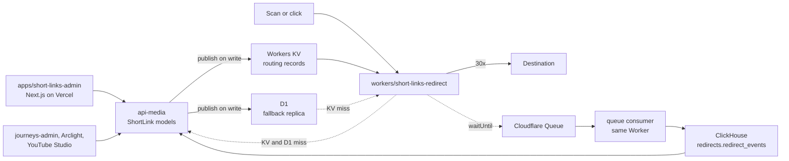

# Short Links Service: technical design and contracts

This is the contract every part of the short-link service is built against.
`README.md` beside it holds the product requirements. If the two disagree,
this file wins for shapes and names.

The service extends what already exists in core rather than adding a parallel
YouTube-only silo: the media context's `ShortLink` / `ShortLinkDomain` models
grow the fields the PRD asks for, api-media publishes routing records to a
Cloudflare edge store on every write, a new Worker serves redirects for every
short-link domain (nxstp.is, arc.gt, stg.arc.gt, and the new YouTube domain)
from that store, and a new admin app gives staff one place to mint links,
download QR codes, change destinations, and see scans.



## Components

| Piece                          | Path                                   | Role                                                                                                |
| ------------------------------ | -------------------------------------- | --------------------------------------------------------------------------------------------------- |
| Data + control plane           | `apis/api-media/src/schema/shortLink`  | Prisma models, Pothos schema, protection rules, edge publishing, ClickHouse reads, health checks    |
| Redirect plane                 | `workers/short-links-redirect`         | Hono Worker: KV → D1 → api-media lookup, redirect, reserved paths, UTM pass-through, queue producer |
| Analytics consumer             | `workers/short-links-redirect` (queue) | Batches queue messages into ClickHouse; parses user agent; never stores IP or raw UA                |
| Admin UI                       | `apps/short-links-admin`               | Links, campaigns, domains, QR download, destination history, Test Redirect, dashboards              |
| Legacy redirect surface (kept) | `apps/short-links`                     | Untouched. Cut a domain over by pointing its DNS / Cloudflare route at the Worker                    |

## Data model (Prisma, `libs/prisma/media`)

Migration: `20260926045620_short_links_service`. All additive.

### `ShortLinkDomain` (new fields)

| Field               | Type                | Default        | Meaning                                                                                        |
| ------------------- | ------------------- | -------------- | ---------------------------------------------------------------------------------------------- |
| `redirectStatus`    | Int                 | 307            | 301, 302, 307 or 308. arc.gt uses 302 to match the Arclight keyword route.                     |
| `slugAllowedChars`  | String              | `A-Za-z0-9_-`  | Regex character-class body. Validated on create.                                               |
| `slugMinLength`     | Int                 | 1              |                                                                                                |
| `slugMaxLength`     | Int                 | 64             |                                                                                                |
| `slugCaseSensitive` | Boolean             | true           | When false, pathnames are lower-cased on create and looked up lower-cased at the edge.         |
| `reservedPaths`     | String[]            | []             | First path segments never minted (`admin`, `api`, `.well-known`, arc.gt's `s`, `hls`, `dl`…). |
| `fallbackTo`        | String?             | null           | Where unresolved traffic goes when `notFound = fallback`; where paused links go.                |
| `notFound`          | `ShortLinkNotFound` | `lostPage`     | `lostPage`, `fallback`, `passthrough`.                                                          |
| `passthroughOrigin` | String?             | null           | For `passthrough`: origin that receives the untouched path + query (arc.gt → api.arclight.org). |
| `autoFailover`      | Boolean             | false          | Health check may pause a failing link (never `videoEmbedded`).                                  |
| `edgePublishedAt`   | DateTime?           | null           | Last successful edge write.                                                                     |

### `ShortLink` (new fields)

| Field                | Type                   | Notes                                                                       |
| -------------------- | ---------------------- | --------------------------------------------------------------------------- |
| `name`, `description`| String?                | Labels.                                                                     |
| `assetClass`         | `ShortLinkAssetClass`  | `standard` (default), `permanent`, `videoEmbedded`.                         |
| `status`             | `ShortLinkStatus`      | `active` (default), `paused`, `retired`.                                    |
| `redirectStatus`     | Int?                   | Per-link override.                                                          |
| `fallbackTo`         | String?                | Per-link override, used while paused.                                       |
| `placement`          | `ShortLinkPlacement?`  | `description`, `endScreen`, `card`, `communityPost`, `inVideoQr`, `other`.  |
| `language`           | String?                | BCP-47.                                                                     |
| `tags`               | String[]               |                                                                             |
| `videoId`            | String? → `Video`      | Core video. `SetNull` on video delete.                                      |
| `youtubeVideoId`     | String?                | YouTube's own id. Not a foreign key.                                        |
| `campaigns`          | `ShortLinkCampaign[]`  | Many-to-many.                                                               |
| `destinationHistory` | history rows           |                                                                             |
| `deletedAt`          | DateTime?              | Soft delete only. `@@unique([pathname, domainId])` keeps the slug reserved. |
| `edgePublishedAt`    | DateTime?              |                                                                             |
| `healthStatus`       | `ShortLinkHealth?`     | `ok`, `notFound`, `serverError`, `timeout`, `dns`, `tls`, `redirectLoop`, `unknown`. |
| `healthCheckedAt`    | DateTime?              |                                                                             |

`ShortLinkCampaign { id, name, description?, startsAt?, endsAt?, tags[], ownerId?, createdAt, updatedAt, shortLinks[] }`

`ShortLinkDestinationHistory { id, shortLinkId, from, to, changedBy?, changedAt, note? }` — written on every change to `to`.

`MediaRole` gains `shortLinkEditor` and `shortLinkAdmin`.

### Protection rules (enforced in resolvers, not only the UI)

| Rule                                            | `standard` | `permanent`  | `videoEmbedded`      |
| ----------------------------------------------- | ---------- | ------------ | -------------------- |
| Change `pathname`                               | never (pathnames are immutable for every class) | never | never |
| Change `to`                                     | editor     | admin        | admin + `note` required |
| Delete (soft)                                   | editor     | admin        | admin                |
| Automatic failover on failed health check       | if domain opts in | if domain opts in | never          |
| QR error-correction default                     | M          | M            | H                    |

"editor" = `shortLinkEditor`, `shortLinkAdmin`, `publisher`, or a valid interop token. "admin" = `shortLinkAdmin` or `publisher`. Interop callers (api-journeys, Arclight, YouTube Studio) create `standard` links only.

## Edge store contracts

### Keys

| Key                              | Written when                                    |
| -------------------------------- | ----------------------------------------------- |
| `domain:<hostname>`              | domain created/updated/published                |
| `link:<hostname>/<pathname>`     | link created/updated/published/paused/retired   |

`hostname` is always lower-case. `pathname` is stored exactly as minted; when the domain is case-insensitive it is lower-cased both at publish and at lookup.

Deleted or retired links have their `link:` key deleted from KV and D1.

### Domain record (`domain:<hostname>`)

```json
{
  "v": 1,
  "id": "uuid",
  "hostname": "arc.gt",
  "redirectStatus": 302,
  "fallbackTo": null,
  "notFound": "passthrough",
  "passthroughOrigin": "https://api.arclight.org",
  "reservedPaths": ["s", "hls", "dl", "dh", "v2", "api"],
  "slugCaseSensitive": true
}
```

### Routing record (`link:<hostname>/<pathname>`)

```json
{
  "v": 1,
  "id": "uuid",
  "to": "https://www.jesusfilm.org/watch/jesus.html",
  "status": 307,
  "fallbackTo": null,
  "paused": false,
  "assetClass": "videoEmbedded",
  "placement": "inVideoQr",
  "campaignIds": ["uuid"],
  "videoId": "1_jf-0-0",
  "youtubeVideoId": "dQw4w9WgXcQ",
  "language": "en"
}
```

`status` is the effective status (link override, else domain). `to` is the effective destination: for an arc.gt link that carries `brightcoveId` + `redirectType`, api-media publishes `to = <passthroughOrigin>/<pathname>` so the Arclight API keeps resolving Brightcove URLs exactly as it does today (one hop, same as the current wholesale redirect). `v` lets the Worker reject a shape it does not understand and fall through to the next store.

### D1

```sql
CREATE TABLE IF NOT EXISTS short_link_records (
  key TEXT PRIMARY KEY,
  value TEXT NOT NULL,
  updated_at TEXT NOT NULL
);
```

Same keys and JSON values as KV. api-media upserts via the D1 REST API in the same publish call that writes KV.

### Publish semantics (api-media)

- Publishing runs inside the mutation, after the Postgres write, inside the same `$transaction`; if KV rejects the write the transaction rolls back and the mutation fails. D1 failure is logged, not fatal (it is the replica).
- Local dev and tests: when `CLOUDFLARE_SHORT_LINKS_KV_NAMESPACE_ID` is unset, publishing is a no-op that resolves successfully (same pattern as the Vercel domain calls).
- `shortLinkDomainPublish(id)` republishes the domain record and every live link on it (backfill / cutover / publish-gap repair).
- `shortLinkPublish(id)` republishes one link.

## Worker: `workers/short-links-redirect`

Bindings: `SHORT_LINKS_KV` (KV), `SHORT_LINKS_DB` (D1), `SHORT_LINKS_EVENTS` (Queue producer + consumer). Vars: `CORE_GRAPHQL_ENDPOINT`, `CLICKHOUSE_URL`, `CLICKHOUSE_DATABASE` (`redirects`). Secrets: `CLICKHOUSE_USER`, `CLICKHOUSE_PASSWORD`.

Request flow for `GET`/`HEAD` `https://<host>/<path>?<query>`:

1. Load `domain:<host>` (KV, then D1). Unknown host → 404 lost page.
2. Strip a leading slash; if the path is empty, contains `/`, or its first segment is in `reservedPaths`, or it fails a cheap grammar check (`^[A-Za-z0-9_.~-]{1,64}$`) → not-found behaviour (`lostPage` 404 / `fallback` redirect / `passthrough` redirect to `passthroughOrigin + original path + query`).
3. Look up `link:<host>/<path>` (lower-cased when the domain is case-insensitive): KV → D1 → api-media `shortLinkByPath` with a 2 s timeout (hit → write back to KV, log `publish_gap`) → not-found behaviour.
4. `paused` → redirect to link `fallbackTo`, else domain `fallbackTo`, else not-found behaviour.
5. Build the destination: parse `to`; append every incoming query parameter except `qr` (UTMs pass through; existing destination params are kept). Redirect with `status`. `Cache-Control: no-store`.
6. `ctx.waitUntil(SHORT_LINKS_EVENTS.send(event))` after the response is built. Failures never affect the response.

`?qr=1` on the short URL marks attribution `qr`; the QR images the admin app renders encode `https://<host>/<pathname>?qr=1`.

Other routes: `/.well-known/*` → 404. Non-GET/HEAD → 405.

### Queue message

```json
{
  "v": 1,
  "ts": "2026-09-26T10:00:00.000Z",
  "hostname": "arc.gt",
  "pathname": "abc123",
  "linkId": "uuid",
  "campaignIds": [],
  "videoId": null,
  "youtubeVideoId": null,
  "placement": null,
  "destination": "https://...",
  "status": 302,
  "attribution": "qr",
  "country": "US",
  "userAgent": "Mozilla/5.0 ...",
  "referrerHost": "youtube.com",
  "language": "en",
  "utmSource": null,
  "utmMedium": null,
  "utmCampaign": null,
  "resolvedFrom": "kv"
}
```

`userAgent` is consumed by the queue consumer to derive `deviceClass` (`mobile`, `tablet`, `desktop`, `bot`, `unknown`), `os`, and `browser`, and is then dropped. No IP is ever put on the queue; `country` comes from `request.cf.country`.

### ClickHouse

```sql
CREATE DATABASE IF NOT EXISTS redirects;

CREATE TABLE IF NOT EXISTS redirects.redirect_events (
  ts               DateTime64(3, 'UTC'),
  hostname         LowCardinality(String),
  pathname         String,
  link_id          String,
  campaign_ids     Array(String),
  video_id         Nullable(String),
  youtube_video_id Nullable(String),
  placement        LowCardinality(Nullable(String)),
  destination      String,
  status           UInt16,
  attribution      LowCardinality(String),
  country          LowCardinality(Nullable(String)),
  device_class     LowCardinality(String),
  os               LowCardinality(String),
  browser          LowCardinality(String),
  referrer_host    Nullable(String),
  language         LowCardinality(Nullable(String)),
  utm_source       Nullable(String),
  utm_medium       Nullable(String),
  utm_campaign     Nullable(String),
  resolved_from    LowCardinality(String)
)
ENGINE = MergeTree
PARTITION BY toYYYYMM(ts)
ORDER BY (link_id, ts);
```

Inserted over HTTP (`INSERT INTO redirects.redirect_events FORMAT JSONEachRow`) with basic auth. api-media reads it the same way with `FORMAT JSON`.

## GraphQL additions (api-media)

Existing fields, arguments and error unions are unchanged; everything below is additive. Existing callers (api-journeys' QR-code service, journeys-admin, Arclight's keyword route, YouTube Studio) keep working.

```graphql
enum ShortLinkAssetClass { standard permanent videoEmbedded }
enum ShortLinkStatus { active paused retired }
enum ShortLinkPlacement { description endScreen card communityPost inVideoQr other }
enum ShortLinkNotFound { lostPage fallback passthrough }
enum ShortLinkHealth { ok notFound serverError timeout dns tls redirectLoop unknown }
# MediaRole gains shortLinkEditor and shortLinkAdmin

type ShortLinkDomain {
  # existing: id hostname apexName createdAt updatedAt services check
  redirectStatus: Int!
  slugAllowedChars: String!
  slugMinLength: Int!
  slugMaxLength: Int!
  slugCaseSensitive: Boolean!
  reservedPaths: [String!]!
  fallbackTo: String
  notFound: ShortLinkNotFound!
  passthroughOrigin: String
  autoFailover: Boolean!
  edgePublishedAt: DateTime
  linkCount: Int!
}

type ShortLink {
  # existing: id pathname to domain service brightcoveId redirectType bitrate sourceRef
  name: String
  description: String
  assetClass: ShortLinkAssetClass!
  status: ShortLinkStatus!
  redirectStatus: Int
  fallbackTo: String
  placement: ShortLinkPlacement
  language: String
  tags: [String!]!
  videoId: String
  youtubeVideoId: String
  campaigns: [ShortLinkCampaign!]!
  destinationHistory: [ShortLinkDestinationHistory!]!
  userId: String
  createdAt: DateTime!
  updatedAt: DateTime!
  deletedAt: DateTime
  edgePublishedAt: DateTime
  healthStatus: ShortLinkHealth
  healthCheckedAt: DateTime
  shortUrl: String!        # https://<hostname>/<pathname>
  qrUrl: String!           # shortUrl + ?qr=1 (what QR images encode)
}

type ShortLinkCampaign {
  id: ID! name: String! description: String startsAt: DateTime endsAt: DateTime
  tags: [String!]! ownerId: String createdAt: DateTime! updatedAt: DateTime!
  shortLinks: [ShortLink!]! linkCount: Int!
}

type ShortLinkDestinationHistory {
  id: ID! shortLinkId: String! from: String! to: String! changedBy: String changedAt: DateTime! note: String
}

enum ShortLinkResolutionSource { link linkFallback domainFallback passthrough lostPage reserved }
type ShortLinkResolution {
  found: Boolean!
  location: String          # null for lostPage
  status: Int!              # 404 for lostPage
  source: ShortLinkResolutionSource!
  shortLink: ShortLink
}

type ShortLinkStatsPoint { key: String!, count: Int!, qrCount: Int! }
type ShortLinkStats {
  total: Int! qr: Int! direct: Int!
  byDay: [ShortLinkStatsPoint!]!
  byLink: [ShortLinkStatsPoint!]!        # key = linkId
  byCampaign: [ShortLinkStatsPoint!]!    # key = campaignId
  byCountry: [ShortLinkStatsPoint!]!
  byDeviceClass: [ShortLinkStatsPoint!]!
  byPlacement: [ShortLinkStatsPoint!]!
  byReferrerHost: [ShortLinkStatsPoint!]!
  byAttribution: [ShortLinkStatsPoint!]!
}
input ShortLinkStatsFilter {
  linkId: String, campaignId: String, hostname: String, videoId: String, youtubeVideoId: String
  from: DateTime!, to: DateTime!
}

input ShortLinksFilter {
  hostname: String, search: String, status: ShortLinkStatus, assetClass: ShortLinkAssetClass
  campaignId: String, placement: ShortLinkPlacement, videoId: String, youtubeVideoId: String
  tag: String, service: Service, includeDeleted: Boolean
}

extend type Query {
  # existing: shortLinkByPath (now ignores deleted and retired links), shortLink(id), shortLinkDomains, shortLinkDomain
  shortLinks(hostname: String, filter: ShortLinksFilter, first, after, ...): ShortLinkConnection!   # existing connection, new optional filter
  shortLinkResolve(hostname: String!, pathname: String!): ShortLinkResolution!   # editor; mirrors the Worker
  shortLinkCampaigns(search: String, ...): ShortLinkCampaignConnection!          # editor
  shortLinkCampaign(id: String!): ShortLinkCampaign!                             # editor; NotFoundError
  shortLinkStats(filter: ShortLinkStatsFilter!): ShortLinkStats!                 # editor
}

extend type Mutation {
  shortLinkCreate(input: MutationShortLinkCreateInput!)   # existing + name description assetClass status redirectStatus fallbackTo placement language tags videoId youtubeVideoId campaignIds
  shortLinkUpdate(input: MutationShortLinkUpdateInput!)   # existing + same optional fields + note; `to` stays required
  shortLinkDelete(id: String!)                            # now a soft delete
  shortLinkPublish(id: String!): ShortLink!               # admin
  shortLinkBulkUpdate(input: { ids: [String!]!, status: ShortLinkStatus, addTags: [String!], removeTags: [String!], addCampaignIds: [String!], removeCampaignIds: [String!] }): [ShortLink!]!  # editor
  shortLinkDomainCreate / shortLinkDomainUpdate           # existing + redirectStatus slugAllowedChars slugMinLength slugMaxLength slugCaseSensitive reservedPaths fallbackTo notFound passthroughOrigin autoFailover (admin)
  shortLinkDomainPublish(id: String!): ShortLinkDomain!   # admin
  shortLinkCampaignCreate(input: { name!, description, startsAt, endsAt, tags }): ShortLinkCampaign!
  shortLinkCampaignUpdate(input: { id!, name, description, startsAt, endsAt, tags }): ShortLinkCampaign!
  shortLinkCampaignDelete(id: String!): ShortLinkCampaign!
}
```

## Auth scopes (api-media builder)

| Scope               | True when                                                           |
| ------------------- | ------------------------------------------------------------------- |
| `isShortLinkEditor` | roles include `shortLinkEditor`, `shortLinkAdmin`, or `publisher`   |
| `isShortLinkAdmin`  | roles include `shortLinkAdmin` or `publisher`                       |

Existing `isPublisher` + `isValidInterop` gates on the short link mutations stay, widened with `$any` to include the editor scope.

## Environment variables

### api-media

| Variable                                  | Purpose                                                            |
| ----------------------------------------- | ------------------------------------------------------------------ |
| `CLOUDFLARE_ACCOUNT_ID`                   | already present                                                    |
| `CLOUDFLARE_SHORT_LINKS_API_TOKEN`        | API token with Workers KV Storage:Edit and D1:Edit                 |
| `CLOUDFLARE_SHORT_LINKS_KV_NAMESPACE_ID`  | KV namespace id; unset → publishing is a no-op                      |
| `CLOUDFLARE_SHORT_LINKS_D1_DATABASE_ID`   | D1 database id; unset → D1 replica skipped                         |
| `SHORT_LINKS_CLICKHOUSE_URL`              | e.g. `https://xxx.us-east-2.aws.clickhouse.cloud:8443`; unset → stats return zeros |
| `SHORT_LINKS_CLICKHOUSE_USER`             |                                                                    |
| `SHORT_LINKS_CLICKHOUSE_PASSWORD`         |                                                                    |
| `SHORT_LINKS_CLICKHOUSE_DATABASE`         | default `redirects`                                                |
| `SLACK_SHORT_LINKS_BOT_TOKEN`, `SLACK_SHORT_LINKS_CHANNEL_ID` | optional; health-check alerts                   |

### Worker (`wrangler.toml` vars / `wrangler secret`)

`CORE_GRAPHQL_ENDPOINT`, `CLICKHOUSE_URL`, `CLICKHOUSE_DATABASE`; secrets `CLICKHOUSE_USER`, `CLICKHOUSE_PASSWORD`. KV / D1 / Queue ids are per environment in `wrangler.toml`.

### Admin app (`apps/short-links-admin`, Doppler project `short-links-admin`)

Same Firebase + gateway variables as `videos-admin` (`NEXT_PUBLIC_GATEWAY_URL`, `NEXT_PUBLIC_FIREBASE_*`, `AUTH_SECRET`, `FIREBASE_CLIENT_EMAIL`, `FIREBASE_PRIVATE_KEY`), plus `SHORT_LINKS_ADMIN_VERCEL_PROJECT_ID` in CI.

## Failure order

| Down                         | Effect                                                                                   |
| ---------------------------- | ---------------------------------------------------------------------------------------- |
| ClickHouse or Queues         | Redirects continue; events delay or drop.                                                |
| api-media or Postgres        | Known links redirect from the last published records; unknown paths get the domain's not-found behaviour; no new links. |
| KV                           | D1 serves.                                                                               |
| Worker                       | Nothing on the cut-over domains resolves. It is the one component with the 99.99% target. |

## Cutover per domain

1. Create KV namespace, D1 database (apply `d1/0001_init.sql`), Queue, and ClickHouse table (`clickhouse/0001_init.sql`).
2. Fill the ids into `wrangler.toml`, set the Worker secrets, deploy to stage.
3. Set the api-media env vars; run `shortLinkDomainPublish` for the domain (backfills every live link).
4. Add the hostname as a custom domain / route of the Worker. For nxstp.is this replaces the Vercel `apps/short-links` deployment; for arc.gt the domain is configured with `notFound = passthrough`, `passthroughOrigin = https://api.arclight.org`, `redirectStatus = 302`, `reservedPaths = [s, hls, dl, dh, v2, api]` so non-keyword paths keep reaching the Arclight API.
5. Watch `publish_gap` logs; zero is the goal.
